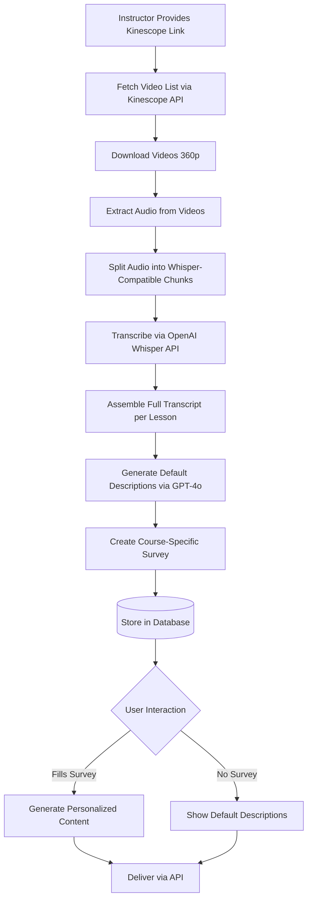
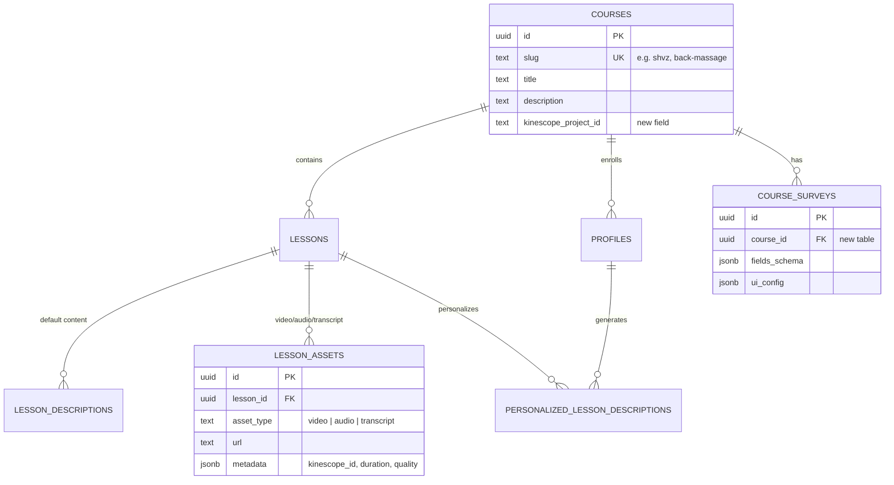
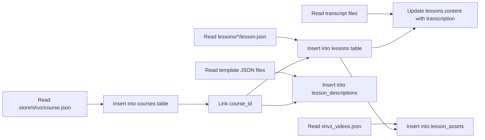
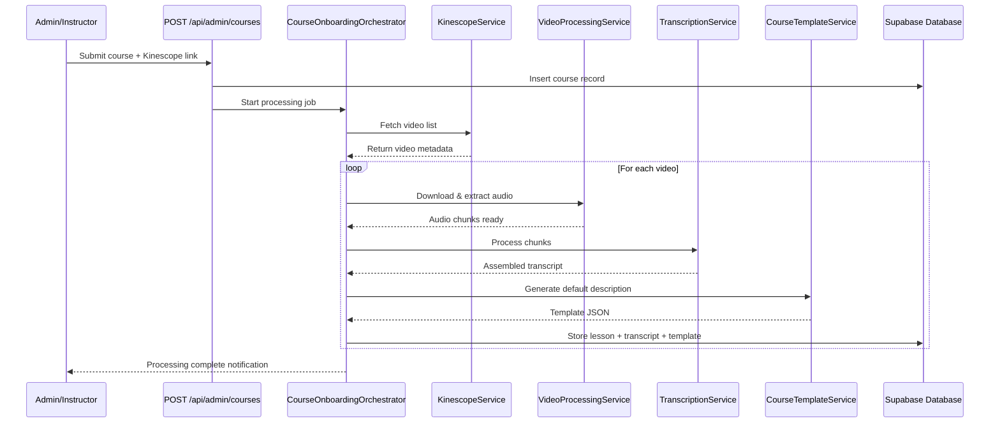
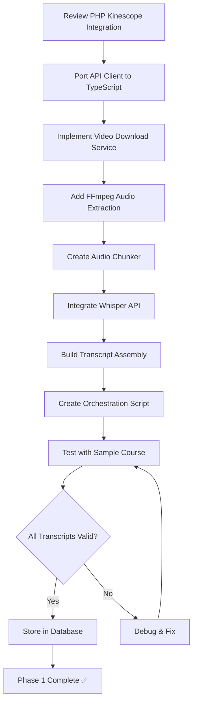

# Multi-Course Architecture Design

## Overview

Transform the current single-course personalization system into a multi-course platform that supports independent course workflows, from video processing to personalized content delivery. The system will enable instructors to onboard new courses by providing a Kinescope project link, automatically processing video content, generating base lesson descriptions, creating course-specific surveys, and delivering personalized learning experiences.

**Business Value:**
- Scale the platform to support multiple courses and instructors
- Automate the entire course onboarding pipeline
- Maintain personalization quality across different subject domains
- Reduce manual work in course setup and maintenance

**Current State:**
The system is hardcoded to work with a single course ("shvz" - Neck and Shoulder Zone Massage). All file paths, lesson template IDs, and workflows are tightly coupled to this specific course.

**Target State:**
A flexible multi-course platform where each course operates independently with its own survey, default descriptions, video assets, and transcriptions while sharing the same personalization engine and AI prompts.

---

## Architecture

### High-Level System Flow


```mermaid
flowchart TD
    Start[Instructor Provides Kinescope Link] --> Fetch[Fetch Video List via Kinescope API]
    Fetch --> Download[Download Videos 360p]
    Download --> Extract[Extract Audio from Videos]
    Extract --> Chunk[Split Audio into Whisper-Compatible Chunks]
    Chunk --> Transcribe[Transcribe via OpenAI Whisper API]
    Transcribe --> Assemble[Assemble Full Transcript per Lesson]
    Assemble --> GenDefault[Generate Default Descriptions via GPT-4o]
    GenDefault --> CreateSurvey[Create Course-Specific Survey]
    CreateSurvey --> StoreDB[(Store in Database)]
    
    StoreDB --> UserFlow{User Interaction}
    UserFlow -->|Fills Survey| GenPersonalized[Generate Personalized Content]
    UserFlow -->|No Survey| ShowDefault[Show Default Descriptions]
    
    GenPersonalized --> Deliver[Deliver via API]
    ShowDefault --> Deliver
```

### Database Schema Updates

The existing database schema already supports multi-course architecture through the `courses` table and `lessons.course_id` foreign key. No schema changes are required.

**Key Tables:**
- **courses**: Stores course metadata (slug, title, description)
- **lessons**: Links to course via `course_id`, stores lesson content including transcriptions in JSONB `content` field
- **lesson_descriptions**: Stores default (non-personalized) lesson descriptions
- **profiles**: User profiles linked to specific course via `course_slug`
- **personalized_lesson_descriptions**: Personalized content per user per lesson

**Data Isolation Strategy:**
- Each course identified by unique `slug` (e.g., "shvz", "back-massage", "sports-massage")
- Lessons scoped to `course_id`
- User profiles scoped to `course_slug`
- Personalized descriptions reference both `profile_id` and `lesson_id`, ensuring isolation

### Multi-Course Data Structure


```mermaid
erDiagram
    COURSES ||--o{ LESSONS : contains
    COURSES ||--o{ PROFILES : enrolls
    COURSES ||--o{ COURSE_SURVEYS : has
    LESSONS ||--o{ LESSON_DESCRIPTIONS : "default content"
    LESSONS ||--o{ LESSON_ASSETS : "video/audio/transcript"
    PROFILES ||--o{ PERSONALIZED_LESSON_DESCRIPTIONS : generates
    LESSONS ||--o{ PERSONALIZED_LESSON_DESCRIPTIONS : personalizes
    
    COURSES {
        uuid id PK
        text slug UK "e.g. shvz, back-massage"
        text title
        text description
        text kinescope_project_id "new field"
    }
    
    COURSE_SURVEYS {
        uuid id PK
        uuid course_id FK "new table"
        jsonb fields_schema
        jsonb ui_config
    }
    
    LESSON_ASSETS {
        uuid id PK
        uuid lesson_id FK
        text asset_type "video | audio | transcript"
        text url
        jsonb metadata "kinescope_id, duration, quality"
    }
```

**New Fields/Tables:**
- `courses.kinescope_project_id`: Links course to Kinescope project for video fetching
- `course_surveys` table: Stores survey configuration per course (field definitions, UI layout, validation rules)

---

## Course Onboarding Pipeline

### Phase 1: Video Processing

#### Kinescope API Integration

**Purpose:** Fetch video metadata and download URLs for a given project.

**Workflow:**
1. Instructor provides Kinescope project ID or folder link
2. System authenticates with Kinescope API (API key from environment)
3. Fetch list of videos in project with metadata (title, duration, video ID, available qualities)
4. Filter for 360p quality URLs (balance between file size and Whisper accuracy)
5. Store video metadata in `lesson_assets` table

**API Response Structure:**
| Field | Type | Description |
|-------|------|-------------|
| id | string | Kinescope video UUID |
| title | string | Video title (used for lesson title) |
| duration | number | Duration in seconds |
| status | string | Processing status ("done" required) |
| url | string | Kinescope player URL |
| download_url | string | Direct download link (360p) |

**Error Handling:**
- Invalid project ID → alert instructor
- Missing 360p quality → fallback to lowest available or alert
- Incomplete video processing → skip video, log warning

#### Video Download Service

**Purpose:** Download videos efficiently with resume capability.

**Requirements:**
- Download 360p MP4 files to local storage `store/{course_slug}/videos/`
- Support resume for interrupted downloads
- Validate file integrity (checksum)
- Parallel downloads with rate limiting (max 3 concurrent)
- Progress tracking and logging

**Storage Path Convention:**
```
store/{course_slug}/videos/{lesson_number}-{kinescope_id}.mp4
```

#### Audio Extraction

**Purpose:** Extract audio track from video for transcription.

**Tool:** FFmpeg command-line interface

**Process:**
1. Validate video file exists and is readable
2. Extract audio using FFmpeg: `ffmpeg -i video.mp4 -vn -acodec libmp3lame -q:a 2 audio.mp3`
3. Output format: MP3, 128kbps (sufficient for Whisper)
4. Store in `store/{course_slug}/audio/{lesson_number}-{kinescope_id}.mp3`

**Quality Parameters:**
- Audio codec: MP3 (libmp3lame)
- Bitrate: 128kbps
- Sample rate: 44.1kHz (default)

#### Audio Chunking for Whisper

**Purpose:** Split large audio files to comply with OpenAI Whisper API limits (25 MB max).

**Strategy:**
- Split audio into 10-minute segments (typical size: 10-15 MB)
- Use FFmpeg segment muxer to avoid re-encoding: `ffmpeg -i audio.mp3 -f segment -segment_time 600 -c copy chunk_%03d.mp3`
- Preserve chunk order via numeric suffix
- Store chunks temporarily in `store/{course_slug}/audio/chunks/{lesson_number}/`

**Edge Cases:**
- Audio under 25 MB → process as single file
- Segment boundary mid-word → acceptable (Whisper handles partial words)

### Phase 2: Transcription

#### Whisper API Integration

**Purpose:** Convert audio to text with high accuracy.

**API Details:**
- Model: `whisper-1` (OpenAI's latest)
- Language: Russian (`ru`) with auto-detection fallback
- Response format: `verbose_json` (includes timestamps and confidence)
- Temperature: 0.2 (balance between accuracy and determinism)

**Workflow:**
1. Process each audio chunk sequentially
2. Send chunk to Whisper API with metadata (language hint, format)
3. Receive transcript with word-level timestamps
4. Store chunk transcripts with ordering metadata

**Rate Limiting:**
- Respect OpenAI API rate limits (50 requests/minute for Whisper)
- Implement exponential backoff on 429 errors
- Queue-based processing for multiple lessons

#### Transcript Assembly

**Purpose:** Combine chunk transcripts into full lesson transcript.

**Process:**
1. Load all chunk transcripts for a lesson in order
2. Concatenate text segments
3. Optional: Remove duplicate phrases at chunk boundaries
4. Calculate total character count and duration
5. Store in `lessons.content` JSONB field:
   ```json
   {
     "transcription": "full text here...",
     "transcription_length": 12500,
     "transcription_source": "openai-whisper-1",
     "transcription_date": "2025-01-15T10:30:00Z"
   }
   ```

**Quality Assurance:**
- Minimum length threshold: 500 characters (flag if below)
- Check for encoding issues (UTF-8 validation)
- Log character count and estimated word count

### Phase 3: Default Description Generation

#### Template Generation via GPT-4o

**Purpose:** Create structured default lesson descriptions from transcripts for users who haven't completed the survey.

**Prompt Strategy:**
The same prompt structure currently used in `regenerate-lesson-templates.ts` will be applied, generating 7-section descriptions with emoji keys:

1. 👋 Introduction (2-3 sentences: lesson goal, expected result)
2. 🔑 Key Points (4-6 bullets, each ≤18 words)
3. 💡 Practical Tips (3-5 instruction points with imperative verbs)
4. ⚠️ Important Notes (2-4 contraindications, conditional)
5. 🧰 Equipment & Preparation (conditional)
6. 📚 Homework (1-2 sentences with concrete action)
7. _motivational line_ (1 inspirational sentence)

**AI Configuration:**
- Model: `gpt-4o`
- Temperature: 0.7 (creative yet grounded)
- Max tokens: 2000
- Response format: JSON with emoji keys

**Storage:**
- Store in `lesson_descriptions.data` JSONB field
- Link to lesson via `lesson_descriptions.lesson_id`

**Fallback:**
If AI generation fails, create minimal default:
```json
{
  "👋 Введение": "Урок {number}: {title}. Изучите основные техники и принципы работы.",
  "🔑 Ключевые моменты": ["Основные техники", "Безопасность", "Эффективность"],
  "💡 Практические советы": ["Следите за реакцией", "Начинайте мягко"],
  "📚 Домашнее задание": "Просмотрите урок и попрактикуйте 10-15 минут",
  "_мотивационная строка_": "Практика приближает к мастерству"
}
```

### Phase 4: Survey Configuration

#### Course-Specific Survey Schema

**Purpose:** Define survey fields tailored to each course's domain while maintaining consistency for the personalization engine.

**Survey Schema Structure:**
Each course has a survey configuration in the `course_surveys` table:

```json
{
  "course_id": "uuid-of-course",
  "fields_schema": {
    "real_name": {
      "type": "text",
      "label": "Ваше имя",
      "required": true,
      "placeholder": "Как к вам обращаться?"
    },
    "motivation": {
      "type": "multi-select",
      "label": "Что вас мотивирует изучать этот курс?",
      "options": [
        "Смена профессии",
        "Помощь близким",
        "Дополнительный доход",
        "Саморазвитие"
      ],
      "required": true
    },
    "target_clients": {
      "type": "text",
      "label": "С кем планируете работать?",
      "placeholder": "Офисные работники, спортсмены, пожилые люди..."
    },
    "skills_wanted": {
      "type": "textarea",
      "label": "Какие навыки хотите получить?",
      "placeholder": "Опишите конкретные техники или результаты..."
    },
    "fears": {
      "type": "multi-select",
      "label": "Что вас беспокоит?",
      "options": [
        "Навредить клиенту",
        "Низкая эффективность",
        "Не хватит знаний",
        "Сложно найти клиентов"
      ]
    },
    "wow_result": {
      "type": "text",
      "label": "Какого результата хотите достичь?",
      "placeholder": "Опишите вашу идеальную цель через 6 месяцев..."
    },
    "practice_model": {
      "type": "select",
      "label": "Как планируете практиковать?",
      "options": [
        "На семье и друзьях",
        "Частная практика на дому",
        "В салоне/клинике",
        "Выездные сеансы"
      ]
    }
  },
  "ui_config": {
    "progress_bar": true,
    "step_navigation": true,
    "completion_message": "Спасибо! Создаём ваш персональный курс..."
  }
}
```

**Field Mapping to Personalization:**
The personalization engine expects specific fields (motivation, fears, target_clients, etc.). Survey schema must include these or provide defaults:

| Survey Field | Personalization Use | Required |
|--------------|---------------------|----------|
| real_name | Personal address in descriptions | Yes |
| motivation | Aligns lesson relevance to goals | Yes |
| target_clients | Contextualizes examples | No (default: "клиенты") |
| skills_wanted | Highlights matching techniques | No |
| fears | Addresses concerns in "addressing_fears" section | No |
| wow_result | Motivational framing | No |
| practice_model | Tailors homework and practical advice | No |

**Course-Specific Customization:**
While maintaining core fields, instructors can:
- Customize option lists (e.g., different "motivation" options for yoga vs. massage)
- Add course-specific fields (e.g., "experience_with_anatomy" for advanced courses)
- Adjust field labels and placeholders for domain terminology
- Set conditional logic (e.g., show "equipment_budget" only if practice_model = "частная практика")

**Survey Rendering:**
Frontend dynamically generates survey UI from `course_surveys.fields_schema`, allowing instructors to modify surveys without code changes.

---

## API Endpoints Updates

### Course-Scoped Endpoints

All existing API endpoints need course awareness. Below are updated contracts:

#### POST /api/survey

**Current Behavior:** Creates profile and generates personalizations for hardcoded "shvz" course.

**Updated Behavior:** Accepts `course` parameter, validates against `courses.slug`, generates personalizations for that course's lessons.

**Request:**
```json
{
  "real_name": "Alexey",
  "course": "shvz",
  "uid": "gc_123456",
  "motivation": ["career_change"],
  "target_clients": "office workers",
  "skills_wanted": "pain relief",
  "fears": ["hurting_clients"],
  "wow_result": "help 50 clients in 6 months",
  "practice_model": "home_practice"
}
```

**Response:**
```json
{
  "success": true,
  "profileId": "uuid",
  "userIdentifier": "gc_123456",
  "message": "Персональный курс успешно создан!",
  "firstLessonPreview": {
    "html": "<div>...</div>",
    "lessonNumber": 1,
    "lessonTitle": "Урок введение"
  }
}
```

**Changes:**
- Validate `course` slug exists in database
- Fetch lessons filtered by `course_id`
- Store `course_slug` in `profiles` table

#### POST /api/persona/block

**Current Behavior:** Returns personalized or default HTML for a lesson.

**Updated Behavior:** Adds `course` parameter to scope lesson lookup.

**Request:**
```json
{
  "user_id": "gc_123456",
  "course": "shvz",
  "lesson": "2",
  "title": "Мышцы шейно-воротниковой зоны",
  "flush": false
}
```

**Response:**
```json
{
  "ok": true,
  "html": "<div class='personalized-content'>...</div>",
  "cached": true
}
```

**Changes:**
- Join `lessons` with `courses` on `course_id` WHERE `courses.slug = course`
- If user has no profile, load default description from `lesson_descriptions` for that course's lesson

#### GET /api/lessons

**Current Behavior:** Returns all lessons (implicitly for "shvz").

**Updated Behavior:** Accepts `course` query parameter.

**Request:**
```
GET /api/lessons?course=shvz
```

**Response:**
```json
{
  "lessons": [
    {
      "id": "uuid",
      "lesson_number": 1,
      "title": "Урок введение",
      "summary": "Вводный урок...",
      "course_slug": "shvz"
    }
  ]
}
```

**Changes:**
- Filter lessons by `courses.slug` via JOIN
- Return `course_slug` in response for client-side routing

#### New Endpoint: POST /api/admin/courses

**Purpose:** Admin interface for instructors to onboard new courses.

**Request:**
```json
{
  "slug": "back-massage",
  "title": "Массаж спины",
  "description": "Комплексный курс по массажу спины",
  "kinescope_project_id": "abc-123-def",
  "process_videos": true
}
```

**Response:**
```json
{
  "success": true,
  "courseId": "uuid",
  "message": "Курс создан, обработка видео запущена",
  "job_id": "processing_uuid"
}
```

**Workflow:**
1. Validate slug uniqueness
2. Insert into `courses` table
3. If `process_videos = true`, trigger background job for video processing pipeline
4. Return job ID for status tracking

#### New Endpoint: GET /api/admin/courses/:courseId/processing-status

**Purpose:** Poll video processing job status.

**Response:**
```json
{
  "status": "in_progress",
  "total_lessons": 12,
  "processed_lessons": 7,
  "current_step": "transcription",
  "errors": [],
  "estimated_completion": "2025-01-15T14:30:00Z"
}
```

---

## Data Migration Strategy

### File System to Database Migration

**Current State:**
- Lesson templates stored in `store/shvz/*.json`
- Transcripts stored in `store/shvz/*.txt`
- Video metadata in `shvz_videos.json`

**Target State:**
- All data in PostgreSQL via Supabase
- File system used only for temporary processing (video downloads, audio chunks)

**Migration Script Workflow:**


```mermaid
flowchart LR
    A[Read store/shvz/course.json] --> B[Insert into courses table]
    C[Read lessons/*/lesson.json] --> D[Insert into lessons table]
    E[Read transcript files] --> F[Update lessons.content with transcription]
    G[Read template JSON files] --> H[Insert into lesson_descriptions]
    I[Read shvz_videos.json] --> J[Insert into lesson_assets]
    
    B --> K[Link course_id]
    K --> D
    K --> H
    D --> F
    D --> J
```

**Migration Steps:**

1. **Create Course Record:**
   - Slug: "shvz"
   - Title: "Массаж ШВЗ"
   - Description: "Курс по массажу шейно-воротниковой зоны"
   - Kinescope project ID: (extract from existing data)

2. **Migrate Lessons:**
   - For each `lessons/{number}/lesson.json`:
     - Insert into `lessons` with `course_id` from step 1
     - Map `number` to `lesson_number`
     - Store `title` and `description`

3. **Migrate Transcripts:**
   - Match transcript files `{number}-*.txt` to lessons by number
   - Update `lessons.content` JSONB with:
     ```json
     {
       "transcription": "text content",
       "transcription_length": 12500,
       "transcription_source": "legacy-migration",
       "transcription_date": "2025-01-15T00:00:00Z"
     }
     ```

4. **Migrate Templates (Default Descriptions):**
   - Match template files `{number}-{id}-final.json` to lessons
   - Insert into `lesson_descriptions` with parsed JSON in `data` field

5. **Migrate Video Metadata:**
   - For each entry in `shvz_videos.json`:
     - Match by `id` to lesson (via hardcoded ID map)
     - Insert into `lesson_assets` with:
       - `asset_type = 'video'`
       - `url` from Kinescope URL
       - `metadata` JSONB with duration, Kinescope ID, status

**Verification:**
- Count records in each table matches expected
- Spot-check 3 lessons for data integrity (transcript, template, video link)
- Verify all foreign keys resolve correctly

### Legacy File Cleanup

**Post-Migration:**
- Move `store/shvz/` to `store/archive/shvz_legacy_{timestamp}/`
- Update documentation to reference database as source of truth
- Remove hardcoded `LESSON_ID_MAP` from `lesson-templates.ts` (deprecated)

---

## Personalization Engine Adaptations

### Course-Agnostic Prompts

**Current State:**
Personalization prompts are embedded in `personalization-engine.ts` and reference "massage instructor Anastasia Fomina" and massage-specific terminology.

**Updated Strategy:**
Maintain the same 7-section personalization structure but make prompt content course-agnostic:

**System Prompt Template:**
```
You are an experienced {course_domain} instructor and educational content creator. 
Create deeply personalized lesson descriptions based on full lesson transcripts and detailed student surveys.
```

**Course Domain Mapping:**
| Course Slug | Domain | Instructor Persona |
|-------------|--------|-------------------|
| shvz | massage therapy | experienced massage instructor |
| yoga-basics | yoga instruction | certified yoga teacher |
| nutrition-101 | nutrition coaching | professional nutritionist |

**Prompt Injection Points:**
- Replace `"experienced massage instructor named Anastasia Fomina"` with `"{course.instructor_persona}"`
- Use generic terminology: "techniques" instead of "massage techniques"
- Domain-specific examples come from the transcript itself, not the prompt

**Configuration Storage:**
Add to `courses` table:
```json
{
  "instructor_persona": "experienced massage instructor",
  "domain_terminology": "massage therapy",
  "tone": "professional and supportive"
}
```

### Shared Personalization Logic

**Key Principle:** The personalization engine's core logic (prompt assembly, API calls, fallback handling) remains unchanged. Only course-specific metadata is injected.

**Reusable Components:**
1. `createPersonalizationPrompt()` - templatize with course metadata
2. `generatePersonalizedDescription()` - already course-agnostic (works from transcript + survey)
3. Fallback content generator - use course title and generic language

**No Code Duplication:**
Avoid creating separate personalization functions per course. Instead, pass course metadata as parameters.

---

## Service Layer Architecture

### New Services

#### KinescopeService

**Responsibilities:**
- Authenticate with Kinescope API
- Fetch project videos with metadata
- Generate download URLs for specific quality (360p)
- Handle API errors and rate limits

**Interface:**
```typescript
interface KinescopeVideo {
  id: string;
  title: string;
  duration: number;
  status: string;
  downloadUrl: string;
}

class KinescopeService {
  async fetchProjectVideos(projectId: string): Promise<KinescopeVideo[]>
  async getVideoDownloadUrl(videoId: string, quality: '360p' | '720p' | '1080p'): Promise<string>
}
```

#### VideoProcessingService

**Responsibilities:**
- Download videos with resume support
- Extract audio via FFmpeg
- Chunk audio for Whisper
- Clean up temporary files

**Interface:**
```typescript
class VideoProcessingService {
  async downloadVideo(url: string, outputPath: string): Promise<void>
  async extractAudio(videoPath: string, audioPath: string): Promise<void>
  async chunkAudio(audioPath: string, chunkDir: string, segmentDuration: number): Promise<string[]>
}
```

#### TranscriptionService

**Responsibilities:**
- Send audio chunks to Whisper API
- Retry on failures with exponential backoff
- Assemble chunk transcripts into full text
- Validate transcript quality

**Interface:**
```typescript
interface TranscriptChunk {
  index: number;
  text: string;
  duration: number;
}

class TranscriptionService {
  async transcribeAudioChunk(chunkPath: string, language: string): Promise<TranscriptChunk>
  async assembleTranscript(chunks: TranscriptChunk[]): Promise<string>
}
```

#### CourseTemplateService

**Responsibilities:**
- Generate default lesson descriptions from transcripts
- Validate template structure
- Store templates in database

**Interface:**
```typescript
class CourseTemplateService {
  async generateDefaultDescription(transcript: string, lessonMetadata: LessonMetadata, courseConfig: CourseConfig): Promise<LessonTemplate>
  async storeDefaultDescription(lessonId: string, template: LessonTemplate): Promise<void>
}
```

### Service Orchestration

**Course Onboarding Orchestrator:**
Coordinates all services for end-to-end course setup.


```mermaid
sequenceDiagram
    participant Admin as Admin/Instructor
    participant API as POST /api/admin/courses
    participant Orchestrator as CourseOnboardingOrchestrator
    participant Kinescope as KinescopeService
    participant VideoProc as VideoProcessingService
    participant Transcribe as TranscriptionService
    participant Template as CourseTemplateService
    participant DB as Supabase Database
    
    Admin->>API: Submit course + Kinescope link
    API->>DB: Insert course record
    API->>Orchestrator: Start processing job
    Orchestrator->>Kinescope: Fetch video list
    Kinescope-->>Orchestrator: Return video metadata
    
    loop For each video
        Orchestrator->>VideoProc: Download & extract audio
        VideoProc-->>Orchestrator: Audio chunks ready
        Orchestrator->>Transcribe: Process chunks
        Transcribe-->>Orchestrator: Assembled transcript
        Orchestrator->>Template: Generate default description
        Template-->>Orchestrator: Template JSON
        Orchestrator->>DB: Store lesson + transcript + template
    end
    
    Orchestrator-->>Admin: Processing complete notification
```

**Error Handling Strategy:**
- Transactional processing: rollback lesson on failure
- Persist partial progress: save completed lessons even if later ones fail
- Retry logic: 3 attempts for network errors, fail fast for validation errors
- Logging: detailed logs for debugging, error summaries for admin dashboard

---

## File System Organization

### Course-Specific Directories

**Structure:**
```
store/
├── {course_slug}/
│   ├── videos/           # Downloaded MP4 files (temporary)
│   │   └── {lesson_number}-{kinescope_id}.mp4
│   ├── audio/            # Extracted audio (temporary)
│   │   ├── {lesson_number}-{kinescope_id}.mp3
│   │   └── chunks/       # Whisper-ready segments
│   │       └── {lesson_number}/
│   │           ├── chunk_000.mp3
│   │           ├── chunk_001.mp3
│   │           └── chunk_002.mp3
│   └── logs/             # Processing logs
│       └── {timestamp}_processing.log
├── archive/              # Migrated legacy data
│   └── shvz_legacy_{timestamp}/
└── temp/                 # Temporary processing files (cleaned daily)
```

**Cleanup Policy:**
- Videos and audio: Delete after successful transcript storage in DB
- Chunks: Delete immediately after assembly
- Logs: Retain for 90 days
- Archive: Retain indefinitely (low storage cost)

---

## Frontend Integration

### Course Selection UI

**User Flow:**
1. Landing page displays available courses (fetched from `courses` table)
2. User selects course → navigated to `/course/{slug}/survey`
3. Survey form dynamically rendered from `course_surveys.fields_schema`
4. On submit → POST to `/api/survey` with `course` parameter
5. Redirect to `/dashboard?course={slug}` with personalized lessons

**Course Selector Component:**
```
CourseSelector
├── CourseCard (for each course)
│   ├── Course title
│   ├── Description
│   ├── Lesson count
│   └── "Start Learning" CTA
```

### Survey Rendering

**Dynamic Form Generator:**
Reads `course_surveys.fields_schema` and renders appropriate input components:

| Field Type | Component | Validation |
|-----------|-----------|------------|
| text | Input (single line) | Required flag, min/max length |
| textarea | Textarea | Required flag, min/max length |
| select | Dropdown | Required flag, option validation |
| multi-select | Checkbox group | Min/max selections |

**Example Rendering Logic:**
```
For field in survey.fields_schema:
  If field.type == "text":
    Render <Input label={field.label} required={field.required} />
  If field.type == "multi-select":
    Render <CheckboxGroup options={field.options} />
```

### Lesson Display with Course Context

**Updated Lesson Card:**
- Display course badge (course title or icon)
- Filter lessons by course in dashboard
- Personalized/default content toggle (for instructors to preview)

---

## Testing Strategy

### Unit Tests

**Services to Test:**
- KinescopeService: Mock API responses, test error handling
- VideoProcessingService: Test FFmpeg calls (use sample video), validate outputs
- TranscriptionService: Mock Whisper API, test chunk assembly logic
- CourseTemplateService: Mock GPT-4o responses, validate JSON structure

**Test Coverage Goals:**
- Service functions: 80%+ coverage
- Error paths: All critical failure modes tested
- Edge cases: Empty transcripts, malformed API responses, missing files

### Integration Tests

**End-to-End Flows:**
1. **Course Onboarding:**
   - Provide test Kinescope project ID
   - Verify all lessons created in DB with transcripts and templates
   - Check lesson count matches video count

2. **Personalization Pipeline:**
   - Submit test survey for new course
   - Verify personalized descriptions generated for all lessons
   - Validate HTML output format

3. **API Endpoints:**
   - Test `/api/survey` with multiple courses
   - Test `/api/persona/block` with course parameter
   - Verify course isolation (user from course A can't access course B personalizations)

**Test Data:**
- Minimal test course: 2 lessons, short transcripts
- Full test course: 12 lessons, real-world transcript lengths
- Edge case course: 1 lesson, very long transcript (20k+ chars)

### User Acceptance Testing

**Scenarios:**
1. Instructor creates new course via admin panel
2. Student selects course, fills survey, receives personalized content
3. Student without survey views default descriptions
4. Instructor previews personalized vs. default content side-by-side

---

## Deployment Considerations

### Environment Variables

**New Variables:**
- `KINESCOPE_API_KEY`: Authentication for Kinescope API
- `FFMPEG_PATH`: Path to FFmpeg binary (default: `/usr/bin/ffmpeg`)
- `WHISPER_API_ENDPOINT`: OpenAI Whisper endpoint (default: `https://api.openai.com/v1/audio/transcriptions`)
- `VIDEO_STORAGE_PATH`: Base path for temporary video storage (default: `./store`)

**Existing Variables:**
- `OPENAI_API_KEY`: Used for Whisper + GPT-4o
- `NEXT_PUBLIC_SUPABASE_URL`, `NEXT_PUBLIC_SUPABASE_ANON_KEY`: Database access

### Infrastructure Requirements

**Compute:**
- FFmpeg installed on server (for audio extraction)
- Sufficient CPU for concurrent video downloads (3 parallel)
- Background job queue for long-running processing (e.g., BullMQ with Redis)

**Storage:**
- Temporary storage for videos/audio: 10-20 GB per course (cleaned after processing)
- Database storage: ~50 MB per course (transcripts, templates, metadata)

**Network:**
- Outbound bandwidth for Kinescope downloads: ~500 MB per lesson (360p video)
- OpenAI API rate limits: Whisper (50 req/min), GPT-4o (500 req/min on paid tier)

### Scaling Strategy

**Phase 1 (MVP):**
- Sequential processing: one course at a time
- Manual trigger via admin panel
- Single server deployment (Vercel + serverless functions)

**Phase 2 (Production):**
- Parallel course processing with job queue
- Dedicated worker instances for video/audio processing (Railway, Render)
- CDN for video delivery (Kinescope already handles this)
- Rate limiting and caching for API endpoints

---

## Migration from Current System

### Backward Compatibility

**Principle:** Existing "shvz" course users should experience zero disruption.

**Compatibility Measures:**
1. **API Endpoints:** Accept optional `course` parameter, default to "shvz" if missing
2. **Database:** Migrate existing data to new schema with `course_slug = 'shvz'`
3. **File Paths:** Legacy code can still read from `store/shvz/` until migration complete
4. **URLs:** Maintain existing routes (`/survey`, `/dashboard`) with course auto-detection from user profile

### Gradual Rollout Plan

**Step 1: Database Migration (Week 1)**
- Run migration script to populate `courses`, `lessons`, `lesson_descriptions` tables
- Verify data integrity
- Keep legacy files as backup

**Step 2: API Updates (Week 2)**
- Update endpoints to support `course` parameter
- Deploy with backward compatibility mode (default to "shvz")
- Monitor error rates

**Step 3: Frontend Updates (Week 3)**
- Add course selector UI
- Update survey to accept course context
- Deploy to staging for testing

**Step 4: Course Onboarding Pipeline (Week 4)**
- Implement video processing services
- Create admin panel for course management
- Test with small pilot course (3-5 lessons)

**Step 5: Full Launch (Week 5)**
- Onboard second course to production
- Monitor performance and user feedback
- Optimize transcription speed and cost

---

## Security & Privacy

### API Authentication

**Admin Endpoints:**
- Require authentication token (e.g., Supabase Auth with role-based access)
- Only users with `instructor` or `admin` role can create courses
- Rate limiting on course creation (max 1 per hour per user)

**User Endpoints:**
- Public endpoints for survey and lesson content
- User ID validation (check against Supabase `profiles` table)
- CORS configuration for GetCourse integration

### Data Privacy

**Personally Identifiable Information (PII):**
- User names stored in `profiles.name` (encrypted at rest via Supabase)
- Survey responses in `profiles.survey` JSONB (may contain sensitive info)
- No PII logged to external services (Sentry, logs)

**Third-Party APIs:**
- Kinescope: Only course-level video IDs shared, no user data
- OpenAI: Transcripts and user survey data sent for personalization (review OpenAI privacy policy for compliance)

**Data Retention:**
- User profiles: Retained until user requests deletion
- Personalized content: Deleted when profile deleted (cascade on `profile_id` FK)
- Video files: Deleted immediately after transcript extraction
- Logs: Anonymized, no PII, retained 90 days

---

## Monitoring & Observability

### Metrics to Track

**Course Onboarding:**
- Processing time per lesson (target: <5 min/lesson)
- Whisper API success rate (target: >98%)
- Template generation success rate (target: >95%)
- Storage usage per course

**Personalization:**
- Personalization generation time (target: <10s/lesson)
- OpenAI API cost per user (monitor for budget control)
- Fallback content usage rate (indicates quality issues)

**User Engagement:**
- Survey completion rate per course
- Lesson view count (personalized vs. default)
- User retention by course

### Error Alerting

**Critical Errors:**
- Course onboarding failure → alert instructor
- Whisper API quota exceeded → alert admin
- Database connection failures → immediate escalation

**Non-Critical Warnings:**
- Single lesson processing failure → log for retry
- Low survey completion rate → weekly report to instructor

---

## Future Enhancements

### Phase 2 Features

1. **Multi-Language Support:**
   - Detect transcript language via Whisper
   - Generate descriptions in user's preferred language
   - Survey localization

2. **Advanced Analytics:**
   - Track which techniques users struggle with (based on survey fears)
   - Recommend prerequisite lessons
   - Adaptive learning paths

3. **Instructor Dashboard:**
   - View survey response analytics
   - Edit default descriptions without regenerating
   - A/B test personalization prompts

4. **Collaborative Courses:**
   - Multiple instructors per course
   - Instructor comments on user progress
   - Live Q&A integration

### Scalability Roadmap

**500+ Courses:**
- Separate database for video metadata (reduce main DB load)
- Object storage (S3) for transcripts instead of JSONB
- Dedicated transcription workers (AWS Lambda, GCP Cloud Run)

**10k+ Users:**
- Redis cache for personalized content (reduce OpenAI API calls)
- Pre-generate personalizations for common survey profiles
- CDN for static HTML content

---

## Open Questions & Decisions Needed

1. **Kinescope API Access:**
   - ✅ **RESOLVED**: API integration patterns available in PHP version archives
   - Reference existing implementation for authentication and endpoints

2. **FFmpeg Licensing:**
   - Confirm FFmpeg is acceptable for commercial use (LGPL license)
   - Server deployment has FFmpeg pre-installed?

3. **OpenAI Whisper Costs:**
   - Current pricing: $0.006/minute
   - Budget per course? (12 lessons × ~10 min/lesson = ~$0.72/course)

4. **Survey Field Standardization:**
   - ✅ **RESOLVED**: Keep current survey structure, no changes needed
   - Core fields remain: real_name, motivation, target_clients, skills_wanted, fears, wow_result, practice_model

5. **Video Storage:**
   - Keep videos after transcription (for future use) or delete?
   - If keeping, where to store? (Kinescope already hosts, maybe just reference URLs)

6. **Processing Timeline:**
   - Acceptable wait time for instructor? (real-time vs. overnight batch)
   - Show progress bar or email notification on completion?

---

## Implementation Priorities

### **Phase 1: Transcript Pipeline (TOP PRIORITY)**

**Objective:** Enable automated transcript generation for new courses as the foundation for all personalization features.

**Why This First:**
- Transcripts are the source of truth for both default and personalized descriptions
- Blocking dependency for all downstream features
- Can run independently without other system changes
- Enables parallel course content preparation while building personalization features

**Scope:**
1. Kinescope API integration (reference PHP version archives)
2. Video download service with 360p quality filter
3. Audio extraction via FFmpeg
4. Audio chunking for Whisper API limits (25 MB max)
5. Whisper transcription with sequential chunk processing
6. Transcript assembly and database storage in `lessons.content` JSONB

**Success Criteria:**
- ✅ Given a Kinescope project ID, system produces full transcripts for all lessons
- ✅ Transcripts stored in database with metadata (length, source, date)
- ✅ Process handles errors gracefully (retries, logging, resume capability)
- ✅ Average processing time: <5 minutes per lesson
- ✅ Transcript quality: >500 characters, valid UTF-8, no missing chunks

**Deliverables:**
1. `lib/services/kinescope.ts` - API client based on PHP implementation patterns
2. `lib/services/video-processing.ts` - Download, audio extraction, chunking
3. `lib/services/transcription.ts` - Whisper integration, assembly
4. `scripts/process-course-transcripts.ts` - CLI orchestration script
5. Unit tests for each service
6. Integration test with 2-lesson sample course

**Development Flow:**

```mermaid
flowchart TD
    A[Review PHP Kinescope Integration] --> B[Port API Client to TypeScript]
    B --> C[Implement Video Download Service]
    C --> D[Add FFmpeg Audio Extraction]
    D --> E[Create Audio Chunker]
    E --> F[Integrate Whisper API]
    F --> G[Build Transcript Assembly]
    G --> H[Create Orchestration Script]
    H --> I[Test with Sample Course]
    I --> J{All Transcripts Valid?}
    J -->|Yes| K[Store in Database]
    J -->|No| L[Debug & Fix]
    L --> I
    K --> M[Phase 1 Complete ✅]
```

---

## Phase 1 Detailed Specification

### 1. Kinescope Service Implementation

**Reference Source:** PHP version archives (existing API integration)

**Expected API Endpoints (based on standard Kinescope API):**
- `GET /v1/projects/{projectId}/videos` - List all videos in project
- `GET /v1/videos/{videoId}` - Get video details including download URLs
- `GET /v1/videos/{videoId}/download` - Get direct download link for specific quality

**TypeScript Interface:**
```typescript
// lib/services/kinescope.ts

interface KinescopeConfig {
  apiKey: string;
  baseUrl: string; // e.g., https://api.kinescope.io
}

interface KinescopeVideoAsset {
  quality: '360p' | '720p' | '1080p' | 'source';
  url: string;
  size: number; // bytes
}

interface KinescopeVideo {
  id: string;
  title: string;
  duration: number; // seconds
  status: 'processing' | 'done' | 'error';
  assets: KinescopeVideoAsset[];
  created_at: string;
}

class KinescopeService {
  constructor(config: KinescopeConfig);
  
  /**
   * Fetch all videos in a project
   * @param projectId Kinescope project ID
   * @returns Array of video metadata
   */
  async fetchProjectVideos(projectId: string): Promise<KinescopeVideo[]>;
  
  /**
   * Get download URL for specific quality
   * @param videoId Kinescope video UUID
   * @param quality Preferred quality (fallback to lower if unavailable)
   * @returns Direct download URL
   */
  async getDownloadUrl(videoId: string, quality: '360p'): Promise<string>;
}
```

**Error Handling:**
- `401 Unauthorized` → throw error with message "Invalid Kinescope API key"
- `404 Project Not Found` → return empty array with console warning
- `429 Rate Limited` → exponential backoff retry (max 3 attempts, 1s/2s/4s delays)
- Network errors → retry with 30s timeout
- Invalid response JSON → log raw response, throw parse error

**Environment Variable:**
```bash
# .env.local
KINESCOPE_API_KEY=your_api_key_here
```

### 2. Video Processing Service

**Download Strategy:**
```typescript
// lib/services/video-processing.ts

interface DownloadOptions {
  url: string;
  outputPath: string;
  resumeSupport?: boolean; // default: true
  onProgress?: (downloaded: number, total: number) => void;
}

async function downloadVideo(options: DownloadOptions): Promise<void> {
  // Use axios with streaming support
  // Check if partial file exists, get size, resume from byte offset
  // Validate downloaded file: check size matches expected, file is readable
  // Log progress every 10%
}
```

**Storage Path Convention:**
```
store/{course_slug}/videos/{lesson_number}-{kinescope_id}.mp4
Example: store/new-course/videos/01-abc123-def456.mp4
```

**FFmpeg Integration:**
```typescript
interface AudioExtractionOptions {
  inputPath: string;   // path to video file
  outputPath: string;  // path to output audio file
  format: 'mp3';       // audio format
  bitrate: '128k';     // audio quality
}

async function extractAudio(options: AudioExtractionOptions): Promise<void> {
  // Execute: ffmpeg -i {input} -vn -acodec libmp3lame -b:a {bitrate} {output}
  // Use child_process.spawn for real-time progress output
  // Validate output file exists and has audio stream (ffprobe check)
  // Throw error if extraction fails with ffmpeg error message
}
```

**Storage Path:**
```
store/{course_slug}/audio/{lesson_number}-{kinescope_id}.mp3
Example: store/new-course/audio/01-abc123-def456.mp3
```

**Audio Chunking:**
```typescript
interface ChunkOptions {
  inputPath: string;
  outputDir: string;
  segmentDuration: number; // seconds, default 600 (10 min)
  maxSizeMB: number;       // default 20 (safety margin under 25 MB)
}

async function chunkAudio(options: ChunkOptions): Promise<string[]> {
  // Execute: ffmpeg -i {input} -f segment -segment_time {duration} -c copy {output}/chunk_%03d.mp3
  // Validate chunk sizes (should all be < maxSizeMB)
  // Return array of chunk file paths in order: [chunk_000.mp3, chunk_001.mp3, ...]
}
```

**Storage Path:**
```
store/{course_slug}/audio/chunks/{lesson_number}/
├── chunk_000.mp3
├── chunk_001.mp3
└── chunk_002.mp3
```

### 3. Transcription Service

**Whisper API Integration:**
```typescript
// lib/services/transcription.ts

import { getOpenAIClient } from './openai';
import fs from 'fs';

interface TranscriptChunk {
  index: number;
  text: string;
  duration: number;
  language?: string;
}

/**
 * Transcribe a single audio chunk using OpenAI Whisper
 */
async function transcribeChunk(
  chunkPath: string,
  index: number,
  language: string = 'ru'
): Promise<TranscriptChunk> {
  const openai = getOpenAIClient();
  
  try {
    const response = await openai.audio.transcriptions.create({
      file: fs.createReadStream(chunkPath),
      model: 'whisper-1',
      language: language, // hint to improve accuracy
      response_format: 'verbose_json', // includes duration, language detection
      temperature: 0.2 // balance between accuracy and determinism
    });
    
    return {
      index,
      text: response.text,
      duration: response.duration,
      language: response.language
    };
  } catch (error) {
    console.error(`Error transcribing chunk ${index}:`, error);
    throw error;
  }
}
```

**Rate Limiting:**
```typescript
/**
 * Process chunks with rate limiting (Whisper API: 50 req/min)
 */
async function transcribeChunksWithRateLimit(
  chunkPaths: string[],
  language: string = 'ru'
): Promise<TranscriptChunk[]> {
  const results: TranscriptChunk[] = [];
  const delayMs = 1200; // ~50 requests/min
  
  for (let i = 0; i < chunkPaths.length; i++) {
    console.log(`Transcribing chunk ${i + 1}/${chunkPaths.length}...`);
    
    const chunk = await transcribeChunk(chunkPaths[i], i, language);
    results.push(chunk);
    
    // Wait before next request (except for last chunk)
    if (i < chunkPaths.length - 1) {
      await new Promise(resolve => setTimeout(resolve, delayMs));
    }
  }
  
  return results;
}
```

**Transcript Assembly:**
```typescript
/**
 * Assemble chunks into full transcript
 */
function assembleTranscript(chunks: TranscriptChunk[]): string {
  // Sort by index to ensure correct order
  const sorted = chunks.sort((a, b) => a.index - b.index);
  
  // Concatenate text with space separator
  let fullText = sorted.map(c => c.text.trim()).join(' ');
  
  // Optional: Clean up potential duplicate phrases at chunk boundaries
  // For MVP, simple concatenation is sufficient
  
  return fullText;
}
```

**Complete Transcription Function:**
```typescript
/**
 * Main function: transcribe audio file (handles chunking automatically)
 */
export async function transcribeAudioFile(
  audioPath: string,
  courseSlug: string,
  lessonNumber: number
): Promise<{ text: string; duration: number; language: string }> {
  const chunkDir = path.join(process.cwd(), 'store', courseSlug, 'audio', 'chunks', lessonNumber.toString());
  
  // Create chunk directory
  await fs.promises.mkdir(chunkDir, { recursive: true });
  
  // Check if audio file is small enough to process directly
  const stats = await fs.promises.stat(audioPath);
  const sizeMB = stats.size / (1024 * 1024);
  
  let chunks: TranscriptChunk[];
  
  if (sizeMB < 20) {
    // Process single file
    console.log('Audio file is small enough, processing directly');
    const chunk = await transcribeChunk(audioPath, 0);
    chunks = [chunk];
  } else {
    // Chunk and process
    console.log(`Audio file is ${sizeMB.toFixed(1)} MB, chunking...`);
    const chunkPaths = await chunkAudio({
      inputPath: audioPath,
      outputDir: chunkDir,
      segmentDuration: 600,
      maxSizeMB: 20
    });
    
    console.log(`Created ${chunkPaths.length} chunks, starting transcription...`);
    chunks = await transcribeChunksWithRateLimit(chunkPaths);
  }
  
  // Assemble full transcript
  const fullText = assembleTranscript(chunks);
  const totalDuration = chunks.reduce((sum, c) => sum + c.duration, 0);
  const detectedLanguage = chunks[0]?.language || 'ru';
  
  // Clean up chunk files
  await fs.promises.rm(chunkDir, { recursive: true, force: true });
  
  return {
    text: fullText,
    duration: totalDuration,
    language: detectedLanguage
  };
}
```

### 4. Orchestration Script

**Script:** `scripts/process-course-transcripts.ts`

**CLI Interface:**
```bash
# Process all lessons in a Kinescope project
npx tsx --env-file=.env.local scripts/process-course-transcripts.ts \
  --course-slug=new-course \
  --course-title="Новый курс массажа" \
  --kinescope-project-id=abc123xyz \
  --start-lesson=1 \
  --end-lesson=12

# Resume from interruption
npx tsx --env-file=.env.local scripts/process-course-transcripts.ts \
  --course-slug=new-course \
  --resume

# Retry failed lessons
npx tsx --env-file=.env.local scripts/process-course-transcripts.ts \
  --course-slug=new-course \
  --retry-failed
```

**Main Workflow:**
```typescript
import { KinescopeService } from '@/lib/services/kinescope';
import { downloadVideo, extractAudio } from '@/lib/services/video-processing';
import { transcribeAudioFile } from '@/lib/services/transcription';
import { createSupabaseServerClient } from '@/lib/supabase/server';

interface ProcessingOptions {
  courseSlug: string;
  courseTitle: string;
  kinescopeProjectId: string;
  startLesson?: number;
  endLesson?: number;
  resume?: boolean;
  retryFailed?: boolean;
}

async function processCourseTranscripts(options: ProcessingOptions) {
  const startTime = Date.now();
  
  console.log('🚀 Starting course transcript processing...');
  console.log('Course:', options.courseTitle);
  console.log('Slug:', options.courseSlug);
  
  // 1. Validate environment
  if (!process.env.KINESCOPE_API_KEY) {
    throw new Error('KINESCOPE_API_KEY not found in environment');
  }
  if (!process.env.OPENAI_API_KEY) {
    throw new Error('OPENAI_API_KEY not found in environment');
  }
  
  // 2. Initialize services
  const kinescope = new KinescopeService({
    apiKey: process.env.KINESCOPE_API_KEY,
    baseUrl: 'https://api.kinescope.io'
  });
  const supabase = createSupabaseServerClient();
  
  // 3. Create/fetch course in database
  let courseId: string;
  const { data: existingCourse } = await supabase
    .from('courses')
    .select('id')
    .eq('slug', options.courseSlug)
    .maybeSingle();
  
  if (existingCourse) {
    courseId = existingCourse.id;
    console.log('✅ Course found in database:', courseId);
  } else {
    const { data: newCourse, error } = await supabase
      .from('courses')
      .insert({
        slug: options.courseSlug,
        title: options.courseTitle,
        description: `Автоматически созданный курс из Kinescope проекта ${options.kinescopeProjectId}`
      })
      .select('id')
      .single();
    
    if (error || !newCourse) {
      throw new Error(`Failed to create course: ${error?.message}`);
    }
    
    courseId = newCourse.id;
    console.log('✅ Course created in database:', courseId);
  }
  
  // 4. Fetch videos from Kinescope
  console.log('\n📹 Fetching videos from Kinescope...');
  const videos = await kinescope.fetchProjectVideos(options.kinescopeProjectId);
  console.log(`Found ${videos.length} videos`);
  
  // Filter videos by lesson range if specified
  const filteredVideos = videos.filter((v, index) => {
    const lessonNum = index + 1;
    if (options.startLesson && lessonNum < options.startLesson) return false;
    if (options.endLesson && lessonNum > options.endLesson) return false;
    return true;
  });
  
  console.log(`Processing ${filteredVideos.length} lessons\n`);
  
  // 5. Process each video
  const results = {
    total: filteredVideos.length,
    successful: 0,
    failed: 0,
    skipped: 0,
    errors: [] as Array<{ lesson: number; error: string }>
  };
  
  for (let i = 0; i < filteredVideos.length; i++) {
    const video = filteredVideos[i];
    const lessonNumber = i + 1;
    
    console.log(`\n${'='.repeat(60)}`);
    console.log(`📚 Lesson ${lessonNumber}/${filteredVideos.length}: ${video.title}`);
    console.log(`${'='.repeat(60)}`);
    
    try {
      // Check if lesson already has transcript (resume mode)
      if (options.resume) {
        const { data: existingLesson } = await supabase
          .from('lessons')
          .select('content')
          .eq('course_id', courseId)
          .eq('lesson_number', lessonNumber)
          .maybeSingle();
        
        if (existingLesson?.content?.transcription) {
          console.log('⏭️  Transcript already exists, skipping...');
          results.skipped++;
          continue;
        }
      }
      
      // Step 1: Download video
      const videoPath = path.join(
        process.cwd(),
        'store',
        options.courseSlug,
        'videos',
        `${lessonNumber.toString().padStart(2, '0')}-${video.id}.mp4`
      );
      
      if (!fs.existsSync(videoPath)) {
        console.log('⬇️  Downloading video (360p)...');
        const downloadUrl = await kinescope.getDownloadUrl(video.id, '360p');
        await downloadVideo({
          url: downloadUrl,
          outputPath: videoPath,
          onProgress: (downloaded, total) => {
            const percent = ((downloaded / total) * 100).toFixed(1);
            process.stdout.write(`\r   Progress: ${percent}%`);
          }
        });
        console.log('\n✅ Video downloaded');
      } else {
        console.log('⏭️  Video already exists, skipping download');
      }
      
      // Step 2: Extract audio
      const audioPath = path.join(
        process.cwd(),
        'store',
        options.courseSlug,
        'audio',
        `${lessonNumber.toString().padStart(2, '0')}-${video.id}.mp3`
      );
      
      if (!fs.existsSync(audioPath)) {
        console.log('🎵 Extracting audio...');
        await extractAudio({
          inputPath: videoPath,
          outputPath: audioPath,
          format: 'mp3',
          bitrate: '128k'
        });
        console.log('✅ Audio extracted');
      } else {
        console.log('⏭️  Audio already exists, skipping extraction');
      }
      
      // Step 3: Transcribe
      console.log('🎤 Transcribing audio...');
      const transcript = await transcribeAudioFile(
        audioPath,
        options.courseSlug,
        lessonNumber
      );
      console.log(`✅ Transcription complete (${transcript.text.length} characters)`);
      
      // Step 4: Store in database
      console.log('💾 Saving to database...');
      const { error: upsertError } = await supabase
        .from('lessons')
        .upsert({
          course_id: courseId,
          lesson_number: lessonNumber,
          title: video.title,
          content: {
            transcription: transcript.text,
            transcription_length: transcript.text.length,
            transcription_duration: transcript.duration,
            transcription_language: transcript.language,
            transcription_source: 'openai-whisper-1',
            transcription_date: new Date().toISOString()
          }
        }, {
          onConflict: 'course_id,lesson_number'
        });
      
      if (upsertError) {
        throw new Error(`Database error: ${upsertError.message}`);
      }
      
      console.log('✅ Saved to database');
      
      // Step 5: Clean up temporary files
      console.log('🗑️  Cleaning up temporary files...');
      await fs.promises.unlink(videoPath);
      await fs.promises.unlink(audioPath);
      console.log('✅ Cleanup complete');
      
      results.successful++;
      
    } catch (error) {
      console.error(`❌ Error processing lesson ${lessonNumber}:`, error);
      results.failed++;
      results.errors.push({
        lesson: lessonNumber,
        error: error instanceof Error ? error.message : String(error)
      });
    }
  }
  
  // 6. Print summary
  const elapsed = ((Date.now() - startTime) / 1000 / 60).toFixed(1);
  
  console.log('\n' + '='.repeat(60));
  console.log('🎉 Processing Complete!');
  console.log('='.repeat(60));
  console.log(`Total lessons: ${results.total}`);
  console.log(`✅ Successful: ${results.successful}`);
  console.log(`⏭️  Skipped: ${results.skipped}`);
  console.log(`❌ Failed: ${results.failed}`);
  console.log(`⏱️  Time elapsed: ${elapsed} minutes`);
  
  if (results.errors.length > 0) {
    console.log('\n❌ Errors:');
    results.errors.forEach(err => {
      console.log(`   Lesson ${err.lesson}: ${err.error}`);
    });
  }
  
  // Save processing report
  const reportPath = path.join(
    process.cwd(),
    'store',
    options.courseSlug,
    'logs',
    `processing_${Date.now()}.json`
  );
  await fs.promises.mkdir(path.dirname(reportPath), { recursive: true });
  await fs.promises.writeFile(reportPath, JSON.stringify({
    timestamp: new Date().toISOString(),
    options,
    results,
    elapsed_minutes: parseFloat(elapsed)
  }, null, 2));
  
  console.log(`\n📄 Report saved to: ${reportPath}`);
}

// CLI argument parsing
const args = process.argv.slice(2);
const options = parseCliArgs(args); // implement argument parser

processCourseTranscripts(options)
  .then(() => process.exit(0))
  .catch(error => {
    console.error('Fatal error:', error);
    process.exit(1);
  });
```

---

## Testing Strategy (Phase 1)

### Unit Tests

**Test Files:**
```
test/services/kinescope.test.ts
test/services/video-processing.test.ts
test/services/transcription.test.ts
```

**Key Test Cases:**

1. **KinescopeService:**
   - Mock API responses for fetchProjectVideos
   - Test error handling (401, 404, 429)
   - Test retry logic with exponential backoff

2. **VideoProcessingService:**
   - Mock file system operations
   - Test download resume logic
   - Test audio extraction with sample video
   - Test chunking logic with various file sizes

3. **TranscriptionService:**
   - Mock OpenAI Whisper API responses
   - Test chunk assembly order
   - Test rate limiting delays
   - Test error recovery

### Integration Test

**Test Course Setup:**
- Create test course with 2 short lessons (2-3 min each)
- Use real Kinescope videos (test project)
- Run full pipeline end-to-end

**Validation:**
```typescript
test('Full transcript pipeline', async () => {
  const options = {
    courseSlug: 'test-course',
    courseTitle: 'Test Course',
    kinescopeProjectId: 'test-project-id',
    startLesson: 1,
    endLesson: 2
  };
  
  await processCourseTranscripts(options);
  
  // Verify lessons in database
  const { data: lessons } = await supabase
    .from('lessons')
    .select('*')
    .eq('course_id', testCourseId);
  
  expect(lessons).toHaveLength(2);
  
  // Verify transcript quality
  lessons.forEach(lesson => {
    expect(lesson.content.transcription).toBeDefined();
    expect(lesson.content.transcription.length).toBeGreaterThan(500);
    expect(lesson.content.transcription_source).toBe('openai-whisper-1');
  });
  
  // Verify temporary files cleaned up
  const videoPath = `store/test-course/videos/01-*.mp4`;
  expect(fs.existsSync(videoPath)).toBe(false);
});
```

---

## Implementation Timeline (Phase 1)

| Week | Task | Owner | Status |
|------|------|-------|--------|
| **Week 1** |
| Day 1-2 | Review PHP Kinescope integration, design TypeScript API client | Dev | 🔲 |
| Day 3-5 | Implement KinescopeService with tests | Dev | 🔲 |
| Day 3-5 | Implement video download service | Dev | 🔲 |
| **Week 2** |
| Day 1-2 | Implement FFmpeg audio extraction | Dev | 🔲 |
| Day 3-4 | Implement audio chunking logic | Dev | 🔲 |
| Day 5 | Unit tests for video-processing service | Dev | 🔲 |
| **Week 3** |
| Day 1-3 | Implement Whisper API integration | Dev | 🔲 |
| Day 3-4 | Implement transcript assembly and storage | Dev | 🔲 |
| Day 5 | Unit tests for transcription service | Dev | 🔲 |
| **Week 4** |
| Day 1-3 | Build orchestration script with CLI | Dev | 🔲 |
| Day 4 | Integration test with 2-lesson course | QA | 🔲 |
| Day 5 | Code review and documentation | Team | 🔲 |
| **Week 5** |
| Day 1-5 | Process first production course (12 lessons) | Ops | 🔲 |

**Estimated Effort:** 5 weeks (1 developer)

**Risk Mitigation:**
- ⚠️ FFmpeg not available on deployment → Test early, add to deployment checklist, verify on Vercel/Railway
- ⚠️ Whisper API rate limits → Implement queue with proper delays, monitor API usage
- ⚠️ Large video files → Test download resume logic with interrupted network
- ⚠️ Transcript quality issues → Review sample outputs early, adjust Whisper parameters (temperature, language hint)
- ⚠️ Cost overruns → Estimate costs before processing, set budget alerts

---

## Cost Estimation (Phase 1)

### OpenAI Whisper API Costs

**Pricing:** $0.006 per minute of audio

**Estimated Costs per Course (12 lessons):**
- Average lesson duration: 15 minutes
- Total audio: 12 × 15 = 180 minutes
- **Cost per course: $1.08**

**Budget for 10 Courses:** ~$11

### Infrastructure Costs

**Storage:**
- Temporary video/audio files: ~5 GB per course (deleted after processing)
- Transcript storage in database: ~50 KB per lesson, 600 KB per course
- **Negligible cost** (Supabase free tier: 500 MB database)

**Compute:**
- FFmpeg processing: minimal CPU usage
- Video downloads: bandwidth cost (Vercel/Railway include generous bandwidth)
- **Negligible cost** for <100 courses/month

**Total Estimated Monthly Cost (processing 5 courses/month):** ~$5.50

---

## Next Steps After Phase 1

### Phase 2: Default Description Generation

**Dependencies:** Phase 1 complete (transcripts in database)

**Objective:** Generate default lesson descriptions from transcripts using existing GPT-4o prompt.

**Timeline:** 1-2 weeks

**Deliverables:**
- Adapt `regenerate-lesson-templates.ts` logic to new architecture
- Store default descriptions in `lesson_descriptions` table
- CLI script: `scripts/generate-course-defaults.ts --course-slug=new-course`

### Phase 3: Multi-Course Schema Migration

**Timeline:** 1 week

**Deliverables:**
- Migrate existing "shvz" data to new structure
- Test backward compatibility
- Update API endpoints to support `course` parameter

### Phase 4-5: API Updates & Frontend (as originally planned)
