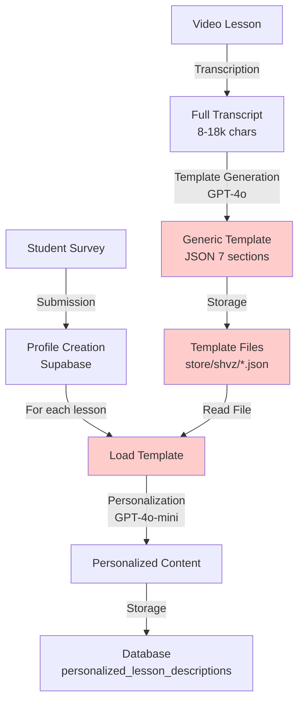
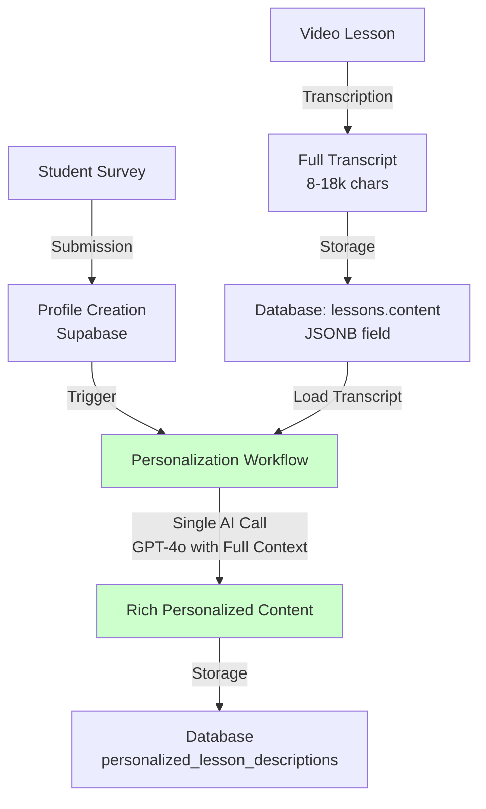
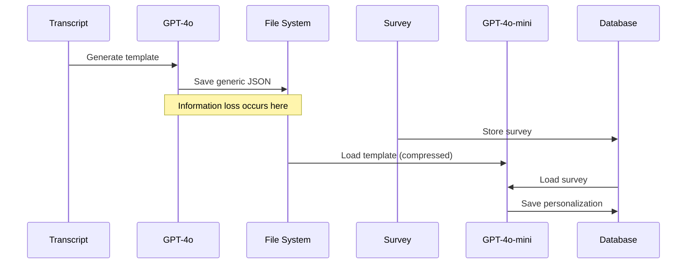
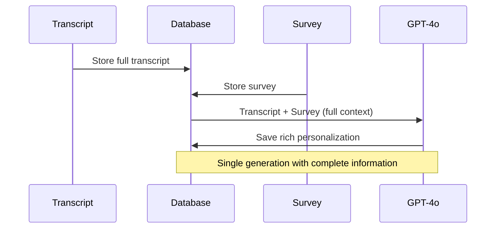
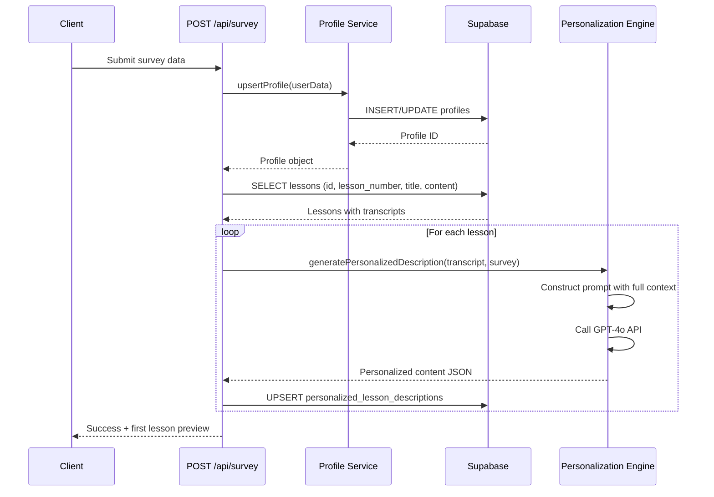
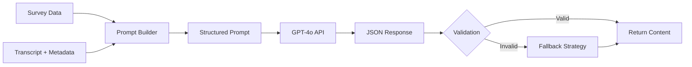
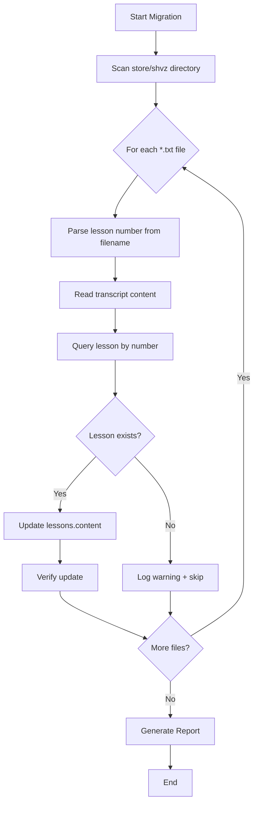
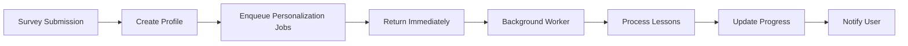

# Refactoring Personalization Engine: Direct Generation from Transcriptions

## Overview

### Current Problem

The existing personalization system generates superficial, template-based lesson descriptions that fail to engage students and demonstrate course value. The root cause is a multi-stage processing pipeline that progressively loses contextual richness:

1. **Video Transcription** → Full textual content of lesson (8,000-18,000 characters)
2. **Template Generation ("Fish")** → Compressed summary (stored as JSON template)
3. **Personalization** → Minimal adaptation of already-compressed template using survey data

This architecture creates an information bottleneck at Stage 2, where the AI model works with condensed summaries rather than rich source material. The final personalized content lacks depth, specific examples, and meaningful connection to student goals.

### Business Impact

- **Low completion rates**: Generic descriptions fail to motivate students to watch lessons
- **Perceived low value**: Descriptions don't demonstrate concrete, personalized benefits
- **Weak student engagement**: Content feels automated rather than personally relevant
- **Missed retention opportunity**: Failing to leverage rich lesson content and detailed survey data

### Proposed Solution

Eliminate the intermediate template generation stage and implement direct personalized description generation from full lesson transcriptions. The new architecture will provide the AI model with complete context from both data sources simultaneously, enabling deep semantic analysis and authentic personalization.

**Strategic Objective**: Increase course completion rates by delivering rich, valuable, deeply personalized lesson descriptions that motivate students to engage with content.

## Architecture Transformation

### Current Architecture



**Key Issues**:
- Red components represent the problematic intermediate stage
- Template acts as information bottleneck
- Two separate AI calls with isolated contexts
- Generic templates stored statically, divorced from source material

### Target Architecture



**Improvements**:
- Green components show new streamlined workflow
- Single AI generation step with complete context
- Direct semantic analysis of lesson content against student profile
- Eliminates static template files and intermediate processing

### Data Flow Comparison

**Before**:


**After**:


## Personalization Engine Redesign

### New Prompt Engineering Strategy

The new prompt must guide the AI to:
1. Analyze full lesson transcript for concrete examples, techniques, and learning moments
2. Map transcript content to specific student profile attributes (goals, fears, target clients, practice model)
3. Generate descriptions that explicitly reference both lesson specifics and student context
4. Create actionable, personalized homework tailored to student's practice environment

**Prompt Structure**:

| Component | Purpose | Data Source |
|-----------|---------|-------------|
| Role Definition | Establish expert persona (course methodologist + copywriter) | Static |
| Student Context | Provide complete profile for personalization | Survey JSONB |
| Lesson Context | Provide full learning material for analysis | Transcript from DB |
| Task Specification | Define generation objectives and quality criteria | Static |
| Output Schema | Enforce structured JSON response format | Static |

### Personalized Content Structure

The new content schema maintains the proven 7-section structure while enriching each field:

| Field | Type | Characteristics | Personalization Strategy |
|-------|------|----------------|-------------------------|
| `introduction` | String | 2-3 sentences | Address student by name; link lesson to their `wow_result` |
| `why_it_matters_for_you` | String | 4-5 sentences | Map lesson content to student's `fears`, `goals`, and `target_clients` |
| `key_takeaways` | Array | 3-4 specific learning outcomes | Extract from transcript; frame as actionable skills |
| `practical_application` | String | 3-4 sentences | Connect techniques to student's `practice_model` and `target_clients` |
| `addressing_fears` | String | 2-3 sentences | Directly reference student's `fears`; explain mitigation from lesson |
| `personalized_homework` | String | 2-4 sentences | Tailor to `practice_model` and skill level |
| `motivational_quote` | String | 1 sentence | Reference student's `wow_result` for inspiration |

**Quality Criteria**:
- Every field must demonstrate awareness of both lesson content and student profile
- Descriptions must reference specific techniques, examples, or moments from transcript
- Language should feel like personal mentorship, not automated generation
- Content must be actionable and concrete, avoiding generic platitudes

### AI Model Selection and Configuration

| Aspect | Value | Rationale |
|--------|-------|-----------|
| **Model** | GPT-4o | Superior long-context understanding for processing 8-18k character transcripts; stronger semantic analysis for matching lesson content to student profiles |
| **Temperature** | 0.7 | Balance between consistency and natural variation in tone |
| **Max Tokens** | 2000-2500 | Accommodate rich, detailed descriptions across 7 fields |
| **System Prompt** | Expert course methodologist + copywriter persona | Establishes quality expectations and communication style |
| **Response Format** | JSON mode enforced | Ensures structured, parseable output |

**Note**: Upgrading from GPT-4o-mini to GPT-4o increases per-request cost but enables processing full transcripts in single call, eliminating need for separate template generation step.

## Data Model Changes

### Database Schema Modifications

#### Lessons Table Enhancement

**Current Structure**:
```
lessons (
  id UUID PRIMARY KEY,
  course_id UUID REFERENCES courses(id),
  lesson_number INT,
  title TEXT,
  summary TEXT,         -- Currently stores generic description
  content JSONB,        -- Underutilized
  created_at TIMESTAMPTZ
)
```

**Required Changes**:

| Field | Modification | Purpose |
|-------|-------------|---------|
| `content` | **Store full transcript as JSONB** | Enable AI to access complete lesson material |
| `summary` | Deprecate or repurpose | No longer needed as standalone field |

**Content JSONB Structure**:
```
{
  "transcription": "Full lesson transcript text...",
  "duration": "30 минут",
  "transcription_length": 12453,
  "transcription_source": "whisper-api",
  "transcription_date": "2024-10-08"
}
```

#### Personalized Lesson Descriptions Table

**No structural changes required** - existing schema already supports rich JSON content:

```
personalized_lesson_descriptions (
  id UUID PRIMARY KEY,
  profile_id UUID REFERENCES profiles(id),
  lesson_id UUID REFERENCES lessons(id),
  content JSONB,        -- Will store new 7-field personalized structure
  created_at TIMESTAMPTZ,
  UNIQUE(profile_id, lesson_id)
)
```

### File System Changes

**Deprecate**:
- `store/shvz/*.json` - Static template files
- `store/shvz/lessons/*/lesson.json` - Lesson metadata (migrate to DB)

**Migrate**:
- Transcript `.txt` files → Database `lessons.content.transcription`
- Template JSON structure → No longer needed (generated on-demand)

## API Design

### POST /api/survey - Enhanced Survey Submission Handler

**Current Behavior**:
1. Create user profile
2. Load static template files for each lesson
3. Generate personalized descriptions from templates
4. Save to database

**New Behavior**:
1. Create user profile
2. Load lesson transcripts from database
3. Generate personalized descriptions directly from transcripts
4. Save to database

**Workflow Diagram**:



**Request Validation**:

| Field | Type | Required | Validation |
|-------|------|----------|-----------|
| `real_name` | String | Yes | Non-empty |
| `course` | String | Yes | Must exist in `courses` table |
| `motivation` | Array | No | Valid survey responses |
| `target_clients` | String | No | - |
| `skills_wanted` | String | No | - |
| `fears` | Array | No | - |
| `wow_result` | String | No | - |
| `practice_model` | String | No | - |
| `uid` | String | No | GetCourse integration ID |

**Response Structure**:
```
{
  "success": true,
  "profileId": "uuid",
  "userIdentifier": "string",
  "message": "Персональный курс успешно создан!",
  "firstLessonPreview": {
    "html": "formatted personalized content",
    "lessonNumber": 1,
    "lessonTitle": "string"
  }
}
```

**Error Handling**:

| Scenario | HTTP Status | Response |
|----------|-------------|----------|
| Missing required fields | 400 | `{ "error": "Имя и курс обязательны для заполнения" }` |
| Profile creation failure | 500 | `{ "error": "Не удалось создать профиль" }` |
| No lessons found | 200 | `{ "profileId": "uuid", "warning": "Профиль создан, но уроки не найдены" }` |
| AI generation failure | Partial success | Continue processing; log errors; return success with count |
| Transcript not found for lesson | Skip lesson | Log warning; continue to next lesson |

## Service Layer Architecture

### New Personalization Service

Create unified service: `lib/services/personalization-engine.ts`

**Responsibilities**:
1. Load lesson transcript from database
2. Construct personalization prompt with full context
3. Call OpenAI API with GPT-4o
4. Parse and validate JSON response
5. Return structured personalized content

**Service Interface**:

```
generatePersonalizedDescription(
  lessonId: UUID,
  transcript: string,
  lessonMetadata: LessonMetadata,
  surveyData: SurveyData,
  userName: string
): Promise<PersonalizedContent>

interface LessonMetadata {
  lesson_number: number;
  title: string;
}

interface SurveyData {
  motivation?: string[];
  target_clients?: string;
  skills_wanted?: string;
  fears?: string[];
  wow_result?: string;
  practice_model?: string;
}

interface PersonalizedContent {
  introduction: string;
  why_it_matters_for_you: string;
  key_takeaways: string[];
  practical_application: string;
  addressing_fears: string;
  personalized_homework: string;
  motivational_quote: string;
}
```

**Prompt Construction Logic**:



**Fallback Strategy**:
When AI returns invalid JSON or generation fails:
1. Log error with full context (lesson ID, user ID, error details)
2. Retry once with adjusted temperature (0.5)
3. If retry fails, create minimal personalized content using template approach
4. Mark personalization as "fallback" in logs for later review

### Modified OpenAI Service

Update `lib/services/openai.ts`:

**Changes**:

| Function | Modification | Reason |
|----------|--------------|--------|
| `createPersonalizationPrompt()` | **Deprecate** | Logic moved to new personalization engine |
| `personalizeLesson()` | **Deprecate** | Replaced by `generatePersonalizedDescription()` |
| `getOpenAIClient()` | **Keep** | Singleton pattern still needed |

**New Responsibility**: Provide centralized OpenAI client configuration only.

### Template Service Deprecation

**Deprecate**: `lib/services/lesson-templates.ts`

**Rationale**: 
- Template loading no longer needed in new architecture
- Transcripts accessed directly from database
- Reduces file system dependencies

**Migration Path**:
1. Mark all functions as `@deprecated` with migration notes
2. Update dependent code to use database-based approach
3. Remove file in subsequent release after verification

## Data Migration Strategy

### Phase 1: Transcript Migration to Database

**Objective**: Move all lesson transcripts from file system to `lessons.content` JSONB field.

**Migration Script**: `scripts/migrate-transcripts-to-db.ts`

**Process**:



**Data Validation**:

| Check | Criteria | Action if Failed |
|-------|----------|------------------|
| File format | `.txt` extension | Skip file |
| Lesson number extraction | Regex match | Log error + skip |
| Lesson exists in DB | Query returns row | Log warning + skip |
| Transcript content | Non-empty, > 1000 chars | Log warning but proceed |
| JSONB structure | Valid JSON after insertion | Rollback + log error |

**Rollback Strategy**:
- Transaction-based updates (batch of 5 lessons)
- Keep original `.txt` files until verification complete
- Maintain backup of `lessons` table before migration

### Phase 2: Template File Deprecation

**Objective**: Verify new system works without template files; archive old files.

**Steps**:
1. Deploy new personalization engine to staging
2. Test survey submission with 3-5 test profiles
3. Verify all lessons generate personalized descriptions
4. Compare quality of new descriptions vs. old (manual review)
5. Move template JSON files to `store/shvz/_deprecated_templates/`
6. Monitor production for 1 week
7. Permanently delete deprecated files if no issues

**Verification Criteria**:
- 100% success rate for personalization generation
- Quality assessment: 80%+ of new descriptions rated "better" or "equal" to old
- No errors related to missing template files
- Performance: average generation time ≤ 10 seconds per lesson

## Implementation Workflow

### Stage 1: Database Preparation

**Tasks**:
1. Create transcript migration script
2. Execute migration on staging database
3. Validate data integrity
4. Execute migration on production database
5. Create database backup

**Acceptance Criteria**:
- All lessons have non-null `content.transcription` field
- Transcription length matches source `.txt` file length
- Migration report shows 100% success rate

### Stage 2: Service Layer Development

**Tasks**:
1. Create `lib/services/personalization-engine.ts`
2. Implement `generatePersonalizedDescription()` function
3. Design and test new prompt template
4. Implement JSON response validation
5. Add error handling and fallback logic
6. Write unit tests

**Acceptance Criteria**:
- Service function has 100% unit test coverage
- Prompt generates valid JSON responses in 95%+ of test cases
- Fallback logic activates correctly on failures
- Performance: single description generation completes in 5-8 seconds

### Stage 3: API Refactoring

**Tasks**:
1. Update `app/api/survey/route.ts`
2. Replace template loading with transcript loading from DB
3. Replace `personalizeLesson()` calls with `generatePersonalizedDescription()`
4. Update error handling for new workflow
5. Write integration tests

**Acceptance Criteria**:
- POST /api/survey successfully processes survey and generates descriptions
- All lessons receive personalized descriptions
- First lesson preview returns correctly
- Errors are logged appropriately
- Integration tests pass

### Stage 4: Legacy Code Removal

**Tasks**:
1. Mark deprecated functions with `@deprecated` annotations
2. Remove calls to `loadLessonTemplate()` across codebase
3. Update `scripts/update-user-personalizations.ts` to use new engine
4. Remove unused imports
5. Archive template files

**Acceptance Criteria**:
- No compilation errors after deprecation
- All scripts use new personalization engine
- Template files moved to archive directory
- Documentation updated to reflect new architecture

### Stage 5: Testing and Validation

**Testing Strategy**:

| Test Type | Scope | Success Criteria |
|-----------|-------|------------------|
| **Unit Tests** | Personalization engine service | 100% code coverage; all edge cases handled |
| **Integration Tests** | POST /api/survey with mock DB | Survey processing completes; all lessons personalized |
| **End-to-End Tests** | Full user journey on staging | Survey → profile → personalizations → lesson preview |
| **Quality Assessment** | Manual review of generated content | 80%+ rated "better" than old system |
| **Performance Tests** | Load testing with 10 concurrent surveys | Average processing time ≤ 2 minutes per survey |

**Test Data**:
- 5 diverse test profiles with varied survey responses
- Lessons 1, 5, 10 (representing different content types)
- Edge cases: missing survey fields, very long transcripts, special characters

## Risk Assessment and Mitigation

### Technical Risks

| Risk | Probability | Impact | Mitigation Strategy |
|------|------------|--------|---------------------|
| **AI generates invalid JSON** | Medium | High | Robust parsing with retry logic; fallback to structured template |
| **Increased API costs (GPT-4o)** | Certain | Medium | Monitor costs closely; optimize prompt length; consider caching |
| **Longer processing time** | High | Low | Asynchronous processing; show progress indicator; pre-generate for new users |
| **Transcript missing from DB** | Low | Medium | Validation script before deployment; fallback to generic description |
| **Quality regression** | Medium | High | A/B testing; manual review before full rollout; collect user feedback |

### Operational Risks

| Risk | Probability | Impact | Mitigation Strategy |
|------|------------|--------|---------------------|
| **Migration data loss** | Low | Critical | Transaction-based migration; comprehensive backups; rollback plan |
| **Downtime during deployment** | Low | Medium | Blue-green deployment; deploy during low-traffic window |
| **User confusion if quality differs** | Medium | Low | Gradual rollout; collect feedback; iterate on prompt |

### Business Risks

| Risk | Probability | Impact | Mitigation Strategy |
|------|------------|--------|---------------------|
| **Higher costs reduce ROI** | Medium | Medium | Calculate cost per student; adjust pricing if needed; optimize prompt |
| **No improvement in completion rates** | Low | High | Define metrics before launch; A/B test; have rollback plan |

## Success Metrics

### Technical Metrics

| Metric | Current Baseline | Target | Measurement Method |
|--------|------------------|--------|-------------------|
| **Personalization generation success rate** | ~95% | 98%+ | Log analysis; error rate monitoring |
| **Average processing time per lesson** | 3-5 sec (template) | 5-8 sec (direct) | API response time logs |
| **AI response validity rate** | ~90% | 95%+ | JSON parsing success logs |
| **Cost per personalized lesson** | ~$0.005 | ≤$0.02 | OpenAI API usage logs |

### Quality Metrics

| Metric | Measurement Method | Target |
|--------|-------------------|--------|
| **Content richness** | Character count; unique words | +50% vs. old |
| **Personalization depth** | Manual review: references to student data | 80%+ of descriptions |
| **Actionability** | Manual review: specific, concrete advice | 90%+ of descriptions |
| **Expert review score** | Methodologist rates 1-5 | Average ≥ 4.0 |

### Business Metrics

| Metric | Current Baseline | Target | Measurement Window |
|--------|------------------|--------|-------------------|
| **Course completion rate** | TBD | +15% | 3 months post-launch |
| **Lesson view rate** | TBD | +20% | 1 month post-launch |
| **Student feedback score** | TBD | ≥4.5/5 | Ongoing |
| **Time to first lesson view** | TBD | -20% | 1 month post-launch |

## Testing Strategy

### Unit Testing

**Target**: `lib/services/personalization-engine.ts`

**Test Cases**:

| Test | Input | Expected Behavior |
|------|-------|-------------------|
| Valid complete survey | Full transcript + all survey fields | Returns valid PersonalizedContent |
| Minimal survey data | Full transcript + only name | Returns personalized content with defaults |
| Empty transcript | Survey + empty string | Throws validation error |
| Invalid JSON from AI | Mock malformed response | Triggers fallback; logs error |
| API timeout | Mock timeout | Retries; returns fallback on second failure |

**Test Framework**: Vitest with MSW (Mock Service Worker) for API mocking

### Integration Testing

**Target**: `app/api/survey/route.ts`

**Test Scenarios**:

| Scenario | Setup | Verification |
|----------|-------|--------------|
| New user survey submission | Valid survey data | Profile created; all lessons personalized |
| Existing user re-submission | User with existing profile | Profile updated; personalizations regenerated |
| Course with missing transcripts | Mock DB with some null transcripts | Skips lessons; logs warnings; returns partial success |
| AI service unavailable | Mock API failure | Returns error; profile still created |

**Test Database**: Supabase test project with seeded data

### End-to-End Testing

**Framework**: Playwright

**User Journey**:
1. Navigate to survey page
2. Fill complete survey form
3. Submit survey
4. Verify redirect to dashboard
5. Check first lesson preview displays
6. Navigate to lesson 5
7. Verify personalized description loads

**Validation Points**:
- All form fields accept input
- Loading states display during processing
- Personalized content contains student name
- Content differs from generic template

## Performance Optimization

### Prompt Engineering Optimization

**Goal**: Minimize token usage while maintaining quality.

**Strategies**:

| Technique | Expected Savings | Trade-off |
|-----------|-----------------|-----------|
| Truncate transcripts to 10,000 chars | 30-40% token reduction | May lose some context |
| Remove filler words from transcripts | 10-15% reduction | Minimal impact |
| Use shorter system prompt | 5% reduction | Maintain quality |
| Compress JSON schema in prompt | 5% reduction | None |

### Caching Strategy

**Opportunity**: Transcripts rarely change after initial import.

**Implementation**:
- Cache transcript content in Redis (TTL: 24 hours)
- Key format: `lesson:transcript:{lesson_id}`
- Invalidate on lesson update
- Reduces database queries by ~90% for repeated operations

**Expected Impact**:
- Faster processing for batch operations
- Reduced database load
- Minimal infrastructure cost (Redis)

### Asynchronous Processing

**Current**: Synchronous generation during survey submission (blocking).

**Future Enhancement**: Queue-based processing with progress tracking.

**Architecture**:


**Benefits**:
- Faster API response time
- Better user experience
- Resilience to failures

**Implementation Complexity**: Medium (requires job queue infrastructure).

---

**Document Version**: 1.0  
**Last Updated**: 2024  
**Status**: Design Approved - Ready for Implementation