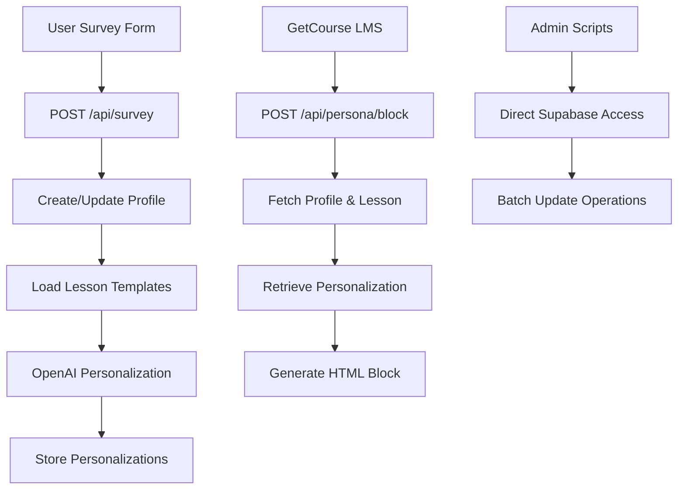

# Project Refactoring Design

## Overview

This document outlines a systematic refactoring plan for the Persona MVP application—a Next.js 15-based personalized learning platform that generates customized lesson content using OpenAI. The system serves a single local user and stores lesson templates and personalizations in Supabase.

**Core Objective**: Eliminate code duplication (DRY principle) while maintaining simplicity appropriate for an MVP, avoiding over-engineering.

**Scope**: Backend API routes, utility functions, shared business logic, and documentation consolidation.

## Current Architecture Analysis

### Technology Stack
- **Framework**: Next.js 15 (App Router), React 19, TypeScript
- **Database**: Supabase (PostgreSQL)
- **AI Integration**: OpenAI SDK (GPT-4o-mini)
- **Styling**: Tailwind CSS
- **Testing**: Vitest, Playwright

### Key Components
| Component Type | Location | Purpose |
|---|---|---|
| API Routes | `app/api/` | Handle survey submission, personalization generation, lesson retrieval |
| Database Layer | `lib/api/`, `lib/supabase/` | Supabase client configuration and data access functions |
| AI Logic | Inline in API routes and scripts | OpenAI integration for content personalization |
| Scripts | `scripts/` | Database migrations, lesson imports, user personalization updates |
| UI Components | `components/` | Profile survey, personalized lesson display |

### Data Flow



## Identified Code Duplication Issues

### 1. OpenAI Client Initialization
**Duplication Pattern**: OpenAI client instantiated in multiple files  
**Occurrences**: 5 locations
- `app/api/survey/route.ts` (line 6)
- `app/api/persona/personalize-template/route.ts` (line 6)
- `scripts/update-user-personalizations.ts` (line 6)
- `scripts/regenerate-lesson-templates.ts` (line 5)
- `lib/openai.ts` (line 2) — Centralized instance exists but not used

**Impact**: Configuration inconsistency risk, redundant initialization overhead

### 2. Lesson ID Mapping Dictionary
**Duplication Pattern**: Identical `getLessonId()` function with hardcoded mapping  
**Occurrences**: 4 locations
- `app/api/survey/route.ts` (lines 299-316)
- `app/api/persona/personalize-template/route.ts` (lines 151-167)
- `scripts/update-user-personalizations.ts` (lines 214-230)
- `scripts/regenerate-lesson-templates.ts` (line 195)

**Content**: 12-entry dictionary mapping lesson numbers to UUIDs

**Impact**: High maintenance burden—any ID change requires updates in 4 files

### 3. Template Personalization Logic
**Duplication Pattern**: Near-identical OpenAI prompt construction and API call  
**Occurrences**: 3 locations
- `app/api/survey/route.ts` (`generateTemplatePersonalization`, lines 192-296)
- `app/api/persona/personalize-template/route.ts` (`personalizeTemplate`, lines 172-233)
- `scripts/update-user-personalizations.ts` (`generateTemplatePersonalization`, lines 120-212)

**Shared Elements**:
- Template loading logic with multi-pattern file search
- Identical OpenAI prompt structure (360+ characters)
- Same model configuration (gpt-4o-mini, temperature 0.7, max_tokens 1000)
- Fallback to original template on error

### 4. HTML Content Formatting
**Duplication Pattern**: Identical HTML block generation  
**Occurrences**: 3 locations
- `app/api/persona/block/route.ts` (lines 126-170)
- `app/api/persona/personalize-template/route.ts` (`formatPersonalizedContent`, lines 235-287)
- `app/api/debug/route.ts` (lines 44-90)

**Structure**: Five persona-section divs with conditional rendering (summary_short, why_watch, quick_action, homework_20m, social_share)

### 5. CORS Headers Configuration
**Duplication Pattern**: Identical CORS headers object  
**Occurrences**: 3 API routes
- `app/api/persona/block/route.ts` (lines 15-19, OPTIONS handler)
- `app/api/persona/personalize-template/route.ts` (lines 21-25, OPTIONS handler)
- Both implement identical OPTIONS methods

**Content**: Access-Control-Allow-Origin, Methods, Headers

### 6. Error Handling Patterns
**Duplication Pattern**: Repetitive try-catch with similar error responses  
**Occurrences**: Multiple API routes

**Common Pattern**:
```
try {
  // business logic
} catch (error) {
  console.error("Error message", error);
  return NextResponse.json(
    { error: "Generic error message" },
    { status: 500 }
  );
}
```

### 7. Survey Alert Messages
**Duplication Pattern**: Identical "fill survey" HTML alerts  
**Occurrences**: 3 locations
- `app/api/persona/block/route.ts` (lines 47-59, 104-116)
- `app/api/persona/personalize-template/route.ts` (lines 50-62)

### 8. Template File Resolution
**Duplication Pattern**: File existence check with multiple naming patterns  
**Occurrences**: 2 locations
- `app/api/survey/route.ts` (lines 197-210)
- `app/api/persona/personalize-template/route.ts` (lines 84-97)

**Logic**: Iterate through 3 filename candidates, return first existing file

### 9. Documentation Fragmentation
**Issue**: 17 documentation files with overlapping content

**Files**: 
- System guides: COMPLETE_SYSTEM.md, SYSTEM_OVERVIEW.md, MASTER_GUIDE.md, EPIC_GUIDE.md, ULTIMATE_GUIDE.md
- Quick starts: QUICK_START.md, QUICK_START_FIXED.md, LAUNCH_GUIDE.md
- Deployment: VERCEL_DEPLOY.md, RAILWAY_DEPLOYMENT.md, RAILWAY_DEPLOYMENT_FINAL.md
- Feature-specific: 8+ additional files

**Impact**: Information scattered, no single source of truth, maintenance overhead

## Refactoring Strategy

### Phase 1: Centralize Shared Utilities

#### 1.1 OpenAI Service Layer
**File**: `lib/services/openai.ts`

**Purpose**: Consolidate OpenAI client and personalization logic

**Exports**:
| Function | Parameters | Returns | Description |
|---|---|---|---|
| `getOpenAIClient()` | none | `OpenAI` | Returns singleton OpenAI instance |
| `personalizeLesson()` | `template`, `survey`, `userName`, `lessonInfo` | `Promise<PersonalizedContent>` | Core personalization logic with error handling |

**Interface Definitions**:
```
PersonalizedContent {
  summary_short: string
  why_watch: string
  quick_action: string
  social_share: string
  homework_20m: string
}

SurveyData {
  motivation?: string[]
  target_clients?: string
  skills_wanted?: string
  fears?: string[]
  wow_result?: string
  practice_model?: string
}
```

**Implementation Notes**:
- Use existing `lib/openai.ts` as base
- Extract prompt template as constant
- Implement retry logic with exponential backoff for OpenAI API failures
- Return fallback template on error (same as current behavior)

#### 1.2 Lesson Template Service
**File**: `lib/services/lesson-templates.ts`

**Purpose**: Manage lesson template file operations

**Exports**:
| Function | Parameters | Returns | Description |
|---|---|---|---|
| `getLessonTemplateId()` | `lessonNumber: number` | `string` | Returns UUID for lesson number |
| `loadLessonTemplate()` | `lessonNumber: number` | `Promise<LessonTemplate>` | Loads and parses template JSON |
| `getLessonTemplateIds()` | none | `Record<number, string>` | Returns all lesson ID mappings |

**Constants**:
- `LESSON_ID_MAP`: Single source of truth for 12 lesson UUIDs

**File Resolution Strategy**:
- Try patterns: `{n}-{n}-{id}-final.json`, `{n}-{id}-final.json`, `{id}-final.json`
- Return default template structure if none found

#### 1.3 HTML Formatter Service
**File**: `lib/services/html-formatter.ts`

**Purpose**: Generate consistent HTML output for personalized content

**Exports**:
| Function | Parameters | Returns | Description |
|---|---|---|---|
| `formatPersonalizedContent()` | `content: PersonalizedContent` | `string` | Generates persona-block HTML |
| `formatSurveyAlert()` | `userId: string` | `string` | "Fill survey" prompt HTML |
| `formatNotFoundAlert()` | `message: string`, `type?: string` | `string` | Generic alert box |

**HTML Structure**:
- Persona sections with conditional rendering
- Consistent CSS class naming (persona-block, persona-section, persona-text)
- Icon prefixes: 📝, 🎯, ⚡, 📚, 📱

#### 1.4 HTTP Utilities
**File**: `lib/utils/http.ts`

**Purpose**: Standardize API response patterns

**Exports**:
| Constant/Function | Type | Description |
|---|---|---|
| `CORS_HEADERS` | `Record<string, string>` | Standard CORS configuration |
| `createCorsResponse()` | `(data, status?) => NextResponse` | Creates CORS-enabled response |
| `createErrorResponse()` | `(message, status?, cors?) => NextResponse` | Standardized error format |
| `createOptionsHandler()` | `() => NextResponse` | Generic OPTIONS method handler |

**Error Response Format**:
```
{
  ok: boolean
  error?: string
  data?: unknown
}
```

### Phase 2: Refactor API Routes

#### 2.1 Survey Route Refactoring
**File**: `app/api/survey/route.ts`

**Changes**:
- Replace inline OpenAI logic with `personalizeLesson()` from service layer
- Use `loadLessonTemplate()` instead of inline file operations
- Remove `getLessonId()` function (use service)
- Keep survey data validation and profile creation logic (business-specific)

**Preserved Logic**:
- Profile upsert strategy (create vs. update)
- Course ID resolution
- Batch personalization with Promise.all

#### 2.2 Persona Block Route
**File**: `app/api/persona/block/route.ts`

**Changes**:
- Use `CORS_HEADERS` constant
- Replace HTML generation with `formatPersonalizedContent()`
- Use `formatSurveyAlert()` for missing profile scenarios
- Use `createOptionsHandler()` for OPTIONS method

**Preserved Logic**:
- User profile lookup by user_identifier
- Lesson search by title/number with fallback
- Personalization retrieval from database

#### 2.3 Personalize Template Route
**File**: `app/api/persona/personalize-template/route.ts`

**Changes**:
- Use `personalizeLesson()` from service layer
- Use `loadLessonTemplate()` instead of manual file reading
- Replace HTML formatting with service function
- Use standardized CORS utilities

**Preserved Logic**:
- Profile retrieval by user_identifier
- Lesson lookup by lesson_number
- Upsert personalization to database

#### 2.4 Debug Route Cleanup
**File**: `app/api/debug/route.ts`

**Changes**:
- Use `formatPersonalizedContent()` for HTML generation
- Consider removing if not actively used in production

### Phase 3: Refactor Scripts

#### 3.1 Update User Personalizations Script
**File**: `scripts/update-user-personalizations.ts`

**Changes**:
- Import and use `personalizeLesson()` service
- Use `loadLessonTemplate()` for template loading
- Remove duplicated OpenAI initialization and prompt logic

**Preserved Logic**:
- CLI argument parsing
- Batch processing with progress logging
- Direct Supabase client usage (not using Next.js server client)

#### 3.2 Regenerate Lesson Templates Script
**File**: `scripts/regenerate-lesson-templates.ts`

**Changes**:
- Use centralized `getLessonTemplateId()` function
- Consider extracting shared template generation logic if applicable

### Phase 4: Database Layer Consistency

#### 4.1 Profile Service
**File**: `lib/services/profile.ts`

**Purpose**: Standardize profile operations

**Exports**:
| Function | Parameters | Returns | Description |
|---|---|---|---|
| `getProfileByUserId()` | `userId: string` | `Promise<Profile \| null>` | Retrieves profile with error handling |
| `upsertProfile()` | `profileData: ProfileInput` | `Promise<Profile>` | Create or update profile |
| `getProfileSurvey()` | `userId: string` | `Promise<SurveyData \| null>` | Retrieves survey data only |

**Implementation Notes**:
- Use Supabase server client
- Handle maybeSingle() results consistently
- Return null instead of throwing on "not found"

#### 4.2 Personalization Service
**File**: `lib/services/personalization.ts`

**Purpose**: Standardize personalization CRUD operations

**Exports**:
| Function | Parameters | Returns | Description |
|---|---|---|---|
| `savePersonalization()` | `profileId`, `lessonId`, `content` | `Promise<void>` | Upserts personalization |
| `getPersonalization()` | `profileId`, `lessonId` | `Promise<PersonalizedContent \| null>` | Retrieves single |
| `deletePersonalization()` | `profileId`, `lessonId` | `Promise<void>` | Removes entry |
| `batchSavePersonalizations()` | `items[]` | `Promise<BatchResult>` | Bulk upsert with error tracking |

**Benefit**: Single source of truth for personalization table operations, used across API routes and scripts

### Phase 5: Documentation Consolidation

#### 5.1 Documentation Structure Rationalization

**Target Structure**:
```
docs/
├── README.md (main entry point)
├── getting-started.md (setup, local dev)
├── architecture.md (system design, tech stack)
├── api-reference.md (endpoint documentation)
├── deployment.md (Railway, Vercel guides)
└── maintenance.md (scripts, migrations)
```

**Migration Strategy**:
| Action | Source Files | Target | Rationale |
|---|---|---|---|
| **Merge** | QUICK_START.md, QUICK_START_FIXED.md, LAUNCH_GUIDE.md | getting-started.md | Single onboarding path |
| **Merge** | COMPLETE_SYSTEM.md, SYSTEM_OVERVIEW.md, MASTER_GUIDE.md, EPIC_GUIDE.md, ULTIMATE_GUIDE.md | architecture.md | Eliminate redundant overviews |
| **Merge** | VERCEL_DEPLOY.md, RAILWAY_DEPLOYMENT.md, RAILWAY_DEPLOYMENT_FINAL.md | deployment.md | Unified deployment guide |
| **Merge** | LESSON_MANAGEMENT.md, UPDATE_LESSON_NUMBERS.md, TEMPLATE_REGENERATION_GUIDE.md | maintenance.md | Operational procedures |
| **Merge** | PERSONALIZATION_API.md | api-reference.md | API documentation |
| **Archive** | GETCOURSE_*.md, LESSON_NUMBERS_UPDATE_REPORT.md, FINAL_SUMMARY.md, TEMPLATE_PERSONALIZATION_UPDATE.md | docs/archive/ | Historical reference |
| **Keep** | README.md | Update with links to new structure | Project overview |

**Content Deduplication Rules**:
- Technology stack: Single source in architecture.md
- Environment setup: Single source in getting-started.md
- API endpoints: Single source in api-reference.md with examples
- Remove version history unless critical for troubleshooting

#### 5.2 README.md Enhancement

**Structure**:
1. **Project Overview** (2-3 sentences)
2. **Quick Start** (link to getting-started.md)
3. **Key Features** (bullet list)
4. **Documentation Index** (links to docs/)
5. **Local Development** (essential commands only)

**Remove**: Lengthy boilerplate from create-next-app

## Implementation Checklist

### Step 1: Create Service Layer (2-3 hours)
- [ ] Create `lib/services/openai.ts` with personalization logic
- [ ] Create `lib/services/lesson-templates.ts` with template loading
- [ ] Create `lib/services/html-formatter.ts` with HTML generation
- [ ] Create `lib/utils/http.ts` with CORS and response utilities
- [ ] Create `lib/services/profile.ts` with profile operations
- [ ] Create `lib/services/personalization.ts` with CRUD operations

### Step 2: Refactor API Routes (2-3 hours)
- [ ] Update `app/api/survey/route.ts` to use services
- [ ] Update `app/api/persona/block/route.ts` to use services
- [ ] Update `app/api/persona/personalize-template/route.ts` to use services
- [ ] Update `app/api/personalizations/route.ts` to use personalization service
- [ ] Review and update `app/api/debug/route.ts`

### Step 3: Refactor Scripts (1-2 hours)
- [ ] Update `scripts/update-user-personalizations.ts` to use services
- [ ] Update `scripts/regenerate-lesson-templates.ts` to use services
- [ ] Test scripts with local database

### Step 4: Manual Verification (30 minutes)
- [ ] Test survey submission flow locally in browser
- [ ] Test personalization generation via API (curl or Postman)
- [ ] Test persona block retrieval
- [ ] Verify scripts work correctly with sample data

### Step 5: Documentation Consolidation (1-2 hours)
- [ ] Create `docs/` directory structure
- [ ] Merge system overview documents into `architecture.md`
- [ ] Merge quick start guides into `getting-started.md`
- [ ] Merge deployment guides into `deployment.md`
- [ ] Merge maintenance docs into `maintenance.md`
- [ ] Update `README.md` with new structure
- [ ] Archive historical/obsolete documents
- [ ] Delete redundant files

### Step 6: Validation & Cleanup (30 minutes)
- [ ] Remove old duplicated code (keep one commit before this for safety)
- [ ] Update imports across codebase
- [ ] Run build: `pnpm build`
- [ ] Verify no broken imports or missing dependencies
- [ ] Test locally with `pnpm dev`

## Risk Mitigation

### Backward Compatibility
**Risk**: External systems (GetCourse LMS) depend on API contracts  
**Mitigation**: 
- Keep API endpoint URLs unchanged
- Maintain response format compatibility
- No changes to request/response schemas

### Data Integrity
**Risk**: Script refactoring breaks lesson template loading  
**Mitigation**:
- Preserve exact file path resolution logic
- Test with actual `store/shvz/` directory structure
- Validate JSON parsing error handling

### OpenAI Integration
**Risk**: Prompt changes affect personalization quality  
**Mitigation**:
- Keep prompt text identical during refactoring
- Do not modify model parameters (temperature, max_tokens)
- Preserve error fallback behavior (return original template)

### Local Development
**Risk**: Refactoring breaks local workflow  
**Mitigation**:
- Test `pnpm dev` after each phase
- Verify environment variable loading
- Ensure Supabase connections work

## Success Metrics

| Metric | Before | Target | Measurement Method |
|---|---|---|---|
| **Duplicated LOC** | ~800 lines | <200 lines | Compare identical code blocks |
| **Service Functions** | 0 | 15+ | Count exported functions in `lib/services/` |
| **OpenAI Initializations** | 5 | 1 | Search for `new OpenAI(` |
| **getLessonId Copies** | 4 | 1 | Search for function definition |
| **Documentation Files** | 17 | 6 | Count markdown files in root/docs |
| **Build Time** | Baseline | ≤ baseline + 5% | `pnpm build` duration |
| **Local Dev Startup** | Baseline | ≤ baseline | `pnpm dev` ready time |

## Post-Refactoring Architecture

``mermaid
flowchart TB
    subgraph "API Layer"
        A[Survey Route]
        B[Persona Block Route]
        C[Personalize Route]
    end
    
    subgraph "Service Layer"
        D[OpenAI Service]
        E[Template Service]
        F[HTML Formatter]
        G[Profile Service]
        H[Personalization Service]
    end
    
    subgraph "Infrastructure"
        I[Supabase Client]
        J[OpenAI Client]
        K[File System]
    end
    
    A --> G
    A --> E
    A --> D
    A --> H
    
    B --> G
    B --> H
    B --> F
    
    C --> G
    C --> E
    C --> D
    C --> F
    C --> H
    
    D --> J
    E --> K
    G --> I
    H --> I
```

## Long-Term Maintenance Guidelines

### Adding New Lessons
1. Add UUID to `LESSON_ID_MAP` in `lib/services/lesson-templates.ts`
2. Place template JSON in `store/shvz/` directory following naming convention
3. No code changes needed elsewhere

### Modifying Personalization Logic
1. Update only `personalizeLesson()` in `lib/services/openai.ts`
2. Changes automatically apply to all routes and scripts

### Changing HTML Output
1. Update only `formatPersonalizedContent()` in `lib/services/html-formatter.ts`
2. Consistent output across all endpoints

### Database Schema Changes
1. Update type definitions in `lib/supabase/types.ts`
2. Update service layer interfaces
3. API routes inherit changes automatically

### Documentation Updates
1. Update single file in `docs/` directory
2. No need to sync multiple documents
3. Version-specific notes go in changelog

## Environment Configuration

### Required Environment Variables
No changes to existing environment variables needed. Current configuration remains:

| Variable | Usage | Example |
|---|---|---|
| `NEXT_PUBLIC_SUPABASE_URL` | Supabase project URL | `https://xxx.supabase.co` |
| `NEXT_PUBLIC_SUPABASE_ANON_KEY` | Supabase anonymous key | `eyJhbGc...` |
| `SUPABASE_SERVICE_ROLE_KEY` | Supabase service role key | `eyJhbGc...` |
| `OPENAI_API_KEY` | OpenAI API key | `sk-...` |

### Local Development Setup

**Prerequisites**:
- Node.js 18+
- pnpm installed globally
- Access to Supabase project
- Valid OpenAI API key

**Setup Steps**:
1. Copy `.env.example` to `.env.local`
2. Fill in environment variables
3. Run `pnpm install`
4. Run `pnpm db:migrate` (if needed)
5. Run `pnpm dev`

## Code Style and Conventions

### Service Layer Patterns

**File Naming**: Descriptive singular nouns (e.g., `openai.ts`, `profile.ts`)

**Function Naming**: Verb-based, descriptive
- `getProfileByUserId()` - retrieval operations
- `savePersonalization()` - creation/update
- `formatPersonalizedContent()` - transformation

**Error Handling Strategy**:
- Services return `null` for "not found" scenarios
- Services throw errors for actual failures
- API routes catch and convert to HTTP responses
- Always log errors with context before returning

**Type Safety**:
- Export interfaces for all service parameters
- Use strict TypeScript mode
- Leverage Supabase generated types from `lib/supabase/types.ts`

### Import Organization

**Order**:
1. External libraries (React, Next.js)
2. Internal services (`@/lib/services/*`)
3. Internal utilities (`@/lib/utils/*`)
4. Internal types (`@/lib/supabase/types`)
5. Components (`@/components/*`)
6. Relative imports

**Example**:
```
import { NextRequest, NextResponse } from "next/server"
import { personalizeLesson } from "@/lib/services/openai"
import { loadLessonTemplate } from "@/lib/services/lesson-templates"
import { createErrorResponse, CORS_HEADERS } from "@/lib/utils/http"
import type { SurveyData } from "@/lib/services/openai"
```

## Migration Path Details

### Phase 1 Detailed Implementation

#### Creating openai.ts Service

**Location**: `lib/services/openai.ts`

**Migration Strategy**:
1. Copy existing `openai` client from `lib/openai.ts`
2. Extract `personalizeLesson()` function from `app/api/survey/route.ts`
3. Extract prompt template as named constant
4. Add interface definitions
5. Update error handling to return fallback template

**Key Interfaces**:
```
PersonalizedContent - Result object with 5 fields
SurveyData - Survey form data structure
LessonInfo - Lesson metadata (number, title)
```

**Prompt Template Constant**:
- Name: `PERSONALIZATION_PROMPT_TEMPLATE`
- Type: Template function accepting survey, lesson info
- Length: ~350 characters
- Variables: userName, motivation, targetClients, skills, fears, wowResult, practiceModel

#### Creating lesson-templates.ts Service

**Location**: `lib/services/lesson-templates.ts`

**Constants**:
- `LESSON_ID_MAP`: Copy from any existing `getLessonId()` function
- `TEMPLATE_DIR`: Path to `store/shvz/` directory
- `FILE_PATTERNS`: Array of 3 filename templates

**File Resolution Logic**:
1. Build 3 candidate paths using lesson number and ID
2. Check `fs.existsSync()` for each
3. Return first match or default template
4. Parse JSON with try-catch
5. Validate required fields present

**Default Template Structure**:
```
{
  summary_short: "Урок {n}: {title}"
  why_watch: "Этот урок поможет вам освоить важные техники массажа"
  quick_action: "Просмотрите видео урока внимательно"
  social_share: "Изучаю новые техники массажа!"
  homework_20m: "Просмотрите видео урока и попрактикуйтесь 10-15 минут"
}
```

#### Creating html-formatter.ts Service

**Location**: `lib/services/html-formatter.ts`

**CSS Classes Used**:
- `.persona-block` - Container
- `.persona-section` - Content section
- `.persona-section-title` - Section heading
- `.persona-text` - Body text
- `.persona-homework` - Homework section modifier
- `.persona-social` - Social share modifier
- `.persona-alert` - Alert box
- `.persona-warning` - Warning alert modifier
- `.persona-btn` - Call-to-action button

**HTML Generation Strategy**:
- Use template literals
- Conditional sections with ternary operators
- Sanitize content (escape HTML if needed)
- Preserve emoji icons in section titles

#### Creating http.ts Utilities

**Location**: `lib/utils/http.ts`

**CORS Headers Object**:
```
{
  'Access-Control-Allow-Origin': '*'
  'Access-Control-Allow-Methods': 'POST, OPTIONS'
  'Access-Control-Allow-Headers': 'Content-Type'
}
```

**Response Helpers**:
- `createCorsResponse()` - Wraps data with CORS headers
- `createErrorResponse()` - Standard error format with CORS
- `createOptionsHandler()` - Pre-built OPTIONS response

**Error Response Structure**:
```
{
  ok: false
  error: string (message)
}
```

**Success Response Structure**:
```
{
  ok: true
  data: any
  cached?: boolean
}
```

### Phase 2 Detailed Implementation

#### Refactoring survey/route.ts

**Before (lines to remove)**:
- Lines 6-8: OpenAI initialization
- Lines 192-296: `generateTemplatePersonalization()` function
- Lines 299-316: `getLessonId()` function

**After (imports to add)**:
```
import { personalizeLesson } from "@/lib/services/openai"
import { loadLessonTemplate } from "@/lib/services/lesson-templates"
```

**Code Changes**:
1. Replace `const openai = new OpenAI(...)` - remove
2. Replace `generateTemplatePersonalization()` call with `personalizeLesson()`
3. Remove template loading code - use `loadLessonTemplate()`
4. Remove `getLessonId()` - service handles this

**Preserved Business Logic**:
- Survey data validation (lines 34-37)
- Profile upsert logic (lines 43-98)
- Course lesson retrieval (lines 109-122)
- Batch personalization with Promise.all (lines 125-150)
- Response formatting (lines 161-168)

#### Refactoring persona/block/route.ts

**Before (lines to remove)**:
- Lines 15-19: CORS headers definition
- Lines 126-170: HTML generation code
- Lines 180-189: OPTIONS handler

**After (imports to add)**:
```
import { CORS_HEADERS, createOptionsHandler } from "@/lib/utils/http"
import { formatPersonalizedContent, formatSurveyAlert } from "@/lib/services/html-formatter"
```

**Code Changes**:
1. Replace `corsHeaders` object with `CORS_HEADERS` import
2. Replace inline HTML generation (lines 126-170) with `formatPersonalizedContent(content)`
3. Replace survey alert HTML (lines 47-59) with `formatSurveyAlert(user_id)`
4. Replace OPTIONS handler with `export const OPTIONS = createOptionsHandler()`

**Preserved Business Logic**:
- User profile lookup by user_identifier
- Lesson search with ilike and number fallback
- Personalization retrieval from database
- Content extraction and type casting

#### Refactoring persona/personalize-template/route.ts

**Before (lines to remove)**:
- Lines 6-8: OpenAI initialization
- Lines 84-118: Template loading logic
- Lines 172-233: `personalizeTemplate()` function
- Lines 235-287: `formatPersonalizedContent()` function
- Lines 151-167: `getLessonId()` function

**After (imports to add)**:
```
import { personalizeLesson } from "@/lib/services/openai"
import { loadLessonTemplate } from "@/lib/services/lesson-templates"
import { formatPersonalizedContent } from "@/lib/services/html-formatter"
import { CORS_HEADERS, createOptionsHandler } from "@/lib/utils/http"
```

**Code Changes**:
1. Remove OpenAI initialization
2. Replace template loading with `const template = await loadLessonTemplate(lesson_number)`
3. Replace `personalizeTemplate()` with `personalizeLesson(template, profile.survey, profile.name, lesson)`
4. Replace HTML formatting with service call
5. Use CORS utilities

**Line Count Reduction**: ~150 lines removed, ~20 lines added

### Phase 3 Detailed Implementation

#### Refactoring update-user-personalizations.ts

**Script Purpose**: Regenerate all personalizations for a specific user

**Before (lines to remove)**:
- Lines 6-8: OpenAI initialization
- Lines 120-212: `generateTemplatePersonalization()` function
- Lines 214-230: `getLessonId()` function

**After (imports to add)**:
```
import { personalizeLesson } from "@/lib/services/openai"
import { loadLessonTemplate } from "@/lib/services/lesson-templates"
```

**Code Changes**:
1. Remove OpenAI initialization
2. Replace inline template loading with service call
3. Replace `generateTemplatePersonalization()` with `personalizeLesson()`
4. Keep Supabase direct client (scripts use different client than API routes)

**CLI Usage Preserved**:
```
pnpm db:update-user [userId]
```

**Progress Logging Preserved**:
- "🔄 Обновляем персонализации..." messages
- "✅ Урок X обновлен" confirmations
- "❌ Ошибка" error reporting
- Final success count

### Phase 5 Documentation Consolidation Details

#### Content Mapping

**architecture.md** - Merge from:
- COMPLETE_SYSTEM.md: System architecture diagrams
- SYSTEM_OVERVIEW.md: Component descriptions
- MASTER_GUIDE.md: Technical architecture section
- Technology stack details (existing knowledge base content)

**Structure**:
1. Overview
2. Technology Stack
3. System Architecture (Mermaid diagram)
4. Component Descriptions
5. Data Flow
6. Security Model

**getting-started.md** - Merge from:
- QUICK_START.md: Installation steps
- QUICK_START_FIXED.md: Corrected procedures
- LAUNCH_GUIDE.md: First-time setup

**Structure**:
1. Prerequisites
2. Installation
3. Environment Configuration
4. Database Setup
5. Running Locally
6. Troubleshooting

**deployment.md** - Merge from:
- VERCEL_DEPLOY.md: Vercel-specific steps
- RAILWAY_DEPLOYMENT.md: Railway initial guide
- RAILWAY_DEPLOYMENT_FINAL.md: Railway corrections

**Structure**:
1. Deployment Overview
2. Railway Deployment (recommended)
3. Vercel Deployment (alternative)
4. Environment Variables
5. Post-Deployment Verification
6. Domain Configuration

**maintenance.md** - Merge from:
- LESSON_MANAGEMENT.md: Lesson operations
- UPDATE_LESSON_NUMBERS.md: Lesson number updates
- TEMPLATE_REGENERATION_GUIDE.md: Template regeneration

**Structure**:
1. Database Migrations
2. Lesson Management
3. Template Operations
4. User Personalization Updates
5. Backup Procedures

**api-reference.md** - Merge from:
- PERSONALIZATION_API.md: API endpoint docs

**Structure**:
1. Authentication
2. Endpoint Reference
   - POST /api/survey
   - POST /api/persona/block
   - POST /api/persona/personalize-template
   - POST /api/personalizations
   - DELETE /api/personalizations
3. Request/Response Examples
4. Error Codes

#### Archive Directory

**Purpose**: Preserve historical documentation without cluttering active docs

**Files to Archive**:
- GETCOURSE_HTML_CODES.md
- GETCOURSE_INTEGRATION.md
- GETCOURSE_SETUP.md
- GETCOURSE_SUMMARY.md
- LESSON_NUMBERS_UPDATE_REPORT.md
- FINAL_SUMMARY.md
- TEMPLATE_PERSONALIZATION_UPDATE.md
- EPIC_GUIDE.md
- ULTIMATE_GUIDE.md

**Archive Structure**:
```
docs/archive/
├── getcourse/
│   ├── html-codes.md
│   ├── integration.md
│   ├── setup.md
│   └── summary.md
└── reports/
    ├── lesson-numbers-update.md
    ├── final-summary.md
    └── template-personalization.md
```

## Performance Considerations

### Service Layer Overhead

**Concern**: Additional function calls may add latency

**Analysis**: Negligible impact
- Service calls are in-process (no network overhead)
- Function call cost: <1ms
- Main latency sources: Database queries (50-200ms), OpenAI API (1-3 seconds)
- Service abstraction overhead: <0.1% of total request time

**Benefit**: Code maintainability far outweighs minimal performance cost

### Template Loading Optimization

**Current Behavior**: File system read on every personalization request

**Optimization Opportunity** (future enhancement):
- Cache loaded templates in memory
- Invalidate cache on file change
- Reduce disk I/O by 95%+

**Implementation Note**: Not in refactoring scope (MVP sufficient with current approach)

### OpenAI API Call Patterns

**Current Behavior**:
- Survey submission: 12 sequential API calls (one per lesson)
- Personalize-template: 1 API call per request

**Optimization Opportunity** (future enhancement):
- Batch multiple lessons in single prompt (requires prompt restructuring)
- Implement request queue with rate limiting
- Add result caching layer

**Implementation Note**: Current approach sufficient for single-user MVP

## Rollback Strategy

### Git Workflow

**Before Starting Refactoring**:
1. Create feature branch: `git checkout -b refactor/dry-principles`
2. Commit current state: `git commit -m "Pre-refactoring snapshot"`
3. Tag for easy rollback: `git tag pre-refactor`

**Incremental Commits**:
- Phase 1: `git commit -m "feat: add service layer"`
- Phase 2: `git commit -m "refactor: update API routes"`
- Phase 3: `git commit -m "refactor: update scripts"`
- Phase 5: `git commit -m "docs: consolidate documentation"`

**Rollback Commands**:
- Roll back to tag: `git reset --hard pre-refactor`
- Roll back one phase: `git reset --hard HEAD~1`
- Cherry-pick specific phase: `git cherry-pick <commit-hash>`

### Testing Before Merge

**Validation Checklist**:
1. Application builds successfully: `pnpm build`
2. Dev server starts: `pnpm dev`
3. Survey submission works (test in browser)
4. Personalization generation works (test via API)
5. Scripts execute successfully
6. No console errors in browser
7. No TypeScript errors: `pnpm tsc --noEmit`

**Merge Strategy**:
- Merge to main only after full validation
- Keep feature branch for 1-2 weeks as safety net
- Delete feature branch after production verification
