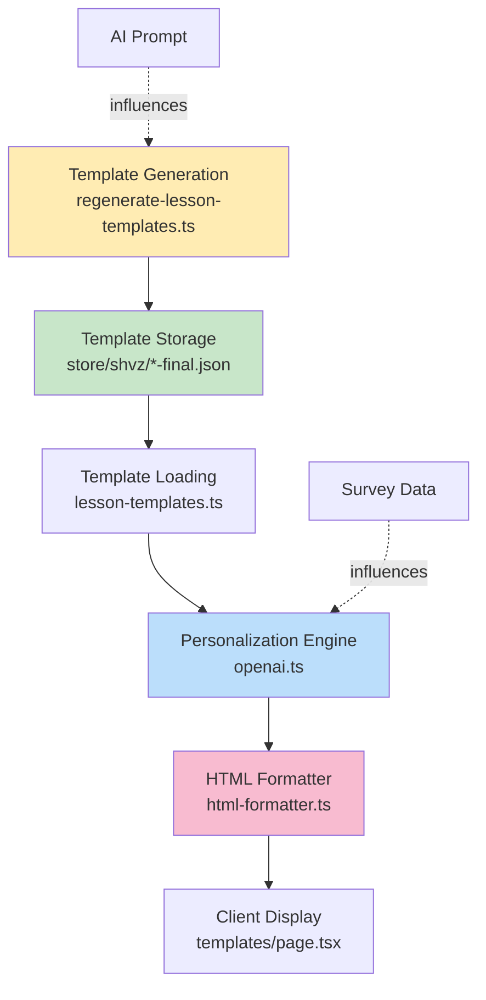
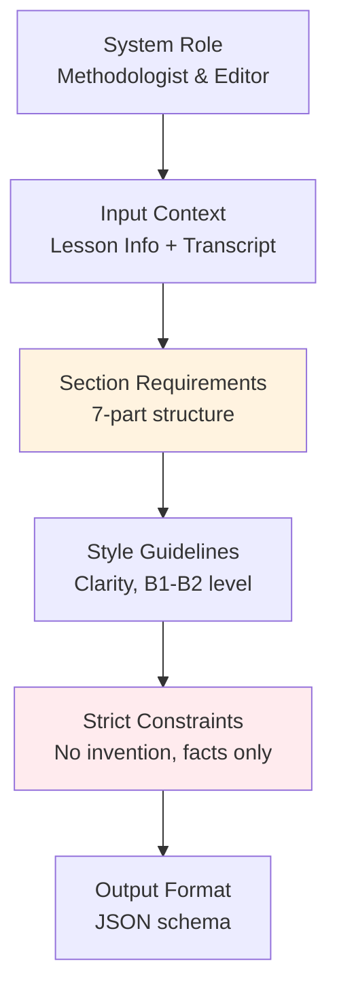
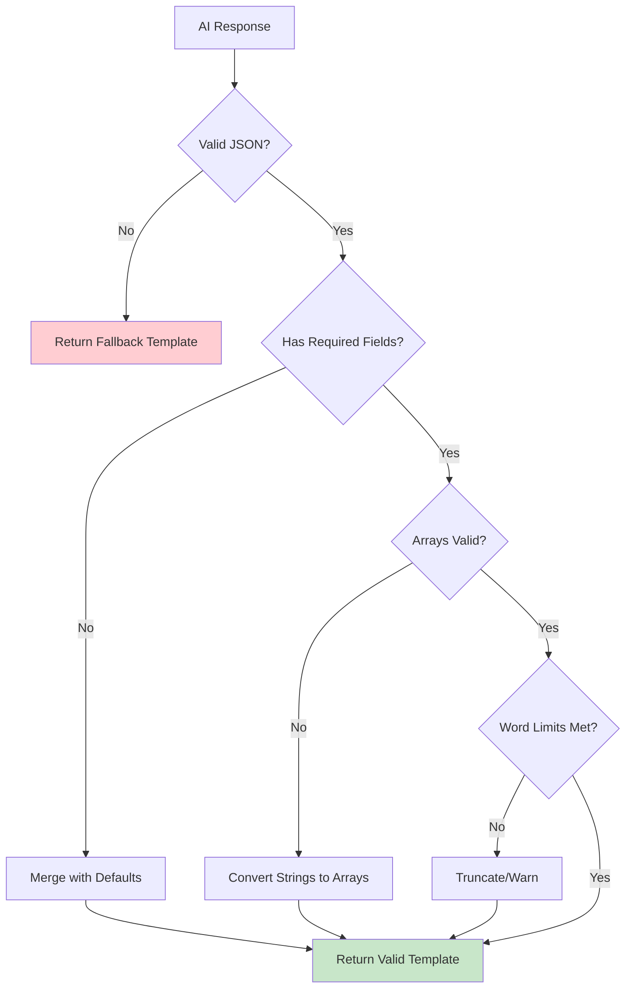
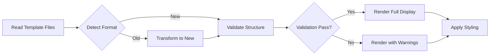

# Lesson Template Restructuring Design

## Overview

This design addresses the misalignment between the current lesson template structure and the required prompt structure for lesson content generation. The current system generates templates with five fields (`summary_short`, `why_watch`, `quick_action`, `social_share`, `homework_20m`), but the target structure requires seven distinct sections with different semantic purposes and formatting requirements.

**Goal**: Restructure the lesson template generation, storage, and rendering system to support the new seven-section format while maintaining backward compatibility during migration.

## Repository Type

**Full-Stack Application** - Next.js-based learning management system with AI-powered lesson personalization.

## Architecture

### Current Template Structure

The existing system uses a five-field JSON structure:

| Field | Purpose | Display Title |
|-------|---------|---------------|
| `summary_short` | Brief lesson overview | 📝 О уроке |
| `why_watch` | Motivation to watch | 🎯 Зачем смотреть |
| `quick_action` | Immediate action item | ⚡ Быстрое действие |
| `social_share` | Social media content | 📱 Поделиться |
| `homework_20m` | 20-minute practice task | 📚 Домашнее задание (20 мин) |

### Target Template Structure

The new structure requires seven sections aligned with pedagogical best practices:

| Section # | Emoji | Title (Russian) | Content Requirements | Conditional |
|-----------|-------|-----------------|---------------------|-------------|
| 1 | 👋 | Введение | 2-3 short sentences: lesson goal and expected result | Required |
| 2 | 🔑 | Ключевые моменты | 4-6 bullet points, each ≤18 words, formatted as "узнаете/научитесь/поймёте" | Required |
| 3 | 💡 | Практические советы | 3-5 instruction points, each starting with imperative verb | Required |
| 4 | ⚠️ | Важно | 2-4 points about contraindications, limitations, safety | Conditional (only if present in transcript) |
| 5 | 🧰 | Инвентарь и подготовка | Equipment list, timing, model positioning | Conditional (only if mentioned) |
| 6 | 📚 | Домашнее задание | 1-2 sentences with concrete, measurable action | Required |
| 7 | - | (мотивационная строка) | 1 italic sentence, inspirational, no marketing hype | Required |

### System Components Affected



## Data Models

### Updated Template JSON Schema

The new template structure replaces flat fields with semantic sections:

| Field Name | Type | Description | Required | Max Length |
|------------|------|-------------|----------|------------|
| `introduction` | string | Lesson goal and expected outcome (2-3 sentences) | Yes | ~200 chars |
| `key_points` | string[] | Array of 4-6 learning objectives, each ≤18 words | Yes | 4-6 items |
| `practical_tips` | string[] | Array of 3-5 imperative instructions | Yes | 3-5 items |
| `important_notes` | string[] | Safety, contraindications, limitations | No | 2-4 items |
| `equipment_preparation` | string | Equipment list and setup instructions | No | ~150 chars |
| `homework` | string | Concrete, measurable practice task | Yes | ~150 chars |
| `motivational_line` | string | Inspirational closing statement | Yes | ~100 chars |

**Example Template JSON**:

```json
{
  "introduction": "В этом уроке освоите базовые техники работы с шейно-воротниковой зоной. Научитесь снимать напряжение и улучшать кровообращение.",
  "key_points": [
    "Узнаете анатомию шейно-воротниковой зоны и основные точки напряжения",
    "Научитесь правильно позиционировать клиента для безопасной работы",
    "Освоите три базовых приёма: поглаживание, растирание, разминание",
    "Поймёте критерии эффективности: потепление тканей, снижение боли"
  ],
  "practical_tips": [
    "Начинайте с лёгкого давления, постепенно увеличивая интенсивность",
    "Избегайте прямого давления на позвонки и сонные артерии",
    "Следите за реакцией клиента, спрашивайте об ощущениях каждые 2-3 минуты"
  ],
  "important_notes": [
    "Не работайте при острой боли, повышенной температуре, воспалениях",
    "Давление должно быть комфортным, без резкой боли"
  ],
  "equipment_preparation": "Массажный стол или стул, масло/крем, полотенце. Длительность сеанса: 15-20 минут.",
  "homework": "Отработайте три базовых приёма на модели по 5 минут каждый. Запишите ощущения клиента и свои наблюдения.",
  "motivational_line": "Каждая практика приближает вас к уверенной работе с реальными клиентами."
}
```

### Migration Strategy

**Backward Compatibility Approach**:

The system will support both old and new template formats during transition period.

| Phase | Duration | Template Loader Behavior | Personalization Engine Behavior |
|-------|----------|--------------------------|----------------------------------|
| Phase 1 | Initial | Detect format, map old→new fields if needed | Generate using new prompt structure |
| Phase 2 | 1-2 weeks | All templates regenerated to new format | Use new template structure directly |
| Phase 3 | Ongoing | Remove old format support code | Standard operation |

**Field Mapping (Old → New)**:

| Old Field | Maps To | Transformation Logic |
|-----------|---------|---------------------|
| `summary_short` | `introduction` | Use as-is if 2-3 sentences; otherwise truncate |
| `why_watch` | `key_points` | Extract bullet points or convert to learning objectives |
| `quick_action` | `practical_tips` | Convert to imperative instruction format |
| `homework_20m` | `homework` | Use as-is, ensure measurability |
| `social_share` | (deprecated) | Remove from new structure |

## Template Generation System

### AI Prompt Engineering

The regeneration script requires updated prompt instructions to generate the new seven-section structure.

**Key Prompt Changes**:

1. **Output Format**: Change from 5-field JSON to 7-field structure
2. **Section Instructions**: Add detailed formatting rules for each section
3. **Conditional Logic**: Explicit instructions for when to include/exclude optional sections
4. **Content Constraints**: Word limits, formatting patterns, style requirements

**Prompt Structure**:



### Template Loader Enhancement

The `lesson-templates.ts` service must handle format detection and transformation.

**Detection Logic**:

The loader determines format version by checking field presence:
- If `introduction` field exists → New format
- If `summary_short` field exists → Old format
- Otherwise → Use default template

**Transformation Function**:

When old format detected, transform to new structure:
1. Map `summary_short` → `introduction`
2. Split `why_watch` text into bullet points → `key_points`
3. Convert `quick_action` to imperative form → `practical_tips`
4. Keep `homework_20m` → `homework`
5. Generate generic `motivational_line`
6. Set `important_notes` and `equipment_preparation` to empty/null

## Personalization Engine Updates

### Personalization Prompt Adaptation

The personalization prompt in `openai.ts` must align with new template structure while maintaining personalization logic.

**Updated Prompt Requirements**:

| Element | Current Behavior | New Behavior |
|---------|------------------|--------------|
| Input Template | 5-field JSON | 7-field JSON with arrays |
| Personalization Points | 5 adaptation criteria | 7 section-specific adaptations |
| Output Format | Flat JSON object | Structured JSON with arrays |
| Field Validation | Check 5 required fields | Check 4 required + 3 optional fields |

**Personalization Strategy by Section**:

| Section | Personalization Approach |
|---------|-------------------------|
| `introduction` | Insert user name, reference their goals |
| `key_points` | Keep structure, adapt examples to user's target clients |
| `practical_tips` | Add user-specific safety notes based on fears/concerns |
| `important_notes` | Emphasize points related to user's fears |
| `equipment_preparation` | Adapt to user's practice model (home/studio/mobile) |
| `homework` | Scale difficulty to user's skill level, reference practice model |
| `motivational_line` | Connect to user's wow_result expectation |

### Response Validation

Enhanced validation ensures AI responses conform to new schema:



## HTML Output Generation

### Formatter Restructuring

The `html-formatter.ts` service must generate HTML for the new seven-section structure.

**Section Rendering Rules**:

| Section | Display Condition | HTML Structure |
|---------|------------------|----------------|
| Introduction | Always (required) | `<div class="persona-section persona-intro">` |
| Key Points | Always (required) | `<ul class="persona-list">` with `<li>` items |
| Practical Tips | Always (required) | `<ul class="persona-tips">` with `<li>` items |
| Important Notes | Only if data exists | `<div class="persona-warning">` with `<ul>` |
| Equipment | Only if data exists | `<div class="persona-equipment">` |
| Homework | Always (required) | `<div class="persona-homework">` |
| Motivational Line | Always (required) | `<p class="persona-motivation"><em>` |

**HTML Template Pattern**:

```
<div class="persona-block">
  <div class="persona-section persona-intro">
    <h3 class="persona-section-title">👋 Введение</h3>
    <p class="persona-text">{introduction}</p>
  </div>
  
  <div class="persona-section">
    <h3 class="persona-section-title">🔑 Ключевые моменты</h3>
    <ul class="persona-list">
      {for each item in key_points}
      <li class="persona-list-item">{item}</li>
      {end for}
    </ul>
  </div>
  
  {conditional sections...}
  
  <div class="persona-motivation">
    <p><em>{motivational_line}</em></p>
  </div>
</div>
```

### CSS Class Strategy

New CSS classes required for semantic styling:

| Class Name | Purpose | Applied To |
|------------|---------|-----------|
| `persona-intro` | Introduction section styling | Section container |
| `persona-list` | Key points list | `<ul>` element |
| `persona-list-item` | Individual learning objective | `<li>` element |
| `persona-tips` | Practical tips list | `<ul>` element |
| `persona-warning` | Important notes box | Section container |
| `persona-equipment` | Equipment info box | Section container |
| `persona-motivation` | Motivational line styling | Container `<div>` |

## Dashboard Display Update

### Templates Page Restructuring

The `/dashboard/templates` page (`templates/page.tsx`) displays generated templates for review.

**Current Display Issues**:
- Shows old 5-field structure
- No visual distinction between required/optional sections
- No array rendering for multi-item sections

**Updated Display Requirements**:

| Requirement | Implementation |
|-------------|----------------|
| Array Rendering | Map over `key_points` and `practical_tips` arrays, display as bullet lists |
| Conditional Display | Show optional sections only when data present |
| Visual Hierarchy | Use different card styles for required vs. optional sections |
| Validation Indicators | Show warnings if required fields missing or word limits exceeded |

**Display Flow**:



## Migration Workflow

### Step-by-Step Migration Process

**Phase 1: Code Updates (No Data Changes)**

1. Update TypeScript interfaces in `lesson-templates.ts`
2. Add format detection logic to template loader
3. Implement old→new transformation function
4. Update fallback template generation
5. Deploy code changes

**Phase 2: Regenerate Templates**

1. Update prompt in `regenerate-lesson-templates.ts`
2. Test generation on 1-2 lessons manually
3. Review generated output for quality
4. Run full regeneration script for all 12 lessons
5. Backup old templates before overwriting

**Phase 3: Update Personalization**

1. Update personalization prompt in `openai.ts`
2. Update validation logic for new structure
3. Test personalization with sample user profiles
4. Deploy personalization updates

**Phase 4: Frontend Updates**

1. Update `html-formatter.ts` with new rendering logic
2. Update `templates/page.tsx` display component
3. Add new CSS classes to `persona/styles.css`
4. Test visual display in dashboard and GetCourse integration

**Phase 5: Cleanup**

1. Remove old format support code (after confirming all templates migrated)
2. Remove unused `social_share` references
3. Update documentation

### Rollback Strategy

If issues arise during migration:

| Issue Type | Rollback Action |
|------------|-----------------|
| Template Generation Failure | Restore from backup files (`*-backup.json`) |
| Personalization Errors | Revert `openai.ts` to use fallback templates |
| Display Issues | Revert `html-formatter.ts`, keep new templates |
| Data Corruption | Restore from `_backup_final_json_*` directory |

## Testing Strategy

### Unit Testing

Test coverage required for each component:

| Component | Test Scenarios |
|-----------|---------------|
| `lesson-templates.ts` | Format detection, transformation, validation, error handling |
| `openai.ts` | Personalization with new structure, array handling, field merging |
| `html-formatter.ts` | Section rendering, conditional display, HTML escaping |
| `regenerate-lesson-templates.ts` | Prompt generation, JSON parsing, file operations |

### Integration Testing

End-to-end scenarios to validate:

1. **Template Generation Flow**: Generate template → Save to file → Load from file → Verify structure
2. **Personalization Flow**: Load template → Personalize with survey → Validate output → Render HTML
3. **Display Flow**: Load templates → Transform if needed → Render in dashboard → Verify all sections visible
4. **GetCourse Integration**: Generate personalized content → Embed in iframe → Verify formatting

### Validation Criteria

Quality gates for each generated template:

| Criterion | Validation Method |
|-----------|-------------------|
| Required fields present | Check for `introduction`, `key_points`, `practical_tips`, `homework`, `motivational_line` |
| Array lengths | Verify `key_points` has 4-6 items, `practical_tips` has 3-5 items |
| Word count limits | Check each `key_points` item ≤18 words |
| Imperative verbs | Verify `practical_tips` items start with verbs |
| No hallucination | Compare generated content against transcript source |

## Risk Assessment & Mitigation

| Risk | Impact | Probability | Mitigation Strategy |
|------|--------|-------------|---------------------|
| AI generates invalid JSON | High | Medium | Robust parsing with fallback to original template |
| Templates lose quality during migration | High | Low | Manual review of 2-3 samples before full regeneration |
| Personalization breaks with new structure | High | Medium | Gradual rollout, maintain old format support initially |
| Display breaks in GetCourse iframes | Medium | Low | Test in staging environment before production deploy |
| Old cached personalizations conflict | Medium | Medium | Add cache versioning, flush old personalizations |

## Performance Considerations

| Aspect | Current | After Changes | Optimization |
|--------|---------|---------------|--------------|
| Template Loading | O(1) file read | O(1) file read + format detection | Cache format version after first load |
| Personalization API | ~2-3s per lesson | ~2-4s (larger prompt/response) | No change needed, acceptable latency |
| HTML Rendering | String concatenation | Array iteration + concatenation | Use template literals, negligible impact |
| Dashboard Page Load | Read 12 files | Read 12 files + transform | Pre-transform at build time if possible |

## Success Metrics

Measurable indicators of successful migration:

| Metric | Target | Measurement Method |
|--------|--------|-------------------|
| Template Generation Success Rate | 100% (12/12 lessons) | Count successful file writes |
| Personalization Error Rate | <5% | Monitor API error logs |
| Template Quality Score | ≥4.0/5.0 | Manual expert review rating |
| User Engagement | No decrease | Compare lesson completion rates pre/post |
| Display Rendering Time | <100ms | Frontend performance monitoring |
