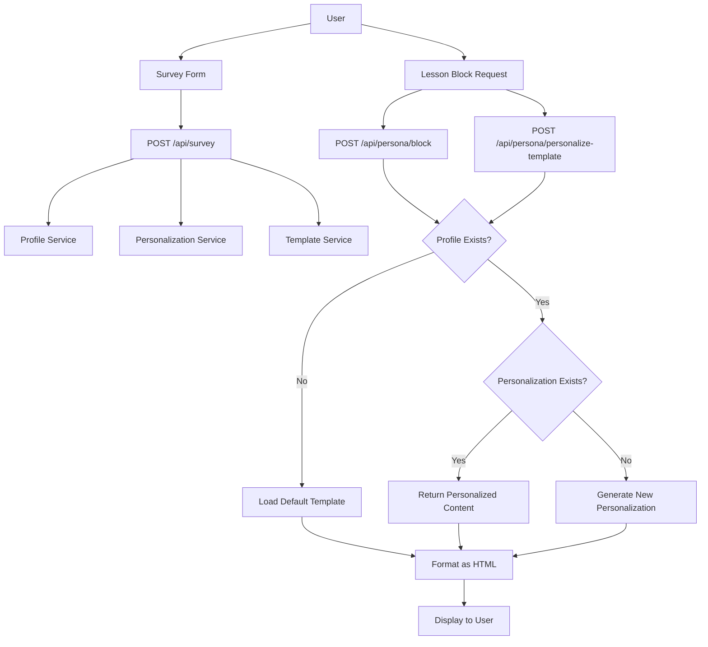
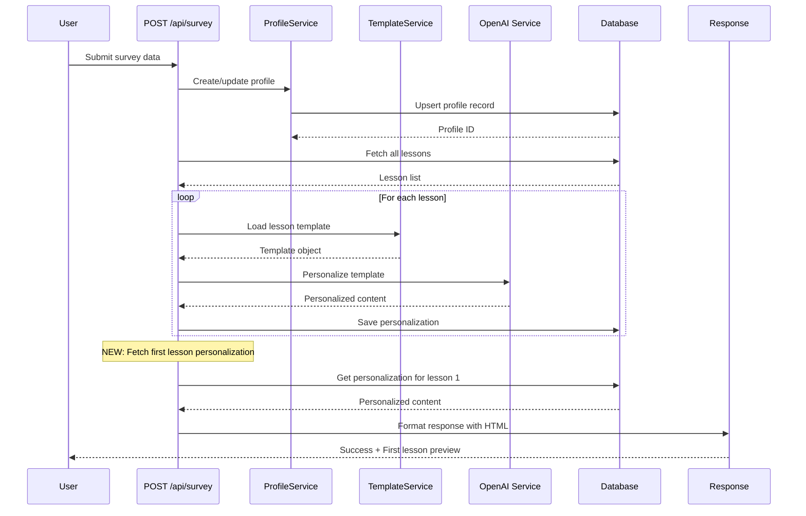
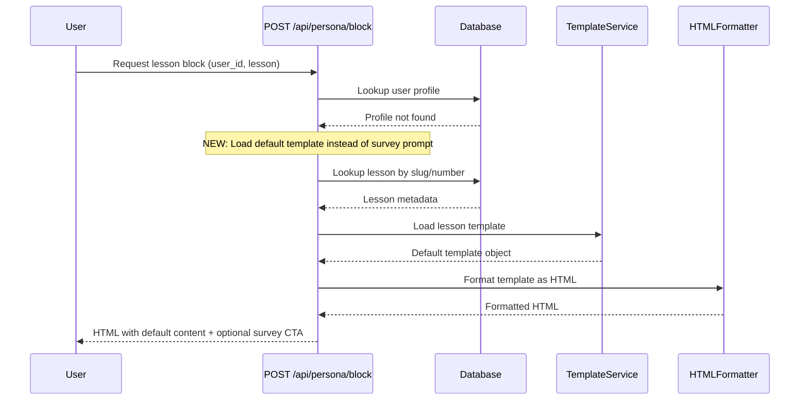

# User Form Filling and Fallback Enhancement

## Overview

This design addresses two critical issues in the personalization workflow:

1. **Survey Processing Gap**: Users who complete the survey form do not receive personalized lesson descriptions, breaking the expected workflow
2. **Missing User Fallback**: When a user is not found in the database, the system should display default lesson templates instead of prompting to fill the survey

These enhancements will improve user experience by ensuring consistent content delivery regardless of profile status and by closing the gap between survey submission and personalization generation.

---

## Problem Analysis

### Issue 1: Survey Completion Without Personalization Output

**Current Behavior:**
- User fills survey form via `/api/survey` endpoint
- Profile is created/updated in database
- Personalization generation is initiated for all lessons
- User receives generic success response without any visible personalized content
- No immediate feedback showing the personalization result

**Root Cause:**
The survey endpoint (`/api/survey`) processes personalizations in the background but does not return any personalized content to the user. The response only includes:
- Success status
- Profile ID
- User identifier
- Generic message

**Expected Behavior:**
After survey submission, the user should immediately see at least one personalized lesson description as proof that personalization was successful.

### Issue 2: Non-Existent User Returns Survey Prompt Instead of Default Content

**Current Behavior:**
- When `/api/persona/block` or `/api/persona/personalize-template` receives a request for a user not in database
- System returns HTML prompting user to fill survey
- No lesson content is displayed at all

**Root Cause:**
The fallback logic treats "user not found" as "user needs to complete survey" rather than "user should see default template content".

**Expected Behavior:**
When a user is not found, the system should display the generic lesson template (the same template used for AI personalization), providing valuable content while optionally suggesting survey completion for personalization.

---

## Architecture

### Component Interaction



### Data Flow for Survey Enhancement



### Data Flow for Default Template Fallback



---

## Enhanced API Behavior

### POST /api/survey Enhancement

#### Current Response Structure
| Field | Type | Description |
|-------|------|-------------|
| success | boolean | Operation success status |
| profileId | string | Created/updated profile UUID |
| userIdentifier | string | User identifier (uid or guest_xxx) |
| message | string | Generic success message |

#### New Response Structure
| Field | Type | Description |
|-------|------|-------------|
| success | boolean | Operation success status |
| profileId | string | Created/updated profile UUID |
| userIdentifier | string | User identifier |
| message | string | Success message |
| **firstLessonPreview** | **object** | **NEW: First lesson personalization** |
| firstLessonPreview.html | string | Formatted HTML of first lesson |
| firstLessonPreview.lessonNumber | number | Lesson number (typically 1) |
| firstLessonPreview.lessonTitle | string | Lesson title |

#### Processing Logic Changes

**Step 1-4: Unchanged**
1. Validate survey data
2. Create/update user profile
3. Fetch all course lessons
4. Generate personalizations for all lessons in parallel

**Step 5: NEW - Retrieve First Lesson**
After all personalizations are saved:
1. Query database for first lesson's personalization
2. If found, format as HTML using `formatPersonalizedContent`
3. Include in response payload

**Step 6: Return Enhanced Response**
Return success response with first lesson preview included

#### Example Response Payload

Natural language description of response structure:
- Success indicator showing personalization was created
- User profile identifier for tracking
- Personalized HTML content for the first lesson, formatted with all sections
- Metadata about which lesson was previewed
- Success message confirming course creation

### POST /api/persona/block Enhancement

#### Current Fallback Behavior Matrix

| Condition | Current Response | Issue |
|-----------|-----------------|-------|
| User not found | Survey prompt HTML | No lesson content shown |
| User found, lesson not found | "Lesson not found" alert | Correct |
| User found, personalization not found | "Personalization unavailable" alert | Correct |
| User found, personalization found | Personalized HTML | Correct |

#### New Fallback Behavior Matrix

| Condition | New Response | Rationale |
|-----------|--------------|-----------|
| User not found | **Default template HTML + survey CTA** | Provide value even without profile |
| User found, lesson not found | "Lesson not found" alert | Unchanged - legitimate error |
| User found, personalization not found | "Personalization unavailable" alert | Unchanged - edge case for async delays |
| User found, personalization found | Personalized HTML | Unchanged - happy path |

#### Processing Logic Changes

**When user profile is not found:**

1. Lookup lesson by slug or number (unchanged)
2. If lesson not found, return "lesson not found" alert (unchanged)
3. **NEW:** Load default lesson template using `loadLessonTemplate(lessonNumber)`
4. **NEW:** Format template as HTML with `formatDefaultTemplateContent`
5. **NEW:** Return HTML with optional survey call-to-action banner

### POST /api/persona/personalize-template Enhancement

Similar changes to `/api/persona/block`:

**When user profile is not found:**
1. Lookup lesson by number (unchanged)
2. **NEW:** Load default template
3. **NEW:** Format and return default content
4. Include survey suggestion in response metadata

---

## HTML Formatting Strategy

### New Formatter Function: formatDefaultTemplateContent

This function will format default lesson templates in a way that:
- Clearly distinguishes default content from personalized content
- Maintains consistent visual structure with personalized blocks
- Optionally includes a subtle call-to-action for survey completion

#### Function Signature
```
formatDefaultTemplateContent(
  template: LessonTemplate,
  lessonInfo: { lesson_number: number, title: string },
  includeSurveyCTA: boolean = true
): string
```

#### HTML Structure

The output will include:
- Header banner indicating this is default (non-personalized) content
- All template sections formatted identically to personalized content
- Footer with optional survey call-to-action
- CSS classes to enable visual differentiation

#### Content Sections Rendered
1. Introduction section
2. Key points list
3. Practical tips list
4. Important notes (if present in template)
5. Equipment preparation (if present in template)
6. Homework section
7. Motivational line

#### Visual Differentiation Strategy

Default templates should use:
- Slightly muted color scheme compared to personalized content
- "Default Template" badge or header text
- Optional banner: "Complete your profile to get personalized recommendations"
- Same structural layout to maintain consistency

---

## Template Loading and Fallback Chain

### Existing Template Loading Logic

The `loadLessonTemplate` function already implements robust fallback:

1. Map lesson number to UUID via `LESSON_ID_MAP`
2. Try multiple filename patterns:
   - `{lessonNumber}-{lessonNumber}-{id}-final.json`
   - `{lessonNumber}-{id}-final.json`
   - `{id}-final.json`
3. Parse and validate JSON structure
4. Detect format (new 7-section vs old 5-field)
5. Transform old format to new if needed
6. Return `getDefaultTemplate()` if no file found

### Default Template Structure

When no template file exists, the system generates a minimal but complete template:

| Section | Default Content Strategy |
|---------|-------------------------|
| introduction | Generic lesson introduction mentioning lesson number |
| key_points | Four generic learning objectives |
| practical_tips | Three universal safety/effectiveness tips |
| important_notes | Empty (optional field) |
| equipment_preparation | Empty (optional field) |
| homework | Generic practice instruction |
| motivational_line | Universal motivational message |

This ensures that even without template files, users receive structured, meaningful content.

---

## Error Handling and Edge Cases

### Survey Endpoint Edge Cases

| Scenario | Handling Strategy |
|----------|------------------|
| No lessons found in database | Return success with warning, skip personalization generation |
| AI personalization fails for some lessons | Log errors, continue processing remaining lessons, return partial success |
| First lesson personalization save fails | Return success without preview, log error |
| Database query for first lesson fails | Return success without preview, log error |

### Block Endpoint Edge Cases

| Scenario | Handling Strategy |
|----------|------------------|
| User not found + lesson not found | Return "lesson not found" alert (lesson validation takes precedence) |
| User not found + invalid lesson number | Return "lesson not found" alert |
| Template file missing for fallback | Use `getDefaultTemplate()` from template service |
| Template JSON parse error | Use `getDefaultTemplate()` as fallback |

### Personalize-Template Endpoint Edge Cases

Same as block endpoint, plus:

| Scenario | Handling Strategy |
|----------|------------------|
| Flush parameter provided with non-existent user | Load default template (don't regenerate without user data) |
| Lesson exists but template missing | Return default template with appropriate messaging |

---

## Implementation Considerations

### Service Layer Responsibilities

**Profile Service** (`lib/services/profile.ts`)
- No changes required
- Existing `upsertProfile` function sufficient

**Template Service** (`lib/services/lesson-templates.ts`)
- No changes required
- `loadLessonTemplate` already implements fallback chain
- `getDefaultTemplate` already provides minimal template structure

**HTML Formatter Service** (`lib/services/html-formatter.ts`)
- **NEW:** Add `formatDefaultTemplateContent` function
- Reuse existing `escapeHtml` utility
- Maintain consistent CSS class naming with `formatPersonalizedContent`

**Personalization Service** (`lib/services/personalization.ts`)
- No changes required
- Existing `getPersonalization` and `savePersonalization` sufficient

### Database Queries

**Survey Endpoint - New Query:**
After personalization generation completes, fetch the first lesson's personalization:

Query parameters:
- Filter by profile ID
- Filter by first lesson ID (from lessons array)
- Return personalization content

**Block Endpoint - Modified Logic:**
When user profile not found:
- Skip personalization lookup
- Proceed directly to template loading
- Use lesson metadata from initial lesson query

### Response Structure Changes

**Survey Endpoint Response:**
- Add optional `firstLessonPreview` object
- Maintain backward compatibility (existing clients ignore new field)
- Preview object structure matches lesson block format

**Block and Personalize-Template Endpoints:**
- Response structure unchanged
- Only `html` field content changes when user not found
- Maintain same HTTP status codes

---

## Testing Strategy

### Unit Testing

**Template Formatter Tests**
- Test `formatDefaultTemplateContent` with complete template
- Test with minimal template (only required fields)
- Test with template including optional sections
- Verify HTML escaping of special characters
- Verify CSS class naming consistency
- Test with and without survey CTA flag

**Template Loading Tests**
- Verify default template structure when file missing
- Verify all required fields present in default template
- Test array fields contain expected number of items

### Integration Testing

**Survey Endpoint Tests**
- Submit survey and verify first lesson preview in response
- Verify preview HTML is properly formatted
- Test with course having zero lessons
- Test with AI personalization failures

**Block Endpoint Tests**
- Request lesson with non-existent user
- Verify default template HTML returned
- Verify lesson metadata included
- Test with invalid lesson number
- Test with valid user (existing behavior)

**Personalize-Template Endpoint Tests**
- Request personalization for non-existent user
- Verify default template returned
- Test flush parameter behavior with non-existent user
- Verify template fallback chain

### End-to-End Testing

**Complete User Journey - New User:**
1. Request lesson block without profile → Receive default template
2. Submit survey form → Receive success with first lesson preview
3. Request same lesson block → Receive personalized content

**Complete User Journey - Existing User:**
1. Request lesson with profile but no personalization → Receive unavailable alert
2. Trigger personalization generation
3. Request lesson again → Receive personalized content

---

## Security Considerations

### XSS Prevention

- All user-provided data must be HTML-escaped before rendering
- Template content is system-controlled (JSON files) but still escaped as defense-in-depth
- Survey form data escaped during personalization save
- User identifiers in URLs must be sanitized

### Input Validation

**Survey Endpoint:**
- Validate required fields present
- Sanitize user identifier format
- Validate course slug format
- Limit survey data field lengths

**Block Endpoint:**
- Validate user_id format (prevent SQL injection via identifier)
- Validate lesson slug/number format
- Sanitize title parameter

### Error Information Disclosure

- Never expose database errors directly to users
- Log detailed errors server-side only
- Return generic "internal server error" for unexpected failures
- Don't reveal template file paths or structure in responses

---

## Performance Optimization

### Survey Endpoint Optimization

**Current Approach:**
- Generates personalizations for all lessons sequentially or in parallel
- Uses `Promise.all` which is already optimal

**New Addition Impact:**
- Single additional database query for first lesson personalization
- Minimal impact (microseconds)
- Query uses indexed fields (profile_id, lesson_id)

**Caching Opportunity:**
- Consider returning cached personalization if survey data unchanged
- Check if profile already exists with identical survey data
- Skip regeneration if personalizations already exist

### Block Endpoint Optimization

**Template Loading:**
- Template files loaded from filesystem (fast)
- Templates are small JSON objects (KB range)
- No caching needed for template files
- Consider in-memory LRU cache for frequently accessed templates

**Database Query Reduction:**
- Current: 2 queries (profile + lesson + personalization)
- With fallback: Still 2 queries maximum
- Lesson query needed regardless of user existence

### HTML Formatting Performance

- String concatenation acceptable for this use case
- Templates contain minimal data (< 1KB typically)
- No need for streaming or chunked responses
- HTML escaping is O(n) where n = content length

---

## Rollout Strategy

### Phase 1: Template Formatter Implementation
- Add `formatDefaultTemplateContent` function
- Write unit tests for formatter
- Verify HTML output quality

### Phase 2: Block Endpoint Enhancement
- Modify `/api/persona/block` to load default templates
- Update fallback logic for non-existent users
- Integration testing with various user/lesson combinations

### Phase 3: Personalize-Template Endpoint Enhancement
- Apply same fallback logic to `/api/persona/personalize-template`
- Ensure consistency between endpoints
- Cross-endpoint integration tests

### Phase 4: Survey Endpoint Enhancement
- Add first lesson preview to response
- Backward compatibility verification
- End-to-end testing of complete workflow

### Phase 5: Monitoring and Refinement
- Monitor error rates for template loading failures
- Track usage of default templates vs personalized content
- Gather user feedback on default template quality
- Iterate on default template content if needed

---

## Success Metrics

### Quantitative Metrics

| Metric | Current State | Target State | Measurement Method |
|--------|--------------|--------------|-------------------|
| Survey completion rate | Unknown | Increase by 15% | Track survey submissions |
| Default template usage | N/A | < 10% of requests | Log template type served |
| Template loading failures | Unknown | < 0.1% | Error logs |
| API response time (survey) | ~2-5s | < 6s | Response time monitoring |
| API response time (block) | ~100-300ms | < 400ms | Response time monitoring |

### Qualitative Metrics

- User confusion reduction: Users should no longer see blank lesson blocks
- Perceived value: Users without profiles still receive valuable content
- Survey motivation: Preview of personalization encourages survey completion

### Monitoring Requirements

**Application Logs:**
- Template fallback usage (user not found scenarios)
- Template file loading failures
- First lesson preview generation failures
- Default template generation invocations

**Analytics Events:**
- Default template served (with lesson number)
- Survey completion with preview success
- Survey completion without preview (edge case)

---

## Documentation Updates

### API Documentation

**Update POST /api/survey documentation:**
- Document new `firstLessonPreview` response field
- Provide example response showing preview structure
- Note that preview is optional (may be absent in error scenarios)

**Update POST /api/persona/block documentation:**
- Document fallback behavior for non-existent users
- Clarify that default templates are served instead of survey prompts
- Provide example of default template response

**Update POST /api/persona/personalize-template documentation:**
- Same updates as block endpoint
- Clarify interaction with `flush` parameter

### Integration Guide Updates

**GetCourse Integration:**
- Update survey integration section to explain preview feature
- Show how to display first lesson preview to users
- Update lesson block integration to explain fallback behavior

### Developer Documentation

**Service Layer Documentation:**
- Document new `formatDefaultTemplateContent` function
- Update html-formatter service documentation
- Add examples of default template HTML structure

---

## Future Enhancement Opportunities

### Progressive Personalization
- Generate personalizations on-demand rather than all at once
- Reduce survey submission response time
- Generate first 3 lessons immediately, rest in background

### Enhanced Default Templates
- Create teacher-authored default templates for each lesson
- Use lesson transcripts or video descriptions
- Provide richer default content than current generic template

### Personalization Preview
- Allow users to preview personalized content before completing survey
- Show side-by-side comparison of default vs personalized
- Increase survey completion motivation

### Smart Fallback
- When user not found, attempt to load pre-generated generic personalizations
- Create "persona archetypes" for common user profiles
- Serve better-than-default content even without user profile

### Template Caching
- Implement Redis or in-memory cache for frequently accessed templates
- Reduce filesystem I/O
- Improve response times for high-traffic lessons

### Async Personalization Status
- Return survey response immediately with status URL
- Allow frontend to poll for personalization completion
- Improve perceived performance for users
