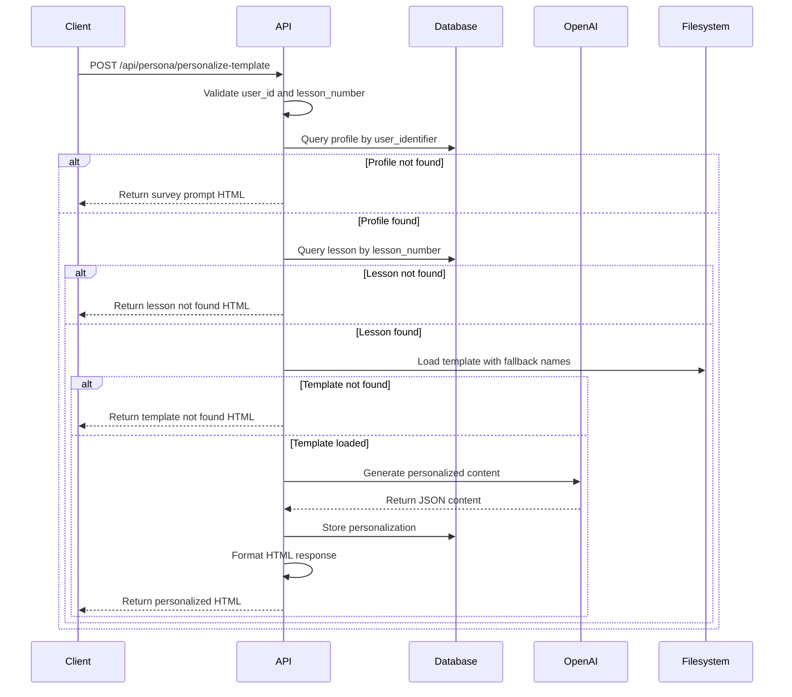
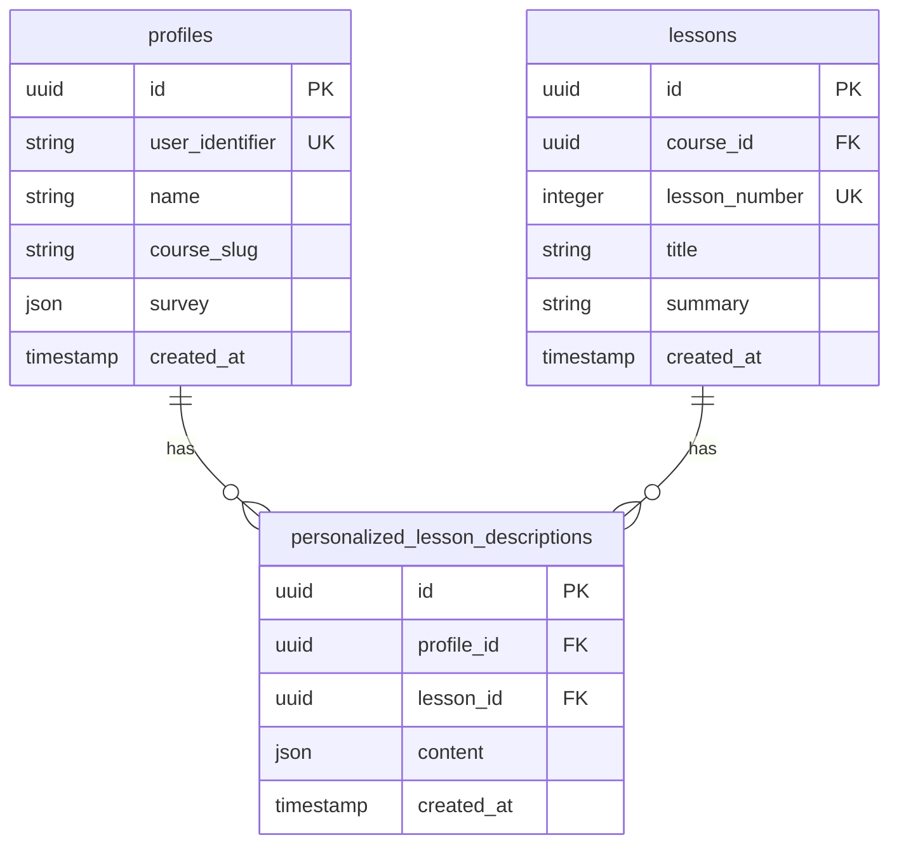

# API Reference

<cite>
**Referenced Files in This Document**   
- [personalize-template/route.ts](file://app/api/persona/personalize-template/route.ts)
- [lessons/route.ts](file://app/api/lessons/route.ts)
- [survey/route.ts](file://app/api/survey/route.ts)
- [personalizations/route.ts](file://app/api/personalizations/route.ts)
- [profiles/[profileId]/personalizations/route.ts](file://app/api/profiles/[profileId]/personalizations/route.ts)
- [block/route.ts](file://app/api/persona/block/route.ts)
- [types.ts](file://lib/supabase/types.ts)
- [personalizations.ts](file://lib/api/personalizations.ts)
- [test-lesson-block.html](file://public/test-lesson-block.html)
- [http.ts](file://lib/utils/http.ts) - *Updated in commit 2dca774c1b54d7e5ce9a56b34ecc788cca802da5*
- [next.config.ts](file://next.config.ts) - *Updated in commit 2dca774c1b54d7e5ce9a56b34ecc788cca802da5*
- [vercel.json](file://vercel.json) - *Updated in commit 2dca774c1b54d7e5ce9a56b34ecc788cca802da5*
- [lesson-templates.ts](file://lib/services/lesson-templates.ts) - *Updated in commit 2dca774c1b54d7e5ce9a56b34ecc788cca802da5*
- [html-formatter.ts](file://lib/services/html-formatter.ts) - *Updated in commit 2dca774c1b54d7e5ce9a56b34ecc788cca802da5*
</cite>

## Update Summary
**Changes Made**   
- Added documentation for default template fallback behavior when user profiles are not found
- Updated CORS configuration details to reflect expanded methods and headers
- Added documentation for OPTIONS preflight handlers across all API endpoints
- Enhanced CORS policy description with new Access-Control-Max-Age header
- Updated section sources to include newly modified files
- Added reference to global CORS configuration in next.config.ts and vercel.json
- Documented the default template content structure and survey CTA behavior

## Table of Contents
1. [Introduction](#introduction)
2. [Core Endpoints](#core-endpoints)
3. [Personalization Flow](#personalization-flow)
4. [CORS and Cross-Origin Access](#cors-and-cross-origin-access)
5. [Error Handling](#error-handling)
6. [Client Integration Examples](#client-integration-examples)
7. [Data Models](#data-models)

## Introduction
This document provides comprehensive API documentation for the persona application, detailing all public endpoints for generating personalized educational content. The system enables dynamic personalization of lesson materials based on user profiles and survey responses, with integration capabilities for external learning platforms.

The API supports key operations including template personalization, lesson retrieval, user profile creation via surveys, and CRUD operations for personalizations. All endpoints follow REST conventions and return JSON responses with consistent error handling patterns.

**Section sources**
- [personalize-template/route.ts](file://app/api/persona/personalize-template/route.ts#L20-L146)
- [survey/route.ts](file://app/api/survey/route.ts#L29-L175)

## Core Endpoints

### POST /api/persona/personalize-template
Generates personalized lesson content based on user profile and lesson number.

**Request Parameters**
- `user_id` (string, required): Unique identifier for the user
- `lesson_number` (number, required): Lesson number to personalize
- `flush` (boolean, optional): If true, bypasses caching

**Request Body Schema**
```json
{
  "user_id": "string",
  "lesson_number": 1,
  "flush": false
}
```

**Response Format**
```json
{
  "ok": true,
  "html": "<div class=\"persona-block\">...</div>",
  "cached": true
}
```

**Status Codes**
- 200: Successful response with personalized HTML content
- 400: Missing required parameters (user_id or lesson_number)
- 500: Internal server error

**Authentication Requirements**: None

**Section sources**
- [personalize-template/route.ts](file://app/api/persona/personalize-template/route.ts#L20-L146)

### GET /api/lessons
Retrieves all available lessons with their metadata.

**Response Format**
```json
{
  "lessons": [
    {
      "id": "uuid",
      "lesson_number": 1,
      "title": "Lesson Title",
      "summary": "Lesson summary text",
      "lesson_descriptions": {
        "data": {}
      }
    }
  ]
}
```

**Status Codes**
- 200: Successful response with lesson data
- 500: Database query error

**Authentication Requirements**: None

**Section sources**
- [lessons/route.ts](file://app/api/lessons/route.ts#L3-L16)

### POST /api/survey
Creates or updates a user profile based on survey responses and generates personalized lesson content.

**Request Body Schema**
```json
{
  "real_name": "string",
  "course": "string",
  "motivation": ["string"],
  "target_clients": "string",
  "skills_wanted": "string",
  "fears": ["string"],
  "wow_result": "string",
  "practice_model": "string",
  "uid": "string"
}
```

**Response Format**
```json
{
  "success": true,
  "profileId": "uuid",
  "userIdentifier": "string",
  "message": "Personal course successfully created!"
}
```

**Status Codes**
- 200: Profile created/updated successfully
- 400: Missing required fields (real_name, course)
- 500: Internal server error

**Authentication Requirements**: None

**Section sources**
- [survey/route.ts](file://app/api/survey/route.ts#L29-L175)

### Personalizations CRUD Operations

#### POST /api/personalizations
Creates or updates a personalization for a specific lesson and profile.

**Request Body Schema**
```json
{
  "profileId": "uuid",
  "lessonId": "uuid",
  "content": {}
}
```

**Response Format**
```json
{
  "success": true,
  "data": {},
  "message": "Personalization created"
}
```

**Status Codes**
- 200: Personalization created or updated
- 400: Missing required fields
- 500: Database operation error

#### DELETE /api/personalizations
Removes a personalization for a specific lesson and profile.

**Request Body Schema**
```json
{
  "profileId": "uuid",
  "lessonId": "uuid"
}
```

**Response Format**
```json
{
  "success": true,
  "message": "Personalization deleted"
}
```

**Status Codes**
- 200: Personalization deleted successfully
- 400: Missing required fields
- 500: Database operation error

#### GET /api/profiles/[profileId]/personalizations
Retrieves all personalizations for a specific profile.

**Response Format**
```json
{
  "personalizations": [
    {
      "lesson_id": "uuid",
      "content": {}
    }
  ]
}
```

**Status Codes**
- 200: Successful response with personalizations
- 500: Database query error

**Authentication Requirements**: None for all personalization endpoints

**Section sources**
- [personalizations/route.ts](file://app/api/personalizations/route.ts#L14-L80)
- [profiles/[profileId]/personalizations/route.ts](file://app/api/profiles/[profileId]/personalizations/route.ts#L8-L27)

## Personalization Flow
The personalization process follows a specific sequence when generating content through POST /api/persona/personalize-template:

1. **User ID and Lesson Validation**: The endpoint first validates that both user_id and lesson_number are provided in the request body.

2. **Profile Retrieval**: The system queries the database for the user's profile using the user_identifier. If no profile exists, it returns a prompt to complete the survey.

3. **Lesson Lookup**: The system retrieves lesson details by matching the lesson_number parameter with the database records.

4. **Template Loading**: The system attempts to load the appropriate lesson template from the store directory using a fallback naming convention:
   - `{lesson_number}-{lesson_number}-{id}-final.json`
   - `{lesson_number}-{id}-final.json`
   - `{id}-final.json`

5. **Content Personalization**: Using OpenAI's GPT model, the system generates personalized content by combining the lesson template with the user's survey responses, addressing their specific motivations, fears, and goals.

6. **Storage and Response**: The personalized content is stored in the database and returned as formatted HTML with the cached status indicating whether the flush parameter was used.

The flow ensures that users receive tailored educational content while maintaining performance through caching mechanisms.



**Diagram sources**
- [personalize-template/route.ts](file://app/api/persona/personalize-template/route.ts#L20-L146)
- [survey/route.ts](file://app/api/survey/route.ts#L29-L175)

## CORS and Cross-Origin Access
The API implements permissive CORS policies to support integration with external educational platforms:

**CORS Headers**
- `Access-Control-Allow-Origin: *`
- `Access-Control-Allow-Methods: GET, POST, PUT, DELETE, OPTIONS`
- `Access-Control-Allow-Headers: Content-Type, Authorization, X-Requested-With`
- `Access-Control-Max-Age: 86400` (24 hours)

All persona-related endpoints (POST /api/persona/personalize-template and POST /api/persona/block) include these CORS headers in their responses, enabling cross-origin requests from any domain. The API also includes OPTIONS method handlers to support preflight requests.

This configuration allows seamless integration with third-party learning management systems and GetCourse integration, where the API is called from different domains than the client application. The updated CORS policy now supports all standard HTTP methods and includes additional headers for authorization and request identification.

The CORS policy is implemented consistently across all persona endpoints through the shared `CORS_HEADERS` constant and `createOptionsHandler` function from `lib/utils/http.ts`. Additionally, global CORS headers are configured in `next.config.ts` and `vercel.json` to ensure headers are applied at multiple levels.

**Section sources**
- [personalize-template/route.ts](file://app/api/persona/personalize-template/route.ts#L21-L24)
- [block/route.ts](file://app/api/persona/block/route.ts#L16-L19)
- [http.ts](file://lib/utils/http.ts#L6-L11) - *Updated in commit 2dca774c1b54d7e5ce9a56b34ecc788cca802da5*
- [next.config.ts](file://next.config.ts#L15-L25) - *Updated in commit 2dca774c1b54d7e5ce9a56b34ecc788cca802da5*
- [vercel.json](file://vercel.json#L4-L25) - *Updated in commit 2dca774c1b54d7e5ce9a56b34ecc788cca802da5*

## Error Handling
The API follows consistent error handling patterns across all endpoints:

**Common Error Responses**
- **400 Bad Request**: Returned when required parameters are missing or invalid
  ```json
  { "ok": false, "error": "user_id and lesson_number are required" }
  ```
- **500 Internal Server Error**: Returned for unexpected server-side errors
  ```json
  { "ok": false, "error": "Internal server error" }
  ```
- **400 Validation Error**: Specific to survey endpoint
  ```json
  { "error": "Name and course are required" }
  ```

**Failure Scenarios**
1. **Missing Profile**: When a user_id doesn't match any existing profile, the system returns a survey prompt instead of an error, guiding the user to complete their profile.

2. **Lesson Not Found**: If the requested lesson_number doesn't exist in the database, the API returns a warning message in HTML format.

3. **Template Not Found**: When no template file is found for the requested lesson, the system returns a template not found message.

4. **OpenAI API Failure**: If the OpenAI service is unavailable, the system falls back to returning the original template content.

5. **Database Errors**: Supabase operations include error handling with appropriate logging and user-friendly error messages.

The error handling strategy prioritizes user experience by providing actionable feedback and fallback content rather than failing completely when components are unavailable.

**Section sources**
- [personalize-template/route.ts](file://app/api/persona/personalize-template/route.ts#L34-L37)
- [survey/route.ts](file://app/api/survey/route.ts#L45-L50)
- [personalizations/route.ts](file://app/api/personalizations/route.ts#L20-L25)

## Client Integration Examples
### JavaScript/TypeScript Implementation
```javascript
async function loadPersonalizedLesson(userId, lessonSlug, lessonTitle) {
  const API_BASE = "https://your-deployment-url.com/api/persona";
  
  try {
    const response = await fetch(`${API_BASE}/block`, {
      method: 'POST',
      headers: {
        'Content-Type': 'application/json',
      },
      body: JSON.stringify({ 
        user_id: userId, 
        lesson: lessonSlug, 
        title: lessonTitle, 
        flush: false
      })
    });
    
    const data = await response.json();
    
    if (data && data.ok && data.html) {
      // Load styles once
      if (!document.querySelector('link[data-persona-styles]')) {
        const link = document.createElement('link');
        link.rel = 'stylesheet';
        link.href = 'https://your-deployment-url.com/persona/styles.css';
        link.setAttribute('data-persona-styles', '1');
        document.head.appendChild(link);
      }
      
      // Insert personalized content
      const mount = document.getElementById('persona-lesson-container');
      mount.innerHTML = data.html;
      mount.style.display = 'block';
      
      console.log('Persona block loaded successfully');
    } else {
      console.warn('Failed to load persona block:', data);
    }
  } catch (error) {
    console.error('Error loading persona block:', error);
  }
}

// Usage example
loadPersonalizedLesson('user123', 'demonstration', '1 Lesson Demonstration');
```

### GetCourse Integration Template
The following HTML template can be embedded in GetCourse lesson pages:

```html
<div id="persona-lesson-1" 
     data-lesson="demonstration" 
     data-title="1 Lesson Demonstration" 
     style="display:none;margin:30px 0;">
</div>

<script>
(async function(){
  const API = "https://your-deployment-url.com/api/persona";
  const UID = "{uid}";
  const userId = (/^\d{3,}$/.test(String(UID))) ? String(UID) : "guest";
  const mount = document.getElementById('persona-lesson-1');
  const lesson = mount.getAttribute('data-lesson');
  const title = mount.getAttribute('data-title');

  try {
    const r = await fetch(`${API}/block`, {
      method: 'POST',
      headers: {'Content-Type': 'application/json'},
      body: JSON.stringify({ 
        user_id: userId, 
        lesson: lesson, 
        title: title, 
        flush: false 
      })
    });
    
    const data = await r.json();
    
    if (data && data.ok && data.html) {
      if (!document.querySelector('link[data-persona-styles]')) {
        const link = document.createElement('link');
        link.rel = 'stylesheet';
        link.href = 'https://your-deployment-url.com/persona/styles.css';
        link.setAttribute('data-persona-styles', '1');
        document.head.appendChild(link);
      }
      mount.innerHTML = data.html;
      mount.style.display = 'block';
    }
  } catch(e) {
    console.error('Persona block error:', e);
  }
})();
</script>
```

**Section sources**
- [test-lesson-block.html](file://public/test-lesson-block.html)
- [block/route.ts](file://app/api/persona/block/route.ts#L14-L183)

## Data Models

### Personalization Content Structure
The personalized content follows a consistent JSON structure with the following fields:

```json
{
  "summary_short": "string",
  "prev_lessons": "string",
  "why_watch": "string",
  "quick_action": "string",
  "social_share": "string",
  "homework_20m": "string"
}
```

### Database Schema
The application uses the following Supabase tables:

**profiles**
- id (uuid)
- user_identifier (string)
- name (string)
- course_slug (string)
- survey (json)
- created_at (timestamp)

**lessons**
- id (uuid)
- course_id (uuid)
- lesson_number (integer)
- title (string)
- summary (string)
- created_at (timestamp)

**personalized_lesson_descriptions**
- id (uuid)
- profile_id (uuid)
- lesson_id (uuid)
- content (json)
- created_at (timestamp)



**Diagram sources**
- [types.ts](file://lib/supabase/types.ts)
- [personalizations.ts](file://lib/api/personalizations.ts)