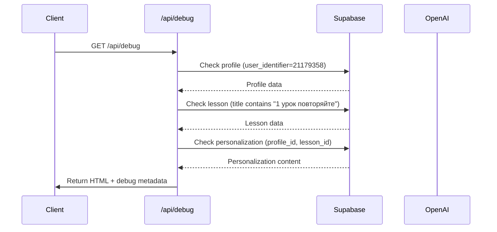
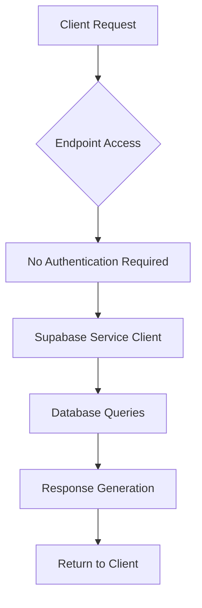

# GET /api/debug

<cite>
**Referenced Files in This Document**   
- [route.ts](file://app/api/debug/route.ts)
- [server.ts](file://lib/supabase/server.ts)
- [openai.ts](file://lib/openai.ts)
- [system_status.md](file://system_status.md)
</cite>

## Table of Contents
1. [Introduction](#introduction)
2. [Endpoint Overview](#endpoint-overview)
3. [Response Payload Structure](#response-payload-structure)
4. [Authentication and Security](#authentication-and-security)
5. [Usage Examples](#usage-examples)
6. [Integration with Monitoring Tools](#integration-with-monitoring-tools)
7. [Troubleshooting Guide](#troubleshooting-guide)
8. [Conclusion](#conclusion)

## Introduction
The `GET /api/debug` endpoint serves as a diagnostic tool for system health verification and operational troubleshooting. It validates core system components including database connectivity, user profiles, lesson data, and personalization logic. This endpoint is critical for deployment validation and production incident response, providing real-time insights into system integrity.

**Section sources**
- [system_status.md](file://system_status.md#L0-L82)

## Endpoint Overview
The debug endpoint performs a comprehensive system check by validating three core components:
1. **User Profile**: Verifies existence of a test user with identifier "21179358"
2. **Lesson Data**: Confirms availability of lesson content matching "1 урок повторяйте"
3. **Personalization Engine**: Ensures personalized lesson descriptions are generated correctly

The endpoint returns a structured response containing HTML content and debug metadata, enabling operations teams to quickly assess system functionality.



**Diagram sources**
- [route.ts](file://app/api/debug/route.ts#L3-L113)

**Section sources**
- [route.ts](file://app/api/debug/route.ts#L3-L113)

## Response Payload Structure
The endpoint returns a JSON response with the following structure:

| Field | Type | Description |
|-------|------|-------------|
| ok | boolean | Overall success status of the diagnostic check |
| html | string | Rendered HTML block containing personalized lesson content |
| debug | object | Diagnostic metadata for system verification |

The `debug` object contains:
- `profile`: Name of the retrieved user profile
- `lesson`: Title of the matched lesson
- `contentKeys`: List of available content keys in personalization
- `summaryShort`: Short summary content
- `whyWatch`: Motivational content explaining lesson value

Example response (healthy state):
```json
{
  "ok": true,
  "html": "<div class=\"persona-block\">...</div>",
  "debug": {
    "profile": "Test User",
    "lesson": "1 урок повторяйте",
    "contentKeys": ["summary_short", "why_watch", "quick_action", "homework_20m", "social_share"],
    "summaryShort": "Урок 1: Введение в массаж",
    "whyWatch": "Этот урок поможет вам освоить базовые техники"
  }
}
```

Example response (degraded state):
```json
{
  "error": "Пользователь не найден"
}
```

**Section sources**
- [route.ts](file://app/api/debug/route.ts#L74-L113)

## Authentication and Security
The endpoint does not implement admin-only access controls in the current implementation. It is accessible without authentication, making it suitable for external monitoring but potentially exposing system information. The endpoint connects to Supabase using service role credentials for comprehensive database access during diagnostics.

Security considerations:
- Uses Supabase service role key for full database access
- No authentication or authorization checks implemented
- Exposes limited system information through error messages
- CORS headers allow access from any origin



**Diagram sources**
- [route.ts](file://app/api/debug/route.ts#L3-L113)
- [server.ts](file://lib/supabase/server.ts#L1-L27)

**Section sources**
- [server.ts](file://lib/supabase/server.ts#L1-L27)
- [openai.ts](file://lib/openai.ts#L1-L7)

## Usage Examples
Operations teams use this endpoint for:

**Deployment Verification:**
```bash
curl -X GET http://localhost:3000/api/debug
# Verify "ok": true in response
# Check debug.profile and debug.lesson fields
```

**Production Incident Response:**
- When users report missing personalized content
- After database migrations or schema changes
- Following Supabase connection issues
- When OpenAI integration fails

**Monitoring Integration:**
```bash
# Health check script
if curl -s http://localhost:3000/api/debug | grep -q '"ok":true'; then
  echo "System healthy"
else
  echo "System degraded" | send-alert
fi
```

**Section sources**
- [route.ts](file://app/api/debug/route.ts#L3-L113)
- [system_status.md](file://system_status.md#L0-L82)

## Integration with Monitoring Tools
The endpoint integrates with external monitoring systems by providing a reliable health check endpoint. Monitoring tools can parse the JSON response to detect system degradation:

1. **Status Detection**: Check `ok` field for boolean true value
2. **Component Verification**: Validate presence of `debug.profile` and `debug.lesson`
3. **Content Integrity**: Ensure `contentKeys` contains expected fields
4. **Response Time Monitoring**: Track endpoint latency

The endpoint's simple JSON structure allows easy integration with:
- Prometheus/Grafana
- Datadog
- New Relic
- Custom health check scripts

**Section sources**
- [system_status.md](file://system_status.md#L0-L82)

## Troubleshooting Guide
Common issues and resolution steps:

**Issue: "Пользователь не найден"**
- Verify profiles table contains user with identifier "21179358"
- Check Supabase connection and authentication
- Validate database schema and data integrity

**Issue: "Урок не найден"**
- Confirm lessons table contains record with title containing "1 урок повторяйте"
- Check database indexing and text search configuration
- Verify lesson data import process completed successfully

**Issue: "Персонализация не найдена"**
- Ensure personalized_lesson_descriptions table has matching profile_id and lesson_id
- Validate personalization generation process
- Check OpenAI API connectivity and quota

**Issue: Internal Server Error**
- Review server logs for error details
- Verify environment variables (Supabase URL, API keys)
- Check network connectivity to Supabase and OpenAI services

**Section sources**
- [route.ts](file://app/api/debug/route.ts#L3-L113)

## Conclusion
The `GET /api/debug` endpoint serves as a critical diagnostic tool for system health monitoring and operational troubleshooting. While currently lacking authentication controls, it provides valuable insights into the integrity of user data, lesson content, and personalization workflows. The endpoint is essential for deployment validation and rapid incident response, enabling operations teams to quickly identify and resolve system issues.