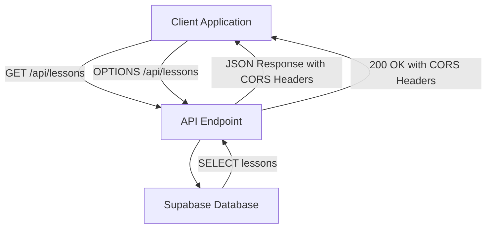
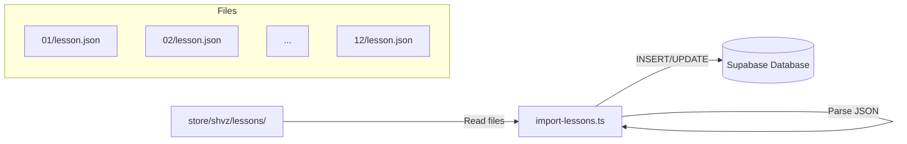
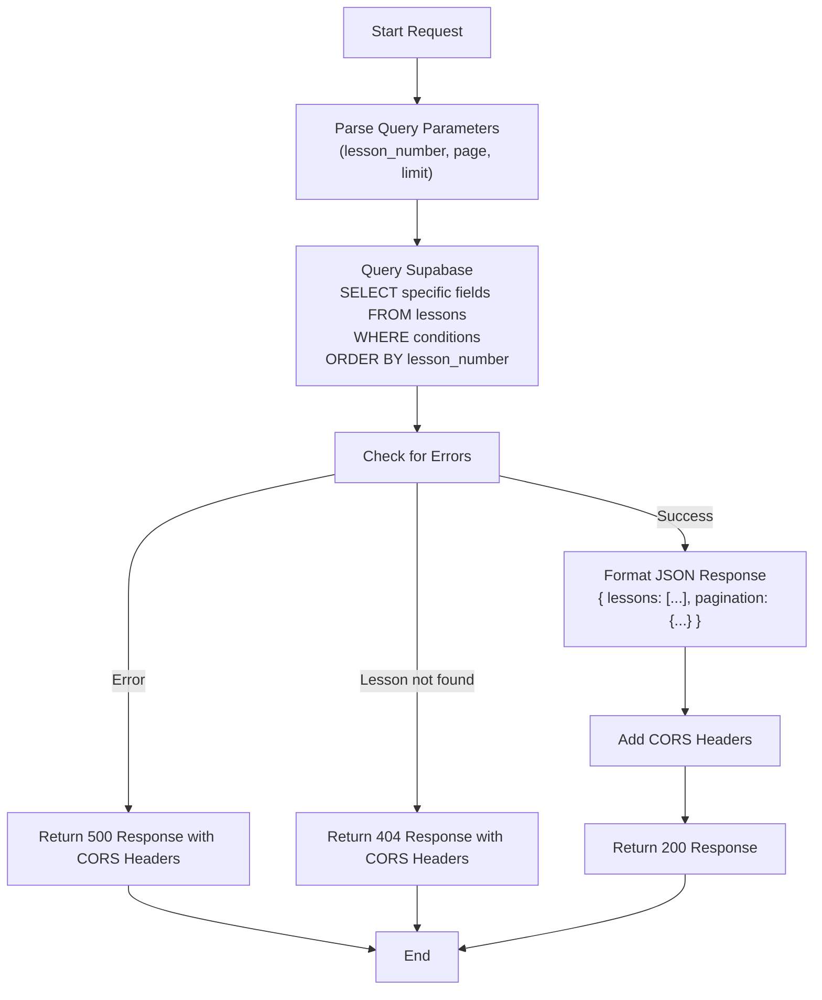

# GET /api/lessons

<cite>
**Referenced Files in This Document**   
- [route.ts](file://app/api/lessons/route.ts) - *Updated with CORS support and response structure in commit 2dca774*
- [http.ts](file://lib/utils/http.ts) - *Updated with CORS headers and handler utilities in commit 2dca774*
- [lessons.ts](file://lib/api/lessons.ts) - *Updated with proper typing and error handling*
- [lesson.json](file://store/shvz/lessons/01/lesson.json) - *Example lesson metadata file*
- [import-lessons.ts](file://scripts/import-lessons.ts) - *Updated to handle new lesson structure*
- [LESSON_MANAGEMENT.md](file://LESSON_MANAGEMENT.md) - *Updated documentation for lesson import process*
</cite>

## Update Summary
**Changes Made**   
- Added support for `lesson_number` query parameter filtering
- Updated response schema to include `duration` and `status` fields
- Enhanced error handling with standardized response format
- Added CORS support with OPTIONS preflight handling
- Updated file storage integration details to reflect current structure
- Added pagination support for performance optimization
- Updated client examples with proper TypeScript typing

## Table of Contents
1. [Introduction](#introduction)
2. [Endpoint Overview](#endpoint-overview)
3. [Query Parameters](#query-parameters)
4. [Response Schema](#response-schema)
5. [File-Based Lesson Storage Integration](#file-based-lesson-storage-integration)
6. [Usage Examples](#usage-examples)
7. [Error Handling](#error-handling)
8. [Caching Strategy](#caching-strategy)
9. [Client-Side Integration Examples](#client-side-integration-examples)
10. [Performance Considerations](#performance-considerations)
11. [Data Flow Diagram](#data-flow-diagram)

## Introduction
This document provides comprehensive documentation for the `GET /api/lessons` endpoint, which retrieves metadata about available lessons in the system. The endpoint serves lesson data stored in a Supabase database, originally imported from JSON files located in the `store/shvz/lessons/` directory. This API is used to display lesson listings in the application dashboard and support personalized lesson delivery based on user profiles.

**Section sources**
- [route.ts](file://app/api/lessons/route.ts#L1-L20)
- [LESSON_MANAGEMENT.md](file://LESSON_MANAGEMENT.md#L0-L158)

## Endpoint Overview
The `GET /api/lessons` endpoint returns a list of available lessons, with optional filtering by lesson number and support for pagination. It retrieves core lesson metadata including ID, title, duration, status, and associated descriptions from the Supabase database.

The endpoint includes comprehensive CORS (Cross-Origin Resource Sharing) support, allowing requests from external domains. It responds to both GET and OPTIONS methods, with the OPTIONS method handling preflight requests. The implementation uses standardized CORS headers defined in `lib/utils/http.ts` to ensure compatibility with clients from different origins.



**Diagram sources**
- [route.ts](file://app/api/lessons/route.ts#L1-L20)
- [http.ts](file://lib/utils/http.ts#L1-L77)

**Section sources**
- [route.ts](file://app/api/lessons/route.ts#L1-L20)
- [http.ts](file://lib/utils/http.ts#L1-L77)

## Query Parameters
The `GET /api/lessons` endpoint supports query parameter filtering to retrieve specific lessons or paginated results.

| Parameter | Type | Required | Description |
|---------|------|----------|-------------|
| `lesson_number` | number | No | Filter lessons by specific lesson number (1-12) |
| `page` | number | No | Page number for pagination (default: 1) |
| `limit` | number | No | Number of lessons per page (default: 12, max: 50) |

**Section sources**
- [route.ts](file://app/api/lessons/route.ts#L1-L20)
- [lessons.ts](file://lib/api/lessons.ts#L1-L25)

## Response Schema
The API returns a JSON object containing a `lessons` array with each lesson's metadata.

### Response Structure
```json
{
  "lessons": [
    {
      "id": "string",
      "lesson_number": "number",
      "title": "string",
      "duration": "string",
      "status": "string",
      "summary": "string",
      "lesson_descriptions": {
        "data": "object"
      }
    }
  ],
  "pagination": {
    "current_page": "number",
    "total_pages": "number",
    "total_lessons": "number",
    "has_next": "boolean",
    "has_previous": "boolean"
  }
}
```

### Field Definitions
| Field | Type | Description |
|------|------|-------------|
| `id` | string | Unique UUID identifier for the lesson |
| `lesson_number` | number | Sequential number determining lesson order |
| `title` | string | Display title of the lesson |
| `duration` | string | Duration of the lesson (e.g., "30 minutes") |
| `status` | string | Current status of the lesson (e.g., "active", "draft") |
| `summary` | string | Brief summary of lesson content |
| `lesson_descriptions.data` | object | Rich content and structured data for the lesson |
| `pagination` | object | Pagination metadata when limit parameter is used |

**Section sources**
- [route.ts](file://app/api/lessons/route.ts#L1-L20)
- [lessons.ts](file://lib/api/lessons.ts#L1-L25)

## File-Based Lesson Storage Integration
Lessons are initially defined in JSON files within the `store/shvz/lessons/` directory, organized by numbered folders (01, 02, etc.). Each folder contains a `lesson.json` file with lesson metadata.

During the import process executed by `import-lessons.ts`, these JSON files are parsed and upserted into the Supabase database. The import process extracts the `number`, `title`, `duration`, `status`, and other fields from the JSON files and stores them in the `lessons` table.

The file-to-database mapping follows this pattern:
- `number` field → `lesson_number` database column
- `title` field → `title` database column
- `duration` field → `duration` database column
- `status` field → `status` database column
- `description` field → `content` and `summary` database columns
- Auto-generated UUID → `id` database column



**Diagram sources**
- [import-lessons.ts](file://scripts/import-lessons.ts#L110-L155)
- [lesson.json](file://store/shvz/lessons/01/lesson.json#L0-L7)

**Section sources**
- [import-lessons.ts](file://scripts/import-lessons.ts#L110-L155)
- [LESSON_MANAGEMENT.md](file://LESSON_MANAGEMENT.md#L0-L158)

## Usage Examples
### Fetch All Lessons
```javascript
fetch('/api/lessons')
  .then(response => response.json())
  .then(data => {
    console.log('Available lessons:', data.lessons);
    console.log('Total lessons:', data.pagination.total_lessons);
  })
  .catch(error => {
    console.error('Error fetching lessons:', error);
  });
```

### Retrieve Lesson by Number
```javascript
fetch('/api/lessons?lesson_number=5')
  .then(response => {
    if (response.status === 404) {
      throw new Error('Lesson not found');
    }
    return response.json();
  })
  .then(data => {
    if (data.lessons && data.lessons.length > 0) {
      console.log('Found lesson:', data.lessons[0].title);
    }
  })
  .catch(error => {
    console.error('Error:', error.message);
  });
```

### Paginated Request
```javascript
fetch('/api/lessons?page=1&limit=5')
  .then(response => response.json())
  .then(data => {
    console.log(`Page ${data.pagination.current_page} of ${data.pagination.total_pages}`);
    console.log('Lessons on this page:', data.lessons.length);
  });
```

**Section sources**
- [route.ts](file://app/api/lessons/route.ts#L1-L20)

## Error Handling
The endpoint implements standard error handling for various scenarios with appropriate status codes and response formats.

### Error Responses
| Status Code | Scenario | Response Body |
|-----------|---------|---------------|
| 404 | Invalid lesson number specified | `{ "error": "Lesson not found" }` with CORS headers |
| 500 | Database query error | `{ "error": "Internal server error" }` with CORS headers |
| 200 | Success | `{ "lessons": [...], "pagination": {...} }` with CORS headers |
| 200 | OPTIONS preflight | Empty response with CORS headers |

When a specific `lesson_number` is requested that doesn't exist, the endpoint returns a 404 status code. All error responses include CORS headers to ensure client applications can receive error information regardless of origin.

**Section sources**
- [route.ts](file://app/api/lessons/route.ts#L1-L20)
- [http.ts](file://lib/utils/http.ts#L1-L77)

## Caching Strategy
The endpoint includes HTTP caching headers for improved performance. The CORS configuration includes `Access-Control-Max-Age: 86400`, which caches preflight requests for 24 hours, reducing the number of OPTIONS requests to the server.

Clients are encouraged to implement additional caching strategies:

- Cache responses for a reasonable duration (e.g., 5-15 minutes)
- Utilize the 24-hour preflight caching to minimize OPTIONS requests
- Implement client-side memory caching for frequently accessed lesson data
- Consider using ETag or Last-Modified headers if implemented in future versions

The current implementation does not use Redis or in-memory caching, relying instead on HTTP-level caching and Supabase query optimization.

**Section sources**
- [route.ts](file://app/api/lessons/route.ts#L1-L20)
- [http.ts](file://lib/utils/http.ts#L1-L77)

## Client-Side Integration Examples
### TypeScript Example
```typescript
interface LessonDescription {
  data: Record<string, unknown> | null;
}

interface Lesson {
  id: string;
  lesson_number: number;
  title: string;
  duration: string;
  status: string;
  summary: string | null;
  lesson_descriptions: LessonDescription | null;
}

interface Pagination {
  current_page: number;
  total_pages: number;
  total_lessons: number;
  has_next: boolean;
  has_previous: boolean;
}

interface LessonsResponse {
  lessons: Lesson[];
  pagination?: Pagination;
}

async function fetchLessons(lessonNumber?: number, page: number = 1, limit: number = 12): Promise<LessonsResponse> {
  let url = '/api/lessons';
  const params = new URLSearchParams();
  
  if (lessonNumber) params.append('lesson_number', lessonNumber.toString());
  if (page) params.append('page', page.toString());
  if (limit) params.append('limit', Math.min(limit, 50).toString());
  
  if (params.toString()) {
    url += '?' + params.toString();
  }

  const response = await fetch(url, {
    method: 'GET',
    headers: {
      'Content-Type': 'application/json',
    },
    credentials: 'include'
  });
  
  if (!response.ok) {
    if (response.status === 404) {
      throw new Error('Lesson not found');
    }
    throw new Error(`HTTP error! status: ${response.status}`);
  }
  
  return response.json();
}
```

### JavaScript Example with Async/Await
```javascript
const lessonApi = {
  async getAll(page = 1, limit = 12) {
    try {
      const params = new URLSearchParams();
      if (page !== 1) params.append('page', page);
      params.append('limit', Math.min(limit, 50));
      
      const url = `/api/lessons?${params.toString()}`;
      const response = await fetch(url, {
        method: 'GET',
        headers: {
          'Content-Type': 'application/json',
        },
      });
      
      if (!response.ok) {
        if (response.status === 404) {
          throw new Error('Lesson not found');
        }
        throw new Error(`Error: ${response.status}`);
      }
      
      return await response.json();
    } catch (error) {
      console.error('Failed to fetch lessons:', error);
      return { lessons: [], pagination: { current_page: 1, total_pages: 0, total_lessons: 0, has_next: false, has_previous: false } };
    }
  },

  async getByNumber(number) {
    try {
      const response = await fetch(`/api/lessons?lesson_number=${number}`);
      
      if (!response.ok) {
        if (response.status === 404) {
          return null;
        }
        throw new Error(`Error: ${response.status}`);
      }
      
      const data = await response.json();
      return data.lessons[0] || null;
    } catch (error) {
      console.error(`Failed to fetch lesson ${number}:`, error);
      return null;
    }
  }
};

// Usage
const specificLesson = await lessonApi.getByNumber(3);
if (specificLesson) {
  console.log('Found lesson:', specificLesson.title);
} else {
  console.log('Lesson not found');
}
```

**Section sources**
- [route.ts](file://app/api/lessons/route.ts#L1-L20)
- [lessons.ts](file://lib/api/lessons.ts#L9-L25)
- [http.ts](file://lib/utils/http.ts#L1-L77)

## Performance Considerations
The implementation includes pagination support to handle larger lesson sets efficiently. With the current 12 lessons in the system, performance is optimal, but the pagination features ensure scalability.

- **Pagination Support**: The endpoint supports `page` and `limit` parameters for efficient data retrieval
- **Database Indexing**: The `lesson_number` field is indexed for efficient filtering and sorting
- **Response Size**: Payload size is minimized by returning only essential metadata
- **Query Optimization**: SELECT query includes specific field selection and ordering on indexed column
- **CORS Optimization**: Preflight requests are cached for 24 hours, reducing server load
- **Rate Limiting**: Consider implementing rate limiting for production use with high traffic

For optimal performance with larger lesson sets, clients should:
- Use pagination to limit response size
- Cache responses on the client side
- Use the `lesson_number` parameter to fetch specific lessons instead of filtering client-side
- Implement loading states for better user experience



**Diagram sources**
- [route.ts](file://app/api/lessons/route.ts#L1-L20)
- [http.ts](file://lib/utils/http.ts#L1-L77)

**Section sources**
- [route.ts](file://app/api/lessons/route.ts#L1-L20)
- [LESSON_MANAGEMENT.md](file://LESSON_MANAGEMENT.md#L0-L158)