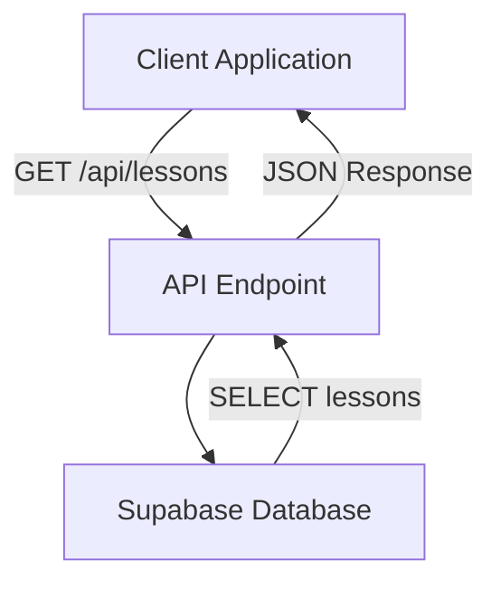
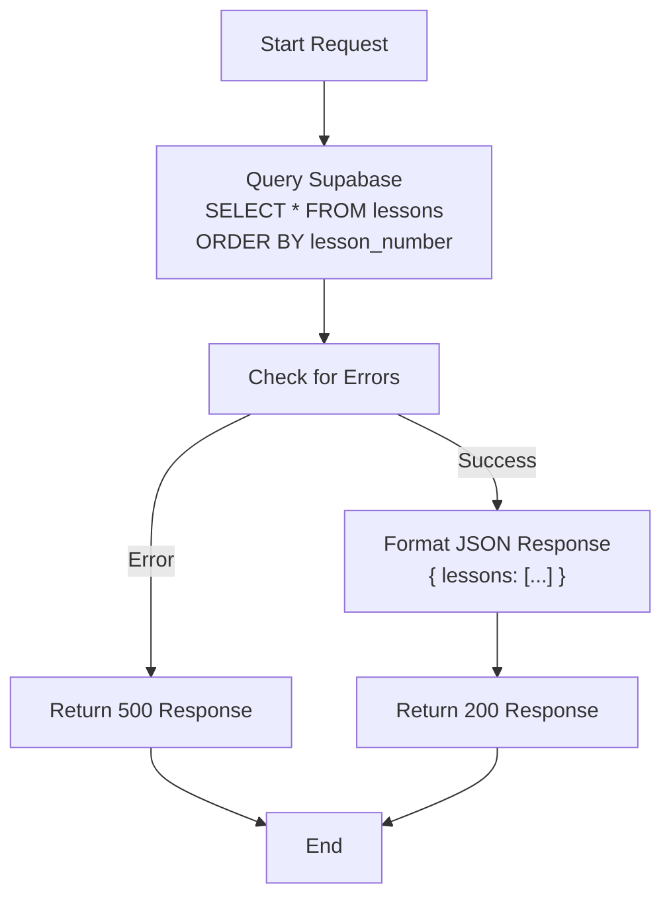

# GET /api/lessons

<cite>
**Referenced Files in This Document**   
- [route.ts](file://app/api/lessons/route.ts)
- [lessons.ts](file://lib/api/lessons.ts)
- [lesson.json](file://store/shvz/lessons/01/lesson.json)
- [import-lessons.ts](file://scripts/import-lessons.ts)
- [LESSON_MANAGEMENT.md](file://LESSON_MANAGEMENT.md)
</cite>

## Table of Contents
1. [Introduction](#introduction)
2. [Endpoint Overview](#endpoint-overview)
3. [Query Parameters](#query-parameters)
4. [Response Schema](#response-schema)
5. [File-Based Lesson Storage Integration](#file-based-lesson-storage-integration)
6. [Usage Examples](#usage-examples)
7. [Error Handling](#error-handling)
8. [Caching Strategy](#caching-strategy)
9. [Client-Side Integration Examples](#client-side-integration-examples)
10. [Performance Considerations](#performance-considerations)
11. [Data Flow Diagram](#data-flow-diagram)

## Introduction
This document provides comprehensive documentation for the `GET /api/lessons` endpoint, which retrieves metadata about available lessons in the system. The endpoint serves lesson data stored in a Supabase database, originally imported from JSON files located in the `store/shvz/lessons/` directory. This API is used to display lesson listings in the application dashboard and support personalized lesson delivery based on user profiles.

**Section sources**
- [route.ts](file://app/api/lessons/route.ts#L1-L20)
- [LESSON_MANAGEMENT.md](file://LESSON_MANAGEMENT.md#L0-L158)

## Endpoint Overview
The `GET /api/lessons` endpoint returns a list of all available lessons sorted by their lesson number in ascending order. It retrieves core lesson metadata including ID, title, summary, and associated descriptions from the Supabase database.

The endpoint does not currently support filtering via query parameters in its implementation, despite potential client-side expectations. All lessons are returned in a single response, ordered by `lesson_number`.



**Diagram sources**
- [route.ts](file://app/api/lessons/route.ts#L1-L20)
- [lessons.ts](file://lib/api/lessons.ts#L9-L23)

**Section sources**
- [route.ts](file://app/api/lessons/route.ts#L1-L20)

## Query Parameters
Currently, the `GET /api/lessons` endpoint does not implement query parameter filtering in its server-side logic. Despite potential client expectations for parameters like `lesson_number`, the endpoint returns all lessons without filtering.

However, the system supports lesson identification through stable UUIDs mapped to lesson numbers, which can be used in related endpoints. The mapping between lesson numbers and IDs is maintained in various parts of the codebase for consistency.

| Parameter | Type | Required | Description |
|---------|------|----------|-------------|
| (none) | - | - | No query parameters are currently supported |

**Section sources**
- [route.ts](file://app/api/lessons/route.ts#L1-L20)
- [survey/route.ts](file://app/api/survey/route.ts#L296-L316)

## Response Schema
The API returns a JSON object containing a `lessons` array with each lesson's metadata.

### Response Structure
```json
{
  "lessons": [
    {
      "id": "string",
      "lesson_number": "number",
      "title": "string",
      "summary": "string",
      "lesson_descriptions": {
        "data": "object"
      }
    }
  ]
}
```

### Field Definitions
| Field | Type | Description |
|------|------|-------------|
| `id` | string | Unique UUID identifier for the lesson |
| `lesson_number` | number | Sequential number determining lesson order |
| `title` | string | Display title of the lesson |
| `summary` | string | Brief summary of lesson content |
| `lesson_descriptions.data` | object | Rich content and structured data for the lesson |

**Section sources**
- [route.ts](file://app/api/lessons/route.ts#L1-L20)
- [lessons.ts](file://lib/api/lessons.ts#L1-L23)

## File-Based Lesson Storage Integration
Lessons are initially defined in JSON files within the `store/shvz/lessons/` directory, organized by numbered folders (01, 02, etc.). Each folder contains a `lesson.json` file with lesson metadata.

During the import process executed by `import-lessons.ts`, these JSON files are parsed and upserted into the Supabase database. The import process extracts the `number`, `title`, `description`, and other fields from the JSON files and stores them in the `lessons` table.

The file-to-database mapping follows this pattern:
- `number` field → `lesson_number` database column
- `title` field → `title` database column
- `description` field → `content` and `summary` database columns
- Auto-generated UUID → `id` database column


**Diagram sources**
- [import-lessons.ts](file://scripts/import-lessons.ts#L110-L155)
- [lesson.json](file://store/shvz/lessons/01/lesson.json#L0-L7)

**Section sources**
- [import-lessons.ts](file://scripts/import-lessons.ts#L110-L155)
- [LESSON_MANAGEMENT.md](file://LESSON_MANAGEMENT.md#L0-L158)

## Usage Examples
### Fetch All Lessons
```javascript
fetch('/api/lessons')
  .then(response => response.json())
  .then(data => {
    console.log('Available lessons:', data.lessons);
  })
  .catch(error => {
    console.error('Error fetching lessons:', error);
  });
```

### Retrieve Lesson by Number (Client-Side Filtering)
Since server-side filtering is not implemented, clients must filter results locally:

```javascript
async function getLessonByNumber(targetNumber) {
  const response = await fetch('/api/lessons');
  const data = await response.json();
  
  return data.lessons.find(lesson => 
    lesson.lesson_number === targetNumber
  );
}

// Usage
getLessonByNumber(5).then(lesson => {
  if (lesson) {
    console.log('Found lesson:', lesson.title);
  } else {
    console.log('Lesson not found');
  }
});
```

**Section sources**
- [route.ts](file://app/api/lessons/route.ts#L1-L20)

## Error Handling
The endpoint implements standard error handling for database operations.

### Error Responses
| Status Code | Scenario | Response Body |
|-----------|---------|---------------|
| 500 | Database query error | `{ "error": "error message" }` |
| 200 | Success | `{ "lessons": [...] }` |

The endpoint does not return 404 errors for invalid lesson numbers since it always returns the complete list of lessons. Client-side code should handle cases where a specific lesson number is not found in the returned array.

**Section sources**
- [route.ts](file://app/api/lessons/route.ts#L1-L20)

## Caching Strategy
The documentation does not specify explicit HTTP caching headers or server-side caching mechanisms for this endpoint. However, given that lesson metadata is relatively static, clients are encouraged to implement caching strategies:

- Cache responses for a reasonable duration (e.g., 5-15 minutes)
- Use ETag or Last-Modified headers if implemented by the server
- Implement client-side memory caching for frequently accessed lesson data

No Redis or in-memory caching is evident in the current implementation.

**Section sources**
- [route.ts](file://app/api/lessons/route.ts#L1-L20)

## Client-Side Integration Examples
### TypeScript Example
```typescript
interface LessonDescription {
  data: Record<string, unknown> | null;
}

interface Lesson {
  id: string;
  lesson_number: number;
  title: string;
  summary: string | null;
  lesson_descriptions: LessonDescription | null;
}

interface LessonsResponse {
  lessons: Lesson[];
}

async function fetchLessons(): Promise<LessonsResponse> {
  const response = await fetch('/api/lessons');
  
  if (!response.ok) {
    throw new Error(`HTTP error! status: ${response.status}`);
  }
  
  return response.json();
}
```

### JavaScript Example with Async/Await
```javascript
const lessonApi = {
  async getAll() {
    try {
      const response = await fetch('/api/lessons');
      if (!response.ok) throw new Error(`Error: ${response.status}`);
      return await response.json();
    } catch (error) {
      console.error('Failed to fetch lessons:', error);
      return { lessons: [] };
    }
  },

  async findByNumber(number) {
    const { lessons } = await this.getAll();
    return lessons.find(lesson => lesson.lesson_number === number);
  }
};

// Usage
const specificLesson = await lessonApi.findByNumber(3);
```

**Section sources**
- [route.ts](file://app/api/lessons/route.ts#L1-L20)
- [lessons.ts](file://lib/api/lessons.ts#L9-L23)

## Performance Considerations
The current implementation retrieves all lessons in a single query without pagination. With only 12 lessons in the system, this approach is performant. However, considerations for future scaling include:

- **No Pagination**: The endpoint returns all lessons without support for offset/limit parameters
- **Fixed Dataset**: Currently limited to 12 lessons as defined in the file structure
- **Database Indexing**: The `lesson_number` field should be indexed for efficient sorting
- **Response Size**: Minimal payload size due to limited lesson count
- **Query Optimization**: Simple SELECT query with ordering on indexed column

For larger lesson sets, implementing pagination (e.g., `?page=1&limit=10`) or cursor-based iteration would be recommended to improve performance and reduce memory usage on client devices.



**Diagram sources**
- [route.ts](file://app/api/lessons/route.ts#L1-L20)

**Section sources**
- [route.ts](file://app/api/lessons/route.ts#L1-L20)
- [LESSON_MANAGEMENT.md](file://LESSON_MANAGEMENT.md#L0-L158)