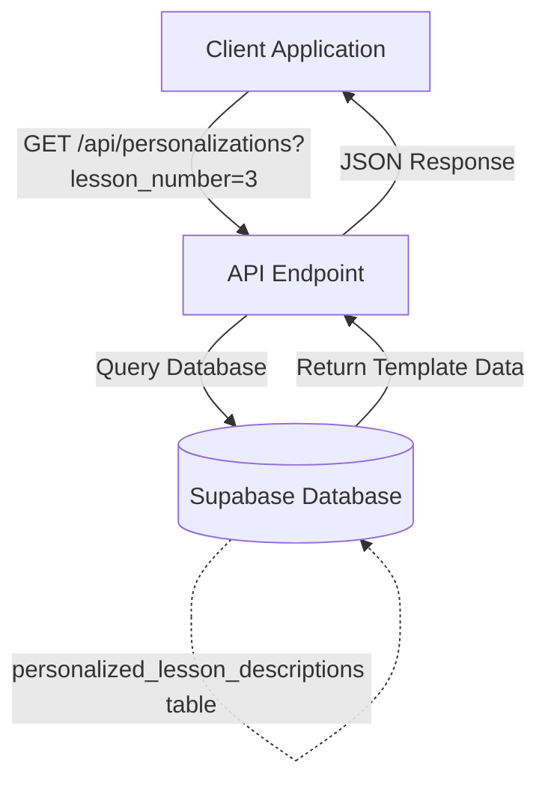
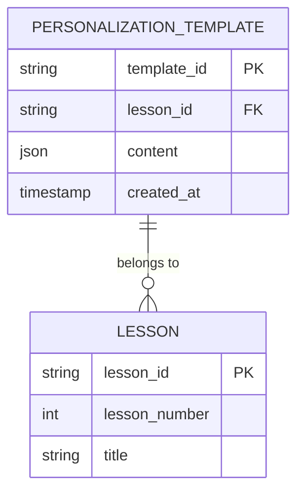
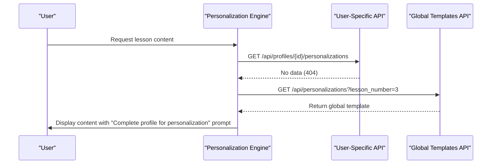
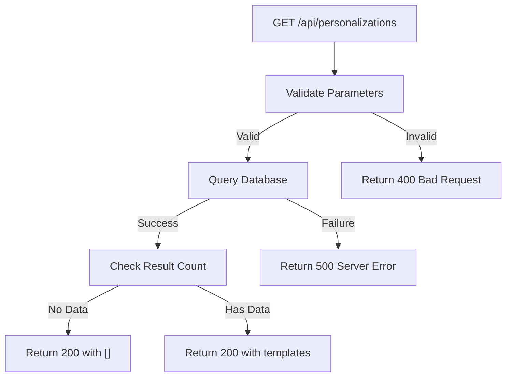
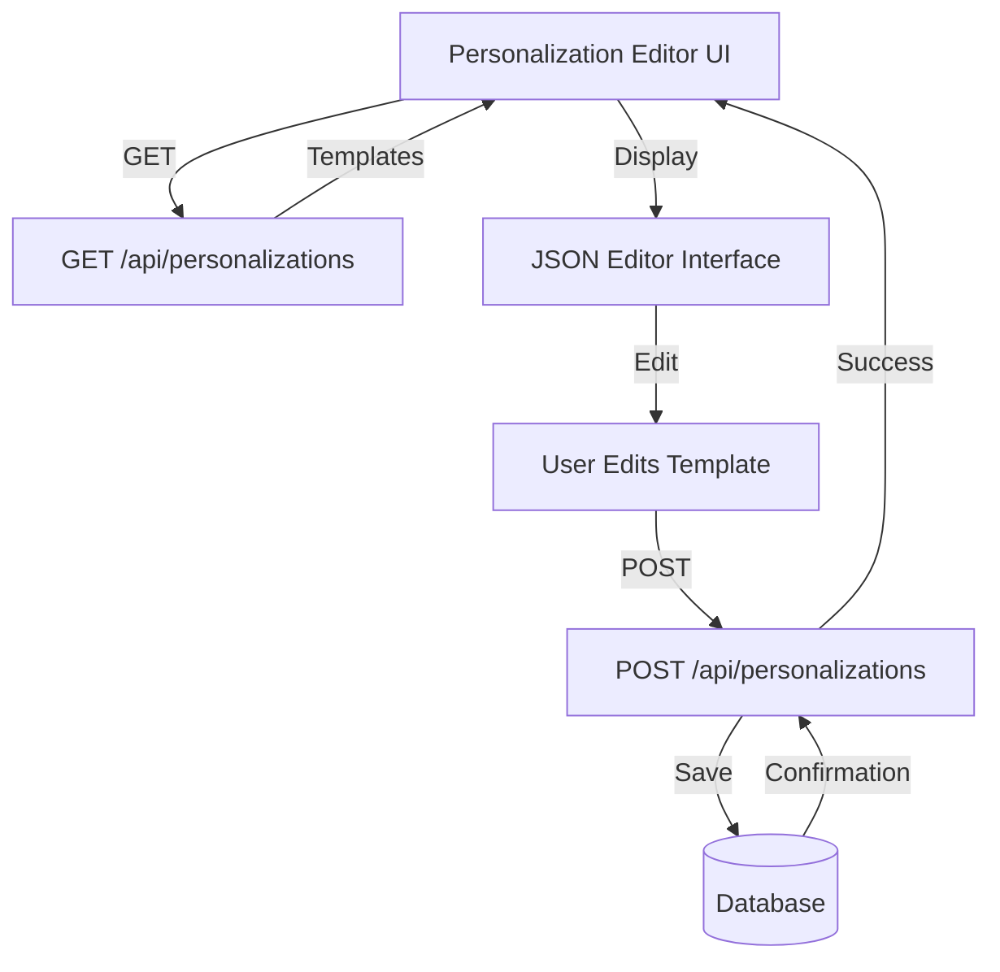

# GET /api/personalizations

<cite>
**Referenced Files in This Document**   
- [route.ts](file://app/api/personalizations/route.ts)
- [personalization-editor.tsx](file://components/personalizations/personalization-editor.tsx)
- [PERSONALIZATION_API.md](file://PERSONALIZATION_API.md)
- [lib/api/personalizations.ts](file://lib/api/personalizations.ts)
- [app/api/persona/personalize-template/route.ts](file://app/api/persona/personalize-template/route.ts)
</cite>

## Table of Contents
1. [Introduction](#introduction)
2. [Endpoint Overview](#endpoint-overview)
3. [Query Parameters](#query-parameters)
4. [Response Format](#response-format)
5. [Fallback Mechanism](#fallback-mechanism)
6. [Usage Examples](#usage-examples)
7. [Caching Considerations](#caching-considerations)
8. [Error Handling](#error-handling)
9. [Integration with Personalization Editor](#integration-with-personalization-editor)

## Introduction
The `GET /api/personalizations` endpoint retrieves global personalization templates used to provide default content when user-specific personalization data is unavailable. These templates serve as fallbacks for the personalization engine, ensuring users receive relevant lesson content even before completing their profile surveys. The endpoint supports filtering by lesson number and returns structured JSON templates used by AI processing to generate personalized lesson descriptions.

**Section sources**
- [PERSONALIZATION_API.md](file://PERSONALIZATION_API.md#L0-L76)

## Endpoint Overview
The `GET /api/personalizations` endpoint is designed to retrieve global personalization templates from the database. These templates contain structured content that serves as default recommendations when no user-specific personalization exists. The endpoint queries the `personalized_lesson_descriptions` table in Supabase and returns template data that includes content structure, lesson identifiers, and creation timestamps.

The endpoint plays a critical role in the personalization system by providing fallback content that maintains user engagement when individualized data is not yet available. This ensures a consistent user experience across the platform, particularly for new users who haven't completed their profile surveys.



**Diagram sources**
- [route.ts](file://app/api/personalizations/route.ts)
- [lib/api/personalizations.ts](file://lib/api/personalizations.ts)

**Section sources**
- [route.ts](file://app/api/personalizations/route.ts)
- [lib/api/personalizations.ts](file://lib/api/personalizations.ts)

## Query Parameters
The endpoint supports query parameters for filtering results by lesson number:

- `lesson_number` (optional): Filters templates by specific lesson number (1-12). When provided, returns only templates matching the specified lesson number.

The filtering functionality allows clients to request specific templates needed for particular lessons, reducing payload size and improving performance. When no lesson number is specified, the endpoint returns all available global templates.

**Section sources**
- [app/api/persona/personalize-template/route.ts](file://app/api/persona/personalize-template/route.ts#L126-L167)

## Response Format
The endpoint returns a JSON response containing an array of personalization templates with the following structure:

- `template_id`: Unique identifier for the template
- `lesson_id`: Identifier for the associated lesson
- `content`: Structured object containing the template content with fields such as:
  - `summary_short`: Brief lesson summary
  - `why_watch`: Explanation of lesson importance and benefits
  - `quick_action`: Immediate action items for the user
  - `social_share`: Social media sharing message
  - `homework_20m`: 20-minute homework assignment
- `created_at`: Timestamp of template creation

The content structure is optimized for AI processing and is used to generate personalized HTML blocks for lesson pages.



**Diagram sources**
- [route.ts](file://app/api/personalizations/route.ts)
- [PERSONALIZATION_API.md](file://PERSONALIZATION_API.md#L114-L159)

**Section sources**
- [route.ts](file://app/api/personalizations/route.ts)
- [PERSONALIZATION_API.md](file://PERSONALIZATION_API.md#L114-L159)

## Fallback Mechanism
The `GET /api/personalizations` endpoint serves as a critical fallback mechanism in the personalization engine. When a user requests lesson content but has no user-specific personalization record (typically because they haven't completed their profile survey), the system automatically retrieves the global template from this endpoint.

This fallback ensures that all users receive relevant, structured content regardless of their profile completion status. The personalization engine first attempts to retrieve user-specific data from the `/api/profiles/[profileId]/personalizations` endpoint, and if no data is found, it falls back to the global templates provided by this endpoint.

The fallback mechanism maintains application functionality and user engagement while encouraging users to complete their profiles for fully personalized content.



**Diagram sources**
- [app/api/persona/block/route.ts](file://app/api/persona/block/route.ts#L105-L128)
- [app/api/personalizations/route.ts](file://app/api/personalizations/route.ts)

**Section sources**
- [app/api/persona/block/route.ts](file://app/api/persona/block/route.ts#L105-L128)

## Usage Examples
The endpoint is used in various contexts throughout the application, particularly in the personalization editor interface. When administrators need to create or modify global templates, they use the editor to generate and test template content.

Example response showing the JSON template structure:
```json
{
  "template_id": "global-lesson-3",
  "lesson_id": "56766339-03e0-4c1b-9d99-cc49590ad3fd",
  "content": {
    "summary_short": "Learn essential massage techniques for shoulder tension relief.",
    "why_watch": "This lesson is crucial for practitioners working with office workers who experience chronic shoulder pain from prolonged sitting.",
    "quick_action": "Practice the basic shoulder kneading technique on a partner tonight.",
    "social_share": "Just learned advanced shoulder massage techniques that relieve tension in minutes!",
    "homework_20m": "1. Practice shoulder assessment. 2. Apply basic kneading technique. 3. Document client feedback. 4. Adjust pressure based on response."
  },
  "created_at": "2025-10-13T10:00:00Z"
}
```

The template structure is designed to be processed by AI systems that may enhance or adapt the content based on user profiles when available.

**Section sources**
- [PERSONALIZATION_API.md](file://PERSONALIZATION_API.md#L191-L227)
- [scripts/update-user-simple.ts](file://scripts/update-user-simple.ts#L125-L139)

## Caching Considerations
Global personalization templates are ideal candidates for caching due to their relatively static nature. The templates change infrequently (typically only when curriculum updates occur), making them perfect for both server-side and client-side caching strategies.

Recommended caching approach:
- Implement server-side caching with a TTL of 24 hours
- Use ETag headers for conditional requests
- Cache at the CDN level for improved global performance
- Invalidate cache when templates are updated via the POST endpoint

Caching significantly improves performance for this endpoint since it is frequently accessed by users across the platform, especially new users who haven't created personalization profiles.

**Section sources**
- [app/api/persona/personalize-template/route.ts](file://app/api/persona/personalize-template/route.ts#L126-L167)

## Error Handling
The endpoint implements comprehensive error handling for various scenarios:

- **Database connectivity issues**: Returns HTTP 500 with error details when unable to connect to Supabase
- **Empty result sets**: Returns HTTP 200 with an empty array when no templates match the query parameters
- **Invalid query parameters**: Returns HTTP 400 with validation error messages

The error handling ensures clients can distinguish between expected empty results (no templates for a lesson) versus system failures (database connectivity issues), allowing for appropriate user interface responses.



**Diagram sources**
- [route.ts](file://app/api/personalizations/route.ts)
- [lib/api/personalizations.ts](file://lib/api/personalizations.ts)

**Section sources**
- [route.ts](file://app/api/personalizations/route.ts)
- [lib/api/personalizations.ts](file://lib/api/personalizations.ts)

## Integration with Personalization Editor
The endpoint is tightly integrated with the personalization editor interface, which allows administrators to manage global templates. The editor component uses this endpoint to fetch existing templates for editing and displays them in a JSON editor interface.

When a template is updated, the editor sends a POST request to the same endpoint path (with different method) to save changes. This creates a complete CRUD interface for managing global personalization templates through a user-friendly interface rather than direct API calls.

The integration ensures that template management is accessible to non-technical staff while maintaining data consistency through the same API used by the application's core functionality.



**Diagram sources**
- [personalization-editor.tsx](file://components/personalizations/personalization-editor.tsx)
- [route.ts](file://app/api/personalizations/route.ts)

**Section sources**
- [personalization-editor.tsx](file://components/personalizations/personalization-editor.tsx)
- [route.ts](file://app/api/personalizations/route.ts)