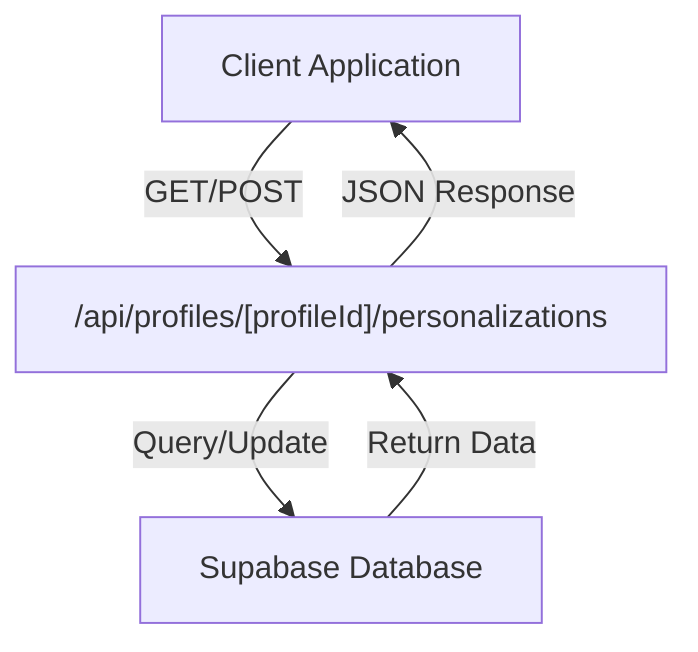
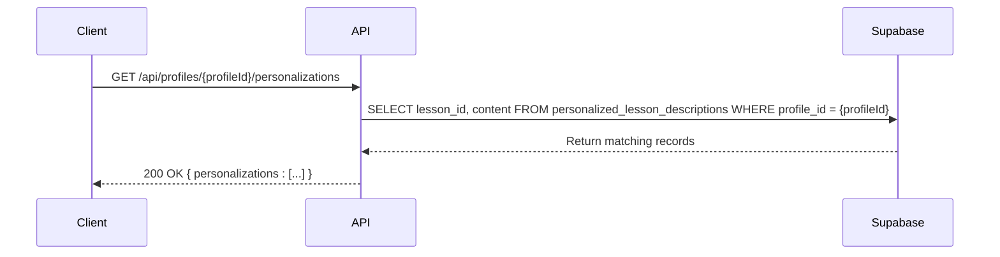
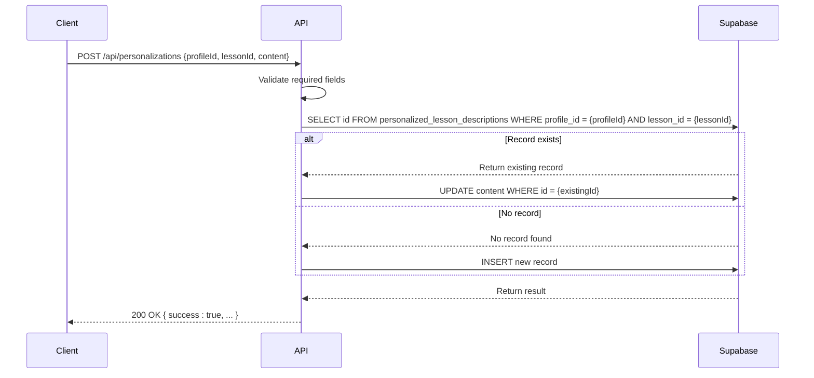
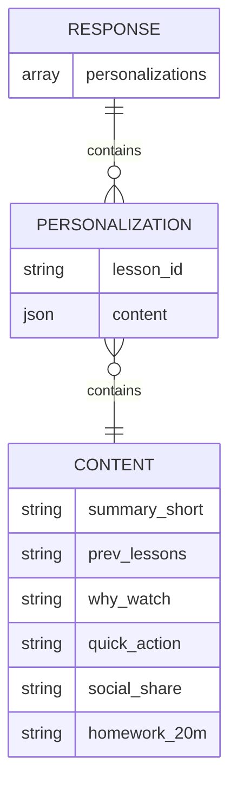
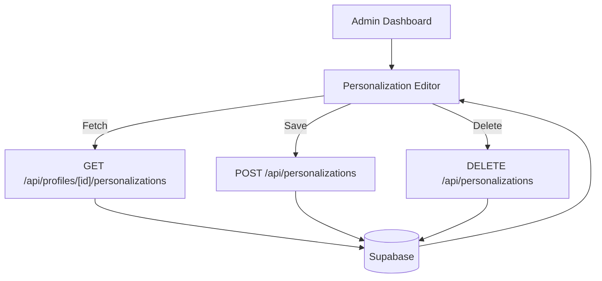

# GET/POST /api/profiles/[profileId]/personalizations

<cite>
**Referenced Files in This Document**   
- [route.ts](file://app/api/profiles/[profileId]/personalizations/route.ts)
- [types.ts](file://lib/supabase/types.ts)
- [server.ts](file://lib/supabase/server.ts)
- [personalizations.ts](file://lib/api/personalizations.ts)
- [migrations/001_init.sql](file://migrations/001_init.sql)
- [personalization-editor.tsx](file://components/personalizations/personalization-editor.tsx)
</cite>

## Table of Contents
1. [Introduction](#introduction)
2. [Endpoint Overview](#endpoint-overview)
3. [GET Method - Retrieve Personalizations](#get-method---retrieve-personalizations)
4. [POST Method - Create/Update Personalization](#post-method---createupdate-personalization)
5. [URL Parameter Binding and Validation](#url-parameter-binding-and-validation)
6. [Response Structure](#response-structure)
7. [Required Fields and Content Schema](#required-fields-and-content-schema)
8. [Integration with Admin Dashboard](#integration-with-admin-dashboard)
9. [Supabase Upsert Operations](#supabase-upsert-operations)
10. [Usage Examples](#usage-examples)
11. [Authentication and Security](#authentication-and-security)
12. [Data Model](#data-model)

## Introduction
This document provides comprehensive documentation for the RESTful endpoints that manage personalizations per user profile. The API allows clients to retrieve all personalizations for a specific profile using GET requests and create or update personalizations for specific lessons using POST requests. The endpoints are designed to support a personalized learning experience by allowing tailored content for each user profile across different lessons.

**Section sources**
- [route.ts](file://app/api/profiles/[profileId]/personalizations/route.ts)

## Endpoint Overview
The `/api/profiles/[profileId]/personalizations` endpoint provides two HTTP methods for managing personalizations:

- **GET**: Retrieves all personalizations associated with a specific profile
- **POST**: Creates a new personalization or updates an existing one for a specific lesson within a profile

The `[profileId]` parameter in the URL path identifies the user profile for which personalizations are being managed. This endpoint serves as the primary interface between the frontend application and the Supabase database for personalization data.



**Diagram sources**
- [route.ts](file://app/api/profiles/[profileId]/personalizations/route.ts)

**Section sources**
- [route.ts](file://app/api/profiles/[profileId]/personalizations/route.ts)

## GET Method - Retrieve Personalizations
The GET method retrieves all personalizations associated with a specific user profile. When a client sends a GET request to `/api/profiles/[profileId]/personalizations`, the server queries the `personalized_lesson_descriptions` table in Supabase, filtering by the provided `profileId`.

The implementation uses Supabase's select method to retrieve only the `lesson_id` and `content` fields from matching records. This selective retrieval optimizes performance by minimizing data transfer. If the query encounters an error, the endpoint returns a 500 status code with an error message. On success, it returns a JSON response containing an array of personalization objects.



**Diagram sources**
- [route.ts](file://app/api/profiles/[profileId]/personalizations/route.ts)
- [types.ts](file://lib/supabase/types.ts)

**Section sources**
- [route.ts](file://app/api/profiles/[profileId]/personalizations/route.ts)

## POST Method - Create/Update Personalization
The POST method creates a new personalization or updates an existing one for a specific lesson within a user profile. Unlike the GET endpoint which uses the `[profileId]` parameter from the URL, this operation is handled by a separate endpoint at `/api/personalizations` that accepts the profileId in the request body.

When a POST request is received, the system first validates that all required fields (`profileId`, `lessonId`, and `content`) are present. It then checks if a personalization already exists for the given profile and lesson combination. If an existing record is found, it performs an update operation; otherwise, it creates a new record. This logic ensures that each profile can have only one personalization per lesson.



**Diagram sources**
- [route.ts](file://app/api/personalizations/route.ts)
- [types.ts](file://lib/supabase/types.ts)

**Section sources**
- [route.ts](file://app/api/personalizations/route.ts)

## URL Parameter Binding and Validation
The GET endpoint uses Next.js route parameters to bind the `profileId` from the URL path. The parameter is accessed through the context object in the GET function signature, which receives the resolved parameters as a Promise<Params> type. The implementation awaits the resolution of the params promise to extract the `profileId` value.

The parameter binding is defined in the Params interface, which specifies that the route expects a `profileId` string parameter. This type-safe approach ensures that the parameter is properly typed throughout the application. While the current implementation does not perform explicit validation of the `profileId` format, it relies on Supabase's query execution to handle invalid UUIDs by returning no results.

```mermaid
flowchart TD
URL[/api/profiles/abc123/personalizations] --> Parser[Next.js Route Parser]
Parser --> Extractor[Parameter Extractor]
Extractor --> |profileId: "abc123"| Context[Context Object]
Context --> Handler[GET Handler Function]
Handler --> Validator[Supabase Query]
```

**Diagram sources**
- [route.ts](file://app/api/profiles/[profileId]/personalizations/route.ts)

**Section sources**
- [route.ts](file://app/api/profiles/[profileId]/personalizations/route.ts)

## Response Structure
The GET endpoint returns a JSON response with a `personalizations` property containing an array of personalization objects. Each object in the array includes the `lesson_id` and `content` fields from the database record.

The `lesson_id` is a UUID string that identifies which lesson the personalization applies to. The `content` field contains a JSON object with the actual personalized content, which can include various properties such as `summary_short`, `prev_lessons`, `why_watch`, `quick_action`, `social_share`, and `homework_20m` as demonstrated in the codebase.

For the POST operation, the response structure is different and includes a `success` boolean flag, the `data` of the created or updated record, and a `message` indicating whether the personalization was created or updated. Error responses include an `error` property with a descriptive message and appropriate HTTP status codes.



**Diagram sources**
- [route.ts](file://app/api/profiles/[profileId]/personalizations/route.ts)
- [types.ts](file://lib/supabase/types.ts)

**Section sources**
- [route.ts](file://app/api/profiles/[profileId]/personalizations/route.ts)

## Required Fields and Content Schema
For the POST operation at `/api/personalizations`, three fields are required in the request body:
- `profileId`: The UUID of the user profile
- `lessonId`: The UUID of the lesson being personalized
- `content`: A structured JSON object containing the personalized content

The `content` field must be a valid JSON object that matches the expected template schema used by the application. Based on the codebase, this typically includes properties such as `summary_short`, `why_watch`, `quick_action`, `social_share`, and `homework_20m`. The schema is flexible and allows for additional custom fields as needed.

The endpoint performs validation to ensure all required fields are present, returning a 400 status code with an error message if any are missing. The validation occurs before any database operations, preventing unnecessary queries when the request is malformed.

**Section sources**
- [route.ts](file://app/api/personalizations/route.ts)

## Integration with Admin Dashboard
The personalization endpoints are integrated with the admin dashboard through the `PersonalizationEditor` component. This React component provides a user interface for administrators to create and modify personalizations for specific lessons within a profile.

The editor uses the `/api/personalizations` endpoint (not the profiles-specific endpoint) to save changes. It sends POST requests with the `profileId`, `lessonId`, and `content` (parsed from a JSON textarea) to create or update personalizations. The component also supports deletion of personalizations through a DELETE request to the same endpoint.

When a user navigates to a profile in the dashboard, the application fetches the existing personalizations using the GET endpoint and populates the editor interface, allowing for modification of existing content or creation of new personalizations for lessons that don't yet have them.



**Diagram sources**
- [personalization-editor.tsx](file://components/personalizations/personalization-editor.tsx)
- [route.ts](file://app/api/personalizations/route.ts)

**Section sources**
- [personalization-editor.tsx](file://components/personalizations/personalization-editor.tsx)

## Supabase Upsert Operations
While the `/api/profiles/[profileId]/personalizations` endpoint only implements GET functionality, the broader personalization system uses Supabase upsert operations in other contexts, particularly during the initial survey processing in the `/api/survey` endpoint.

The upsert operation ensures data consistency by either creating a new record if one doesn't exist or updating an existing record if it does. This is particularly important in scenarios where personalizations might be generated automatically (such as when a user completes a survey) and could potentially conflict with manual edits made through the admin dashboard.

The upsert functionality prevents duplicate personalizations for the same profile-lesson combination by leveraging the unique constraint on the `(profile_id, lesson_id)` columns in the database schema. This ensures that each profile can have only one personalization per lesson, maintaining data integrity across the system.

**Section sources**
- [route.ts](file://app/api/survey/route.ts)
- [migrations/001_init.sql](file://migrations/001_init.sql)

## Usage Examples
### Fetching a User's Personalization History
To retrieve all personalizations for a specific user profile:

```javascript
// GET request to fetch personalizations
const profileId = "a954c858-888d-4e68-b1cd-5d0b2943d207";
const response = await fetch(`/api/profiles/${profileId}/personalizations`);
const data = await response.json();
// Returns: { personalizations: [{ lesson_id: "...", content: { ... } }, ...] }
```

### Updating a Specific Lesson's Content
To create or update a personalization for a specific lesson:

```javascript
// POST request to create/update personalization
const response = await fetch('/api/personalizations', {
  method: 'POST',
  headers: { 'Content-Type': 'application/json' },
  body: JSON.stringify({
    profileId: "a954c858-888d-4e68-b1cd-5d0b2943d207",
    lessonId: "123e4567-e89b-12d3-a456-426614174000",
    content: {
      summary_short: "This lesson is tailored specifically for you!",
      why_watch: "You'll learn techniques that address your specific goals.",
      homework_20m: "Practice the massage techniques on your partner tonight."
    }
  })
});
```

**Section sources**
- [route.ts](file://app/api/profiles/[profileId]/personalizations/route.ts)
- [route.ts](file://app/api/personalizations/route.ts)

## Authentication and Security
The endpoints rely on Supabase for authentication and row-level security enforcement. The `createSupabaseServerClient` function initializes a Supabase client with service role or anonymous keys from environment variables, providing the necessary authentication for database operations.

Row-level security is enforced through Supabase's policies, ensuring that users can only access personalizations for profiles they are authorized to view. The system uses the service role key for server-side operations, which bypasses RLS policies, but the application logic ensures that only valid profile IDs are used in queries.

The API endpoints do not implement additional authentication layers, as they are intended to be used within the context of a server-side application where authentication has already been established. Sensitive operations are protected by requiring the service role key, which is stored securely in environment variables.

**Section sources**
- [server.ts](file://lib/supabase/server.ts)
- [route.ts](file://app/api/profiles/[profileId]/personalizations/route.ts)

## Data Model
The personalization data is stored in the `personalized_lesson_descriptions` table in Supabase, which has the following structure:

- `id`: UUID primary key
- `profile_id`: UUID foreign key referencing the profiles table
- `lesson_id`: UUID foreign key referencing the lessons table
- `content`: JSONB field storing the structured personalization content
- `created_at`: Timestamp of record creation

The table has a unique constraint on the combination of `profile_id` and `lesson_id`, ensuring that each profile can have only one personalization per lesson. This data model supports efficient querying by profile and allows for flexible content storage through the JSONB field type.

```mermaid
erDiagram
PROFILE ||--o{ PERSONALIZATION : has
LESSON ||--o{ PERSONALIZATION : personalized
PROFILE {
uuid id PK
text user_identifier UK
text name
text course_slug
jsonb survey
timestamptz created_at
}
LESSON {
uuid id PK
uuid course_id FK
int lesson_number
text title
text summary
jsonb content
timestamptz created_at
}
PERSONALIZATION {
uuid id PK
uuid profile_id FK
uuid lesson_id FK
jsonb content
timestamptz created_at
}
PERSONALIZATION }o--|| PROFILE : belongs to
PERSONALIZATION }o--|| LESSON : for lesson
```

**Diagram sources**
- [types.ts](file://lib/supabase/types.ts)
- [migrations/001_init.sql](file://migrations/001_init.sql)

**Section sources**
- [types.ts](file://lib/supabase/types.ts)
- [migrations/001_init.sql](file://migrations/001_init.sql)