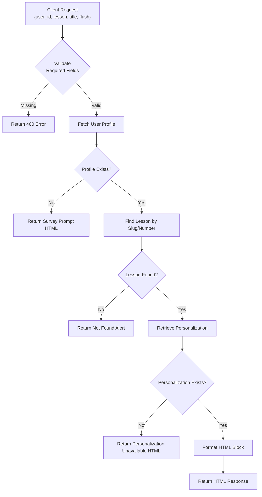
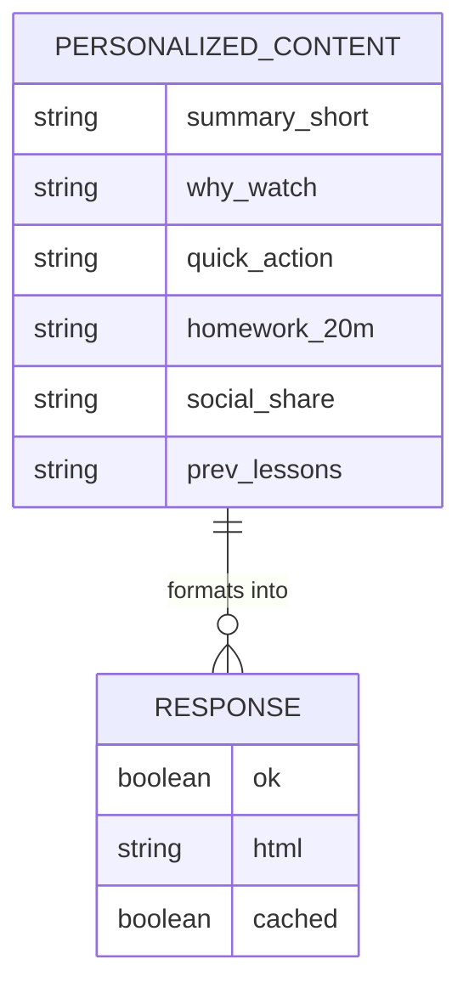
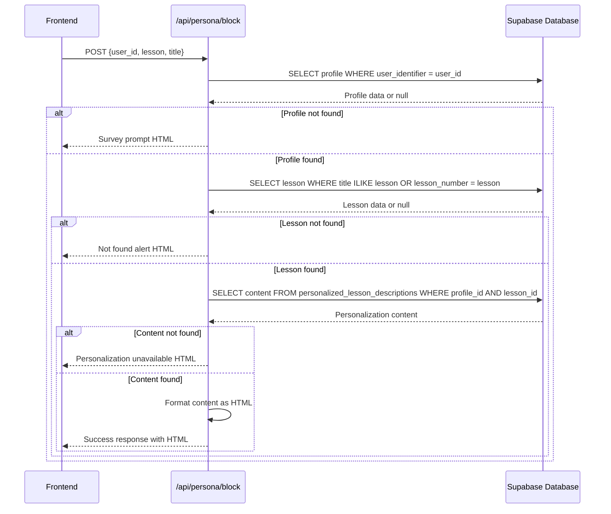
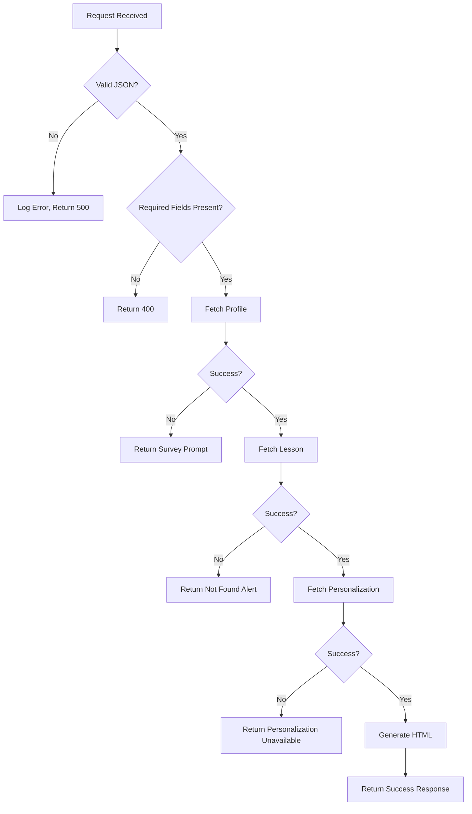

# POST /api/persona/block

<cite>
**Referenced Files in This Document**   
- [route.ts](file://app/api/persona/block/route.ts)
- [openai.ts](file://lib/services/openai.ts)
- [personalize-template/route.ts](file://app/api/persona/personalize-template/route.ts)
- [html-formatter.ts](file://lib/services/html-formatter.ts)
- [personalization.ts](file://lib/services/personalization.ts)
- [lesson-block-template.html](file://public/getcourse/lesson-block-template.html)
</cite>

## Table of Contents
1. [Introduction](#introduction)
2. [Request Structure](#request-structure)
3. [Response Format](#response-format)
4. [Internal Usage in Personalization Engine](#internal-usage-in-personalization-engine)
5. [Example Payloads](#example-payloads)
6. [OpenAI Integration](#openai-integration)
7. [Rate Limiting and Performance](#rate-limiting-and-performance)
8. [Error Handling and Recovery](#error-handling-and-recovery)

## Introduction
The `POST /api/persona/block` endpoint retrieves personalized content blocks for individual lesson components within a course. Unlike full-lesson personalization, this endpoint enables granular rendering of specific sections such as summaries, homework, or social sharing prompts. It is primarily used to dynamically inject AI-generated, user-specific content into lesson pages without requiring full template regeneration. The endpoint supports caching via the `flush` parameter and handles fallback scenarios when user profiles or personalizations are missing.

**Section sources**
- [route.ts](file://app/api/persona/block/route.ts#L1-L197)

## Request Structure
The endpoint accepts a JSON payload with the following fields:

- `user_id`: Unique identifier for the user (required)
- `lesson`: Identifier for the lesson, either by slug or lesson number (required)
- `title`: Display title of the lesson (optional, used in error messages)
- `flush`: Boolean flag to bypass caching and force re-fetching of personalization data (optional)

The request is processed to locate the user's profile via `user_identifier`, identify the target lesson by partial title match or numeric lesson number, and retrieve the corresponding personalized content from the database.



**Diagram sources**
- [route.ts](file://app/api/persona/block/route.ts#L1-L197)

**Section sources**
- [route.ts](file://app/api/persona/block/route.ts#L1-L197)

## Response Format
The response is a JSON object with the following structure:

- `ok`: Boolean indicating success status
- `html`: Rendered HTML string containing the personalized content block (if successful)
- `cached`: Boolean indicating whether the response was served from cache (inverted value of `flush`)

The HTML includes styled sections for various block types such as summary, motivation, quick actions, homework, and social sharing. Each section is conditionally rendered based on the availability of content in the personalization record. The styling uses predefined CSS classes like `persona-section`, `persona-section-title`, and `persona-text`.



**Diagram sources**
- [route.ts](file://app/api/persona/block/route.ts#L1-L197)
- [html-formatter.ts](file://lib/services/html-formatter.ts#L5-L58)

**Section sources**
- [route.ts](file://app/api/persona/block/route.ts#L1-L197)
- [html-formatter.ts](file://lib/services/html-formatter.ts#L5-L58)

## Internal Usage in Personalization Engine
The `POST /api/persona/block` endpoint is internally utilized by the personalization engine during the processing of lesson templates. When a lesson is rendered in the frontend, individual blocks are fetched asynchronously using this endpoint. It is called after the main lesson content loads, allowing for dynamic insertion of personalized components.

The endpoint does not generate new personalizations but retrieves pre-existing ones created by the `POST /api/persona/personalize-template` endpoint. This separation ensures that AI processing occurs during batch personalization rather than on-demand, improving response times and reducing OpenAI API costs during user-facing requests.



**Diagram sources**
- [route.ts](file://app/api/persona/block/route.ts#L1-L197)
- [personalize-template/route.ts](file://app/api/persona/personalize-template/route.ts#L1-L293)

**Section sources**
- [route.ts](file://app/api/persona/block/route.ts#L1-L197)
- [personalize-template/route.ts](file://app/api/persona/personalize-template/route.ts#L1-L293)

## Example Payloads
### Summary Block Request
```json
{
  "user_id": "usr_12345",
  "lesson": "1",
  "title": "Introduction to Massage",
  "flush": false
}
```

### Homework Block Request
```json
{
  "user_id": "usr_12345",
  "lesson": "introduction-to-massage",
  "title": "Introduction to Massage",
  "flush": true
}
```

### Social Sharing Block Request
```json
{
  "user_id": "usr_67890",
  "lesson": "3",
  "title": "Advanced Techniques",
  "flush": false
}
```

These payloads are typically generated client-side using JavaScript embedded in GetCourse HTML templates, as seen in `lesson-block-template.html`.

**Section sources**
- [route.ts](file://app/api/persona/block/route.ts#L1-L197)
- [lesson-block-template.html](file://public/getcourse/lesson-block-template.html#L27-L56)

## OpenAI Integration
While the `POST /api/persona/block` endpoint itself does not directly invoke OpenAI, it relies on content generated by the OpenAI-powered `personalize-template` endpoint. The actual AI processing occurs in `personalize-template/route.ts`, where the `personalizeLesson` function uses GPT-4o-mini to generate structured JSON content based on user survey data and lesson templates.

The prompt engineering includes directives to:
- Address the student by name
- Incorporate motivation and goals
- Address fears and concerns
- Adapt homework to the student's practice model
- Align content with expected outcomes

The output is strictly formatted as JSON with predefined keys like `summary_short`, `why_watch`, `quick_action`, `homework_20m`, and `social_share`.

```mermaid
flowchart LR
A[User Survey Data] --> B[OpenAI Prompt]
C[Lesson Template] --> B
B --> D[GPT-4o-mini]
D --> E[Personalized JSON]
E --> F[Database Storage]
F --> G[/api/persona/block]
G --> H[HTML Response]
```

**Diagram sources**
- [openai.ts](file://lib/services/openai.ts#L0-L138)
- [personalize-template/route.ts](file://app/api/persona/personalize-template/route.ts#L1-L293)

**Section sources**
- [openai.ts](file://lib/services/openai.ts#L0-L138)
- [personalize-template/route.ts](file://app/api/persona/personalize-template/route.ts#L1-L293)

## Rate Limiting and Performance
Due to the potential for multiple block requests per lesson (e.g., summary, homework, social), this endpoint may be called several times during a single page load. To mitigate performance impact:

- **Caching**: The `flush` parameter controls whether cached data is used. When `flush=false`, the system serves existing personalizations without reprocessing.
- **Database Indexing**: The `personalized_lesson_descriptions` table uses a unique index on `(profile_id, lesson_id)` to ensure fast lookups.
- **Asynchronous Loading**: Client-side JavaScript loads blocks asynchronously, preventing blocking of main content rendering.

Despite these optimizations, high-traffic scenarios with many concurrent users may require rate limiting at the infrastructure level to prevent abuse of the OpenAI-dependent personalization pipeline.

**Section sources**
- [route.ts](file://app/api/persona/block/route.ts#L1-L197)
- [personalization.ts](file://lib/services/personalization.ts#L0-L140)

## Error Handling and Recovery
The endpoint implements comprehensive error handling:

- **Missing user_id or lesson**: Returns 400 Bad Request
- **User profile not found**: Returns HTML prompting the user to complete their survey
- **Lesson not found**: Returns a warning alert with the lesson title
- **No personalization available**: Returns HTML prompting survey completion
- **Internal server error**: Catches exceptions and returns 500 status

Recovery strategies include:
- Fallback to static HTML prompts when personalization is unavailable
- Graceful degradation when lessons are not found
- Logging of all errors for debugging
- Client-side error handling in embedded scripts



**Diagram sources**
- [route.ts](file://app/api/persona/block/route.ts#L1-L197)

**Section sources**
- [route.ts](file://app/api/persona/block/route.ts#L1-L197)