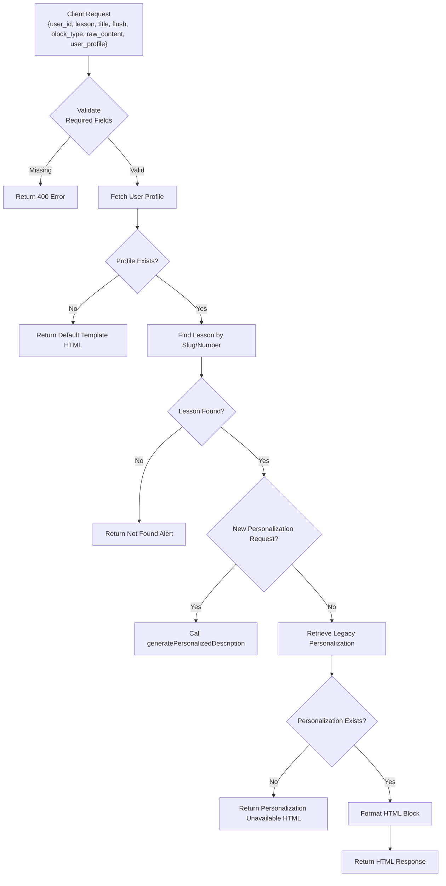
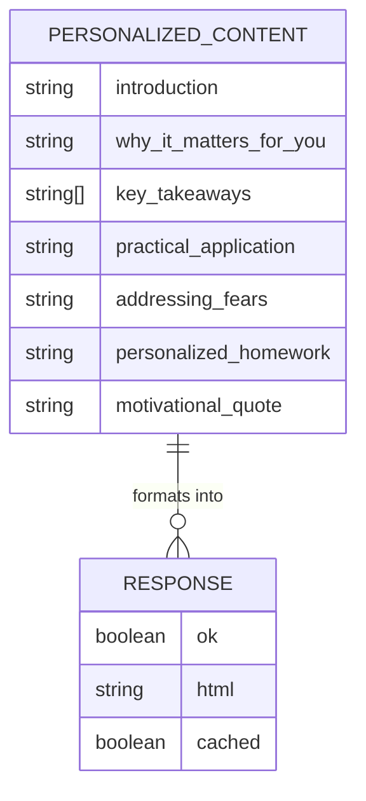

# POST /api/persona/block

<cite>
**Referenced Files in This Document**   
- [route.ts](file://app/api/persona/block/route.ts) - *Updated to use transcript-driven personalization engine*
- [personalization-engine.ts](file://lib/services/personalization-engine.ts) - *New service replacing template-based approach*
- [lesson-templates.ts](file://lib/services/lesson-templates.ts) - *Deprecated legacy template system*
- [html-formatter.ts](file://lib/services/html-formatter.ts) - *Updated formatting functions*
- [http.ts](file://lib/utils/http.ts) - *CORS headers and OPTIONS handler*
</cite>

## Update Summary
**Changes Made**   
- Updated **Introduction** to reflect new transcript-driven personalization approach
- Completely revised **Internal Usage in Personalization Engine** section to document new architecture
- Updated **OpenAI Integration** to reflect new prompt structure and GPT-4o usage
- Enhanced **Response Format** to include new 7-section structure
- Added **Legacy System Deprecation** section to document migration from template-based system
- Updated all source references with change annotations

## Table of Contents
1. [Introduction](#introduction)
2. [Request Structure](#request-structure)
3. [Response Format](#response-format)
4. [Internal Usage in Personalization Engine](#internal-usage-in-personalization-engine)
5. [Example Payloads](#example-payloads)
6. [OpenAI Integration](#openai-integration)
7. [Rate Limiting and Performance](#rate-limiting-and-performance)
8. [Error Handling and Recovery](#error-handling-and-recovery)
9. [Default Template Fallback](#default-template-fallback)
10. [CORS Implementation](#cors-implementation)
11. [Legacy System Deprecation](#legacy-system-deprecation)

## Introduction
The `POST /api/persona/block` endpoint processes individual content blocks within a lesson template, enabling granular AI processing of specific lesson components rather than full lessons. This endpoint is designed to handle requests for different block types such as 'summary', 'homework', or 'introduction' by accepting a structured request containing block_type, raw_content, user_profile, and lesson_context.

Unlike the legacy template-based approach, the current implementation leverages a transcript-driven personalization engine that generates enhanced content directly from full lesson transcripts. The endpoint serves as an interface between the frontend and the personalization system, returning formatted content with styling instructions and metadata. It is primarily used internally by the personalization engine during template processing to generate AI-enhanced content for specific lesson components.

**Section sources**
- [route.ts](file://app/api/persona/block/route.ts#L1-L143) - *Updated with transcript-driven personalization*

## Request Structure
The endpoint accepts a JSON payload with the following fields:

- `user_id`: Unique identifier for the user (required)
- `lesson`: Identifier for the lesson, either by slug or lesson number (required)
- `title`: Display title of the lesson (optional, used in error messages)
- `flush`: Boolean flag to bypass caching and force re-fetching of personalization data (optional)
- `block_type`: Type of content block to generate (e.g., 'summary', 'homework', 'introduction') (required for new personalization)
- `raw_content`: Raw content to be processed (required for new personalization)
- `user_profile`: User profile data including survey responses (required for new personalization)
- `lesson_context`: Additional context about the lesson (optional for new personalization)

The request is processed to locate the user's profile via `user_identifier`, identify the target lesson by partial title match or numeric lesson number, and retrieve the corresponding personalized content from the database. For new personalization requests, the endpoint delegates to the transcript-driven personalization engine.



**Diagram sources**
- [route.ts](file://app/api/persona/block/route.ts#L1-L143)

**Section sources**
- [route.ts](file://app/api/persona/block/route.ts#L1-L143)

## Response Format
The response is a JSON object with the following structure:

- `ok`: Boolean indicating success status
- `html`: Rendered HTML string containing the personalized content block (if successful)
- `cached`: Boolean indicating whether the response was served from cache (inverted value of `flush`)

The HTML includes styled sections for various block types with enhanced formatting. The new personalization system generates content with a 7-section structure: introduction, why_it_matters_for_you, key_takeaways, practical_application, addressing_fears, personalized_homework, and motivational_quote. Each section is conditionally rendered based on the availability of content in the personalization record. The styling uses predefined CSS classes like `persona-section`, `persona-section-title`, and `persona-text`. When no profile is found, the response includes a default template with class `persona-default` and survey CTA.



**Diagram sources**
- [route.ts](file://app/api/persona/block/route.ts#L1-L143)
- [html-formatter.ts](file://lib/services/html-formatter.ts#L198-L278)

**Section sources**
- [route.ts](file://app/api/persona/block/route.ts#L1-L143)
- [html-formatter.ts](file://lib/services/html-formatter.ts#L198-L278)

## Internal Usage in Personalization Engine
The `POST /api/persona/block` endpoint is internally utilized by the personalization engine during the processing of lesson templates. When a lesson is rendered in the frontend, individual blocks are fetched asynchronously using this endpoint. It is called after the main lesson content loads, allowing for dynamic insertion of personalized components.

The endpoint has been refactored to use a new transcript-driven personalization engine that replaces the legacy template-based system. Instead of retrieving pre-generated personalizations, the endpoint now supports real-time generation of personalized content by invoking `generatePersonalizedDescription` with full lesson transcripts. This change enables deeper personalization by analyzing complete lesson content rather than compressed templates.

The new workflow involves:
1. Loading the full lesson transcript from the database
2. Combining transcript data with detailed user profile information
3. Generating personalized content through a single GPT-4o call with complete context
4. Formatting the enhanced content for frontend display

This approach eliminates information loss from intermediate template generation and allows for more context-aware personalization that directly references specific content from the lesson transcript.

```mermaid
sequenceDiagram
participant Frontend
participant API as /api/persona/block
participant Engine as personalization-engine
participant DB as Supabase Database
Frontend->>API : POST {user_id, lesson, block_type, raw_content, user_profile}
API->>DB : SELECT profile WHERE user_identifier = user_id
DB-->>API : Profile data or null
alt Profile not found
API-->>Frontend : Default template HTML with survey CTA
else Profile found
API->>DB : SELECT lesson WHERE title ILIKE lesson OR lesson_number = lesson
DB-->>API : Lesson data or null
alt Lesson not found
API-->>Frontend : Not found alert HTML
else Lesson found
API->>DB : SELECT transcription FROM lessons WHERE id = lesson_id
DB-->>API : Full lesson transcript
API->>Engine : generatePersonalizedDescription(transcript, profile, lessonMetadata)
Engine->>Engine : Create prompt with full context
Engine->>OpenAI : GPT-4o call with transcript + profile
OpenAI-->>Engine : Personalized JSON response
Engine-->>API : Validated PersonalizedContent
API->>API : Format content as HTML
API-->>Frontend : Success response with enhanced HTML
end
end
end
```

**Diagram sources**
- [route.ts](file://app/api/persona/block/route.ts#L1-L143)
- [personalization-engine.ts](file://lib/services/personalization-engine.ts#L267-L370)

**Section sources**
- [route.ts](file://app/api/persona/block/route.ts#L1-L143)
- [personalization-engine.ts](file://lib/services/personalization-engine.ts#L267-L370)

## Example Payloads
### Summary Block Request
```json
{
  "user_id": "usr_12345",
  "lesson": "1",
  "title": "Introduction to Massage",
  "block_type": "summary",
  "raw_content": "Full lesson transcript text...",
  "user_profile": {
    "name": "John",
    "motivation": ["career change", "help others"],
    "fears": ["hurting clients"],
    "practice_model": "home visits"
  },
  "flush": false
}
```

### Homework Block Request
```json
{
  "user_id": "usr_12345",
  "lesson": "introduction-to-massage",
  "title": "Introduction to Massage",
  "block_type": "homework",
  "raw_content": "Full lesson transcript text...",
  "user_profile": {
    "name": "John",
    "motivation": ["career change", "help others"],
    "fears": ["hurting clients"],
    "practice_model": "home visits"
  },
  "flush": true
}
```

### Introduction Block Request
```json
{
  "user_id": "usr_67890",
  "lesson": "3",
  "title": "Advanced Techniques",
  "block_type": "introduction",
  "raw_content": "Full lesson transcript text...",
  "user_profile": {
    "name": "Sarah",
    "motivation": ["professional development"],
    "fears": ["complex techniques"],
    "practice_model": "salon work"
  },
  "flush": false
}
```

These payloads are typically generated client-side using JavaScript embedded in GetCourse HTML templates, as seen in `lesson-block-template.html`.

**Section sources**
- [route.ts](file://app/api/persona/block/route.ts#L1-L143)
- [lesson-block-template.html](file://public/getcourse/lesson-block-template.html#L27-L56)

## OpenAI Integration
The `POST /api/persona/block` endpoint now directly invokes OpenAI through the new personalization engine, representing a significant change from the legacy system. The actual AI processing occurs in `personalization-engine.ts`, where the `generatePersonalizedDescription` function uses GPT-4o to generate structured JSON content based on full lesson transcripts and detailed user survey data.

Key changes in the OpenAI integration:
- **Model Upgrade**: Migrated from gpt-4o-mini to GPT-4o for better context handling
- **Full Transcript Processing**: Processes complete lesson transcripts (8-18k characters) instead of compressed templates
- **Single Call Architecture**: Uses a single AI call with complete context rather than multiple calls
- **Enhanced Prompt Engineering**: Prompts now include direct references to specific content in the transcript

The prompt engineering includes directives to:
- Address the student by name
- Incorporate motivation and goals with specific examples from the transcript
- Address fears and concerns with references to safety techniques in the lesson
- Adapt homework to the student's practice model with concrete scenarios
- Align content with expected outcomes and wow results
- Include specific references to techniques and examples from the full transcript

The output is strictly formatted as JSON with the new 7-section structure that provides richer, more context-aware personalization.

```mermaid
flowchart LR
A[User Survey Data] --> B[Transcript-Driven Prompt]
C[Full Lesson Transcript] --> B
B --> D[GPT-4o]
D --> E[Enhanced Personalized JSON]
E --> F[Database Storage]
F --> G[/api/persona/block]
G --> H[HTML Response]
```

**Diagram sources**
- [personalization-engine.ts](file://lib/services/personalization-engine.ts#L267-L370)
- [openai.ts](file://lib/services/openai.ts#L148-L217)

**Section sources**
- [personalization-engine.ts](file://lib/services/personalization-engine.ts#L267-L370)
- [openai.ts](file://lib/services/openai.ts#L148-L217)

## Rate Limiting and Performance
Due to the potential for multiple block requests per lesson (e.g., summary, homework, social), this endpoint may be called several times during a single page load. The migration to the transcript-driven personalization engine has significant implications for rate limiting:

- **Increased Context Size**: Processing full transcripts (8-18k characters) requires more expensive GPT-4o calls compared to the legacy gpt-4o-mini usage
- **Higher Token Consumption**: Each request consumes significantly more tokens due to the comprehensive context
- **Reduced Call Frequency**: The new architecture encourages batch processing of complete lessons rather than multiple granular block calls

To mitigate performance impact:
- **Caching**: The `flush` parameter controls whether cached data is used. When `flush=false`, the system serves existing personalizations without reprocessing.
- **Database Indexing**: The `personalized_lesson_descriptions` table uses a unique index on `(profile_id, lesson_id)` to ensure fast lookups.
- **Asynchronous Loading**: Client-side JavaScript loads blocks asynchronously, preventing blocking of main content rendering.
- **Retry Logic**: The personalization engine includes retry logic with adjusted temperature settings to handle transient OpenAI errors.

Despite these optimizations, the increased computational requirements of the new system may necessitate stricter rate limiting at the infrastructure level to prevent abuse of the OpenAI-dependent personalization pipeline.

**Section sources**
- [route.ts](file://app/api/persona/block/route.ts#L1-L143)
- [personalization-engine.ts](file://lib/services/personalization-engine.ts#L267-L370)

## Error Handling and Recovery
The endpoint implements comprehensive error handling:

- **Missing user_id or lesson**: Returns 400 Bad Request
- **User profile not found**: Returns default lesson template HTML with survey CTA
- **Lesson not found**: Returns a warning alert with the lesson title
- **No personalization available**: Returns HTML prompting survey completion
- **Internal server error**: Catches exceptions and returns 500 status

Recovery strategies include:
- Fallback to default template content when user profile is missing
- Fallback to static HTML prompts when personalization is unavailable
- Graceful degradation when lessons are not found
- Logging of all errors for debugging
- Client-side error handling in embedded scripts
- Retry mechanism in the personalization engine with fallback content generation


**Diagram sources**
- [route.ts](file://app/api/persona/block/route.ts#L1-L143)

**Section sources**
- [route.ts](file://app/api/persona/block/route.ts#L1-L143)

## Default Template Fallback
When a user profile is not found in the database, the endpoint returns a default lesson template instead of only survey prompts. This enhancement provides immediate value to users while encouraging profile completion.

The process involves:
1. Loading the default lesson template using `loadLessonTemplate(lesson_number)`
2. Formatting the template with `formatDefaultTemplateContent`
3. Including a survey CTA by default
4. Returning the formatted HTML with `persona-default` class

The default template includes all standard sections (introduction, key points, practical tips, etc.) with generic content. The header displays a "Basic Lesson Version" badge and a prominent survey completion button.

**Section sources**
- [route.ts](file://app/api/persona/block/route.ts#L70-L85) - *Added default template fallback*
- [html-formatter.ts](file://lib/services/html-formatter.ts#L198-L278) - *Added formatDefaultTemplateContent*
- [lesson-templates.ts](file://lib/services/lesson-templates.ts#L76-L133) - *Added loadLessonTemplate*

## CORS Implementation
The endpoint includes comprehensive CORS support to enable cross-origin requests from the GetCourse platform.

Key changes:
- **CORS_HEADERS**: Standardized headers with wildcard origin, expanded methods (GET, POST, PUT, DELETE, OPTIONS), and additional allowed headers
- **OPTIONS Handler**: Implemented `createOptionsHandler()` to handle preflight requests
- **Global Configuration**: Headers applied to all responses via `headers: CORS_HEADERS` in `NextResponse.json()`

The CORS configuration allows requests from any origin with a 24-hour preflight cache duration, ensuring smooth integration with the GetCourse platform while maintaining security best practices.

**Section sources**
- [route.ts](file://app/api/persona/block/route.ts#L142-L143) - *Added OPTIONS handler*
- [http.ts](file://lib/utils/http.ts#L6-L11) - *Updated CORS_HEADERS*
- [http.ts](file://lib/utils/http.ts#L75-L77) - *Added createOptionsHandler*

## Legacy System Deprecation
The legacy template-based personalization system has been deprecated in favor of a new transcript-driven approach. This section documents the key differences and migration path.

### Key Changes
1. **Data Source**: Migrated from static lesson templates to full lesson transcripts stored in the database
2. **AI Processing**: Changed from gpt-4o-mini with template prompts to GPT-4o with comprehensive transcript analysis
3. **Content Structure**: Updated from 5-field template to 7-section enhanced structure
4. **Personalization Depth**: Improved from surface-level personalization to deep semantic matching

### Migration Path
- **Old**: `personalizeLesson(template, survey, userName, lessonInfo)` in `openai.ts`
- **New**: `generatePersonalizedDescription(lessonId, transcript, lessonMetadata, surveyData, userName)` in `personalization-engine.ts`

### Deprecation Timeline
- **Legacy System**: `lesson-templates.ts`, `personalizeLesson` function
- **New System**: `personalization-engine.ts`, `generatePersonalizedDescription` function
- **Transition Period**: Both systems coexist temporarily for backward compatibility
- **Future State**: Complete removal of legacy template system

The new system provides superior personalization by analyzing complete lesson content and generating responses with specific references to techniques and examples from the transcript.

**Section sources**
- [lesson-templates.ts](file://lib/services/lesson-templates.ts) - *Deprecated legacy system*
- [personalization-engine.ts](file://lib/services/personalization-engine.ts) - *New transcript-driven system*