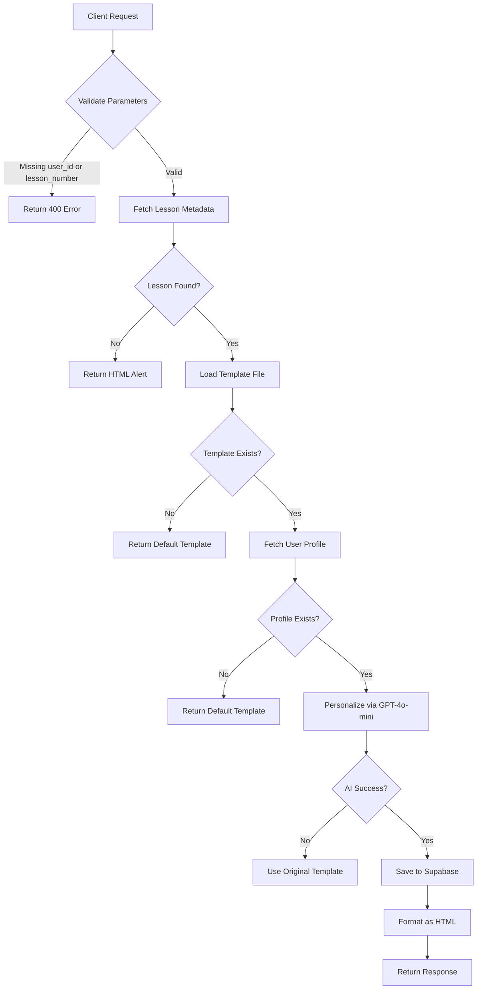
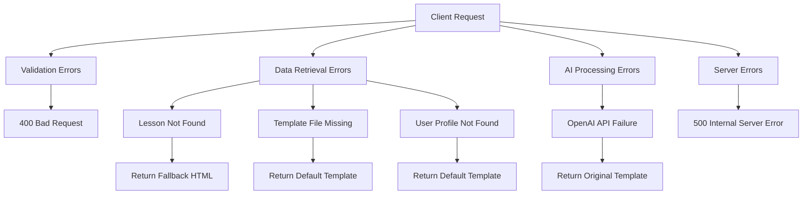

# POST /api/persona/personalize-template

<cite>
**Referenced Files in This Document**   
- [route.ts](file://app/api/persona/personalize-template/route.ts) - *Updated with default template fallback and CORS support*
- [html-formatter.ts](file://lib/services/html-formatter.ts) - *Added formatDefaultTemplateContent function*
- [http.ts](file://lib/utils/http.ts) - *Added CORS_HEADERS and OPTIONS handler*
- [lesson-templates.ts](file://lib/services/lesson-templates.ts) - *Template loading and formatting logic*
- [openai.ts](file://lib/services/openai.ts) - *AI personalization service*
- [lesson.json](file://store/shvz/lessons/01/lesson.json) - *Example lesson template*
</cite>

## Update Summary
**Changes Made**   
- Updated error handling section to reflect new default template fallback behavior
- Added documentation for `formatDefaultTemplateContent` function and its usage
- Enhanced CORS documentation with new OPTIONS handler and headers
- Updated workflow diagram to include default template path
- Modified status codes section to clarify 200 responses for fallback scenarios
- Added new section sources reflecting recent code changes

## Table of Contents
1. [Introduction](#introduction)
2. [Request Structure](#request-structure)
3. [Response Format](#response-format)
4. [Workflow Overview](#workflow-overview)
5. [Error Handling](#error-handling)
6. [Example Requests](#example-requests)
7. [Authentication and Security](#authentication-and-security)
8. [Status Codes](#status-codes)
9. [Integration Guide](#integration-guide)

## Introduction

The `POST /api/persona/personalize-template` endpoint generates AI-personalized lesson content based on user profiles and pre-defined templates. This API is designed to deliver customized educational experiences by leveraging user survey data and OpenAI's GPT-4o-mini model to adapt lesson content dynamically. The endpoint is part of a larger persona-based personalization system that integrates with Supabase for data storage and retrieval.

The system is specifically tailored for a massage therapy education platform, where each lesson is personalized to address individual student motivations, goals, fears, and practice models. The API returns HTML-ready content that can be directly embedded into course pages, providing a seamless integration experience for educational platforms.

**Section sources**
- [route.ts](file://app/api/persona/personalize-template/route.ts#L1-L294)

## Request Structure

The endpoint accepts a JSON POST request with the following parameters:

| Field | Type | Required | Description |
|-------|------|----------|-------------|
| `user_id` | string | Yes | Unique identifier for the user. Typically corresponds to the user_identifier in the profiles table. |
| `lesson_number` | number | Yes | The lesson number (1-12) for which personalization is requested. |
| `flush` | boolean | No | When true, forces regeneration of content even if cached version exists. Default is false. |

The request must be sent with `Content-Type: application/json` header. The `user_id` parameter is used to retrieve the user's profile and survey data from Supabase, while the `lesson_number` determines which lesson template to personalize.

The endpoint supports CORS with the following headers:
- `Access-Control-Allow-Origin: *`
- `Access-Control-Allow-Methods: GET, POST, PUT, DELETE, OPTIONS`
- `Access-Control-Allow-Headers: Content-Type, Authorization, X-Requested-With`
- `Access-Control-Max-Age: 86400` (24 hours)

**Section sources**
- [route.ts](file://app/api/persona/personalize-template/route.ts#L15-L45)
- [http.ts](file://lib/utils/http.ts#L6-L11)

## Response Format

The API returns a JSON response with the following structure:

```json
{
  "ok": true,
  "html": "<div class=\"persona-block\">...</div>",
  "cached": false
}
```

The `html` field contains the personalized lesson content formatted as HTML with CSS classes for styling. The content includes various sections such as:
- `introduction`: Personalized introduction to the lesson
- `key_points`: Key learning points adapted to the user's goals
- `practical_tips`: Practical advice considering the user's fears and practice model
- `important_notes`: Important considerations and contraindications
- `equipment_preparation`: Equipment requirements tailored to practice model
- `homework`: Personalized homework assignment
- `motivational_line`: Motivational message connected to expected results

The response also includes a `cached` boolean field indicating whether the content was served from cache (when `flush` is false) or newly generated. All HTML output uses the `persona-*` CSS class namespace for styling consistency.

The HTML structure follows a consistent pattern with sections wrapped in `persona-section` divs and titles in `persona-section-title` headings, ensuring predictable styling and layout.

**Section sources**
- [route.ts](file://app/api/persona/personalize-template/route.ts#L135-L145)
- [html-formatter.ts](file://lib/services/html-formatter.ts#L1-L224)

## Workflow Overview



**Diagram sources**
- [route.ts](file://app/api/persona/personalize-template/route.ts#L47-L145)

The workflow begins with parameter validation, ensuring both `user_id` and `lesson_number` are provided. The system then retrieves the lesson metadata from Supabase, followed by loading the lesson template from the file system using the `loadLessonTemplate` function.

If the lesson is not found in the database, an appropriate alert is returned. When the user profile is not found, the system now returns a default template formatted with `formatDefaultTemplateContent` instead of a survey prompt, providing immediate educational value while still encouraging profile completion.

The system locates the lesson template by mapping the lesson number to a UUID via the `getLessonTemplateId` function, then searches for the corresponding JSON file in the `store/shvz` directory using multiple filename patterns to ensure compatibility with existing templates.

Once the template is loaded, the personalization process invokes GPT-4o-mini through the OpenAI client with a detailed prompt that includes the template, user survey data, and specific instructions for personalization. The AI model is instructed to address the user by name, consider their motivations and goals, address their fears, adapt homework to their practice model, and connect content to their expected results.

After personalization, the result is saved to Supabase in the `personalized_lesson_descriptions` table and formatted into HTML for immediate use in web interfaces.

**Section sources**
- [route.ts](file://app/api/persona/personalize-template/route.ts#L47-L145)
- [openai.ts](file://lib/services/openai.ts#L1-L8)
- [lesson-templates.ts](file://lib/services/lesson-templates.ts#L63-L120)

## Error Handling

The endpoint implements comprehensive error handling at multiple levels:



**Diagram sources**
- [route.ts](file://app/api/persona/personalize-template/route.ts#L147-L294)

The system handles several error scenarios gracefully:

1. **Validation errors**: When required parameters are missing, the endpoint returns a 400 status code with a descriptive error message.

2. **Data retrieval issues**: 
   - If the lesson metadata cannot be found, the system returns a success response (200) with fallback HTML content.
   - If the user profile is not found, the system returns the default template content with a survey CTA banner using `formatDefaultTemplateContent`.
   - If the template file is missing, a default template structure is generated.

3. **AI processing failures**: If the OpenAI API call fails, the system catches the error and returns the original template content instead of failing completely. This ensures that users always receive some content, even when the personalization service is temporarily unavailable.

4. **Server errors**: Unhandled exceptions result in a 500 status code with a generic error message to prevent exposing sensitive system information.

All errors are logged to the server console for monitoring and debugging purposes. The fallback strategy ensures maximum availability and a consistent user experience even when individual components fail.

**Section sources**
- [route.ts](file://app/api/persona/personalize-template/route.ts#L147-L294)
- [html-formatter.ts](file://lib/services/html-formatter.ts#L143-L223)

## Example Requests

### cURL Example

```bash
curl -X POST https://pesonalisev2-zxby.vercel.app/api/persona/personalize-template \
  -H "Content-Type: application/json" \
  -d '{
    "user_id": "12345",
    "lesson_number": 3,
    "flush": false
  }'
```

### TypeScript Fetch Example

```typescript
async function personalizeLesson(userId: string, lessonNumber: number, flush = false) {
  const response = await fetch('/api/persona/personalize-template', {
    method: 'POST',
    headers: {
      'Content-Type': 'application/json',
      'Origin': 'https://your-education-platform.com'
    },
    body: JSON.stringify({
      user_id: userId,
      lesson_number: lessonNumber,
      flush: flush
    }),
    mode: 'cors'
  });

  if (!response.ok) {
    throw new Error(`HTTP error! status: ${response.status}`);
  }

  const data = await response.json();
  return data;
}

// Usage
const result = await personalizeLesson('12345', 3);
if (result.ok && result.html) {
  document.getElementById('lesson-container').innerHTML = result.html;
}
```

### Handling CORS and JSON Responses

When integrating this API, ensure your client handles CORS properly. The endpoint supports cross-origin requests from any domain (`Access-Control-Allow-Origin: *`) and includes comprehensive CORS headers. For production environments, consider implementing more restrictive CORS policies.

The endpoint now properly handles OPTIONS preflight requests through the `createOptionsHandler` function, ensuring smooth CORS implementation. Always check the `ok` field in the response before processing the `html` content. Even when the HTTP status is 200, the `ok` field may be false in certain error scenarios.

The response is always JSON, even when returning HTML content. Parse the response with `response.json()` and verify the structure before injecting HTML into the DOM to prevent XSS vulnerabilities.

**Section sources**
- [route.ts](file://app/api/persona/personalize-template/route.ts#L1-L294)
- [http.ts](file://lib/utils/http.ts#L69-L76)

## Authentication and Security

The endpoint uses Supabase authentication to verify user identities. The `user_id` parameter corresponds to the `user_identifier` field in the Supabase `profiles` table. Access to user data is controlled through Supabase's Row Level Security (RLS) policies, ensuring that users can only access their own profile information.

The API itself does not require authentication tokens from clients, as it is designed to be called from client-side code in educational platforms. However, sensitive operations are protected server-side by validating that the requesting context matches the requested user data.

Rate limiting considerations:
- The endpoint should be rate-limited at the infrastructure level (e.g., Vercel, Cloudflare) to prevent abuse
- Consider implementing token-based authentication for high-volume integrations
- Monitor usage patterns to detect and prevent scraping or denial-of-service attacks

The system uses environment variables for sensitive credentials:
- `OPENAI_API_KEY` for accessing the OpenAI API
- `NEXT_PUBLIC_SUPABASE_URL` and `SUPABASE_SERVICE_ROLE_KEY` for database access

These credentials are securely managed and never exposed to client-side code.

**Section sources**
- [route.ts](file://app/api/persona/personalize-template/route.ts#L1-L294)
- [server.ts](file://lib/supabase/server.ts#L1-L28)

## Status Codes

| Status Code | Scenario | Example Payload |
|-----------|---------|----------------|
| 200 OK | Successful processing, including cases where fallback content is returned | ```json { "ok": true, "html": "<div class=\"persona-block\">...</div>" } ``` |
| 400 Bad Request | Missing required parameters (`user_id` or `lesson_number`) | ```json { "ok": false, "error": "user_id and lesson_number are required" } ``` |
| 404 Not Found | Not applicable - all data issues return 200 with fallback HTML | N/A |
| 500 Internal Server Error | Unhandled server-side exceptions | ```json { "ok": false, "error": "Internal server error" } ``` |

The endpoint uses a unique approach to status codes: it returns 200 for most scenarios, even when data is missing, to ensure that client applications always receive a valid response that can be rendered. This prevents page rendering failures in educational platforms when personalization data is temporarily unavailable.

Only true server errors (500) and validation failures (400) result in non-200 status codes. This design prioritizes user experience over strict REST conventions, ensuring that educational content is always available, even if not fully personalized.

**Section sources**
- [route.ts](file://app/api/persona/personalize-template/route.ts#L60-L65)
- [route.ts](file://app/api/persona/personalize-template/route.ts#L285-L290)

## Integration Guide

To integrate this endpoint into an educational platform:

1. Add a container element to your lesson page:
```html
<div id="persona-lesson-3" 
     data-lesson="триггерные" 
     data-title="Урок 3: Триггерные точки" 
     style="display:none;margin:30px 0;">
</div>
```

2. Include the integration script:
```javascript
(async function(){
  const API = "https://pesonalisev2-zxby.vercel.app/api/persona";
  const UID = "{user_id_from_your_system}";
  const userId = (/^\d{3,}$/.test(String(UID))) ? String(UID) : "guest";
  const mount = document.getElementById('persona-lesson-3');
  const lesson = mount.getAttribute('data-lesson');
  const title = mount.getAttribute('data-title');

  try {
    const r = await fetch(`${API}/block`, {
      method: 'POST',
      headers: {'Content-Type': 'application/json'},
      body: JSON.stringify({ 
        user_id: userId, 
        lesson: lesson, 
        title: title, 
        flush: false 
      })
    });
    
    const data = await r.json();
    
    if (data && data.ok && data.html) {
      if (!document.querySelector('link[data-persona-styles]')) {
        const link = document.createElement('link');
        link.rel = 'stylesheet';
        link.href = 'https://pesonalisev2-zxby.vercel.app/persona/styles.css';
        link.setAttribute('data-persona-styles', '1');
        document.head.appendChild(link);
      }
      mount.innerHTML = data.html;
      mount.style.display = 'block';
    }
  } catch(e) {
    console.error('Persona block error:', e);
  }
})();
```

3. Ensure your platform passes the correct user identifier to the `UID` variable.

The integration automatically loads the necessary CSS and displays personalized content when available, with graceful degradation when personalization is not possible.

**Section sources**
- [lesson-block-template.html](file://public/getcourse/lesson-block-template.html#L0-L60)
- [route.ts](file://app/api/persona/personalize-template/route.ts#L1-L294)