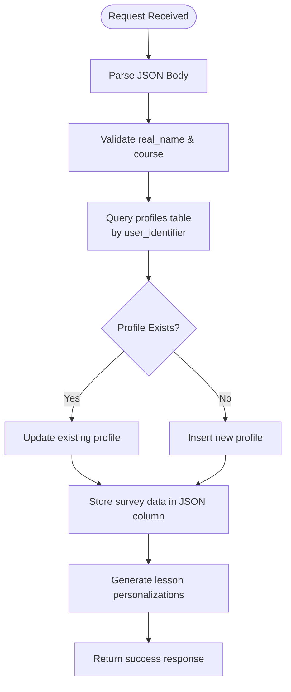
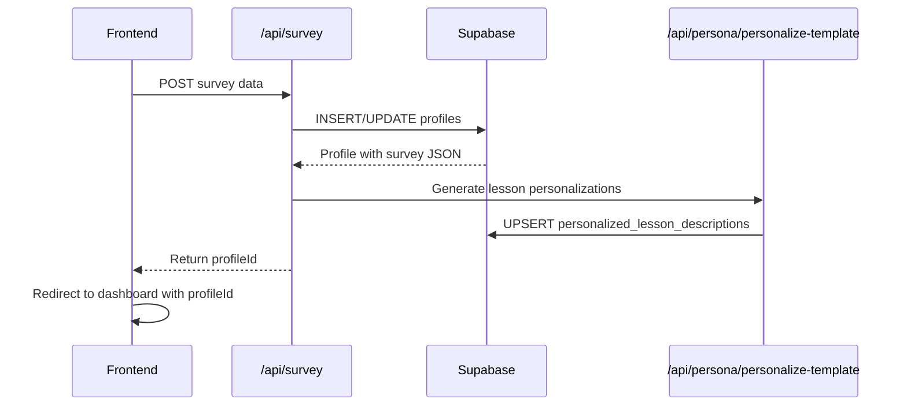

# POST /api/survey

<cite>
**Referenced Files in This Document**   
- [route.ts](file://app/api/survey/route.ts)
- [profile-survey.tsx](file://components/profiles/profile-survey.tsx)
- [page.tsx](file://app/survey/page.tsx)
- [iframe/page.tsx](file://app/survey/iframe/page.tsx)
- [types.ts](file://lib/supabase/types.ts)
</cite>

## Table of Contents
1. [Introduction](#introduction)
2. [Request Body Schema](#request-body-schema)
3. [Profile Storage and Upsert Behavior](#profile-storage-and-upsert-behavior)
4. [Validation with Zod](#validation-with-zod)
5. [Error Responses](#error-responses)
6. [Successful Response Format](#successful-response-format)
7. [Frontend Integration Examples](#frontend-integration-examples)
8. [Integration with Profile Selector UI](#integration-with-profile-selector-ui)
9. [Security Considerations](#security-considerations)

## Introduction
The `POST /api/survey` endpoint is responsible for processing user profile data submitted through the survey form. It creates or updates a user profile in the database, generates personalized lesson descriptions based on the survey responses, and returns a success response with the profile ID. This documentation details the request structure, validation logic, storage behavior, error handling, and integration points.

**Section sources**
- [route.ts](file://app/api/survey/route.ts#L29-L175)

## Request Body Schema
The endpoint accepts a JSON payload containing user profile information. The required fields are `real_name` and `course`, while other fields provide additional context for personalization.

| Field | Type | Required | Description |
|-------|------|----------|-------------|
| `real_name` | string | Yes | Full name of the user |
| `course` | string | Yes | Course slug (e.g., "massazh-shvz") |
| `uid` | string | No | User identifier from GetCourse; auto-generated for guests |
| `motivation` | string[] | No | Array of motivation factors |
| `target_clients` | string | No | Description of intended client base |
| `skills_wanted` | string | No | Desired skills to acquire |
| `fears` | string[] | No | Array of fears or concerns |
| `wow_result` | string | No | Expected impactful result |
| `practice_model` | string | No | Where the user plans to practice |

**Section sources**
- [route.ts](file://app/api/survey/route.ts#L29-L175)
- [types.ts](file://lib/supabase/types.ts#L0-L139)

## Profile Storage and Upsert Behavior
Survey data is stored in the `profiles` table with upsert behavior based on the `user_identifier`. If a profile with the given `uid` already exists, it is updated; otherwise, a new profile is created.

When no `uid` is provided, the system generates a guest identifier using the pattern `guest_${Date.now()}`. The entire survey payload is stored in the `survey` column as JSON, preserving all submitted information for future personalization.



**Diagram sources**
- [route.ts](file://app/api/survey/route.ts#L41-L98)
- [types.ts](file://lib/supabase/types.ts#L0-L139)

**Section sources**
- [route.ts](file://app/api/survey/route.ts#L41-L98)

## Validation with Zod
Although the current implementation uses manual validation, the system is designed to work with Zod for schema validation. The endpoint checks for the presence of required fields (`real_name` and `course`) and returns a 400 error if validation fails. Future implementations may replace manual checks with Zod schema validation for more robust type checking and error messaging.

**Section sources**
- [route.ts](file://app/api/survey/route.ts#L29-L175)

## Error Responses
The endpoint returns appropriate HTTP status codes and error messages for different failure scenarios:

| Status | Response Body | Condition |
|--------|---------------|---------|
| 400 | `{ error: "Имя и курс обязательны для заполнения" }` | Missing `real_name` or `course` |
| 500 | `{ error: "Не удалось обновить профиль" }` | Database update error |
| 500 | `{ error: "Не удалось создать профиль" }` | Database insert error |
| 500 | `{ error: "Внутренняя ошибка сервера" }` | Unexpected server error |

For partial successes (e.g., profile created but lessons not found), the endpoint returns a 200 status with a warning message.

**Section sources**
- [route.ts](file://app/api/survey/route.ts#L29-L175)

## Successful Response Format
Upon successful processing, the endpoint returns a 200 status with the following response body:

```json
{
  "success": true,
  "profileId": "string",
  "userIdentifier": "string",
  "message": "Персональный курс успешно создан!"
}
```

The response includes the generated `profileId` for redirect purposes and the `userIdentifier` for tracking. Clients should use the `profileId` to redirect users to their personalized dashboard.

**Section sources**
- [route.ts](file://app/api/survey/route.ts#L29-L175)

## Frontend Integration Examples
### React Component Submission
```tsx
const handleSubmit = async (e) => {
  e.preventDefault();
  const response = await fetch("/api/survey", {
    method: "POST",
    headers: { "Content-Type": "application/json" },
    body: JSON.stringify(formData)
  });
  const data = await response.json();
  if (response.ok) {
    router.push(`/dashboard?profileId=${data.profileId}`);
  }
};
```

### cURL Command
```bash
curl -X POST https://yourdomain.com/api/survey \
  -H "Content-Type: application/json" \
  -d '{
    "real_name": "Maria Ivanova",
    "course": "massazh-shvz",
    "motivation": ["help_others", "professional_development"],
    "target_clients": "Office workers with back pain",
    "skills_wanted": "Headache relief techniques",
    "fears": ["harm_client"],
    "wow_result": "Help my mother with chronic headaches",
    "practice_model": "On husband and friends"
  }'
```

**Section sources**
- [page.tsx](file://app/survey/page.tsx#L0-L252)
- [iframe/page.tsx](file://app/survey/iframe/page.tsx#L0-L284)

## Integration with Profile Selector UI
The survey data is integrated with the profile selector UI component, which displays submitted survey responses in a formatted manner. The `ProfileSurvey` component renders the stored JSON data from the `profiles.survey` column, formatting field names and values for display.

Personalization requests for lessons use this stored data to generate tailored content through the `/api/persona/personalize-template` endpoint, which accesses the profile's survey data to create customized lesson descriptions.



**Diagram sources**
- [route.ts](file://app/api/survey/route.ts#L29-L175)
- [profile-survey.tsx](file://components/profiles/profile-survey.tsx#L7-L39)

**Section sources**
- [profile-survey.tsx](file://components/profiles/profile-survey.tsx#L7-L39)
- [route.ts](file://app/api/survey/route.ts#L29-L175)

## Security Considerations
### PII Storage
Personal Identifiable Information (PII) is stored in the `profiles` table with the `user_identifier` field. Guest users receive auto-generated identifiers, while registered users from GetCourse have their `uid` preserved. All survey data is stored as JSON in the `survey` column, which may contain sensitive information about user motivations, fears, and goals.

### Supabase RLS Policies
Row Level Security (RLS) policies should be configured to restrict access to profile data. The system uses Supabase's authentication and authorization framework to ensure that users can only access their own profile data. The `profiles` table should have RLS policies that enforce:
- Users can only read their own profile
- Users can only update their own profile
- Service role has full access for backend operations

Sensitive fields should be protected from unauthorized access, and audit logs should be maintained for all profile modifications.

**Section sources**
- [types.ts](file://lib/supabase/types.ts#L0-L139)
- [route.ts](file://app/api/survey/route.ts#L29-L175)