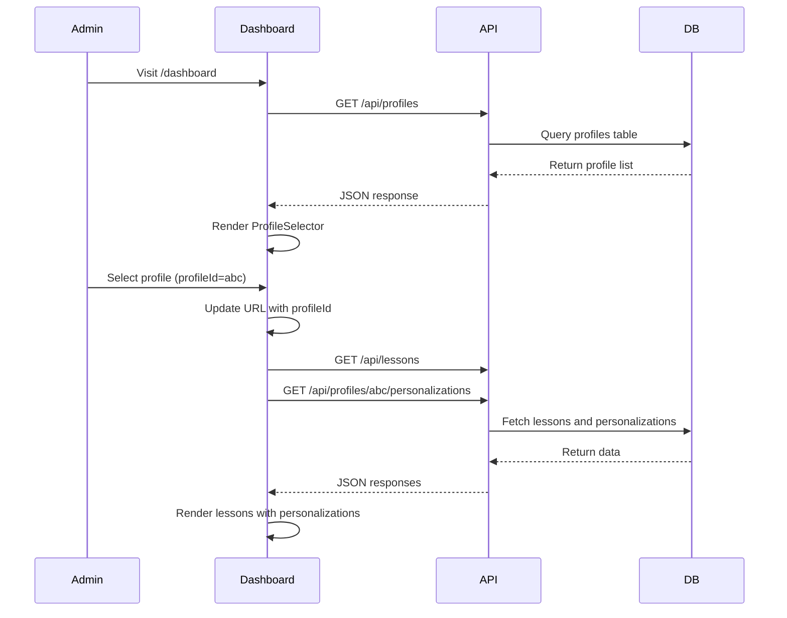
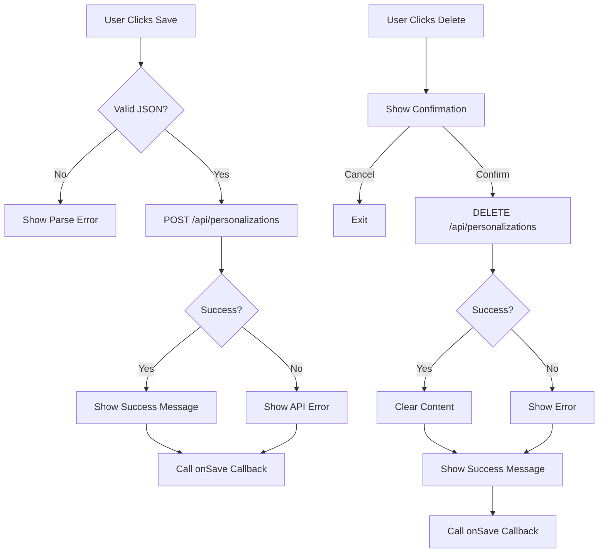

# Admin Dashboard

<cite>
**Referenced Files in This Document**   
- [dashboard/page.tsx](file://app/(dashboard)/dashboard/page.tsx)
- [profile/[profileId]/page.tsx](file://app/(dashboard)/profile/[profileId]/page.tsx)
- [layout.tsx](file://app/(dashboard)/layout.tsx)
- [personalization-editor.tsx](file://components/personalizations/personalization-editor.tsx)
- [profile-selector.tsx](file://components/profiles/profile-selector.tsx)
- [api/personalizations/route.ts](file://app/api/personalizations/route.ts)
- [lib/api/profiles.ts](file://lib/api/profiles.ts)
- [lib/api/lessons.ts](file://lib/api/lessons.ts)
- [lib/api/personalizations.ts](file://lib/api/personalizations.ts)
</cite>

## Table of Contents
1. [Navigation Structure](#navigation-structure)
2. [Profile Selection and Personalization Workflow](#profile-selection-and-personalization-workflow)
3. [Personalization Editor Interface](#personalization-editor-interface)
4. [Save and Delete Workflows](#save-and-delete-workflows)
5. [API Integration](#api-integration)
6. [Access Control and Audit Trails](#access-control-and-audit-trails)
7. [Use Cases for Administrative Tasks](#use-cases-for-administrative-tasks)

## Navigation Structure

The admin dashboard is organized under the `(dashboard)` route group, which provides a consistent layout and navigation experience. The main navigation includes two primary links: "Personalized Lessons" and "Templates (Fishes)", accessible from the header across all dashboard views.

The root dashboard view (`/dashboard`) serves as the central hub for managing user profiles and lesson personalizations. It displays a list of all user profiles in a sidebar and renders lesson content with optional personalization previews based on the selected profile.

A secondary route at `/profile/[profileId]` provides a dedicated interface for editing all personalizations for a specific user. This route enables administrators to manage per-lesson customizations in a focused environment.

```mermaid
graph TD
A[/dashboard] --> B[Header Navigation]
A --> C[Sidebar: Profile Selector]
A --> D[Main: Lessons List]
D --> E[Lesson Card]
E --> F[Base Description]
E --> G[Personalization Preview]
H[/profile/{id}] --> I[Profile Survey Data]
H --> J[Personalization Editor per Lesson]
B --> A
B --> K[/dashboard/templates]
```

**Diagram sources**
- [layout.tsx](file://app/(dashboard)/layout.tsx#L0-L19)
- [dashboard/page.tsx](file://app/(dashboard)/dashboard/page.tsx#L94-L103)
- [profile/[profileId]/page.tsx](file://app/(dashboard)/profile/[profileId]/page.tsx#L0-L89)

**Section sources**
- [layout.tsx](file://app/(dashboard)/layout.tsx#L0-L19)
- [dashboard/page.tsx](file://app/(dashboard)/dashboard/page.tsx#L94-L103)

## Profile Selection and Personalization Workflow

Administrators interact with user profiles through the `ProfileSelector` component, which fetches and displays all available profiles via the `getProfiles()` API function. Each profile entry shows the user's name or identifier and course slug, with visual indication of the currently active selection.

When a profile is selected, the dashboard updates the URL query parameter `profileId`, triggering a re-render of the lessons list with personalization data specific to that profile. The system retrieves personalizations using `getPersonalizationsByProfile(profileId)` and maps them to their respective lessons.

For detailed editing, administrators can navigate directly to `/profile/[profileId]` via a dedicated link in each profile card. This view loads the user's survey data and presents a `PersonalizationEditor` component for every lesson, allowing granular control over personalized content.



**Diagram sources**
- [profile-selector.tsx](file://components/profiles/profile-selector.tsx#L12-L65)
- [dashboard/page.tsx](file://app/(dashboard)/dashboard/page.tsx#L0-L104)
- [lib/api/profiles.ts](file://lib/api/profiles.ts#L5-L18)
- [lib/api/lessons.ts](file://lib/api/lessons.ts#L9-L23)
- [lib/api/personalizations.ts](file://lib/api/personalizations.ts#L7-L23)

**Section sources**
- [profile-selector.tsx](file://components/profiles/profile-selector.tsx#L12-L65)
- [dashboard/page.tsx](file://app/(dashboard)/dashboard/page.tsx#L0-L104)

## Personalization Editor Interface

The `PersonalizationEditor` component provides a JSON-based interface for creating and modifying lesson personalizations. It accepts the following props:
- `profileId`: Target user profile identifier
- `lessonId`: Target lesson identifier
- `lessonTitle`: Display title for context
- `initialContent`: Existing personalization data (optional)
- `onSave`: Callback function triggered after save/delete

The editor renders a `<textarea>` pre-filled with formatted JSON (using `JSON.stringify(..., null, 2)`). The input is labeled "Personalized Content (JSON)" and includes a placeholder showing sample structure. Administrators can directly edit the JSON content before saving.

When `initialContent` is provided (indicating an existing personalization), a "Delete" button appears alongside the "Save" button, allowing removal of the customization.

**Section sources**
- [personalization-editor.tsx](file://components/personalizations/personalization-editor.tsx#L12-L154)

## Save and Delete Workflows

### Save Workflow
When the "Save" button is clicked, the editor performs the following steps:
1. Parses the textarea content as JSON
2. Sends a POST request to `/api/personalizations` with profileId, lessonId, and parsed content
3. Displays success or error message based on response
4. Invokes the `onSave` callback to trigger UI updates

### Delete Workflow
When the "Delete" button is clicked:
1. Shows a confirmation dialog
2. Sends a DELETE request to `/api/personalizations` with profileId and lessonId
3. Clears the editor content upon success
4. Displays appropriate feedback message
5. Invokes the `onSave` callback

Both operations include loading states and error handling to ensure reliable user feedback.



**Diagram sources**
- [personalization-editor.tsx](file://components/personalizations/personalization-editor.tsx#L12-L154)
- [api/personalizations/route.ts](file://app/api/personalizations/route.ts#L0-L134)

**Section sources**
- [personalization-editor.tsx](file://components/personalizations/personalization-editor.tsx#L12-L154)

## API Integration

The admin dashboard integrates with the same backend API endpoints used by the frontend application. Key endpoints include:

- `GET /api/lessons`: Retrieves all lessons with base descriptions
- `GET /api/profiles`: Lists all user profiles
- `GET /api/profiles/[id]/personalizations`: Fetches all personalizations for a profile
- `POST /api/personalizations`: Creates or updates a personalization
- `DELETE /api/personalizations`: Removes a personalization

All API calls are made server-side using Supabase client initialized via `createSupabaseServerClient()`, ensuring secure database access without exposing credentials to the browser.

**Section sources**
- [api/personalizations/route.ts](file://app/api/personalizations/route.ts#L0-L134)
- [lib/supabase/server.ts](file://lib/supabase/server.ts#L19-L25)

## Access Control and Audit Trails

While the current implementation does not include explicit role-based access control in the provided code, the system leverages Supabase's authentication layer through service role keys for database operations. All modifications go through the API routes, which validate input and log errors.

Audit capabilities are limited to server-side console logging of errors. For full audit trails, additional logging of successful operations (including operator ID, timestamp, and before/after states) would need to be implemented in the API routes.

Future enhancements could include:
- Admin authentication middleware
- Change logging to a dedicated audit table
- Version history for personalizations
- Approval workflows for sensitive changes

**Section sources**
- [api/personalizations/route.ts](file://app/api/personalizations/route.ts#L0-L134)
- [lib/supabase/server.ts](file://lib/supabase/server.ts#L19-L25)

## Use Cases for Administrative Tasks

### Fixing AI-Generated Content
Administrators can navigate to a user's profile editor, locate a problematic lesson personalization, edit the JSON directly to correct inaccuracies, and save the changes. The immediate feedback loop allows quick iteration.

### Creating Manual Personalizations
For users without AI-generated content, admins can create custom personalizations from scratch by entering valid JSON structure in the editor and saving. The system accepts any valid object structure.

### Bulk Review and Adjustment
Using the main dashboard view, administrators can quickly scan multiple profiles and their associated personalizations, identifying patterns or inconsistencies across users.

### Content Migration and Testing
The JSON interface allows easy copying of personalization templates between users or lessons, facilitating testing of new content structures before automated generation is implemented.

**Section sources**
- [personalization-editor.tsx](file://components/personalizations/personalization-editor.tsx#L12-L154)
- [profile/[profileId]/page.tsx](file://app/(dashboard)/profile/[profileId]/page.tsx#L0-L89)