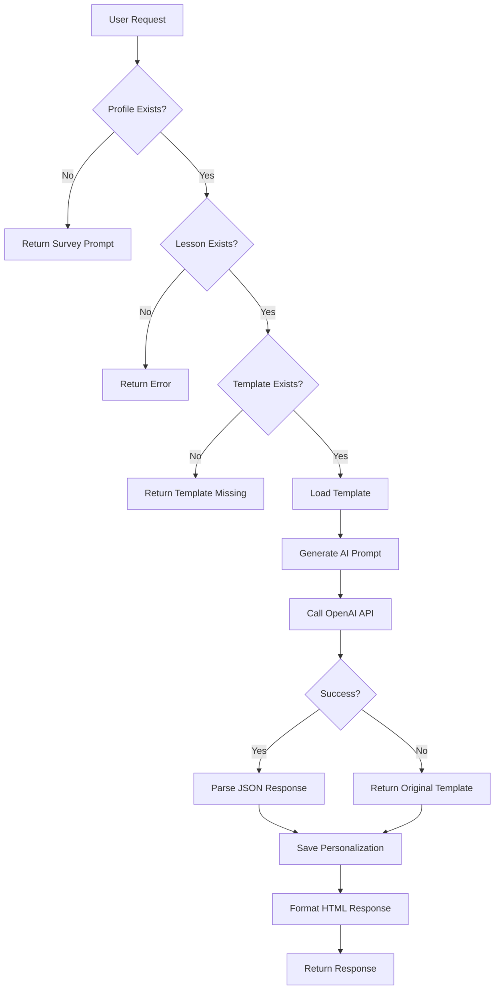
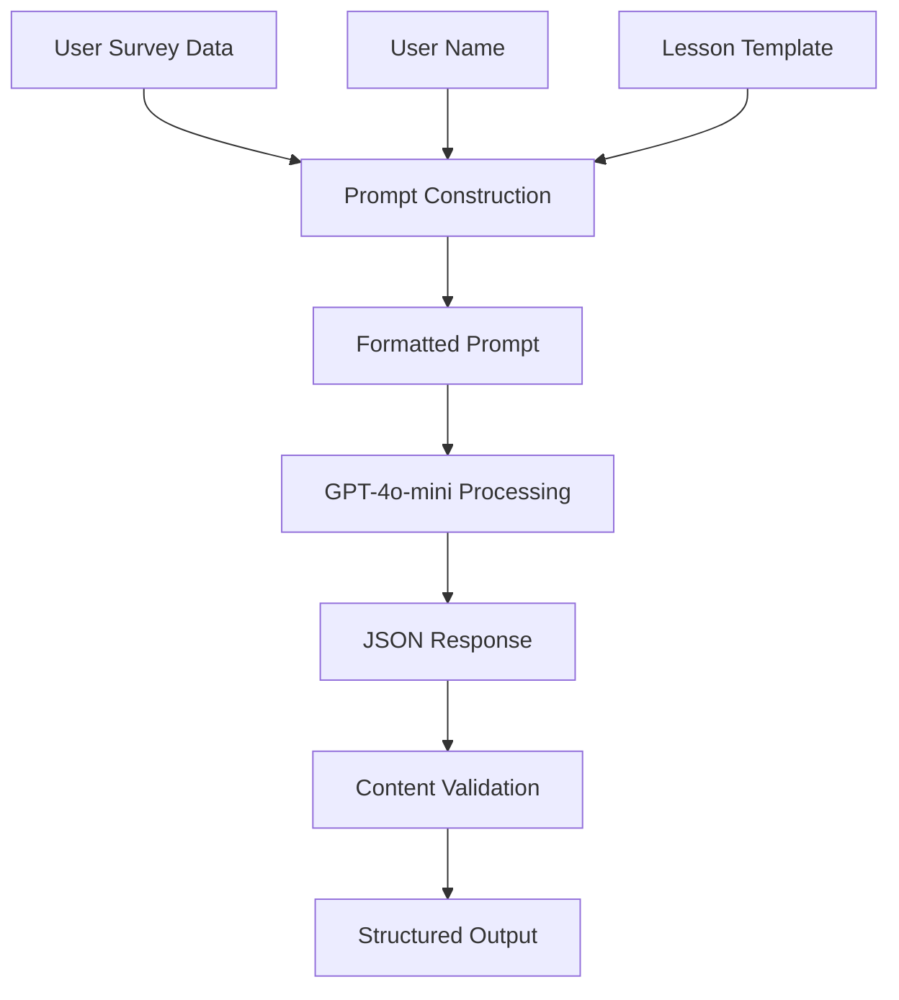
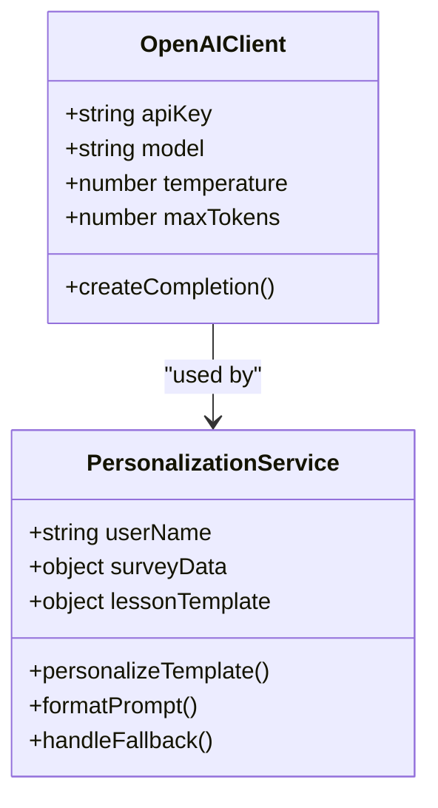
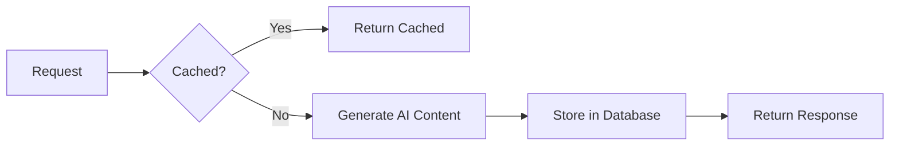

# AI Integration

<cite>
**Referenced Files in This Document**   
- [openai.ts](file://lib/openai.ts)
- [route.ts](file://app/api/persona/personalize-template/route.ts)
- [TEMPLATE_PERSONALIZATION_UPDATE.md](file://TEMPLATE_PERSONALIZATION_UPDATE.md)
</cite>

## Table of Contents
1. [Introduction](#introduction)
2. [Core Components](#core-components)
3. [Prompt Engineering Strategy](#prompt-engineering-strategy)
4. [Error Handling and Fallback Mechanism](#error-handling-and-fallback-mechanism)
5. [OpenAI Client Configuration](#openai-client-configuration)
6. [Input Prompts and Generated Responses](#input-prompts-and-generated-responses)
7. [Security Considerations](#security-considerations)
8. [Performance Optimization](#performance-optimization)
9. [Conclusion](#conclusion)

## Introduction
The AI integration component of the persona application leverages OpenAI's GPT-4o-mini model to generate personalized lesson content based on user survey data, name, and predefined lesson templates. This system enables contextually relevant educational experiences by dynamically adapting content to individual learner profiles. The implementation centers around the `personalizeTemplate` function, which orchestrates AI-driven personalization while ensuring reliability through fallback mechanisms and performance optimization strategies.

## Core Components

The AI personalization workflow is implemented through a dedicated API endpoint and supporting utilities that coordinate data retrieval, AI processing, and response formatting. The system integrates with Supabase for user profile management and stores lesson templates in the filesystem for efficient access.



**Diagram sources**
- [route.ts](file://app/api/persona/personalize-template/route.ts#L0-L293)

**Section sources**
- [route.ts](file://app/api/persona/personalize-template/route.ts#L0-L293)

## Prompt Engineering Strategy

The prompt engineering strategy combines user survey data, name, and lesson templates to create contextually rich inputs for the GPT-4o-mini model. The system constructs prompts that include specific personalization instructions and formatting requirements to ensure consistent output structure.

The prompt template incorporates:
- User name for personalized addressing
- Motivation and target clients to align content with goals
- Desired skills and fears to address learning concerns
- Expected results to connect lessons with outcomes
- Practice model information to tailor homework assignments

The system enforces a strict JSON output format with defined fields including `summary_short`, `why_watch`, `quick_action`, `social_share`, and `homework_20m`. This structured approach ensures predictable parsing and consistent integration with the frontend presentation layer.



**Diagram sources**
- [route.ts](file://app/api/persona/personalize-template/route.ts#L172-L230)

**Section sources**
- [route.ts](file://app/api/persona/personalize-template/route.ts#L172-L230)

## Error Handling and Fallback Mechanism

The system implements a robust error handling strategy that ensures service continuity even when AI processing fails. When the OpenAI API call encounters an error, the system gracefully falls back to returning the original template content without personalization.

The error handling workflow:
1. Attempts AI personalization through the OpenAI API
2. Catches any errors during API communication or response parsing
3. Logs the error for monitoring and debugging
4. Returns the original template as fallback content
5. Continues the request flow to ensure user experience is maintained

This approach prioritizes system reliability and ensures that users always receive lesson content, even if the personalized version cannot be generated. The original template serves as both a functional fallback and a quality baseline for content delivery.

**Section sources**
- [route.ts](file://app/api/persona/personalize-template/route.ts#L210-L230)

## OpenAI Client Configuration

The OpenAI client is configured with specific parameters to balance creativity and consistency in the generated content. The system uses the GPT-4o-mini model with a temperature setting of 0.7, which provides a moderate level of creativity while maintaining focus on the instructional context.

Key configuration parameters:
- **Model**: gpt-4o-mini
- **Temperature**: 0.7 (balanced creativity and consistency)
- **Max Tokens**: 1000 (sufficient for comprehensive lesson personalization)
- **Response Format**: Strict JSON with no additional text

The client is initialized with the API key from environment variables, ensuring secure credential management. The system enforces a JSON-only response policy through both the system message and response parsing logic, guaranteeing that the output can be reliably integrated into the application's data flow.



**Diagram sources**
- [openai.ts](file://lib/openai.ts#L0-L7)
- [route.ts](file://app/api/persona/personalize-template/route.ts#L215-L220)

**Section sources**
- [openai.ts](file://lib/openai.ts#L0-L7)
- [route.ts](file://app/api/persona/personalize-template/route.ts#L215-L220)

## Input Prompts and Generated Responses

The system processes input requests containing user ID and lesson number to generate personalized content. The API endpoint accepts POST requests with a JSON body specifying these parameters and optionally including a flush flag to bypass caching.

Example input request:
```json
{
  "user_id": "user123",
  "lesson_number": 6,
  "flush": true
}
```

The generated JSON response from the AI model follows a predefined structure with specific content fields:
```json
{
  "summary_short": "Personalized lesson description",
  "why_watch": "Motivational content based on user goals",
  "quick_action": "Immediate practice suggestion",
  "social_share": "Shareable content for social media",
  "homework_20m": "Personalized 20-minute homework assignment"
}
```

The system validates that the AI response is valid JSON before processing, with fallback to the original template if parsing fails. This ensures that the application can handle edge cases while maintaining data integrity throughout the personalization pipeline.

**Section sources**
- [route.ts](file://app/api/persona/personalize-template/route.ts#L172-L230)

## Security Considerations

The system implements several security measures to protect sensitive information and ensure responsible AI usage. API key management follows security best practices by storing the OpenAI API key in environment variables, preventing exposure in source code or client-side applications.

Additional security considerations:
- **Rate Limiting**: The system leverages OpenAI's built-in rate limiting to prevent abuse
- **Input Validation**: User inputs are validated before processing to prevent injection attacks
- **CORS Configuration**: The API endpoint includes proper CORS headers to control cross-origin access
- **Error Handling**: Detailed error information is logged server-side but not exposed to clients
- **Data Privacy**: User survey data is handled according to privacy policies and only used for personalization

The environment variable approach for API key storage ensures that credentials remain confidential and can be rotated without code changes. The system also limits the exposure of sensitive user data by only passing necessary information to the AI model.

**Section sources**
- [openai.ts](file://lib/openai.ts#L0-L7)
- [route.ts](file://app/api/persona/personalize-template/route.ts#L0-L293)

## Performance Optimization

The system incorporates multiple performance optimization techniques to ensure responsive user experiences and efficient resource utilization. The primary optimization strategy is result caching, where personalized content is stored in the database after initial generation, eliminating the need for repeated AI processing for the same user-lesson combination.

Additional performance optimizations:
- **Template Caching**: Lesson templates are loaded from the filesystem and can be cached in memory
- **Database Indexing**: The personalized_lesson_descriptions table is indexed for fast lookup by profile and lesson
- **Concurrent Processing**: The system can handle multiple personalization requests concurrently
- **Efficient File Access**: Template files are located using a mapping function that minimizes filesystem searches

The caching strategy significantly reduces API calls to OpenAI, lowering costs and improving response times. Subsequent requests for the same user and lesson return immediately from the database, providing a seamless experience while maintaining up-to-date content through the flush parameter option.



**Diagram sources**
- [route.ts](file://app/api/persona/personalize-template/route.ts#L150-L155)

**Section sources**
- [route.ts](file://app/api/persona/personalize-template/route.ts#L150-L155)

## Conclusion
The AI integration component successfully implements a robust system for generating personalized lesson content using OpenAI's GPT-4o-mini model. By combining user survey data, names, and lesson templates with effective prompt engineering, the system creates contextually relevant educational experiences. The implementation includes comprehensive error handling with fallback mechanisms, secure API key management, and performance optimizations through caching. This approach balances innovation with reliability, ensuring that users receive high-quality personalized content while maintaining system stability and performance.