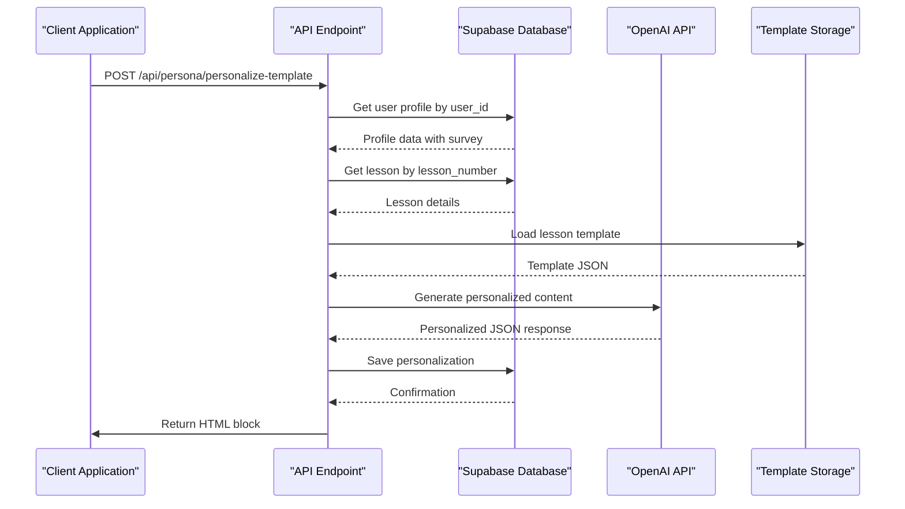
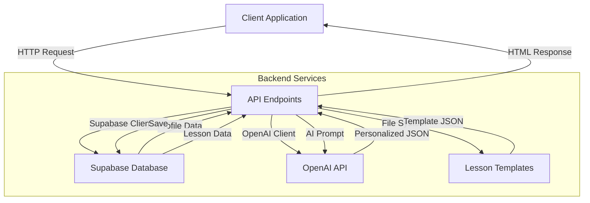

# API Routes

<cite>
**Referenced Files in This Document**   
- [app/api/persona/personalize-template/route.ts](file://app/api/persona/personalize-template/route.ts)
- [app/api/persona/block/route.ts](file://app/api/persona/block/route.ts)
- [app/api/personalizations/route.ts](file://app/api/personalizations/route.ts)
- [app/api/survey/route.ts](file://app/api/survey/route.ts)
- [app/api/lessons/route.ts](file://app/api/lessons/route.ts)
- [app/api/debug/route.ts](file://app/api/debug/route.ts)
- [lib/supabase/server.ts](file://lib/supabase/server.ts)
- [lib/openai.ts](file://lib/openai.ts)
- [lib/api/personalizations.ts](file://lib/api/personalizations.ts)
- [lib/api/lessons.ts](file://lib/api/lessons.ts)
- [lib/utils/http.ts](file://lib/utils/http.ts) - *Updated in recent commit*
- [PERSONALIZATION_API.md](file://PERSONALIZATION_API.md)
</cite>

## Update Summary
**Changes Made**   
- Updated CORS and OPTIONS handler implementation across all API routes
- Enhanced CORS configuration with standardized headers and methods
- Added consistent error response formatting
- Updated source tracking to include new http utility module

## Table of Contents
1. [Introduction](#introduction)
2. [Core API Endpoints](#core-api-endpoints)
3. [Personalization Processing Flow](#personalization-processing-flow)
4. [Error Handling Patterns](#error-handling-patterns)
5. [CORS and Security Configuration](#cors-and-security-configuration)
6. [Validation and Input Sanitization](#validation-and-input-sanitization)
7. [Data Flow and Service Integration](#data-flow-and-service-integration)
8. [Rate Limiting Considerations](#rate-limiting-considerations)
9. [Request/Response Examples](#requestresponse-examples)
10. [Troubleshooting Guide](#troubleshooting-guide)

## Introduction
The persona application provides a comprehensive API for delivering personalized educational content based on user profiles and survey responses. The backend API routes enable dynamic content generation by integrating Supabase database operations with OpenAI's language model capabilities. This documentation details all backend API endpoints, focusing on their HTTP methods, URL patterns, request parameters, response formats, and authentication requirements. The system is designed to personalize lesson templates based on user-specific data such as motivation, target clients, desired skills, fears, expected results, and practice models. The API architecture follows RESTful principles with additional support for JSON-based request bodies and HTML-formatted responses for frontend integration.

## Core API Endpoints

### POST /api/persona/personalize-template
Generates personalized lesson content using AI based on user profile and lesson number.

**Request Parameters**
- `user_id` (string): User identifier from GetCourse system
- `lesson_number` (number): Lesson number to personalize
- `flush` (boolean, optional): Whether to ignore cache

**Request Body Schema**
```json
{
  "user_id": "string",
  "lesson_number": "number",
  "flush": "boolean"
}
```

**Response Format**
```json
{
  "ok": "boolean",
  "html": "string",
  "cached": "boolean"
}
```

**Authentication Requirements**: None (public endpoint)

**Section sources**
- [app/api/persona/personalize-template/route.ts](file://app/api/persona/personalize-template/route.ts)

### POST /api/persona/block
Retrieves pre-generated personalized content block for a specific lesson.

**Request Parameters**
- `user_id` (string): User identifier
- `lesson` (string): Lesson slug or title
- `title` (string): Lesson title
- `flush` (boolean, optional): Whether to ignore cache

**Request Body Schema**
```json
{
  "user_id": "string",
  "lesson": "string",
  "title": "string",
  "flush": "boolean"
}
```

**Response Format**
```json
{
  "ok": "boolean",
  "html": "string",
  "cached": "boolean"
}
```

**Authentication Requirements**: None (public endpoint)

**Section sources**
- [app/api/persona/block/route.ts](file://app/api/persona/block/route.ts)

### POST /api/personalizations
Creates or updates a personalized lesson description for a user profile.

**Request Parameters**
- `profileId` (string): UUID of user profile
- `lessonId` (string): UUID of lesson
- `content` (object): Personalized content structure

**Request Body Schema**
```json
{
  "profileId": "string",
  "lessonId": "string",
  "content": "object"
}
```

**Response Format**
```json
{
  "success": "boolean",
  "data": "object",
  "message": "string"
}
```

**Authentication Requirements**: None (server-side only)

**Section sources**
- [app/api/personalizations/route.ts](file://app/api/personalizations/route.ts)

### DELETE /api/personalizations
Removes a personalized lesson description for a user profile.

**Request Parameters**
- `profileId` (string): UUID of user profile
- `lessonId` (string): UUID of lesson

**Request Body Schema**
```json
{
  "profileId": "string",
  "lessonId": "string"
}
```

**Response Format**
```json
{
  "success": "boolean",
  "message": "string"
}
```

**Authentication Requirements**: None (server-side only)

**Section sources**
- [app/api/personalizations/route.ts](file://app/api/personalizations/route.ts)

### POST /api/survey
Processes user survey data to create profile and generate personalized content for all lessons.

**Request Parameters**
- `real_name` (string): User's real name
- `course` (string): Course identifier
- `motivation` (array): User's motivations
- `target_clients` (string): Target client description
- `skills_wanted` (string): Desired skills
- `fears` (array): User's fears/concerns
- `wow_result` (string): Expected outcome
- `practice_model` (string): Practice model preference
- `uid` (string, optional): User identifier from GetCourse

**Request Body Schema**
```json
{
  "real_name": "string",
  "course": "string",
  "motivation": "array",
  "target_clients": "string",
  "skills_wanted": "string",
  "fears": "array",
  "wow_result": "string",
  "practice_model": "string",
  "uid": "string"
}
```

**Response Format**
```json
{
  "success": "boolean",
  "profileId": "string",
  "userIdentifier": "string",
  "message": "string"
}
```

**Authentication Requirements**: None (public endpoint)

**Section sources**
- [app/api/survey/route.ts](file://app/api/survey/route.ts)

### GET /api/lessons
Retrieves all lessons with their descriptions.

**Request Parameters**: None

**Response Format**
```json
{
  "lessons": "array"
}
```

**Authentication Requirements**: None (public endpoint)

**Section sources**
- [app/api/lessons/route.ts](file://app/api/lessons/route.ts)

### GET /api/debug
Debug endpoint for testing personalization flow with sample data.

**Request Parameters**: None

**Response Format**
```json
{
  "ok": "boolean",
  "html": "string",
  "debug": "object"
}
```

**Authentication Requirements**: None (development only)

**Section sources**
- [app/api/debug/route.ts](file://app/api/debug/route.ts)

## Personalization Processing Flow



**Diagram sources**
- [app/api/persona/personalize-template/route.ts](file://app/api/persona/personalize-template/route.ts)
- [lib/supabase/server.ts](file://lib/supabase/server.ts)
- [lib/openai.ts](file://lib/openai.ts)

The personalization flow begins when a client requests personalized content for a specific lesson. The API first retrieves the user's profile from Supabase, including their survey responses that contain personalization data such as motivation, target clients, skills wanted, fears, and expected results. Simultaneously, the system fetches lesson details by number from the database. With both user and lesson data available, the API loads the appropriate lesson template from the file system storage. The template, along with user survey data, is then sent to OpenAI's GPT-4o-mini model with specific instructions to personalize each element of the lesson. The AI-generated response is saved back to Supabase in the personalized_lesson_descriptions table and formatted into HTML for immediate client rendering.

## Error Handling Patterns

The API implements comprehensive error handling across all endpoints with consistent response patterns:

1. **Validation Errors**: Return 400 status with descriptive error messages when required fields are missing
2. **Resource Not Found**: Return success responses with informative HTML when user or lesson not found
3. **Database Errors**: Log errors and return 500 status with generic error messages
4. **OpenAI API Errors**: Gracefully degrade to original template when AI generation fails

Each endpoint follows a structured try-catch pattern that ensures errors are properly logged while maintaining API stability. The system distinguishes between client errors (4xx) and server errors (5xx), providing appropriate feedback without exposing sensitive implementation details. When database operations fail, the system logs the full error for debugging but returns a sanitized message to the client. For AI integration points, the system implements fallback mechanisms that preserve functionality even when external services are unavailable.

**Section sources**
- [app/api/persona/personalize-template/route.ts](file://app/api/persona/personalize-template/route.ts)
- [app/api/persona/block/route.ts](file://app/api/persona/block/route.ts)
- [app/api/personalizations/route.ts](file://app/api/personalizations/route.ts)
- [app/api/survey/route.ts](file://app/api/survey/route.ts)

## CORS and Security Configuration

All API endpoints include standardized CORS headers through a centralized configuration in `lib/utils/http.ts`. The system uses a shared `CORS_HEADERS` constant and `createOptionsHandler` function to ensure consistency across all routes.

**Standard CORS Headers**
```http
Access-Control-Allow-Origin: *
Access-Control-Allow-Methods: GET, POST, PUT, DELETE, OPTIONS
Access-Control-Allow-Headers: Content-Type, Authorization, X-Requested-With
Access-Control-Max-Age: 86400
```

The configuration allows public access to all endpoints, which is appropriate for the application's use case as an embedded content delivery system. Each endpoint includes an OPTIONS handler to support preflight requests through the `createOptionsHandler` utility function. The system does not implement authentication for API endpoints, as personalization is based on user identifiers rather than secure credentials. However, all database operations use Supabase's service role key for elevated privileges while maintaining security boundaries.

**Section sources**
- [lib/utils/http.ts](file://lib/utils/http.ts)
- [app/api/persona/personalize-template/route.ts](file://app/api/persona/personalize-template/route.ts)
- [app/api/persona/block/route.ts](file://app/api/persona/block/route.ts)
- [app/api/survey/route.ts](file://app/api/survey/route.ts)
- [app/api/lessons/route.ts](file://app/api/lessons/route.ts)

## Validation and Input Sanitization

The API implements rigorous validation at multiple levels:

1. **Request Body Validation**: All endpoints validate required fields before processing
2. **Type Checking**: TypeScript interfaces ensure proper data types
3. **Database Constraints**: Supabase enforces schema integrity
4. **File System Safeguards**: Template loading includes existence checks

Input sanitization occurs through several mechanisms: user identifiers are treated as opaque strings without special character processing, lesson numbers are validated as integers, and JSON content is parsed with error handling. The system uses Supabase's type-safe queries to prevent injection attacks. When generating AI prompts, user data is included in a structured format that prevents prompt injection vulnerabilities.

**Section sources**
- [app/api/persona/personalize-template/route.ts](file://app/api/persona/personalize-template/route.ts)
- [app/api/persona/block/route.ts](file://app/api/persona/block/route.ts)
- [app/api/personalizations/route.ts](file://app/api/personalizations/route.ts)

## Data Flow and Service Integration



**Diagram sources**
- [app/api/persona/personalize-template/route.ts](file://app/api/persona/personalize-template/route.ts)
- [lib/supabase/server.ts](file://lib/supabase/server.ts)
- [lib/openai.ts](file://lib/openai.ts)

The data flow architecture integrates multiple services to deliver personalized content. Client requests are received by API endpoints which coordinate between Supabase for persistent data storage, the file system for lesson templates, and OpenAI for AI-powered personalization. The Supabase integration handles user profiles, lessons, and personalized content storage, while the OpenAI integration transforms generic templates into personalized experiences based on user survey data. The file system stores pre-defined lesson templates that serve as the foundation for personalization. This multi-service architecture enables separation of concerns while maintaining high performance and reliability.

## Rate Limiting Considerations

The current implementation does not include explicit rate limiting, relying instead on platform-level protections from Vercel and Supabase. However, the system incorporates several natural rate-limiting mechanisms:

1. **Caching**: Responses include cache indicators to reduce redundant requests
2. **Expensive Operations**: AI generation creates natural throttling
3. **Database Constraints**: Unique indexes prevent duplicate personalizations
4. **Template Loading**: File system operations add processing overhead

For production deployment, additional rate limiting should be considered, particularly for the AI-intensive endpoints. The system could implement token bucket or sliding window algorithms to prevent abuse while maintaining availability for legitimate users. Given the educational nature of the application, aggressive rate limiting is not currently required.

**Section sources**
- [app/api/persona/personalize-template/route.ts](file://app/api/persona/personalize-template/route.ts)
- [app/api/survey/route.ts](file://app/api/survey/route.ts)

## Request/Response Examples

### Personalize Template Request
```json
{
  "user_id": "21179358",
  "lesson_number": 1
}
```

### Personalize Template Response
```json
{
  "ok": true,
  "html": "<div class=\"persona-block\">...</div>",
  "cached": false
}
```

### Create Personalization Request
```json
{
  "profileId": "a954c858-888d-4e68-b1cd-5d0b2943d207",
  "lessonId": "123e4567-e89b-12d3-a456-426614174000",
  "content": {
    "introduction": "Здравствуйте! Этот урок специально адаптирован для вас.",
    "key_points": [
      "Учитывая вашу профессию, обратите внимание на...",
      "С учетом вашего опыта, рекомендуем..."
    ],
    "homework": "Выполните упражнения, которые подходят именно вам."
  }
}
```

### Survey Submission Request
```json
{
  "real_name": "Алексей",
  "course": "shvz",
  "motivation": ["здоровье", "помощь другим"],
  "target_clients": "люди с болями в спине",
  "skills_wanted": "техника ШВЗ",
  "fears": ["сделать больно клиенту"],
  "wow_result": "помогать людям без лекарств",
  "practice_model": "подруга",
  "uid": "21179358"
}
```

**Section sources**
- [PERSONALIZATION_API.md](file://PERSONALIZATION_API.md)
- [app/api/persona/personalize-template/route.ts](file://app/api/persona/personalize-template/route.ts)
- [app/api/personalizations/route.ts](file://app/api/personalizations/route.ts)
- [app/api/survey/route.ts](file://app/api/survey/route.ts)

## Troubleshooting Guide

Common issues and solutions for API endpoints:

1. **User Profile Not Found**: Ensure the user has completed the survey form with correct UID
2. **Lesson Not Found**: Verify lesson numbers match database entries and templates exist
3. **Template Not Found**: Check store/shvz directory for properly named JSON files
4. **OpenAI Errors**: Validate OPENAI_API_KEY environment variable is set
5. **Supabase Connection**: Confirm NEXT_PUBLIC_SUPABASE_URL and service role key are configured
6. **CORS Issues**: Ensure frontend is making proper POST requests with Content-Type header

The debug endpoint (GET /api/debug) can be used to test the complete personalization flow with hardcoded sample data. Monitoring console logs for error messages from Supabase and OpenAI integrations is recommended for diagnosing issues. When personalization fails, the system typically returns fallback HTML with instructions to complete the survey.

**Section sources**
- [app/api/debug/route.ts](file://app/api/debug/route.ts)
- [app/api/persona/personalize-template/route.ts](file://app/api/persona/personalize-template/route.ts)
- [app/api/survey/route.ts](file://app/api/survey/route.ts)
- [lib/supabase/server.ts](file://lib/supabase/server.ts)
- [lib/openai.ts](file://lib/openai.ts)