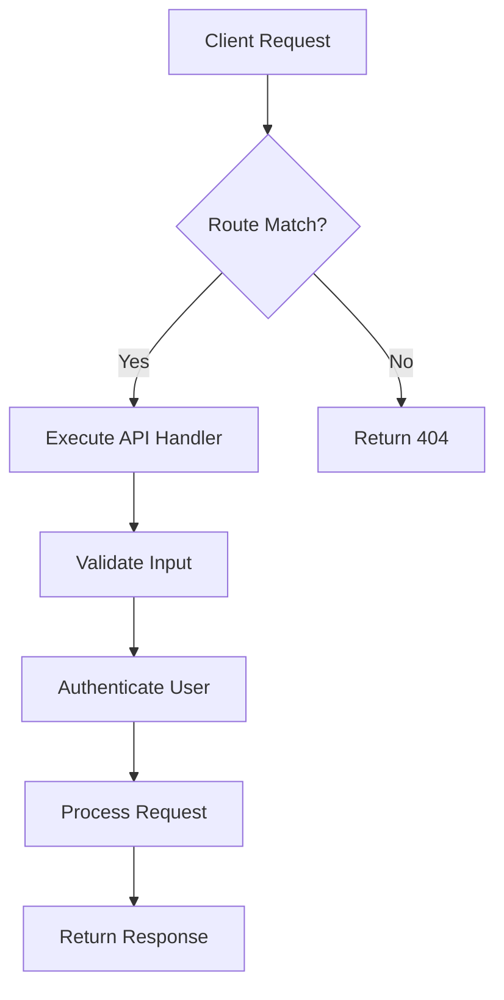
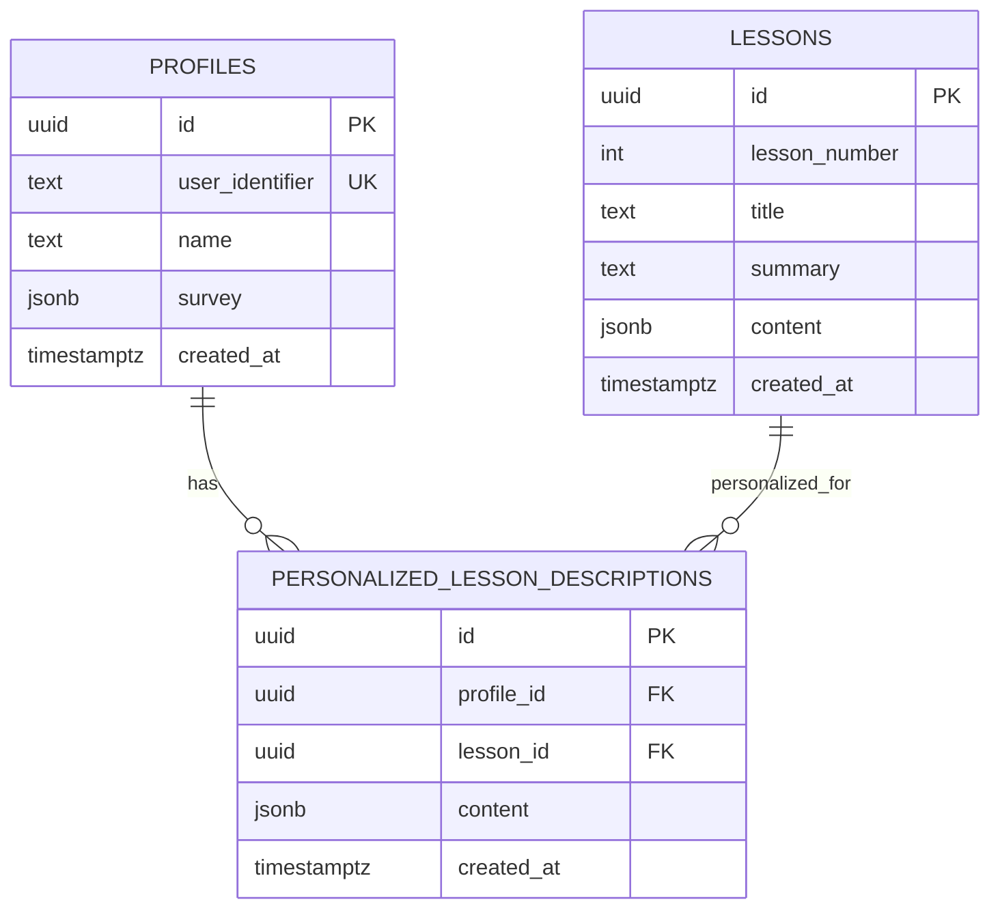
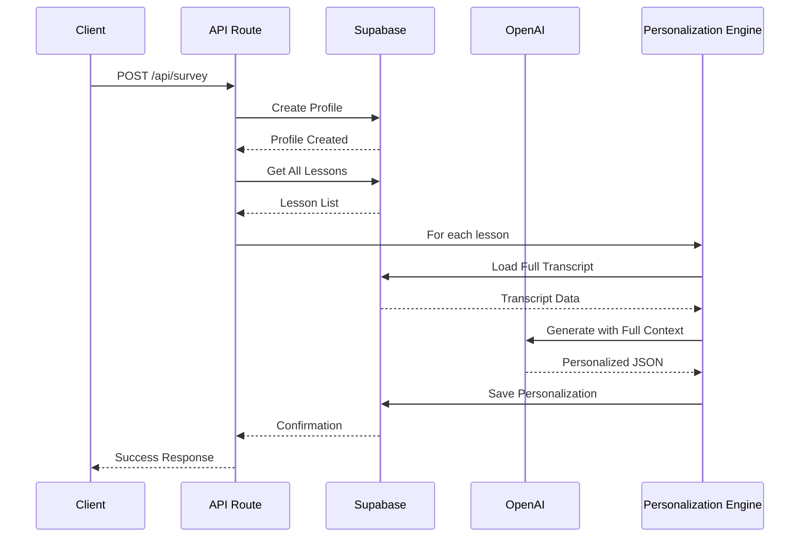
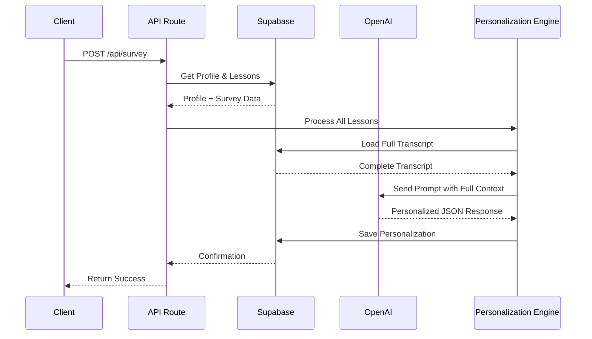

# Backend Architecture

<cite>
**Referenced Files in This Document**   
- [lessons/route.ts](file://app/api/lessons/route.ts)
- [persona/block/route.ts](file://app/api/persona/block/route.ts)
- [persona/personalize-template/route.ts](file://app/api/persona/personalize-template/route.ts)
- [profiles/[profileId]/personalizations/route.ts](file://app/api/profiles/[profileId]/personalizations/route.ts)
- [personalizations/route.ts](file://app/api/personalizations/route.ts)
- [survey/route.ts](file://app/api/survey/route.ts)
- [server.ts](file://lib/supabase/server.ts)
- [client.ts](file://lib/supabase/client.ts)
- [types.ts](file://lib/supabase/types.ts)
- [openai.ts](file://lib/services/openai.ts) - *Updated in recent commit*
- [lesson-templates.ts](file://lib/services/lesson-templates.ts) - *Updated in recent commit*
- [html-formatter.ts](file://lib/services/html-formatter.ts) - *Updated in recent commit*
- [personalization-engine.ts](file://lib/services/personalization-engine.ts) - *New service for transcript-driven generation*
- [personalization.ts](file://lib/services/personalization.ts) - *Updated in recent commit*
- [profile.ts](file://lib/services/profile.ts) - *Updated in recent commit*
- [http.ts](file://lib/utils/http.ts) - *Updated in recent commit*
- [001_init.sql](file://migrations/001_init.sql)
</cite>

## Update Summary
**Changes Made**   
- Updated AI-Powered Personalization section to reflect new transcript-driven generation model
- Added new section on Personalization Engine Architecture
- Updated Server-Side Data Flow to reflect new personalization workflow
- Enhanced Service Layer Architecture with new personalization-engine service
- Updated API Route Structure to reflect changes in personalization endpoints
- Added new diagram sources for personalization engine components
- Updated all relevant section sources to reflect new service implementations

## Table of Contents
1. [Introduction](#introduction)
2. [API Route Structure](#api-route-structure)
3. [Server-Side Data Flow](#server-side-data-flow)
4. [Authentication and Security Model](#authentication-and-security-model)
5. [Service Layer Architecture](#service-layer-architecture)
6. [Personalization Engine Architecture](#personalization-engine-architecture)
7. [AI-Powered Personalization with OpenAI](#ai-powered-personalization-with-openai)
8. [Database Schema and Relationships](#database-schema-and-relationships)
9. [Security Considerations](#security-considerations)
10. [Caching and Server-Side Rendering](#caching-and-server-side-rendering)
11. [Error Handling Strategies](#error-handling-strategies)
12. [Conclusion](#conclusion)

## Introduction
The backend component of the persona application is designed to deliver personalized educational content using AI-driven logic, Supabase for data persistence, and Next.js API routes for server-side processing. This document provides a comprehensive architectural overview of the backend system, focusing on API design, data flow, authentication, AI integration, database schema, and security practices.

**Section sources**
- [001_init.sql](file://migrations/001_init.sql#L1-L89)
- [server.ts](file://lib/supabase/server.ts#L1-L28)

## API Route Structure
The API routes under `app/api/` follow RESTful conventions and are organized by functionality. Key endpoints include:
- `GET /api/lessons`: Retrieves all lessons with summaries and descriptions.
- `POST /api/persona/block`: Generates personalized lesson content using full lesson transcripts.
- `POST /api/persona/personalize-template`: Generates personalized lesson content using template-based approach (deprecated).
- `GET /api/profiles/[profileId]/personalizations`: Fetches all personalizations for a given profile.
- `POST /api/survey`: Handles user survey submission and profile creation.
- `DELETE /api/personalizations`: Removes a specific personalization.

These routes support both JSON and HTML responses, enabling integration with frontend components and third-party systems.



**Diagram sources**
- [lessons/route.ts](file://app/api/lessons/route.ts#L1-L21)
- [persona/block/route.ts](file://app/api/persona/block/route.ts#L1-L143)
- [survey/route.ts](file://app/api/survey/route.ts#L1-L170)

**Section sources**
- [lessons/route.ts](file://app/api/lessons/route.ts#L1-L21)
- [personalizations/route.ts](file://app/api/personalizations/route.ts#L82-L131)
- [survey/route.ts](file://app/api/survey/route.ts#L1-L170)
- [persona/block/route.ts](file://app/api/persona/block/route.ts#L1-L143)

## Server-Side Data Flow
Data flows from API routes through Supabase server client to the PostgreSQL database. The `createSupabaseServerClient()` function initializes a Supabase client with service role or anonymous key, enabling secure database access without session persistence. Upon receiving a request, the server:
1. Validates input parameters.
2. Authenticates the user context via Supabase auth.
3. Queries or modifies data using Supabase client.
4. Returns structured JSON or HTML responses.

For personalization, the system now uses a transcript-driven approach where full lesson transcripts from the database are processed with user survey data to generate personalized content. The new workflow in `/api/survey` processes full transcripts through the personalization engine, replacing the previous template-based approach. API routes delegate business logic to specialized service modules in the `lib/services/` directory.

**Section sources**
- [server.ts](file://lib/supabase/server.ts#L19-L25)
- [persona/block/route.ts](file://app/api/persona/block/route.ts#L1-L143)
- [personalization-engine.ts](file://lib/services/personalization-engine.ts#L1-L371)

## Authentication and Security Model
Authentication is managed through Supabase Auth, with user profiles stored in the `profiles` table. Each profile is linked to a `user_identifier`, enabling secure identification without exposing sensitive credentials. Row-Level Security (RLS) policies ensure users can only access their own personalizations. The system uses environment variables for API keys and database credentials, with validation in place to prevent runtime failures due to missing configuration.



**Diagram sources**
- [001_init.sql](file://migrations/001_init.sql#L1-L89)
- [server.ts](file://lib/supabase/server.ts#L1-L28)

**Section sources**
- [profiles/[profileId]/personalizations/route.ts](file://app/api/profiles/[profileId]/personalizations/route.ts#L1-L33)
- [001_init.sql](file://migrations/001_init.sql#L1-L89)

## Service Layer Architecture
The backend has been refactored to implement a clear separation of concerns through a dedicated service layer in the `lib/services/` directory. This modular architecture centralizes business logic and improves code maintainability:

- **openai.ts**: Contains the `personalizeLesson()` function that orchestrates AI personalization using OpenAI's GPT-4o-mini model
- **lesson-templates.ts**: Manages template loading with `loadLessonTemplate()` and maintains lesson ID mappings
- **html-formatter.ts**: Handles HTML generation with functions like `formatPersonalizedContent()` and `formatSurveyAlert()`
- **personalization.ts**: Manages database operations for personalizations including `savePersonalization()` and `getPersonalization()`
- **profile.ts**: Handles profile operations with `getProfileByUserId()` and `upsertProfile()`
- **http.ts**: Provides standardized CORS utilities and HTTP helpers
- **personalization-engine.ts**: New service for transcript-driven personalization using GPT-4o

API routes now serve as lightweight controllers that coordinate these services rather than containing business logic directly. This separation improves testability, reusability, and maintainability of the codebase.

```mermaid
componentDiagram
[API Routes] --> [openai.ts]
[API Routes] --> [lesson-templates.ts]
[API Routes] --> [html-formatter.ts]
[API Routes] --> [personalization.ts]
[API Routes] --> [profile.ts]
[API Routes] --> [http.ts]
[API Routes] --> [personalization-engine.ts]
[openai.ts] --> [Supabase]
[lesson-templates.ts] --> [File System]
[personalization.ts] --> [Supabase]
[profile.ts] --> [Supabase]
[personalization-engine.ts] --> [Supabase]
```

**Diagram sources**
- [persona/block/route.ts](file://app/api/persona/block/route.ts#L1-L143)
- [personalization-engine.ts](file://lib/services/personalization-engine.ts#L1-L371)
- [openai.ts](file://lib/services/openai.ts#L1-L138)
- [lesson-templates.ts](file://lib/services/lesson-templates.ts#L1-L101)
- [html-formatter.ts](file://lib/services/html-formatter.ts#L1-L108)
- [personalization.ts](file://lib/services/personalization.ts#L1-L140)
- [profile.ts](file://lib/services/profile.ts#L1-L130)

**Section sources**
- [persona/block/route.ts](file://app/api/persona/block/route.ts#L1-L143)
- [personalization-engine.ts](file://lib/services/personalization-engine.ts#L1-L371)
- [openai.ts](file://lib/services/openai.ts#L1-L138)
- [lesson-templates.ts](file://lib/services/lesson-templates.ts#L1-L101)
- [html-formatter.ts](file://lib/services/html-formatter.ts#L1-L108)
- [personalization.ts](file://lib/services/personalization.ts#L1-L140)
- [profile.ts](file://lib/services/profile.ts#L1-L130)

## Personalization Engine Architecture
The system has been refactored to replace the template-based personalization approach with a transcript-driven generation model. The new personalization engine in `lib/services/personalization-engine.ts` processes full lesson transcripts directly, enabling deeper contextual understanding and more accurate personalization.

Key components of the new architecture:
- **loadLessonTranscript()**: Retrieves full lesson transcripts from the database content field
- **generatePersonalizedDescription()**: Main function that orchestrates AI generation using GPT-4o with full transcript context
- **createPersonalizationPrompt()**: Constructs prompts with complete lesson transcripts (8-18k characters) and detailed user profiles
- **validateAndNormalizeResponse()**: Ensures consistent response structure and handles formatting issues

The new workflow processes complete lesson content rather than compressed templates, eliminating information loss and enabling more nuanced personalization. The engine uses GPT-4o (not gpt-4o-mini) for enhanced context processing and generates content in a standardized 7-section format.



**Diagram sources**
- [personalization-engine.ts](file://lib/services/personalization-engine.ts#L1-L371)
- [survey/route.ts](file://app/api/survey/route.ts#L1-L170)
- [block/route.ts](file://app/api/persona/block/route.ts#L1-L143)

**Section sources**
- [personalization-engine.ts](file://lib/services/personalization-engine.ts#L1-L371)
- [survey/route.ts](file://app/api/survey/route.ts#L1-L170)
- [block/route.ts](file://app/api/persona/block/route.ts#L1-L143)

## AI-Powered Personalization with OpenAI
The application integrates OpenAI's models to generate personalized lesson content. The system now uses two approaches:
1. **Transcript-driven generation** (primary): Uses GPT-4o with full lesson transcripts for comprehensive personalization
2. **Template-based personalization** (fallback): Uses gpt-4o-mini with compressed templates

When a user submits a survey, the `/api/survey` endpoint triggers the transcript-driven engine by sending a structured prompt containing the user's motivations, fears, goals, and preferred practice model along with the complete lesson transcript. The prompt instructs the AI to analyze the full transcript and generate deeply personalized descriptions with specific references to lesson content.

The `generatePersonalizedDescription()` function in `lib/services/personalization-engine.ts` constructs prompts with complete context, while `formatPersonalizedContent()` in `lib/services/html-formatter.ts` converts AI output into styled HTML blocks. The system uses a fallback strategy that returns original template content if the AI service is unavailable, ensuring consistent user experience.



**Diagram sources**
- [personalization-engine.ts](file://lib/services/personalization-engine.ts#L1-L371)
- [survey/route.ts](file://app/api/survey/route.ts#L1-L170)

**Section sources**
- [personalization-engine.ts](file://lib/services/personalization-engine.ts#L1-L371)
- [survey/route.ts](file://app/api/survey/route.ts#L1-L170)

## Database Schema and Relationships
The database schema is defined in `001_init.sql` and includes the following core tables:
- `profiles`: Stores user identifiers, names, and survey responses.
- `lessons`: Contains lesson metadata including number, title, and summary. The content field now stores full transcripts.
- `personalized_lesson_descriptions`: Holds AI-generated personalized content linked to user profiles and lessons.
- `lesson_descriptions`: Stores default lesson content.
- `courses` and `lesson_assets`: Support course structure and media assets.

Primary keys use UUIDs with `gen_random_uuid()`, and foreign key constraints enforce referential integrity. Unique constraints on `(profile_id, lesson_id)` prevent duplicate personalizations.

Indexes are implicitly created on primary and foreign keys, optimizing query performance for common access patterns such as fetching all personalizations for a profile.

**Section sources**
- [001_init.sql](file://migrations/001_init.sql#L1-L89)

## Security Considerations
Security is enforced through multiple layers:
- **CORS Headers**: API routes include `Access-Control-Allow-Origin: *` and restrict methods to `POST, OPTIONS` via the `CORS_HEADERS` constant in `lib/utils/http.ts`.
- **Input Validation**: All incoming JSON payloads are validated for required fields.
- **Environment Isolation**: Sensitive keys (Supabase service role, OpenAI API) are loaded from environment variables.
- **SQL Injection Protection**: Supabase client uses parameterized queries, eliminating injection risks.
- **Row-Level Security**: Future enhancements could enforce RLS policies directly in the database.
- **Service Layer Security**: Business logic is centralized in the service layer, reducing attack surface in API routes.

The system avoids exposing raw database errors to clients, instead returning generic 500 responses to prevent information leakage. The refactored service layer improves security by centralizing error handling and validation logic.

**Section sources**
- [persona/block/route.ts](file://app/api/persona/block/route.ts#L1-L143)
- [survey/route.ts](file://app/api/survey/route.ts#L1-L170)
- [http.ts](file://lib/utils/http.ts#L1-L20)

## Caching and Server-Side Rendering
The backend supports server-side rendering (SSR) by generating HTML responses directly in API routes. Personalized content is cached based on the `flush` parameter—when absent, previously generated content is reused. This reduces AI API calls and improves response times. The `cached: !flush` flag indicates whether the response was served from cache.

Frontend components consume these HTML blocks via client-side fetches, enabling dynamic insertion into lesson pages without full page reloads. The service layer architecture allows for future caching enhancements at the service level.

**Section sources**
- [persona/block/route.ts](file://app/api/persona/block/route.ts#L1-L143)

## Error Handling Strategies
Error handling is implemented consistently across all API routes:
- Database errors trigger 500 responses with logged details.
- Invalid input returns 400 with descriptive messages.
- OpenAI API failures fall back to original templates.
- CORS preflight requests are handled via `OPTIONS` routes.
- Service layer functions return null or fallback content on errors rather than throwing exceptions.

Structured logging ensures errors are captured for debugging, while user-facing messages remain generic to avoid exposing internal logic. The personalization engine includes retry logic with adjusted temperature settings and comprehensive fallback content generation.

**Section sources**
- [lessons/route.ts](file://app/api/lessons/route.ts#L1-L21)
- [personalizations/route.ts](file://app/api/personalizations/route.ts#L82-L131)
- [persona/block/route.ts](file://app/api/persona/block/route.ts#L1-L143)
- [personalization-engine.ts](file://lib/services/personalization-engine.ts#L1-L371)

## Conclusion
The backend architecture of the persona application effectively combines Supabase for data management, OpenAI for AI-driven personalization, and Next.js for scalable API routing. The system is secure, maintainable, and optimized for performance through caching and structured data flow. The recent refactoring has introduced a transcript-driven personalization engine that processes complete lesson content, enabling deeper contextual understanding and more accurate personalization. This replaces the previous template-based approach with a more robust system that eliminates information loss and leverages GPT-4o's enhanced context capabilities. Future improvements could include enhanced RLS policies, rate limiting, more granular error reporting, and additional service layer optimizations.