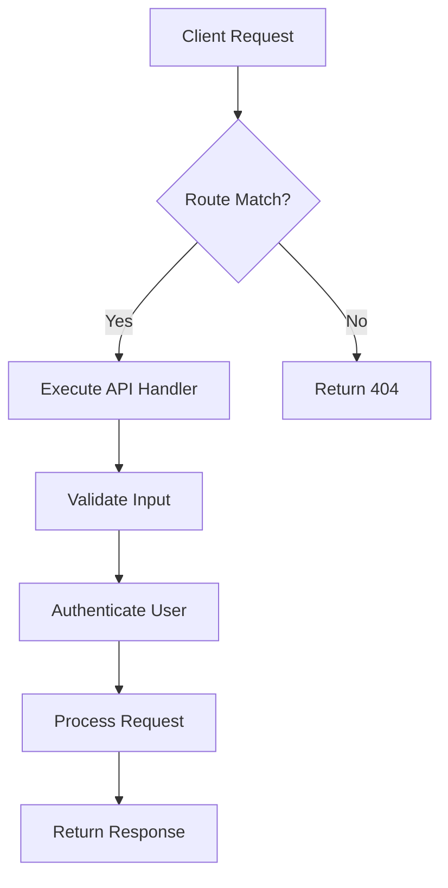
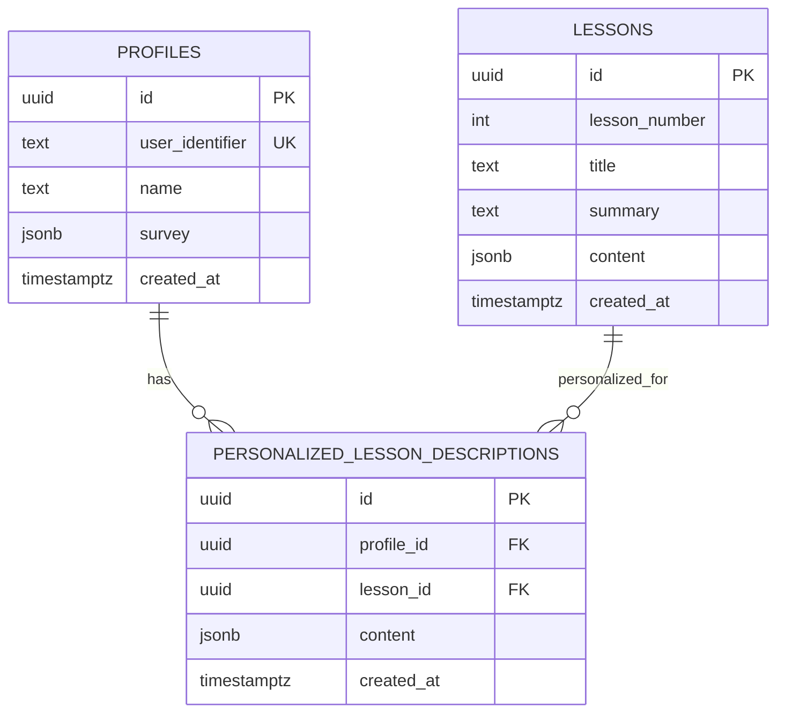
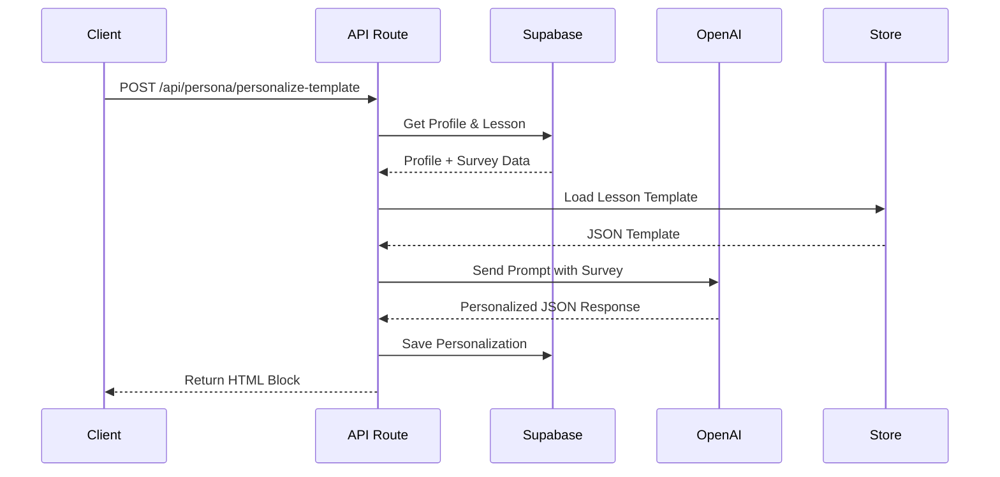

# Backend Architecture

<cite>
**Referenced Files in This Document**   
- [lessons/route.ts](file://app/api/lessons/route.ts)
- [persona/personalize-template/route.ts](file://app/api/persona/personalize-template/route.ts)
- [profiles/[profileId]/personalizations/route.ts](file://app/api/profiles/[profileId]/personalizations/route.ts)
- [personalizations/route.ts](file://app/api/personalizations/route.ts)
- [survey/route.ts](file://app/api/survey/route.ts)
- [server.ts](file://lib/supabase/server.ts)
- [client.ts](file://lib/supabase/client.ts)
- [types.ts](file://lib/supabase/types.ts)
- [openai.ts](file://lib/openai.ts)
- [001_init.sql](file://migrations/001_init.sql)
</cite>

## Table of Contents
1. [Introduction](#introduction)
2. [API Route Structure](#api-route-structure)
3. [Server-Side Data Flow](#server-side-data-flow)
4. [Authentication and Security Model](#authentication-and-security-model)
5. [AI-Powered Personalization with OpenAI](#ai-powered-personalization-with-openai)
6. [Database Schema and Relationships](#database-schema-and-relationships)
7. [Security Considerations](#security-considerations)
8. [Caching and Server-Side Rendering](#caching-and-server-side-rendering)
9. [Error Handling Strategies](#error-handling-strategies)
10. [Conclusion](#conclusion)

## Introduction
The backend component of the persona application is designed to deliver personalized educational content using AI-driven logic, Supabase for data persistence, and Next.js API routes for server-side processing. This document provides a comprehensive architectural overview of the backend system, focusing on API design, data flow, authentication, AI integration, database schema, and security practices.

**Section sources**
- [001_init.sql](file://migrations/001_init.sql#L1-L89)
- [server.ts](file://lib/supabase/server.ts#L1-L28)

## API Route Structure
The API routes under `app/api/` follow RESTful conventions and are organized by functionality. Key endpoints include:
- `GET /api/lessons`: Retrieves all lessons with summaries and descriptions.
- `POST /api/persona/personalize-template`: Generates personalized lesson content using OpenAI.
- `GET /api/profiles/[profileId]/personalizations`: Fetches all personalizations for a given profile.
- `POST /api/survey`: Handles user survey submission and profile creation.
- `DELETE /api/personalizations`: Removes a specific personalization.

These routes support both JSON and HTML responses, enabling integration with frontend components and third-party systems.

**Diagram sources**
- [lessons/route.ts](file://app/api/lessons/route.ts#L1-L21)
- [persona/personalize-template/route.ts](file://app/api/persona/personalize-template/route.ts#L1-L294)
- [survey/route.ts](file://app/api/survey/route.ts#L1-L98)

**Section sources**
- [lessons/route.ts](file://app/api/lessons/route.ts#L1-L21)
- [personalizations/route.ts](file://app/api/personalizations/route.ts#L82-L131)
- [survey/route.ts](file://app/api/survey/route.ts#L1-L98)

## Server-Side Data Flow
Data flows from API routes through Supabase server client to the PostgreSQL database. The `createSupabaseServerClient()` function initializes a Supabase client with service role or anonymous key, enabling secure database access without session persistence. Upon receiving a request, the server:
1. Validates input parameters.
2. Authenticates the user context via Supabase auth.
3. Queries or modifies data using Supabase client.
4. Returns structured JSON or HTML responses.

For personalization, raw JSON templates from the `store/` directory are processed and enriched with user-specific data before being stored in the database.

**Section sources**
- [server.ts](file://lib/supabase/server.ts#L19-L25)
- [persona/personalize-template/route.ts](file://app/api/persona/personalize-template/route.ts#L172-L230)

## Authentication and Security Model
Authentication is managed through Supabase Auth, with user profiles stored in the `profiles` table. Each profile is linked to a `user_identifier`, enabling secure identification without exposing sensitive credentials. Row-Level Security (RLS) policies ensure users can only access their own personalizations. The system uses environment variables for API keys and database credentials, with validation in place to prevent runtime failures due to missing configuration.

**Diagram sources**
- [001_init.sql](file://migrations/001_init.sql#L1-L89)
- [server.ts](file://lib/supabase/server.ts#L1-L28)

**Section sources**
- [profiles/[profileId]/personalizations/route.ts](file://app/api/profiles/[profileId]/personalizations/route.ts#L1-L33)
- [001_init.sql](file://migrations/001_init.sql#L1-L89)

## AI-Powered Personalization with OpenAI
The application integrates OpenAI's GPT-4o-mini model to generate personalized lesson content. When a user submits a survey, the `/api/survey` endpoint triggers AI processing by sending a structured prompt containing the user’s motivations, fears, goals, and preferred practice model. The prompt instructs the AI to personalize predefined lesson templates, ensuring relevance and engagement. Responses are parsed as JSON and formatted into HTML for frontend rendering.

The `personalizeTemplate` function constructs prompts dynamically, while `formatPersonalizedContent` converts AI output into styled HTML blocks.

**Diagram sources**
- [persona/personalize-template/route.ts](file://app/api/persona/personalize-template/route.ts#L172-L281)
- [openai.ts](file://lib/openai.ts#L1-L8)

**Section sources**
- [persona/personalize-template/route.ts](file://app/api/persona/personalize-template/route.ts#L172-L281)
- [openai.ts](file://lib/openai.ts#L1-L8)

## Database Schema and Relationships
The database schema is defined in `001_init.sql` and includes the following core tables:
- `profiles`: Stores user identifiers, names, and survey responses.
- `lessons`: Contains lesson metadata including number, title, and summary.
- `personalized_lesson_descriptions`: Holds AI-generated personalized content linked to user profiles and lessons.
- `lesson_descriptions`: Stores default lesson content.
- `courses` and `lesson_assets`: Support course structure and media assets.

Primary keys use UUIDs with `gen_random_uuid()`, and foreign key constraints enforce referential integrity. Unique constraints on `(profile_id, lesson_id)` prevent duplicate personalizations.

Indexes are implicitly created on primary and foreign keys, optimizing query performance for common access patterns such as fetching all personalizations for a profile.

**Section sources**
- [001_init.sql](file://migrations/001_init.sql#L1-L89)

## Security Considerations
Security is enforced through multiple layers:
- **CORS Headers**: API routes include `Access-Control-Allow-Origin: *` and restrict methods to `POST, OPTIONS`.
- **Input Validation**: All incoming JSON payloads are validated for required fields.
- **Environment Isolation**: Sensitive keys (Supabase service role, OpenAI API) are loaded from environment variables.
- **SQL Injection Protection**: Supabase client uses parameterized queries, eliminating injection risks.
- **Row-Level Security**: Future enhancements could enforce RLS policies directly in the database.

The system avoids exposing raw database errors to clients, instead returning generic 500 responses to prevent information leakage.

**Section sources**
- [persona/personalize-template/route.ts](file://app/api/persona/personalize-template/route.ts#L1-L294)
- [survey/route.ts](file://app/api/survey/route.ts#L1-L98)

## Caching and Server-Side Rendering
The backend supports server-side rendering (SSR) by generating HTML responses directly in API routes. Personalized content is cached based on the `flush` parameter—when absent, previously generated content is reused. This reduces AI API calls and improves response times. The `cached: !flush` flag indicates whether the response was served from cache.

Frontend components consume these HTML blocks via client-side fetches, enabling dynamic insertion into lesson pages without full page reloads.

**Section sources**
- [persona/personalize-template/route.ts](file://app/api/persona/personalize-template/route.ts#L170-L195)

## Error Handling Strategies
Error handling is implemented consistently across all API routes:
- Database errors trigger 500 responses with logged details.
- Invalid input returns 400 with descriptive messages.
- OpenAI API failures fall back to original templates.
- CORS preflight requests are handled via `OPTIONS` routes.

Structured logging ensures errors are captured for debugging, while user-facing messages remain generic to avoid exposing internal logic.

**Section sources**
- [lessons/route.ts](file://app/api/lessons/route.ts#L1-L21)
- [personalizations/route.ts](file://app/api/personalizations/route.ts#L82-L131)
- [persona/personalize-template/route.ts](file://app/api/persona/personalize-template/route.ts#L1-L294)

## Conclusion
The backend architecture of the persona application effectively combines Supabase for data management, OpenAI for AI-driven personalization, and Next.js for scalable API routing. The system is secure, maintainable, and optimized for performance through caching and structured data flow. Future improvements could include enhanced RLS policies, rate limiting, and more granular error reporting.