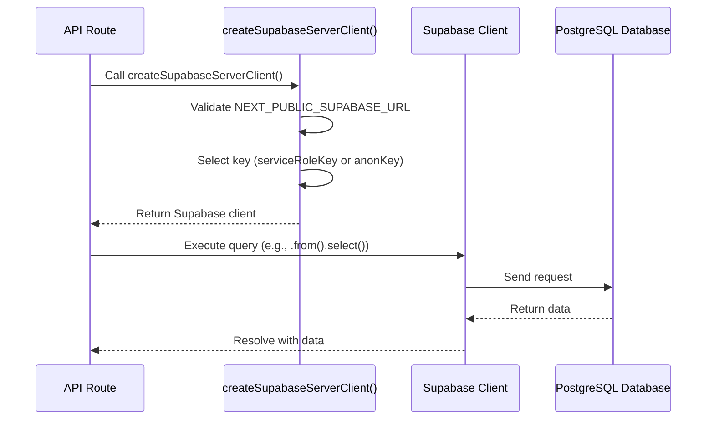
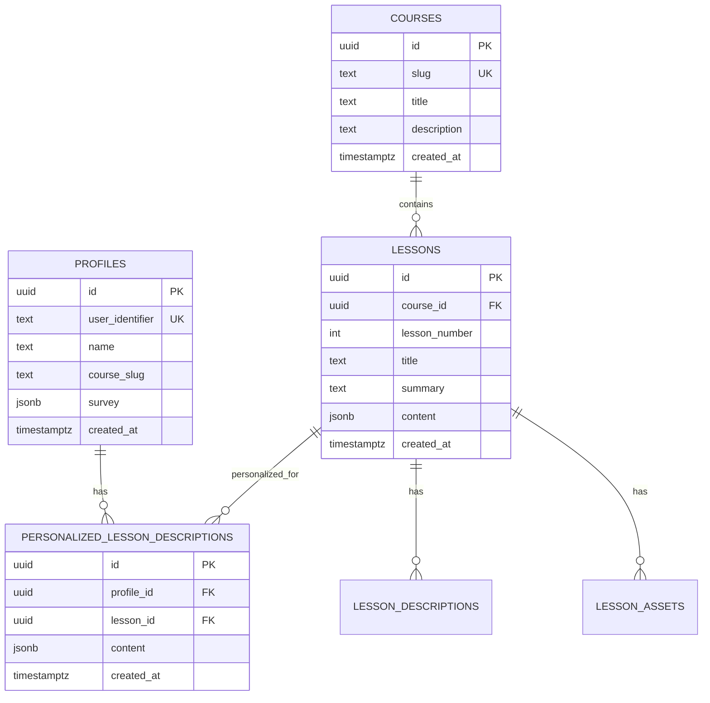
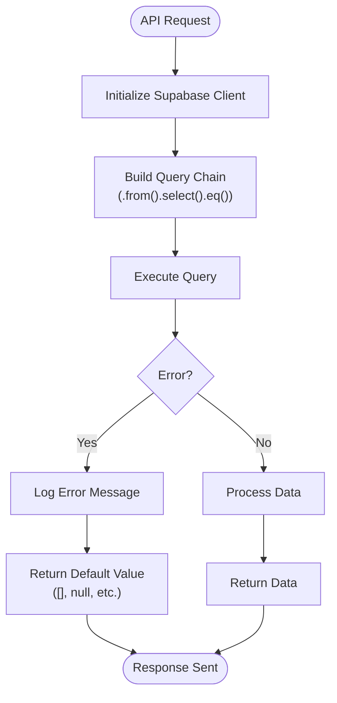

# Database Access

<cite>
**Referenced Files in This Document**   
- [server.ts](file://lib/supabase/server.ts)
- [001_init.sql](file://migrations/001_init.sql)
- [types.ts](file://lib/supabase/types.ts)
- [personalizations.ts](file://lib/api/personalizations.ts)
- [lessons.ts](file://lib/api/lessons.ts)
- [profiles.ts](file://lib/api/profiles.ts)
- [personalize-template/route.ts](file://app/api/persona/personalize-template/route.ts)
</cite>

## Table of Contents
1. [Introduction](#introduction)
2. [Database Access Layer Overview](#database-access-layer-overview)
3. [Supabase Client Initialization](#supabase-client-initialization)
4. [Database Schema](#database-schema)
5. [Row-Level Security and Service Role Usage](#row-level-security-and-service-role-usage)
6. [Type Safety with Generated Types](#type-safety-with-generated-types)
7. [Common Query Patterns](#common-query-patterns)
8. [Connection and Error Handling](#connection-and-error-handling)
9. [Best Practices for Supabase in Next.js Server Components](#best-practices-for-supabase-in-nextjs-server-components)
10. [Conclusion](#conclusion)

## Introduction
This document provides comprehensive documentation for the database access layer in the Persona application. It details the implementation of server-side data operations using Supabase, the structure of the PostgreSQL database schema, and best practices for secure and efficient data interaction within a Next.js environment. The focus is on server-side operations, type safety, and integration patterns used across API routes.

## Database Access Layer Overview
The database access layer in the Persona application is built on Supabase, a PostgreSQL-based backend-as-a-service platform. It enables server-side data operations through a TypeScript client, with strict type safety, connection management, and integration with Next.js server components. The layer abstracts direct database interactions through utility functions and ensures secure access using environment-controlled credentials.

**Section sources**
- [server.ts](file://lib/supabase/server.ts#L1-L27)
- [001_init.sql](file://migrations/001_init.sql#L0-L88)

## Supabase Client Initialization
The `createSupabaseServerClient` function is the primary entry point for server-side database access. It is defined in `lib/supabase/server.ts` and uses the Supabase client SDK to create a typed client instance. The function is marked with `server-only` to prevent accidental usage on the client side.

The client is initialized with the Supabase project URL and a key, which is selected based on availability: the service role key takes precedence over the anonymous key. This allows elevated privileges when needed (e.g., bypassing row-level security), while falling back to public access when appropriate.

The client is configured with `persistSession: false`, which is optimal for server components where sessions are not maintained across requests. Each call creates a fresh client instance, ensuring isolation and preventing state leakage.

**Diagram sources**
- [server.ts](file://lib/supabase/server.ts#L19-L25)
- [personalize-template/route.ts](file://app/api/persona/personalize-template/route.ts#L38)

**Section sources**
- [server.ts](file://lib/supabase/server.ts#L1-L27)

## Database Schema
The database schema is defined in `migrations/001_init.sql` and consists of several interconnected tables that support the application's core functionality: course delivery, user profiling, and lesson personalization.

### Core Tables
The schema includes the following primary tables:

- **courses**: Stores course metadata with a unique slug for routing.
- **lessons**: Contains individual lessons linked to courses, ordered by lesson number.
- **profiles**: Tracks user profiles with identifiers, survey responses, and course associations.
- **personalized_lesson_descriptions**: Stores AI-generated, user-specific lesson content.
- **lesson_descriptions**: Holds static, non-personalized lesson descriptions.
- **lesson_assets**: Manages multimedia assets associated with lessons.

### Relationships and Constraints
The schema enforces referential integrity through foreign key constraints:
- `lessons.course_id` references `courses.id` with cascade delete.
- `lesson_descriptions.lesson_id` references `lessons.id` with cascade delete.
- `personalized_lesson_descriptions.profile_id` and `lesson_id` reference `profiles.id` and `lessons.id` respectively, both with cascade delete.

Unique constraints ensure data consistency:
- `courses.slug` is unique.
- `lessons` enforces unique combinations of `course_id` and `lesson_number`.
- `personalized_lesson_descriptions` ensures one personalization per profile-lesson pair.

### Indexing Strategy
While explicit indexes are not defined in the migration, PostgreSQL automatically creates indexes for primary keys and unique constraints. This provides efficient lookups on:
- `courses.id` and `courses.slug`
- `lessons.id` and the `(course_id, lesson_number)` pair
- `profiles.id` and `profiles.user_identifier`
- `personalized_lesson_descriptions` composite key on `(profile_id, lesson_id)`

**Diagram sources**
- [001_init.sql](file://migrations/001_init.sql#L1-L88)

**Section sources**
- [001_init.sql](file://migrations/001_init.sql#L1-L88)

## Row-Level Security and Service Role Usage
The application leverages Supabase's Row-Level Security (RLS) model to control data access at the database level. While RLS policies are not included in the provided migration file, their presence is implied by the use of different authentication keys.

The `createSupabaseServerClient` function conditionally uses the `SUPABASE_SERVICE_ROLE_KEY` when available, which bypasses RLS policies and allows full table access. This is necessary for server-side operations that need to read or write data on behalf of users, such as generating personalized lesson content or syncing user profiles.

In contrast, client-side operations would use the anonymous key (`NEXT_PUBLIC_SUPABASE_ANON_KEY`), which respects RLS policies and limits access based on user identity and defined rules. This dual-key strategy enables secure, fine-grained control over data access patterns.

**Section sources**
- [server.ts](file://lib/supabase/server.ts#L1-L27)

## Type Safety with Generated Types
Type safety is enforced through the `Database` interface in `lib/supabase/types.ts`. This type is generated to reflect the exact structure of the PostgreSQL schema, providing compile-time validation for all database operations.

The `Database` interface defines types for each table's `Row`, `Insert`, and `Update` operations:
- `Row`: Represents the full shape of a record as returned from the database.
- `Insert`: Defines optional fields for creation (e.g., `id` is optional, defaults to UUID).
- `Update`: Specifies all fields as optional, reflecting partial updates.

These types are used as generics in the Supabase client (`createClient<Database>`), ensuring that queries, selections, and mutations are type-checked. This prevents runtime errors due to schema mismatches and improves developer experience with autocompletion and validation.

**Section sources**
- [types.ts](file://lib/supabase/types.ts#L8-L134)

## Common Query Patterns
The application uses consistent query patterns across API routes and utility functions. These patterns are abstracted into reusable functions in the `lib/api` directory.

### Data Retrieval Examples
- **Get all lessons with descriptions**: Uses a join to fetch lessons and their associated descriptions in a single query.
- **Get profile by ID**: Uses `.single()` to expect exactly one result, with error handling for not-found cases.
- **Get personalizations by profile**: Fetches all personalized lesson content for a given profile, ordered by lesson.

These queries are executed using the server client and include error handling to log issues and return safe defaults (e.g., empty arrays) rather than throwing.

**Diagram sources**
- [lessons.ts](file://lib/api/lessons.ts#L9-L23)
- [profiles.ts](file://lib/api/profiles.ts#L20-L37)
- [personalizations.ts](file://lib/api/personalizations.ts#L7-L23)

**Section sources**
- [lessons.ts](file://lib/api/lessons.ts#L1-L24)
- [profiles.ts](file://lib/api/profiles.ts#L1-L38)
- [personalizations.ts](file://lib/api/personalizations.ts#L1-L28)

## Connection and Error Handling
The database access layer implements robust error handling and connection management. Since each server component creates a new client instance, connection pooling is managed by Supabase at the service level.

Errors from Supabase queries are caught and logged using `console.error`, providing visibility into database issues without exposing sensitive information to clients. Functions return safe defaults (e.g., empty arrays) on error, ensuring that API routes can respond gracefully.

Environment validation is performed at client creation time, throwing errors if required variables like `NEXT_PUBLIC_SUPABASE_URL` are missing. This fails fast during startup or request processing, preventing silent failures.

**Section sources**
- [server.ts](file://lib/supabase/server.ts#L1-L27)
- [lessons.ts](file://lib/api/lessons.ts#L1-L24)
- [profiles.ts](file://lib/api/profiles.ts#L1-L38)

## Best Practices for Supabase in Next.js Server Components
The implementation follows several best practices for using Supabase in Next.js:

1. **Server-Only Access**: The `server-only` directive prevents client-side import of the server client.
2. **Environment-Based Key Selection**: Uses service role key when available for elevated access, falling back to anon key.
3. **Type-Safe Queries**: Leverages generated types to ensure schema consistency.
4. **Graceful Error Handling**: Logs errors and returns defaults instead of propagating failures.
5. **Reusable Data Access Functions**: Abstracts common queries into utility functions in `lib/api`.
6. **Stateless Clients**: Creates fresh client instances per request, avoiding session persistence issues.

These practices ensure secure, maintainable, and scalable database access across the application.

**Section sources**
- [server.ts](file://lib/supabase/server.ts#L1-L27)
- [lessons.ts](file://lib/api/lessons.ts#L1-L24)
- [profiles.ts](file://lib/api/profiles.ts#L1-L38)
- [personalizations.ts](file://lib/api/personalizations.ts#L1-L28)

## Conclusion
The database access layer in the Persona application provides a secure, type-safe, and efficient interface to PostgreSQL via Supabase. The `createSupabaseServerClient` function enables server-side data operations with appropriate privilege levels, while the well-defined schema supports the application's core functionality. Type safety, error handling, and reusable query patterns ensure maintainability and reliability across API routes and server components.