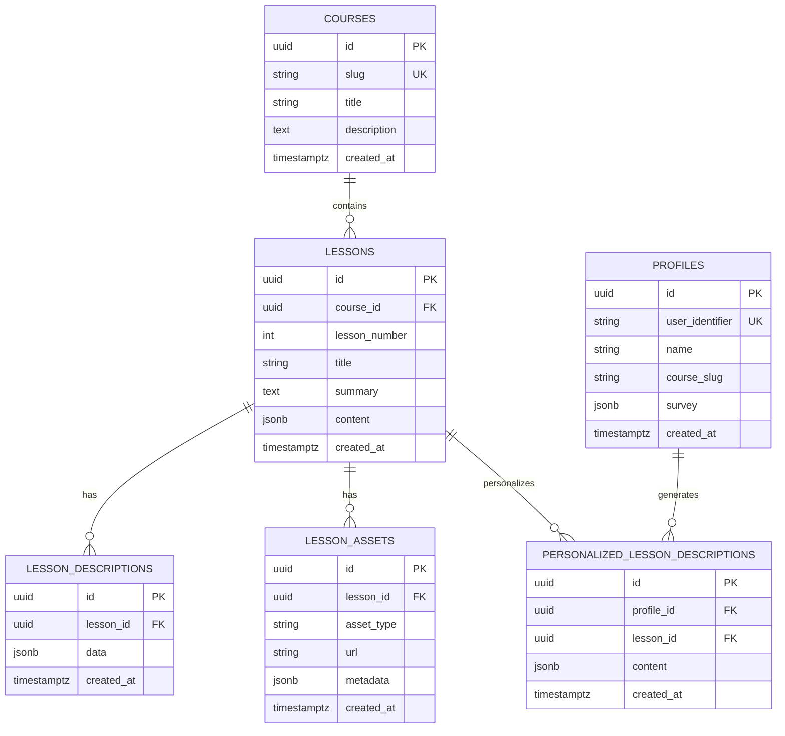
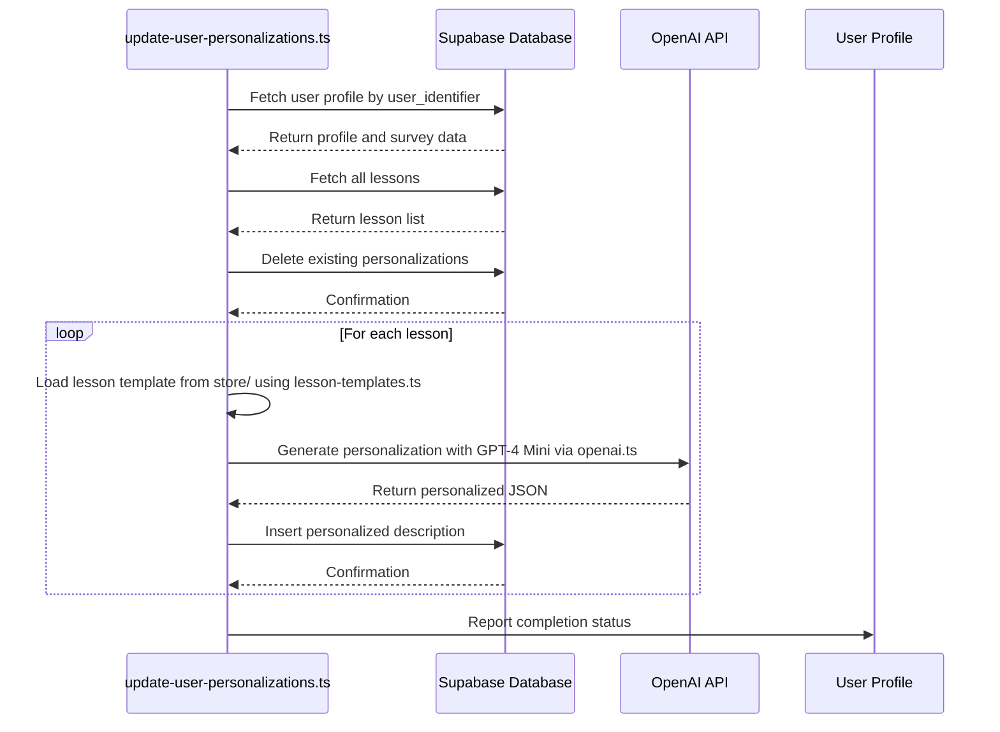
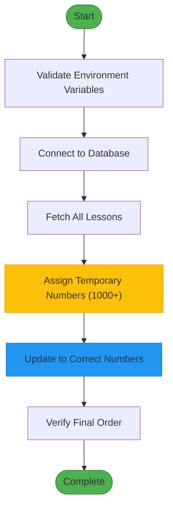

# Data Management Scripts

<cite>
**Referenced Files in This Document**   
- [run-migrations.ts](file://scripts/run-migrations.ts) - *Updated in recent commit*
- [import-lessons.ts](file://scripts/import-lessons.ts)
- [regenerate-lesson-templates.ts](file://scripts/regenerate-lesson-templates.ts) - *Refactored to use centralized services*
- [update-user-personalizations.ts](file://scripts/update-user-personalizations.ts) - *Updated to use centralized services*
- [update-lesson-numbers.ts](file://scripts/update-lesson-numbers.ts)
- [update-lesson-numbers-safe.ts](file://scripts/update-lesson-numbers-safe.ts)
- [update-lesson-numbers-api.ts](file://scripts/update-lesson-numbers-api.ts)
- [fix-remaining-lessons.ts](file://scripts/fix-remaining-lessons.ts)
- [update-user-simple.ts](file://scripts/update-user-simple.ts)
- [update-user-via-api.ts](file://scripts/update-user-via-api.ts)
- [001_init.sql](file://migrations/001_init.sql)
- [lesson-templates.ts](file://lib/services/lesson-templates.ts) - *Added as centralized service*
- [openai.ts](file://lib/services/openai.ts) - *Added as centralized service*
</cite>

## Update Summary
**Changes Made**   
- Updated **Template Regeneration** section to reflect refactored code structure using centralized services
- Updated **User Personalization Update Scripts** section to reflect modularized personalization logic
- Added new **Centralized Services** section to document shared functionality
- Enhanced source tracking with new file references and update annotations
- Removed outdated information about direct OpenAI usage in scripts
- Updated code examples to reflect current implementation

## Table of Contents
1. [Introduction](#introduction)
2. [Database Migrations](#database-migrations)
3. [Lesson Data Import](#lesson-data-import)
4. [Template Regeneration](#template-regeneration)
5. [User Personalization Update Scripts](#user-personalization-update-scripts)
6. [Centralized Services](#centralized-services)
7. [Lesson Number Update Scripts](#lesson-number-update-scripts)
8. [Execution Workflow and Dependencies](#execution-workflow-and-dependencies)
9. [Error Handling and Recovery](#error-handling-and-recovery)
10. [Idempotency and Data Safety](#idempotency-and-data-safety)
11. [Command-Line Usage Examples](#command-line-usage-examples)

## Introduction
This document provides comprehensive documentation for the data management and maintenance scripts in the persona application. These scripts are essential for initializing, updating, and maintaining the application's data layer, including database schema, lesson content, user personalizations, and metadata. The scripts are located in the `scripts/` directory and are designed to be executed in specific sequences during system setup, updates, or maintenance operations.

## Database Migrations

The `run-migrations.ts` script handles database schema migrations using raw SQL files stored in the `migrations/` directory. It connects to the Supabase PostgreSQL database using the `SUPABASE_DB_URL` environment variable and applies SQL migration scripts in alphabetical order.

The script ensures the database schema is up-to-date by executing all `.sql` files in the migrations directory. The primary migration file `001_init.sql` defines the complete database schema, including tables for courses, lessons, profiles, lesson descriptions, personalized lesson descriptions, and lesson assets. The schema uses UUID primary keys, proper foreign key constraints, and triggers to maintain consistent timestamps.



**Section sources**
- [run-migrations.ts](file://scripts/run-migrations.ts#L1-L49)
- [001_init.sql](file://migrations/001_init.sql#L1-L89)

## Lesson Data Import

The `import-lessons.ts` script imports lesson data, course information, and user profiles from JSON files stored in the `store/` directory into the Supabase database. It uses the `NEXT_PUBLIC_SUPABASE_URL` and `SUPABASE_SERVICE_ROLE_KEY` environment variables for database access with elevated privileges.

The script performs three main operations: creating or updating the course record, importing lesson data with associated descriptions and assets, and importing user profiles with their personalized lesson descriptions. It uses upsert operations with conflict resolution to ensure idempotency, allowing the script to be run multiple times without creating duplicate records.

The lesson import process reads lesson data from individual `lesson.json` files in numbered directories within `store/shvz/lessons/`. For each lesson, it creates a record in the `lessons` table and associated records in `lesson_descriptions` and `lesson_assets` tables. User profiles are imported from `user_profiles.json`, and personalized lesson descriptions are imported from user-specific directories in `store/shvz/personalize/`.

**Section sources**
- [import-lessons.ts](file://scripts/import-lessons.ts#L1-L265)

## Template Regeneration

The `regenerate-lesson-templates.ts` script regenerates lesson template files by processing lesson transcripts with OpenAI's GPT-4 model. It requires the `OPENAI_API_KEY` environment variable to access the OpenAI API.

The script follows a four-step process for each lesson: retrieving lesson metadata from `lesson.json` files, reading the corresponding transcript file, generating a new template using GPT-4 with a detailed prompt, and saving the result as a JSON file with a standardized naming convention. The prompt instructs the AI to create structured lesson summaries with specific sections including introduction, key points, practical tips, important notes, preparation requirements, homework, and motivational statements.

To prevent data loss, the script creates backup copies of existing template files before overwriting them. It processes lessons sequentially with a one-second delay between requests to avoid rate limiting. The script uses a predefined mapping between lesson numbers and stable UUIDs to ensure consistent file naming across executions.

**Updated** The script now uses centralized services from `lib/services/` for lesson template ID management and OpenAI operations, improving code maintainability and consistency.

**Section sources**
- [regenerate-lesson-templates.ts](file://scripts/regenerate-lesson-templates.ts#L1-L311)
- [lesson-templates.ts](file://lib/services/lesson-templates.ts#L1-L102) - *Centralized template service*
- [openai.ts](file://lib/services/openai.ts#L1-L139) - *Centralized OpenAI service*

## User Personalization Update Scripts

Several scripts handle the generation and updating of user personalizations, which customize lesson content based on individual user profiles and survey responses.

The `update-user-personalizations.ts` script generates personalized lesson descriptions by combining user survey data with lesson templates using OpenAI's GPT-4 Mini model. It first retrieves the user's profile and survey responses, then fetches all lessons, deletes existing personalizations, and generates new personalized content for each lesson. The personalization process adapts the lesson template to address the user's specific motivation, target clients, desired skills, fears, and expected results.

The `update-user-simple.ts` script provides a simpler alternative that creates basic personalizations without AI processing. It uses template strings with user data to generate personalized content fields. This script is useful when AI services are unavailable or when simpler personalizations are sufficient.

The `update-user-via-api.ts` script delegates personalization generation to an external API endpoint. It makes HTTP POST requests to a Vercel-hosted API that handles the personalization logic. This approach centralizes personalization logic and allows for more complex processing without requiring OpenAI credentials on the client side.

**Updated** The personalization scripts now use centralized services from `lib/services/` for template loading and AI personalization, ensuring consistent behavior across different scripts and improving maintainability.



**Diagram sources**
- [update-user-personalizations.ts](file://scripts/update-user-personalizations.ts#L1-L236)
- [update-user-simple.ts](file://scripts/update-user-simple.ts#L1-L141)
- [update-user-via-api.ts](file://scripts/update-user-via-api.ts#L1-L114)
- [lesson-templates.ts](file://lib/services/lesson-templates.ts#L1-L102)
- [openai.ts](file://lib/services/openai.ts#L1-L139)

**Section sources**
- [update-user-personalizations.ts](file://scripts/update-user-personalizations.ts#L1-L236)
- [update-user-simple.ts](file://scripts/update-user-simple.ts#L1-L141)
- [update-user-via-api.ts](file://scripts/update-user-via-api.ts#L1-L114)
- [lesson-templates.ts](file://lib/services/lesson-templates.ts#L1-L102)
- [openai.ts](file://lib/services/openai.ts#L1-L139)

## Centralized Services

The application now uses centralized services in the `lib/services/` directory to improve code maintainability and ensure consistent behavior across different scripts.

The `lesson-templates.ts` service provides a single source of truth for lesson ID mappings and template loading functionality. It exports functions to retrieve lesson template IDs and load lesson templates from the file system, handling multiple filename patterns and providing fallback templates when files are not found.

The `openai.ts` service implements a singleton pattern for the OpenAI client, ensuring efficient resource usage. It provides a centralized `personalizeLesson` function that handles the core personalization logic with proper error handling and fallback mechanisms. The service uses the `gpt-4o-mini` model for personalization and includes comprehensive error handling to ensure robust operation.

These centralized services are used by multiple scripts including `regenerate-lesson-templates.ts` and `update-user-personalizations.ts`, reducing code duplication and improving maintainability.

**Section sources**
- [lesson-templates.ts](file://lib/services/lesson-templates.ts#L1-L102)
- [openai.ts](file://lib/services/openai.ts#L1-L139)

## Lesson Number Update Scripts

Three scripts handle the updating of lesson numbers to ensure consistency between the database and source files: `update-lesson-numbers.ts`, `update-lesson-numbers-safe.ts`, and `update-lesson-numbers-api.ts`.

The `update-lesson-numbers.ts` script uses a direct PostgreSQL connection to update lesson numbers. It queries the database for all lessons, matches them with corresponding lesson files by title, and updates the `lesson_number` field when discrepancies are found. This approach is efficient but risks constraint violations if the new numbers conflict with existing records.

The `update-lesson-numbers-safe.ts` script uses a safer two-step process with the Supabase client. First, it assigns temporary high-numbered values (starting from 1000) to all lessons to eliminate any uniqueness constraint conflicts. Then, it updates each lesson to its correct number. This approach guarantees that no constraint violations occur during the update process.

The `update-lesson-numbers-api.ts` script is functionally identical to the safe version but represents a separate implementation. Additionally, the `fix-remaining-lessons.ts` script addresses specific known inconsistencies by directly updating lessons with hardcoded title-to-number mappings.



**Diagram sources**
- [update-lesson-numbers-safe.ts](file://scripts/update-lesson-numbers-safe.ts#L1-L118)
- [update-lesson-numbers.ts](file://scripts/update-lesson-numbers.ts#L1-L103)
- [fix-remaining-lessons.ts](file://scripts/fix-remaining-lessons.ts#L1-L74)

**Section sources**
- [update-lesson-numbers.ts](file://scripts/update-lesson-numbers.ts#L1-L103)
- [update-lesson-numbers-safe.ts](file://scripts/update-lesson-numbers-safe.ts#L1-L118)
- [update-lesson-numbers-api.ts](file://scripts/update-lesson-numbers-api.ts#L1-L100)
- [fix-remaining-lessons.ts](file://scripts/fix-remaining-lessons.ts#L1-L74)

## Execution Workflow and Dependencies

The data management scripts have specific dependencies on environment variables and external services. All scripts require proper configuration through environment variables, typically loaded from a `.env` file.

Key dependencies include:
- **Database connectivity**: Most scripts require `NEXT_PUBLIC_SUPABASE_URL` and either `SUPABASE_SERVICE_ROLE_KEY` or `NEXT_PUBLIC_SUPABASE_ANON_KEY`
- **OpenAI API**: Template regeneration and AI-based personalization scripts require `OPENAI_API_KEY`
- **File system access**: Scripts need read/write access to the `store/` and `migrations/` directories
- **Supabase database**: The destination for imported data and updated records

The typical execution sequence during system setup is:
1. Run `run-migrations.ts` to initialize the database schema
2. Execute `import-lessons.ts` to populate the database with course content
3. Use `regenerate-lesson-templates.ts` to refresh lesson templates from transcripts
4. Apply lesson number updates with `update-lesson-numbers-safe.ts` if needed
5. Generate user personalizations with `update-user-personalizations.ts` for specific users

**Section sources**
- [run-migrations.ts](file://scripts/run-migrations.ts#L1-L49)
- [import-lessons.ts](file://scripts/import-lessons.ts#L1-L265)
- [regenerate-lesson-templates.ts](file://scripts/regenerate-lesson-templates.ts#L1-L311)

## Error Handling and Recovery

All data management scripts implement comprehensive error handling to ensure data integrity and provide meaningful feedback during failures.

The scripts use try-catch blocks around critical operations and validate environment variables at startup. When errors occur, they are logged with descriptive messages, and the process exits with a non-zero status code to indicate failure. Database operations include error handling for constraint violations, connection issues, and query failures.

For recovery procedures:
- Database migration failures can be addressed by fixing the SQL script and re-running `run-migrations.ts`
- Lesson import failures may require verifying file paths and database connectivity before retrying
- Template regeneration failures due to OpenAI API issues can be resolved by checking the API key and retrying after a delay
- Personalization update failures might require validating user IDs and survey data

The `update-lesson-numbers-safe.ts` script exemplifies robust error handling by using a two-phase update process that prevents constraint violations, ensuring that the database remains in a consistent state even if the script fails mid-execution.

**Section sources**
- [run-migrations.ts](file://scripts/run-migrations.ts#L1-L49)
- [import-lessons.ts](file://scripts/import-lessons.ts#L1-L265)
- [regenerate-lesson-templates.ts](file://scripts/regenerate-lesson-templates.ts#L1-L311)

## Idempotency and Data Safety

Most scripts are designed to be idempotent, meaning they can be safely executed multiple times without causing unintended side effects or data corruption.

The `import-lessons.ts` script uses upsert operations with `onConflict` parameters to prevent duplicate records. When a course, lesson, or profile already exists, the script updates the existing record rather than creating a new one. This allows the import process to be re-run after updates to source files without duplicating data.

The `regenerate-lesson-templates.ts` script creates backup files before overwriting existing templates, providing a recovery option if the new templates are unsatisfactory. The personalization update scripts delete existing personalizations before creating new ones, ensuring that users don't accumulate outdated or conflicting personalization data.

Scripts that modify lesson numbers use careful sequencing to avoid violating unique constraints. The safe update script temporarily assigns high-numbered values to bypass conflicts, while the direct update script checks for existing numbers before making changes.

**Section sources**
- [import-lessons.ts](file://scripts/import-lessons.ts#L1-L265)
- [regenerate-lesson-templates.ts](file://scripts/regenerate-lesson-templates.ts#L1-L311)
- [update-lesson-numbers-safe.ts](file://scripts/update-lesson-numbers-safe.ts#L1-L118)

## Command-Line Usage Examples

The scripts are executed using Node.js and can accept command-line arguments for customization.

Basic usage examples:
```bash
# Run database migrations
npx ts-node scripts/run-migrations.ts

# Import all lesson data
npx ts-node scripts/import-lessons.ts

# Regenerate all lesson templates
npx ts-node scripts/regenerate-lesson-templates.ts

# Update personalizations for a specific user
npx ts-node scripts/update-user-personalizations.ts 21179358

# Update personalizations for default user (21179358)
npx ts-node scripts/update-user-personalizations.ts

# Safely update lesson numbers
npx ts-node scripts/update-lesson-numbers-safe.ts

# Fix remaining lesson number inconsistencies
npx ts-node scripts/fix-remaining-lessons.ts
```

Environment variables must be set before running the scripts. A typical `.env` file would include:
```
SUPABASE_DB_URL=postgresql://...
NEXT_PUBLIC_SUPABASE_URL=https://...
SUPABASE_SERVICE_ROLE_KEY=...
OPENAI_API_KEY=sk-...
COURSE_STORE_PATH=../store/shvz
```

The scripts provide detailed console output indicating progress, successful operations, and any errors encountered, allowing operators to monitor execution and troubleshoot issues.

**Section sources**
- [run-migrations.ts](file://scripts/run-migrations.ts#L1-L49)
- [import-lessons.ts](file://scripts/import-lessons.ts#L1-L265)
- [regenerate-lesson-templates.ts](file://scripts/regenerate-lesson-templates.ts#L1-L311)
- [update-user-personalizations.ts](file://scripts/update-user-personalizations.ts#L1-L236)
- [update-lesson-numbers-safe.ts](file://scripts/update-lesson-numbers-safe.ts#L1-L118)