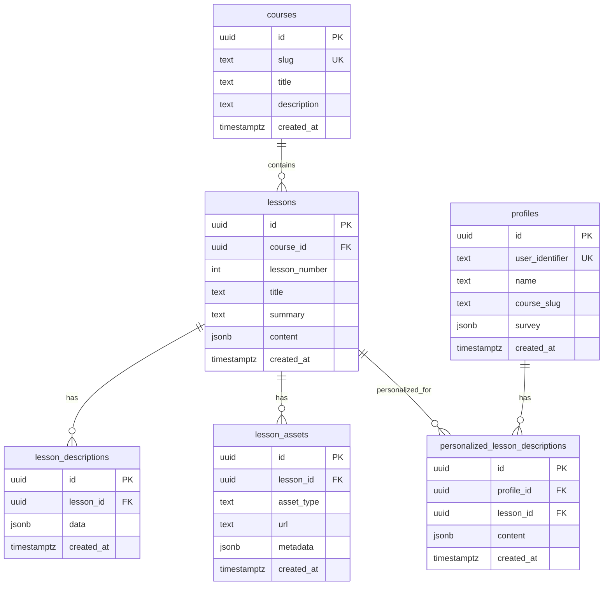
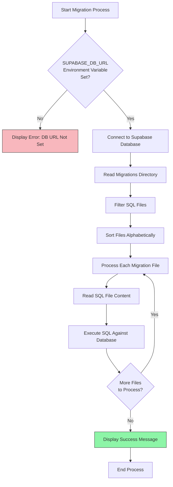
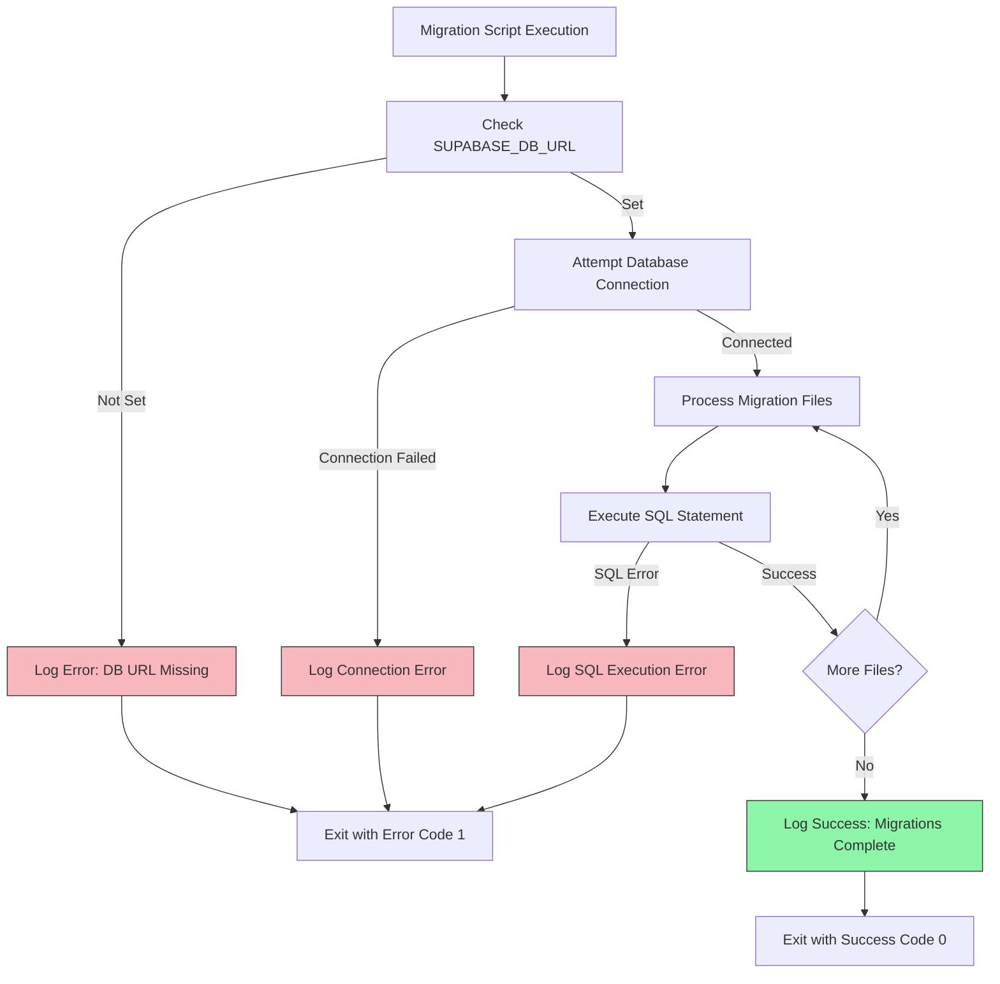

# Database Migrations

<cite>
**Referenced Files in This Document**   
- [001_init.sql](file://migrations/001_init.sql)
- [run-migrations.ts](file://scripts/run-migrations.ts)
- [server.ts](file://lib/supabase/server.ts)
</cite>

## Table of Contents
1. [Introduction](#introduction)
2. [Migration System Overview](#migration-system-overview)
3. [Schema Structure](#schema-structure)
4. [Migration Execution Process](#migration-execution-process)
5. [Environment Configuration](#environment-configuration)
6. [Error Handling and Troubleshooting](#error-handling-and-troubleshooting)
7. [Best Practices](#best-practices)

## Introduction
The persona application utilizes a Supabase-based PostgreSQL database with a structured migration system to manage schema changes. This document details the database migration framework, focusing on the initialization process, schema structure, and execution workflow. The system ensures consistent database state across development, testing, and production environments through version-controlled SQL scripts and automated application.

## Migration System Overview
The database migration system in the persona application is built around a directory-based approach using the `migrations/` folder to store versioned SQL schema definitions. The core of this system is the `run-migrations.ts` script, which connects to the Supabase PostgreSQL database and applies schema changes in a controlled, sequential manner.

The migration process follows a simple but effective pattern: SQL files in the migrations directory are executed in alphabetical order, ensuring that schema changes are applied in the correct sequence. This approach provides a clear audit trail of database evolution and enables reproducible database states across different environments.

**Section sources**
- [run-migrations.ts](file://scripts/run-migrations.ts#L1-L48)
- [001_init.sql](file://migrations/001_init.sql#L1-L88)

## Schema Structure
The initial database schema is defined in the `001_init.sql` file, which establishes the foundational tables and relationships for the application. The schema includes several key entities that support the persona application's functionality.

The core tables include:
- `courses`: Stores course metadata with unique slugs
- `lessons`: Contains lesson content associated with courses
- `lesson_descriptions`: Holds descriptive data for lessons
- `profiles`: Manages user profiles with survey data
- `personalized_lesson_descriptions`: Stores personalized content for users
- `lesson_assets`: Manages multimedia assets for lessons

Each table includes standardized timestamp management through the `set_timestamps()` trigger function, which automatically maintains creation timestamps. The schema also establishes referential integrity through foreign key constraints with appropriate cascade behaviors.

**Diagram sources**
- [001_init.sql](file://migrations/001_init.sql#L1-L88)

**Section sources**
- [001_init.sql](file://migrations/001_init.sql#L1-L88)

## Migration Execution Process
The migration execution process is orchestrated by the `run-migrations.ts` script, which follows a structured workflow to apply schema changes. The process begins with establishing a database connection using the Supabase connection string, then proceeds to read and execute all SQL files in the migrations directory in alphabetical order.

The script's main function initializes a PostgreSQL client connection and processes each migration file sequentially. For each file, the script reads the SQL content and executes it against the database. The execution order is determined by sorting the filenames alphabetically, ensuring that migration `001_init.sql` runs before any subsequent migrations.

**Diagram sources**
- [run-migrations.ts](file://scripts/run-migrations.ts#L20-L39)

**Section sources**
- [run-migrations.ts](file://scripts/run-migrations.ts#L1-L48)

## Environment Configuration
Proper environment configuration is critical for the migration system to function correctly. The primary environment variable required is `SUPABASE_DB_URL`, which contains the connection string for the PostgreSQL database. This variable must be set before executing the migration script.

The connection string can be obtained from the Supabase dashboard under Project Settings → Database → Connection string. Without this variable, the migration script will terminate with an error message indicating that the database URL is not set.

While not directly used in the migration script, other Supabase-related environment variables such as `SUPABASE_SERVICE_ROLE_KEY` and `NEXT_PUBLIC_SUPABASE_URL` are used in other parts of the application for authentication and client connections. These variables work in conjunction with the database URL to provide complete Supabase integration.

**Section sources**
- [run-migrations.ts](file://scripts/run-migrations.ts#L5-L8)
- [server.ts](file://lib/supabase/server.ts#L1-L27)

## Error Handling and Troubleshooting
The migration system includes comprehensive error handling to manage common failure scenarios. When the `SUPABASE_DB_URL` environment variable is not set, the script provides a clear error message with instructions on where to obtain the connection string from the Supabase dashboard.

For database connection issues, the script uses a try-finally block to ensure that the database connection is properly closed even if an error occurs during migration execution. Any errors during the migration process are caught and logged with descriptive messages, and the process exits with a non-zero status code to indicate failure.

Common troubleshooting scenarios include:
- **Connection timeouts**: Verify the Supabase project is active and the connection string is correct
- **SQL syntax errors**: Validate SQL syntax in migration files, particularly when adding new constraints or modifying existing schema
- **Permission issues**: Ensure the database user has appropriate privileges to create tables and modify schema
- **Duplicate migrations**: Avoid re-executing migrations by maintaining proper versioning in filename prefixes

The error handling approach follows a fail-fast principle, terminating the process immediately when critical errors are encountered to prevent partial schema updates that could lead to inconsistent database states.

**Diagram sources**
- [run-migrations.ts](file://scripts/run-migrations.ts#L8-L10)
- [run-migrations.ts](file://scripts/run-migrations.ts#L44-L48)

**Section sources**
- [run-migrations.ts](file://scripts/run-migrations.ts#L1-L48)

## Best Practices
To maintain a reliable and scalable database migration system, several best practices should be followed:

1. **Idempotent migrations**: Design migration scripts to be idempotent by using `IF NOT EXISTS` clauses for table and constraint creation, allowing safe re-execution without errors.

2. **Version-controlled schema changes**: Store all migration files in version control alongside application code to maintain a complete history of database evolution.

3. **Sequential numbering**: Use sequential numbering in migration filenames (e.g., `001_`, `002_`) to ensure proper execution order and avoid conflicts.

4. **Atomic changes**: Each migration file should represent a single logical change to the schema, making it easier to understand, review, and potentially roll back if necessary.

5. **Comprehensive testing**: Test migrations against a copy of the production schema to identify potential issues before deployment.

6. **Backup before major changes**: Always create a database backup before applying significant schema changes, especially in production environments.

7. **Documentation in comments**: Include descriptive comments in migration files explaining the purpose of schema changes for future reference.

Following these practices ensures that the database schema evolves in a controlled, predictable manner that supports the application's development lifecycle.

**Section sources**
- [001_init.sql](file://migrations/001_init.sql#L1-L88)
- [run-migrations.ts](file://scripts/run-migrations.ts#L1-L48)