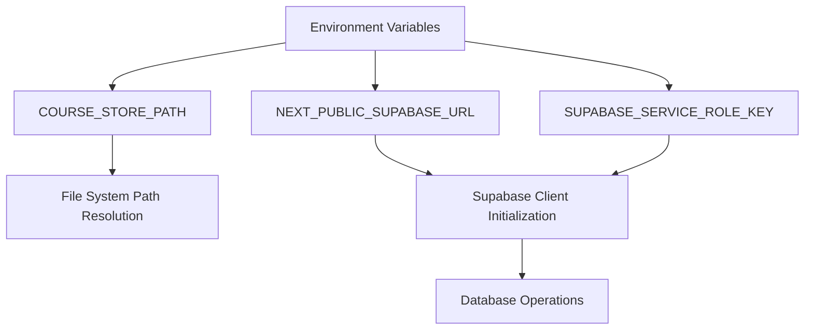
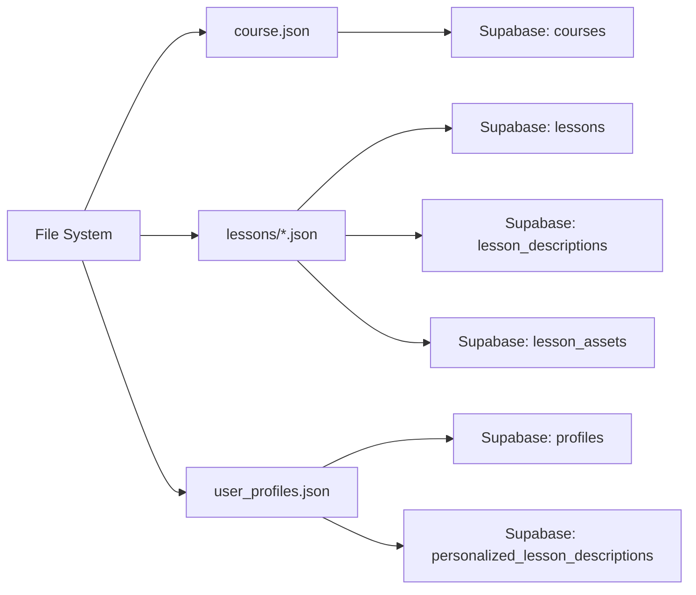
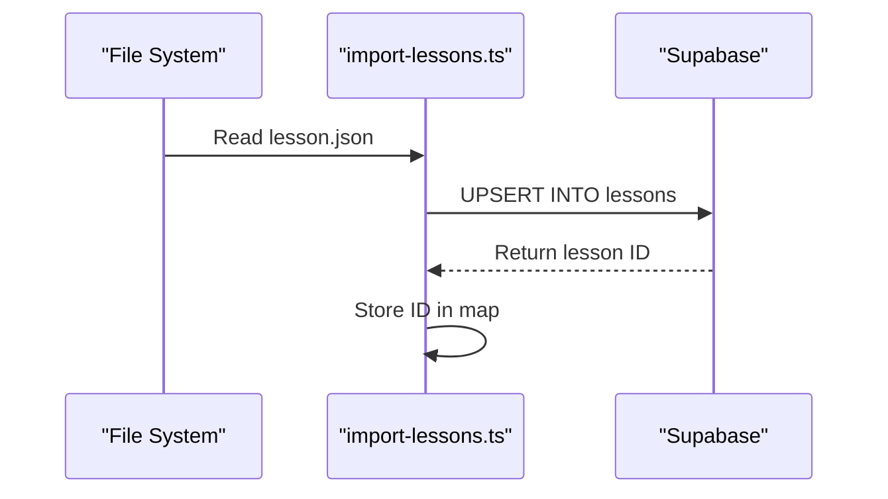
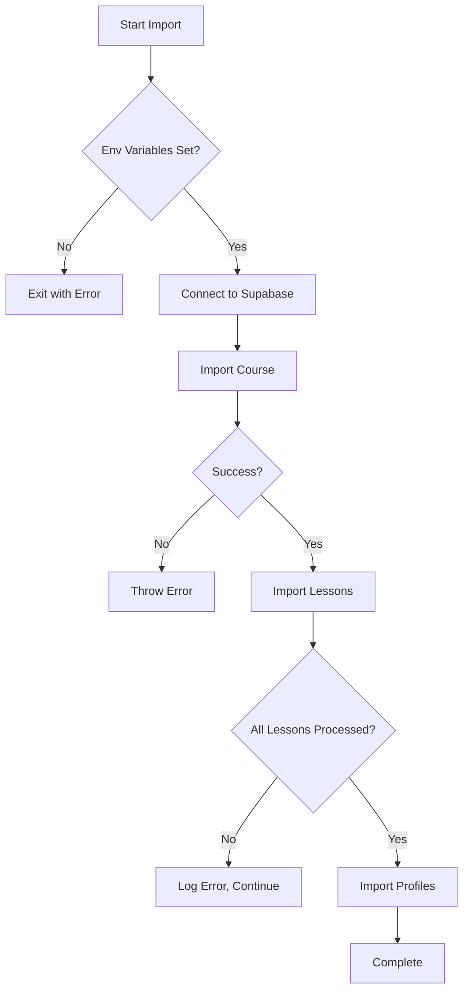

# Lesson Import

<cite>
**Referenced Files in This Document**   
- [import-lessons.ts](file://scripts/import-lessons.ts)
- [course.json](file://store/shvz/course.json)
- [lesson.json](file://store/shvz/lessons/01/lesson.json)
- [user_profiles.json](file://store/user_profiles.json)
- [client.ts](file://lib/supabase/client.ts)
- [server.ts](file://lib/supabase/server.ts)
</cite>

## Table of Contents
1. [Introduction](#introduction)
2. [Configuration Requirements](#configuration-requirements)
3. [Data Flow Overview](#data-flow-overview)
4. [Course Creation Process](#course-creation-process)
5. [Lesson Import and Upsertion](#lesson-import-and-upsertion)
6. [Description and Asset Handling](#description-and-asset-handling)
7. [Profile and Personalization Import](#profile-and-personalization-import)
8. [Error Handling and Validation](#error-handling-and-validation)
9. [Execution Workflow](#execution-workflow)
10. [Conclusion](#conclusion)

## Introduction
The `import-lessons.ts` script is responsible for seeding lesson data from the file system into the Supabase database. It orchestrates the import of course metadata, lesson content, descriptions, assets, and user profiles to initialize the application's data layer. This document details how the script processes JSON files located in `store/shvz/lessons/` and related directories, transforming them into structured database records across multiple tables including `lessons`, `lesson_descriptions`, and `lesson_assets`. The script plays a critical role in the initial data population workflow, enabling consistent and automated database seeding.

**Section sources**
- [import-lessons.ts](file://scripts/import-lessons.ts#L1-L264)

## Configuration Requirements
The script requires specific environment variables and file structure to function correctly. The primary configuration includes:

- `COURSE_STORE_PATH`: File system path to the course data directory (defaults to `../store/Массаж ШВЗ`)
- `NEXT_PUBLIC_SUPABASE_URL`: Public URL of the Supabase project
- `SUPABASE_SERVICE_ROLE_KEY`: Service role key for administrative database access

These variables must be defined in the environment; otherwise, the script terminates with an error. The Supabase client is initialized using these credentials to perform upsert operations with full privileges.

**Diagram sources**
- [import-lessons.ts](file://scripts/import-lessons.ts#L15-L25)

## Data Flow Overview
The data flow begins with JSON files in the file system and ends with structured records in the Supabase database. The process follows a sequential pipeline:

1. Read course metadata from `course.json`
2. Ensure the course exists or create it in the `courses` table
3. Iterate through lesson directories and import each lesson
4. Store lesson descriptions in `lesson_descriptions`
5. Link associated assets in `lesson_assets`
6. Import user profiles and personalized lesson data

This flow ensures that all educational content is consistently loaded and related entities are properly connected via foreign keys.

**Diagram sources**
- [import-lessons.ts](file://scripts/import-lessons.ts#L150-L264)

## Course Creation Process
The script begins by reading `course.json` from the course store path. This file contains metadata such as course name, description, and lesson list. Using this data, the script upserts a record into the `courses` table with a fixed slug `massazh-shvz`. The upsert operation prevents duplication by using the slug as a conflict target. If the operation fails, an error is thrown, halting execution.

**Section sources**
- [import-lessons.ts](file://scripts/import-lessons.ts#L79-L92)
- [course.json](file://store/shvz/course.json#L1-L10)

## Lesson Import and Upsertion
Lessons are stored in numbered directories under `store/shvz/lessons/`, each containing a `lesson.json` file. The script reads these files and upserts records into the `lessons` table, using `course_id` and `lesson_number` as the conflict key. The lesson title and summary are extracted from the JSON, with fallback defaults if fields are missing. Each successfully inserted lesson returns an ID, which is stored in a map for later use in related operations.

**Diagram sources**
- [import-lessons.ts](file://scripts/import-lessons.ts#L94-L130)

## Description and Asset Handling
For each lesson, the script processes two types of additional data: descriptions and assets. The `description` field from `lesson.json` is stored as JSONB in the `lesson_descriptions` table, linked by `lesson_id`. If a description exists, it is upserted with conflict resolution on the `lesson_id` key.

Assets are defined in the `files` array of each lesson JSON. Each asset is inserted into the `lesson_assets` table with metadata including type, URL, and filename. Duplicate asset entries are ignored based on the unique constraint of the table.

**Section sources**
- [import-lessons.ts](file://scripts/import-lessons.ts#L118-L129)
- [lesson.json](file://store/shvz/lessons/01/lesson.json#L1-L8)

## Profile and Personalization Import
The script imports user profiles from `store/user_profiles.json`, upserting them into the `profiles` table with `user_identifier` as the conflict key. For each profile, it checks for personalized lesson data in `store/shvz/personalize/{userId}/`. If found, JSON files matching lesson numbers are read and inserted into `personalized_lesson_descriptions`, linking the profile and lesson via foreign keys. Missing personalize directories are handled gracefully without stopping the import.

**Section sources**
- [import-lessons.ts](file://scripts/import-lessons.ts#L132-L184)
- [user_profiles.json](file://store/user_profiles.json#L1-L270)

## Error Handling and Validation
The script implements robust error handling at multiple levels. Critical failures (e.g., missing environment variables, database connection issues) cause immediate termination. Less critical issues, such as missing personalize directories, are logged as warnings but do not stop execution. All database operations are wrapped in try-catch blocks, with detailed error messages indicating the failed operation and affected lesson or profile.

**Diagram sources**
- [import-lessons.ts](file://scripts/import-lessons.ts#L20-L30)

## Execution Workflow
The `main()` function orchestrates the entire import process in sequence: course creation, lesson import, and profile processing. The workflow is linear and synchronous to ensure data consistency. Upon completion, success messages are logged to the console. If any unhandled error occurs, it is caught at the top level, logged with full details, and the process exits with a failure code.

**Section sources**
- [import-lessons.ts](file://scripts/import-lessons.ts#L186-L264)

## Conclusion
The `import-lessons.ts` script provides a reliable mechanism for seeding educational content into the Supabase database. By leveraging file system data and structured JSON formats, it enables repeatable and consistent data population for the course management system. Its design emphasizes error resilience, data integrity, and clear logging, making it suitable for both development and production initialization workflows.