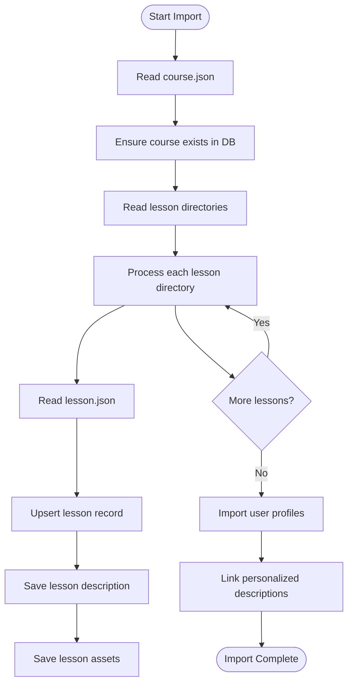
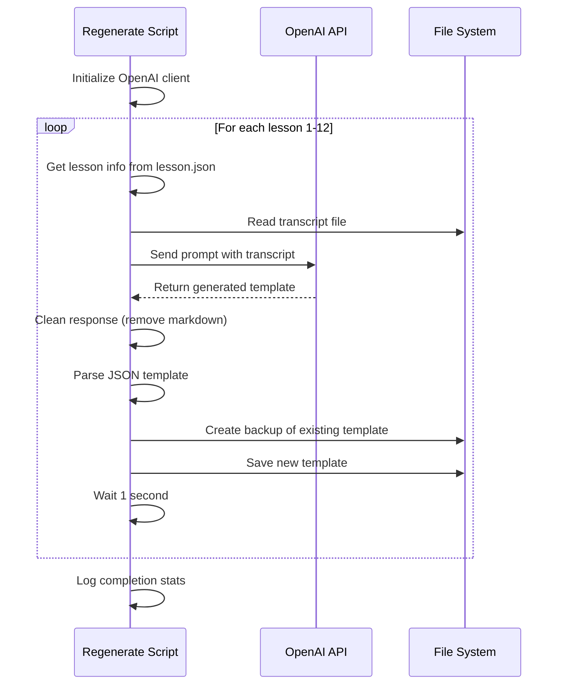
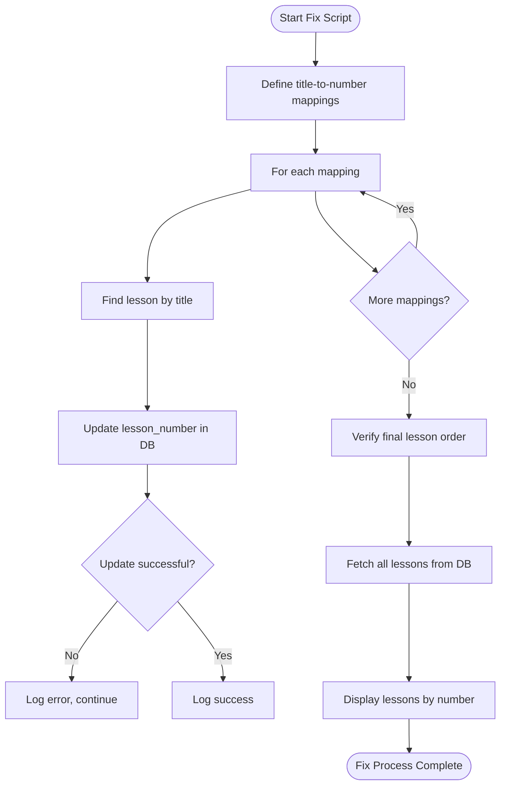
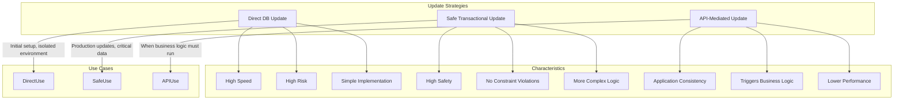

# Lesson Management Scripts

<cite>
**Referenced Files in This Document**   
- [import-lessons.ts](file://scripts/import-lessons.ts)
- [regenerate-lesson-templates.ts](file://scripts/regenerate-lesson-templates.ts)
- [fix-remaining-lessons.ts](file://scripts/fix-remaining-lessons.ts)
- [update-lesson-numbers.ts](file://scripts/update-lesson-numbers.ts)
- [update-lesson-numbers-safe.ts](file://scripts/update-lesson-numbers-safe.ts)
- [update-lesson-numbers-api.ts](file://scripts/update-lesson-numbers-api.ts)
- [lesson.json](file://store/shvz/lessons/01/lesson.json)
- [client.ts](file://lib/supabase/client.ts)
- [openai.ts](file://lib/openai.ts)
</cite>

## Table of Contents
1. [Introduction](#introduction)
2. [Core Scripts Overview](#core-scripts-overview)
3. [Data Import and Seeding](#data-import-and-seeding)
4. [AI-Driven Template Regeneration](#ai-driven-template-regeneration)
5. [Post-Processing and Fix Scripts](#post-processing-and-fix-scripts)
6. [Lesson Number Update Strategies](#lesson-number-update-strategies)
7. [Input Sources and Configuration](#input-sources-and-configuration)
8. [Execution Order and Dependencies](#execution-order-and-dependencies)
9. [Error Recovery and Logging](#error-recovery-and-logging)
10. [Performance Considerations](#performance-considerations)

## Introduction
This document provides comprehensive documentation for the lesson lifecycle management scripts used in the course content pipeline. These scripts handle critical operations including initial data seeding, AI-powered template regeneration, post-import corrections, and lesson numbering updates. The system is designed to manage lesson data for a massage therapy course, with workflows that integrate Supabase as the primary database and OpenAI for AI-generated content. The scripts are structured to support both automated processing and manual intervention when needed, ensuring data consistency and integrity throughout the lesson management lifecycle.

## Core Scripts Overview
The lesson management system consists of several specialized scripts that handle different stages of the lesson lifecycle. These scripts are designed to work together in a specific sequence to ensure proper data initialization, transformation, and maintenance. The core functionality is divided into three main categories: data import operations, AI-driven content generation, and data correction/maintenance tasks. Each script is designed to be idempotent where possible, allowing for safe re-execution in case of partial failures. The system uses Supabase as the primary data store and leverages OpenAI's API for intelligent content generation, with all operations logging detailed progress and error information to facilitate monitoring and debugging.

**Section sources**
- [import-lessons.ts](file://scripts/import-lessons.ts)
- [regenerate-lesson-templates.ts](file://scripts/regenerate-lesson-templates.ts)
- [fix-remaining-lessons.ts](file://scripts/fix-remaining-lessons.ts)

## Data Import and Seeding
The `import-lessons.ts` script handles the initial seeding of lesson data into Supabase from local JSON files. It processes lesson directories in the `store/shvz/lessons/` folder, extracting lesson metadata, descriptions, and associated assets. The script first ensures the course record exists in the database, then imports each lesson with its number, title, and description. For each lesson, it creates corresponding entries in the `lessons`, `lesson_descriptions`, and `lesson_assets` tables, using upsert operations to prevent duplication. The import process maintains a mapping of lesson numbers to database IDs, which is used later for profile personalization. The script also imports user profiles and their personalized lesson descriptions, establishing the complete initial dataset for the course.

**Diagram sources**
- [import-lessons.ts](file://scripts/import-lessons.ts#L67-L174)

**Section sources**
- [import-lessons.ts](file://scripts/import-lessons.ts#L67-L264)
- [lesson.json](file://store/shvz/lessons/01/lesson.json)

## AI-Driven Template Regeneration
The `regenerate-lesson-templates.ts` script uses OpenAI to regenerate lesson templates based on transcribed lesson content. It processes lessons 1-12 sequentially, reading each lesson's information and transcript before generating a new structured template. The script uses a detailed prompt that instructs the AI to create concise, fact-based lesson summaries with specific sections including introduction, key points, practical advice, and homework. The generated templates follow a strict JSON format with predefined fields. After generation, the script saves the new template to the appropriate file in the store directory, creating a backup of the previous version. The process includes rate limiting with 1-second pauses between requests to avoid overwhelming the OpenAI API. This script is typically run when the prompt template changes or when improved transcriptions are available.

**Diagram sources**
- [regenerate-lesson-templates.ts](file://scripts/regenerate-lesson-templates.ts#L245-L306)
- [openai.ts](file://lib/openai.ts)

**Section sources**
- [regenerate-lesson-templates.ts](file://scripts/regenerate-lesson-templates.ts#L5-L310)
- [lib/openai.ts](file://lib/openai.ts)

## Post-Processing and Fix Scripts
The `fix-remaining-lessons.ts` script addresses data inconsistencies that may remain after initial import operations. It specifically targets lessons with incorrect numbering due to title mismatches or import sequencing issues. The script applies a predefined mapping of lesson titles to correct numbers, updating the database records accordingly. It includes comprehensive logging to track which lessons are updated and provides a final verification step that displays all lessons in number order. The script is designed to handle partial failures gracefully, continuing with other updates even if one update operation fails. This script serves as a targeted correction mechanism for known data quality issues, rather than a general-purpose data repair tool.

**Diagram sources**
- [fix-remaining-lessons.ts](file://scripts/fix-remaining-lessons.ts#L22-L69)

**Section sources**
- [fix-remaining-lessons.ts](file://scripts/fix-remaining-lessons.ts#L1-L73)

## Lesson Number Update Strategies
The system provides three variants of lesson number update scripts, each with different safety guarantees and use cases:

### Direct Database Update (update-lesson-numbers.ts)
This script uses a direct PostgreSQL client to update lesson numbers. It connects directly to the database using a connection string and executes raw SQL UPDATE statements. This approach is fast but carries the highest risk of constraint violations if multiple lessons are assigned the same number during the update process. It should only be used when the database is guaranteed to be in a consistent state and no other processes are modifying lesson data.

### Safe Transactional Update (update-lesson-numbers-safe.ts)
This script implements a two-phase update process to prevent constraint violations. First, it assigns temporary numbers (1000+) to all lessons, creating a "safe zone" that avoids conflicts with existing numbers. Then, it updates each lesson to its final number. This approach ensures that no two lessons ever have the same number during the update process, making it safe for production environments. The script uses Supabase's client library for database operations.

### API-Mediated Update (update-lesson-numbers-api.ts)
This script uses the application's public API (via Supabase client) to update lesson numbers. It operates at a higher level of abstraction than the direct database approach, potentially triggering additional business logic, validation, or side effects defined in the application. This method is the safest in terms of maintaining application consistency but may be slower due to additional processing layers.

**Diagram sources**
- [update-lesson-numbers.ts](file://scripts/update-lesson-numbers.ts#L28-L98)
- [update-lesson-numbers-safe.ts](file://scripts/update-lesson-numbers-safe.ts#L24-L113)
- [update-lesson-numbers-api.ts](file://scripts/update-lesson-numbers-api.ts#L24-L95)

**Section sources**
- [update-lesson-numbers.ts](file://scripts/update-lesson-numbers.ts#L1-L102)
- [update-lesson-numbers-safe.ts](file://scripts/update-lesson-numbers-safe.ts#L1-L117)
- [update-lesson-numbers-api.ts](file://scripts/update-lesson-numbers-api.ts#L1-L99)

## Input Sources and Configuration
The lesson management scripts rely on several input sources and configuration parameters. The primary data source is the `store/shvz/lessons/` directory, which contains subdirectories for each lesson (01-12), each with a `lesson.json` file containing lesson metadata. Additional input sources include transcript files in the main `store/shvz/` directory (named with lesson number prefixes) and user profile data in `user_profiles.json`. The scripts require several environment variables: `NEXT_PUBLIC_SUPABASE_URL` and `SUPABASE_SERVICE_ROLE_KEY` for database access, `OPENAI_API_KEY` for AI operations, and `SUPABASE_DB_URL` for direct database connections. The `COURSE_STORE_PATH` variable can override the default store location. All scripts are designed to fail fast if required configuration is missing, providing clear error messages to aid troubleshooting.

**Section sources**
- [import-lessons.ts](file://scripts/import-lessons.ts#L1-L264)
- [regenerate-lesson-templates.ts](file://scripts/regenerate-lesson-templates.ts#L1-L310)
- [store/shvz/lessons/](file://store/shvz/lessons/)

## Execution Order and Dependencies
The lesson management scripts must be executed in a specific order to ensure data consistency and proper system operation. The recommended execution sequence is: (1) `import-lessons.ts` to seed initial data, (2) `regenerate-lesson-templates.ts` to update AI-generated content, (3) `update-lesson-numbers-safe.ts` to correct lesson numbering, and (4) `fix-remaining-lessons.ts` for final corrections. The `import-lessons.ts` script must run before any scripts that depend on database content. The template regeneration script should be run after any changes to the prompt or transcript files. The numbering update scripts should be executed after the initial import but before the fix script. The safe and API-mediated update variants can be used interchangeably depending on the environment, with the safe version preferred for production. Scripts that modify database content should not be run concurrently to avoid race conditions.

**Section sources**
- [import-lessons.ts](file://scripts/import-lessons.ts)
- [regenerate-lesson-templates.ts](file://scripts/regenerate-lesson-templates.ts)
- [fix-remaining-lessons.ts](file://scripts/fix-remaining-lessons.ts)
- [update-lesson-numbers.ts](file://scripts/update-lesson-numbers.ts)

## Error Recovery and Logging
All lesson management scripts implement comprehensive error handling and logging mechanisms. Each script uses console output with emoji indicators to distinguish between different message types: 🔄 for process start, 📚 for information, 📝 for updates, ✅ for successes, ❌ for errors, and 🎉 for completion. Critical errors cause the script to exit with a non-zero status code. The scripts handle various error conditions including missing configuration, file system errors, database connection issues, and API failures. The `import-lessons.ts` script throws exceptions on database errors, while the `regenerate-lesson-templates.ts` script continues processing other lessons if one fails. The numbering update scripts include transaction safety measures to prevent partial updates from leaving the database in an inconsistent state. The fix script logs both successes and failures but continues processing all mappings even if some fail.

**Section sources**
- [import-lessons.ts](file://scripts/import-lessons.ts#L67-L264)
- [regenerate-lesson-templates.ts](file://scripts/regenerate-lesson-templates.ts#L245-L306)
- [fix-remaining-lessons.ts](file://scripts/fix-remaining-lessons.ts#L22-L69)

## Performance Considerations
When processing large lesson sets, several performance considerations should be taken into account. The `import-lessons.ts` script processes lessons sequentially, which ensures data consistency but limits throughput. For large datasets, consider batching database operations or using bulk insert methods. The `regenerate-lesson-templates.ts` script includes a 1-second delay between OpenAI requests to avoid rate limiting, making it the slowest operation in the pipeline. When regenerating all templates, expect approximately 12-15 seconds of processing time. The numbering update scripts read all lessons into memory before processing, which is efficient for small datasets but could become problematic with thousands of lessons. The safe update variant requires two passes through the data, doubling the database operation count compared to the direct update. For optimal performance, run these scripts during off-peak hours and ensure adequate database connection limits and API rate limits are configured.

**Section sources**
- [regenerate-lesson-templates.ts](file://scripts/regenerate-lesson-templates.ts#L245-L306)
- [update-lesson-numbers.ts](file://scripts/update-lesson-numbers.ts#L28-L98)
- [update-lesson-numbers-safe.ts](file://scripts/update-lesson-numbers-safe.ts#L24-L113)