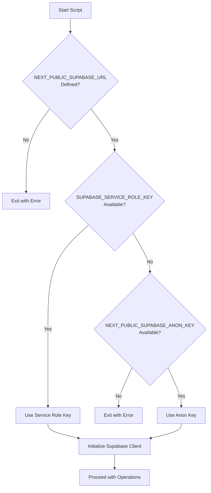
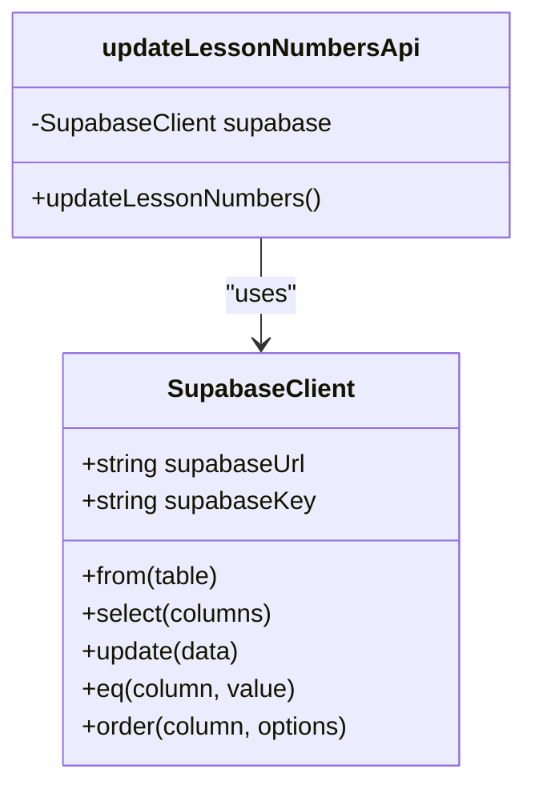
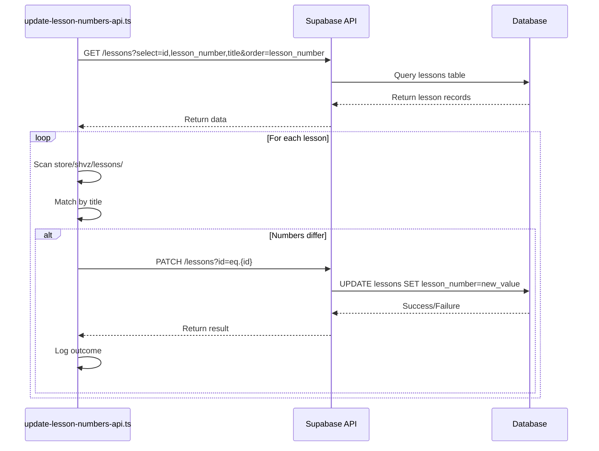

# API-Mediated Update

<cite>
**Referenced Files in This Document**   
- [update-lesson-numbers-api.ts](file://scripts/update-lesson-numbers-api.ts)
- [client.ts](file://lib/supabase/client.ts)
- [server.ts](file://lib/supabase/server.ts)
</cite>

## Table of Contents
1. [Introduction](#introduction)
2. [Environment Configuration](#environment-configuration)
3. [Supabase Client Initialization](#supabase-client-initialization)
4. [Lesson Number Update Workflow](#lesson-number-update-workflow)
5. [API vs Direct Database Access](#api-vs-direct-database-access)
6. [Error Handling and Debugging](#error-handling-and-debugging)
7. [Conclusion](#conclusion)

## Introduction

The `update-lesson-numbers-api.ts` script implements an API-mediated approach to update lesson numbering in the database, leveraging the Supabase client to interact with data through the same interface used by the application's frontend. This methodology ensures consistency with application-level business logic and security rules, as all operations pass through the same authentication and authorization layers that protect user-facing functionality. Unlike direct database access methods, this script operates within the application's security context, making it suitable for environments where direct PostgreSQL access is restricted or prohibited.

**Section sources**
- [update-lesson-numbers-api.ts](file://scripts/update-lesson-numbers-api.ts#L1-L100)

## Environment Configuration

The script relies on critical environment variables to establish a secure connection to the Supabase backend. It requires `NEXT_PUBLIC_SUPABASE_URL` to identify the project endpoint, which is mandatory for initialization. For authentication, the script implements a fallback strategy: it prioritizes the `SUPABASE_SERVICE_ROLE_KEY` for elevated privileges but gracefully falls back to the `NEXT_PUBLIC_SUPABASE_ANON_KEY` when the service role key is unavailable. This dual-key approach provides operational flexibility while maintaining security boundaries, allowing the script to function in both development and production environments with appropriate permission levels.

**Diagram sources**
- [update-lesson-numbers-api.ts](file://scripts/update-lesson-numbers-api.ts#L6-L20)

## Supabase Client Initialization

The script initializes the Supabase client using `@supabase/supabase-js`, the same library used throughout the application for database interactions. This ensures that all API calls follow identical patterns and security protocols as the frontend and backend services. The initialization process mirrors the pattern found in `lib/supabase/server.ts`, where environment variables are validated and a client instance is created with the appropriate authentication key. By using the official Supabase client, the script inherits built-in features such as automatic retry logic, connection pooling, and consistent error handling, which are essential for reliable batch operations.

**Diagram sources**
- [update-lesson-numbers-api.ts](file://scripts/update-lesson-numbers-api.ts#L21-L23)
- [server.ts](file://lib/supabase/server.ts#L1-L27)

## Lesson Number Update Workflow

The update process follows a systematic workflow to synchronize lesson numbers between the file system templates and the database records. First, the script retrieves all lessons from the database ordered by their current lesson number. Then, for each lesson, it scans the `store/shvz/lessons` directory to locate the corresponding template file by matching lesson titles. When a match is found, the script compares the template's number with the database value and initiates an update if they differ. The update operation uses Supabase's `.from().update()` API with an `.eq()` filter to target specific records, ensuring atomic updates with proper error handling for each operation.

**Diagram sources**
- [update-lesson-numbers-api.ts](file://scripts/update-lesson-numbers-api.ts#L24-L95)

## API vs Direct Database Access

The API-mediated approach in `update-lesson-numbers-api.ts` contrasts with direct PostgreSQL client methods used in scripts like `update-lesson-numbers.ts`. While both achieve similar outcomes, the API approach offers significant advantages in secure environments. By routing updates through the Supabase API, the script automatically enforces row-level security policies, triggers any associated database functions, and maintains consistent audit trails. This is particularly valuable when direct database access is restricted by infrastructure policies or when operating in multi-tenant environments where isolation is critical. However, this approach may introduce slightly higher latency due to HTTP overhead and is subject to API rate limits, requiring careful consideration for large-scale batch operations.

**Section sources**
- [update-lesson-numbers-api.ts](file://scripts/update-lesson-numbers-api.ts#L24-L95)
- [update-lesson-numbers.ts](file://scripts/update-lesson-numbers.ts#L28-L98)

## Error Handling and Debugging

The script implements comprehensive error handling to ensure reliability during batch updates. Each database operation is wrapped in try-catch blocks, with specific error handling for fetch and update operations. The script provides detailed console output for success, warnings, and failures, including the specific lesson title and error message when updates fail. For debugging API response errors, developers should verify that environment variables are correctly set and that the Supabase project is accessible. Network interruptions or rate limits can be mitigated by implementing retry logic with exponential backoff, though this is not currently included in the script. Monitoring the console output provides immediate feedback on the update progress and any issues encountered.

**Section sources**
- [update-lesson-numbers-api.ts](file://scripts/update-lesson-numbers-api.ts#L30-L95)

## Conclusion

The `update-lesson-numbers-api.ts` script exemplifies a secure, maintainable approach to database maintenance by leveraging the application's existing API layer. This strategy ensures consistency with business logic and security rules while operating within the same constraints as user-facing functionality. The fallback authentication mechanism, clear error reporting, and systematic update workflow make it a robust solution for environments where direct database access is unavailable. For production use, consider enhancing the script with retry logic, rate limit handling, and more sophisticated logging to improve reliability during large-scale operations.