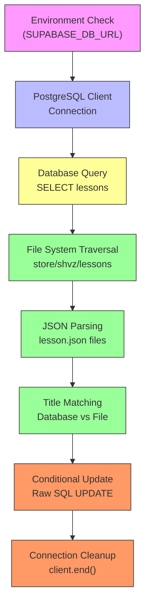
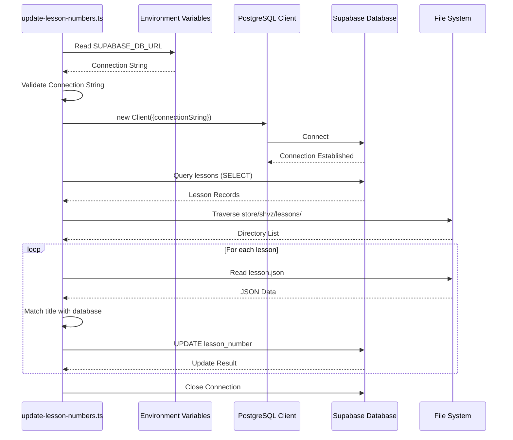
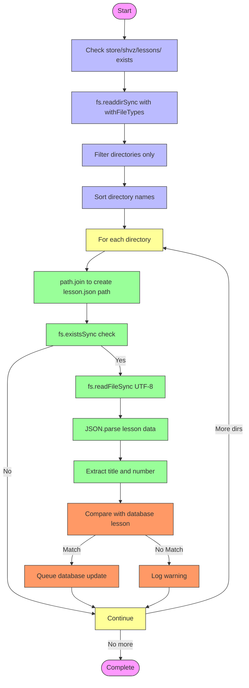
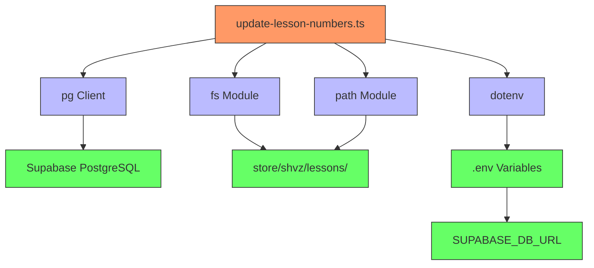

# Direct Lesson Update

<cite>
**Referenced Files in This Document**   
- [update-lesson-numbers.ts](file://scripts/update-lesson-numbers.ts)
- [lesson.json](file://store/shvz/lessons/01/lesson.json)
- [lesson.json](file://store/shvz/lessons/05/lesson.json)
- [package.json](file://package.json)
- [UPDATE_LESSON_NUMBERS.md](file://UPDATE_LESSON_NUMBERS.md)
</cite>

## Table of Contents
1. [Introduction](#introduction)
2. [Core Components](#core-components)
3. [Architecture Overview](#architecture-overview)
4. [Detailed Component Analysis](#detailed-component-analysis)
5. [Dependency Analysis](#dependency-analysis)
6. [Performance Considerations](#performance-considerations)
7. [Troubleshooting Guide](#troubleshooting-guide)
8. [Conclusion](#conclusion)

## Introduction
The `update-lesson-numbers.ts` script provides a direct mechanism for synchronizing lesson numbers between file system templates and the Supabase database. This documentation details how the script connects directly to PostgreSQL, traverses lesson template files, and updates database records using raw SQL queries. The system is designed for development environments where direct database access is acceptable, but carries risks of data inconsistency due to lack of transactional safety.

## Core Components
The direct lesson update mechanism consists of a Node.js script that uses the PostgreSQL client to connect directly to Supabase, reads lesson metadata from JSON files in the store/shvz/lessons directory, and updates lesson numbers in the database. The script relies on environment variables for database connectivity and uses file system operations to map folder-based lesson files to database records.

**Section sources**
- [update-lesson-numbers.ts](file://scripts/update-lesson-numbers.ts#L1-L103)

## Architecture Overview


**Diagram sources**
- [update-lesson-numbers.ts](file://scripts/update-lesson-numbers.ts#L1-L103)

## Detailed Component Analysis

### Direct Database Connection Mechanism
The script establishes a direct connection to the Supabase PostgreSQL database using the `pg` client library, bypassing the Supabase API layer for direct SQL access. This approach provides maximum control over database operations but requires careful management of connection lifecycle and error handling.



**Diagram sources**
- [update-lesson-numbers.ts](file://scripts/update-lesson-numbers.ts#L31-L32)
- [update-lesson-numbers.ts](file://scripts/update-lesson-numbers.ts#L37-L42)
- [update-lesson-numbers.ts](file://scripts/update-lesson-numbers.ts#L72-L77)

### File System Traversal and JSON Processing
The script uses Node.js `fs` and `path` modules to traverse the lesson directory structure, read JSON files, and extract lesson metadata. This file-based approach allows the system to maintain lesson configuration in version-controlled templates while synchronizing with the database.



**Diagram sources**
- [update-lesson-numbers.ts](file://scripts/update-lesson-numbers.ts#L48-L52)
- [update-lesson-numbers.ts](file://scripts/update-lesson-numbers.ts#L58-L65)
- [update-lesson-numbers.ts](file://scripts/update-lesson-numbers.ts#L62)

### Lesson Number Synchronization Logic
The core synchronization logic compares lesson titles between database records and JSON files to determine the correct lesson number mapping. This title-based matching ensures that lesson renumbering is accurate even when the current database numbers are incorrect.

```mermaid
classDiagram
class LessonDatabaseRecord {
+id : string
+lesson_number : number
+title : string
}
class LessonFileSystemData {
+number : number
+title : string
+description : string
+duration : string
+status : string
+created_at : string
}
class UpdateProcessor {
-connectionString : string
-lessonDir : string
+updateLessonNumbers() : Promise~void~
-findMatchingLessonFile(title : string) : {newNumber : number, lessonFile : string}
-validateEnvironment() : void
}
UpdateProcessor --> LessonDatabaseRecord : "reads from"
UpdateProcessor --> LessonFileSystemData : "reads from"
UpdateProcessor --> "pg".Client : "uses"
UpdateProcessor --> "fs".promises : "uses"
UpdateProcessor --> "path".posix : "uses"
note right of UpdateProcessor
Uses raw SQL queries for direct
database updates without
transactional safety
end note
note right of LessonDatabaseRecord
Retrieved via SELECT query
Ordered by lesson_number
end note
note right of LessonFileSystemData
Parsed from lesson.json files
in numbered directories
(01, 02, 03, etc.)
end note
```

**Diagram sources**
- [update-lesson-numbers.ts](file://scripts/update-lesson-numbers.ts#L62)
- [update-lesson-numbers.ts](file://scripts/update-lesson-numbers.ts#L72-L77)
- [lesson.json](file://store/shvz/lessons/01/lesson.json#L1-L8)

## Dependency Analysis


**Diagram sources**
- [update-lesson-numbers.ts](file://scripts/update-lesson-numbers.ts#L2)
- [package.json](file://package.json#L18)
- [UPDATE_LESSON_NUMBERS.md](file://UPDATE_LESSON_NUMBERS.md#L12-L25)

## Performance Considerations
The script processes lessons sequentially rather than in parallel, which prevents potential race conditions but limits performance. Each lesson update executes a separate SQL query, resulting in multiple round trips to the database. For environments with a large number of lessons, this could become a bottleneck. The synchronous file system operations (`fs.readdirSync`, `fs.readFileSync`) block the event loop, which could impact performance when dealing with many lesson files. Consider using asynchronous file operations and batch updates for improved performance in larger datasets.

## Troubleshooting Guide
Common issues with the lesson update script include connection failures, file read errors, and title mismatches between database records and JSON files. Connection issues typically stem from missing or incorrect `SUPABASE_DB_URL` environment variables. File system errors occur when the script cannot access the store/shvz/lessons directory or its contents. Title mismatches happen when lesson titles in the database don't exactly match those in the JSON files, preventing proper synchronization. The script provides detailed logging to help diagnose these issues, with warning messages for missing files and critical errors for connection problems.

**Section sources**
- [update-lesson-numbers.ts](file://scripts/update-lesson-numbers.ts#L10-L14)
- [update-lesson-numbers.ts](file://scripts/update-lesson-numbers.ts#L60-L67)
- [update-lesson-numbers.ts](file://scripts/update-lesson-numbers.ts#L85-L88)

## Conclusion
The direct lesson update mechanism provides a straightforward way to synchronize lesson numbers between file templates and the database. While effective for development environments, the lack of transactional safety and direct SQL execution make it unsuitable for production use. The script's reliance on exact title matching requires careful coordination between file content and database records. For production scenarios, consider using the safer `update-lesson-numbers-safe.ts` alternative that employs temporary numbering to prevent conflicts, or the API-based `update-lesson-numbers-api.ts` that uses the Supabase client library for more controlled database access.