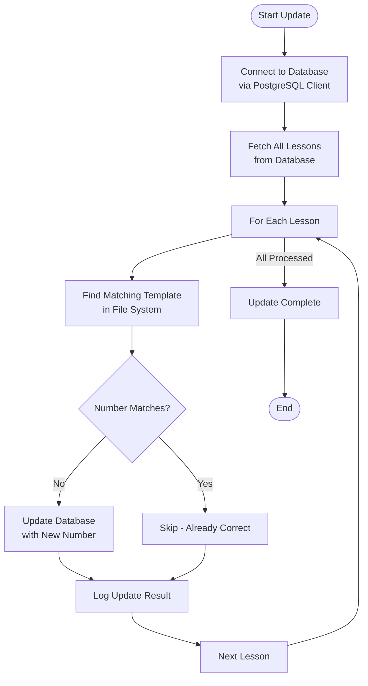
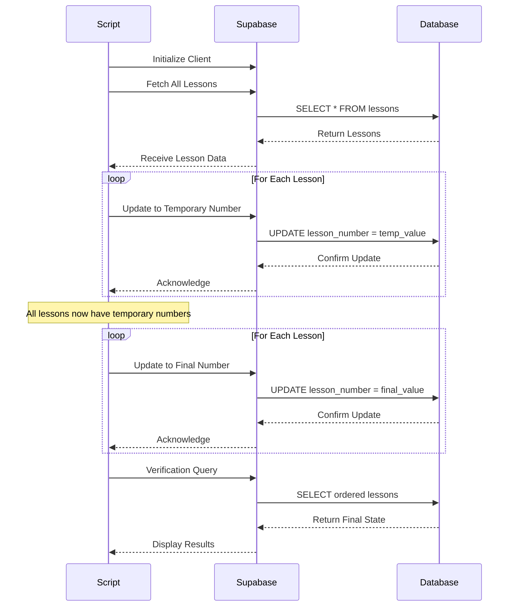
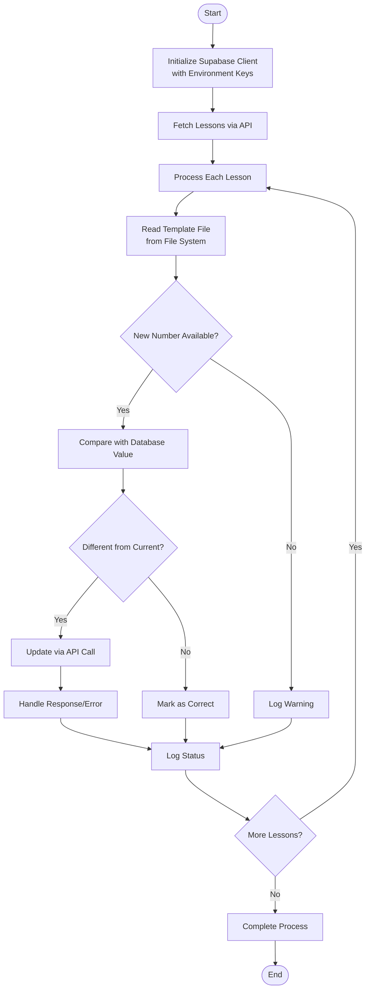
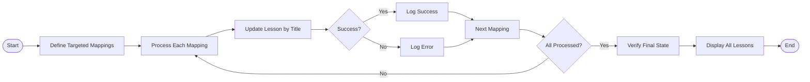

# Lesson Number Updates

<cite>
**Referenced Files in This Document**   
- [update-lesson-numbers.ts](file://scripts/update-lesson-numbers.ts)
- [update-lesson-numbers-safe.ts](file://scripts/update-lesson-numbers-safe.ts)
- [update-lesson-numbers-api.ts](file://scripts/update-lesson-numbers-api.ts)
- [fix-remaining-lessons.ts](file://scripts/fix-remaining-lessons.ts)
- [client.ts](file://lib/supabase/client.ts)
- [server.ts](file://lib/supabase/server.ts)
- [types.ts](file://lib/supabase/types.ts)
- [lesson.json](file://store/shvz/lessons/01/lesson.json)
</cite>

## Table of Contents
1. [Introduction](#introduction)
2. [Core Update Mechanisms](#core-update-mechanisms)
3. [Direct Database Updates](#direct-database-updates)
4. [Safe Transactional Updates](#safe-transactional-updates)
5. [API-Mediated Updates](#api-mediated-updates)
6. [Specialized Fix Script](#specialized-fix-script)
7. [Client Comparison: PostgreSQL vs Supabase](#client-comparison-postgresql-vs-supabase)
8. [Error Handling and Logging](#error-handling-and-logging)
9. [Usage Guidance and Best Practices](#usage-guidance-and-best-practices)
10. [Conclusion](#conclusion)

## Introduction
This document details the lesson number synchronization system designed to maintain consistency between database records and file system templates. The system comprises four distinct scripts that address different operational requirements and safety constraints. Each approach balances data integrity, execution environment, and risk mitigation differently, providing flexibility for various deployment scenarios. The primary goal across all implementations is to ensure lesson numbering accuracy across both persistent storage and template files.

## Core Update Mechanisms

The lesson number update system implements four complementary approaches to synchronize lesson numbering:

1. **Direct Database Updates**: Uses PostgreSQL client for immediate updates
2. **Safe Transactional Updates**: Implements two-phase update with temporary numbering
3. **API-Mediated Updates**: Uses Supabase client through API endpoints
4. **Specialized Fix Script**: Corrects specific misnumbered entries

All scripts share the common objective of aligning database lesson numbers with those defined in JSON template files located in the file system. They operate by reading lesson metadata from template files and updating corresponding database records to match the expected numbering.

**Section sources**
- [update-lesson-numbers.ts](file://scripts/update-lesson-numbers.ts#L1-L102)
- [update-lesson-numbers-safe.ts](file://scripts/update-lesson-numbers-safe.ts#L1-L117)
- [update-lesson-numbers-api.ts](file://scripts/update-lesson-numbers-api.ts#L1-L99)
- [fix-remaining-lessons.ts](file://scripts/fix-remaining-lessons.ts#L1-L73)

## Direct Database Updates

The direct database update mechanism uses the PostgreSQL client to establish a direct connection to the database. This approach bypasses the application API layer, providing maximum performance and minimal overhead. The script connects using the `SUPABASE_DB_URL` environment variable and executes SQL queries directly against the database.

This method performs updates in a single phase, comparing current database values with expected values from template files and applying changes immediately. While efficient, this approach carries higher risk in production environments due to the lack of transactional safety when multiple records need renumbering.

The direct approach is best suited for development environments or one-time migrations where performance is prioritized over safety guarantees.

**Diagram sources**
- [update-lesson-numbers.ts](file://scripts/update-lesson-numbers.ts#L1-L102)

**Section sources**
- [update-lesson-numbers.ts](file://scripts/update-lesson-numbers.ts#L1-L102)

## Safe Transactional Updates

The safe transactional update mechanism implements a two-phase approach to prevent primary key conflicts during renumbering operations. Using the Supabase client, this method first assigns temporary numbers (starting from 1000) to all lessons, then updates them to their correct final values.

This two-step process eliminates the risk of unique constraint violations that could occur when swapping numbers between records. By using temporary values outside the normal numbering range, the script ensures that no two records temporarily share the same lesson number during the update process.

The safety guarantees make this approach ideal for production environments where data integrity is paramount. However, it requires additional database operations and slightly longer execution time compared to direct updates.

**Diagram sources**
- [update-lesson-numbers-safe.ts](file://scripts/update-lesson-numbers-safe.ts#L1-L117)

**Section sources**
- [update-lesson-numbers-safe.ts](file://scripts/update-lesson-numbers-safe.ts#L1-L117)

## API-Mediated Updates

The API-mediated update mechanism uses the Supabase client to interact with the database through API endpoints rather than direct connections. This approach respects the application's API layer and security rules, making it suitable for environments where direct database access is restricted.

Unlike the safe transactional approach, this method performs updates in a single phase without temporary numbering. It relies on the API's validation and authorization mechanisms to ensure data integrity. The script uses either the service role key or anonymous key for authentication, depending on availability.

This approach provides a balance between safety and simplicity, operating within the application's intended architecture while avoiding the complexity of two-phase updates. It's particularly useful in staging environments or when compliance requirements mandate API-only access.

**Diagram sources**
- [update-lesson-numbers-api.ts](file://scripts/update-lesson-numbers-api.ts#L1-L99)

**Section sources**
- [update-lesson-numbers-api.ts](file://scripts/update-lesson-numbers-api.ts#L1-L99)

## Specialized Fix Script

The specialized fix script addresses specific misnumbered entries that may remain after bulk updates. Unlike the comprehensive update scripts, this tool targets known problematic cases with hardcoded mappings for precise corrections.

The script focuses on lessons with inconsistent naming patterns or numbering discrepancies that automated matching might miss. It directly updates records based on exact title matches, ensuring that specific edge cases are properly resolved.

After applying the targeted fixes, the script performs a verification query to display the final state of all lessons, providing immediate feedback on the success of the operation. This makes it valuable for post-migration cleanup and quality assurance.

**Diagram sources**
- [fix-remaining-lessons.ts](file://scripts/fix-remaining-lessons.ts#L1-L73)

**Section sources**
- [fix-remaining-lessons.ts](file://scripts/fix-remaining-lessons.ts#L1-L73)

## Client Comparison: PostgreSQL vs Supabase

The update scripts employ two different client approaches with distinct characteristics:

| Feature | PostgreSQL Client | Supabase Client |
|--------|------------------|----------------|
| **Connection Type** | Direct database connection | API-based connection |
| **Authentication** | Connection string | Service role or anon key |
| **Network Path** | Direct to database | Through Supabase API |
| **Security Rules** | Bypasses RLS | Respects RLS policies |
| **Use Case** | Bulk migrations, dev | Production, API-constrained |
| **Performance** | Higher (direct access) | Lower (API overhead) |
| **Safety** | Lower (direct changes) | Higher (API validation) |

The PostgreSQL client (`pg`) used in `update-lesson-numbers.ts` provides direct access to the database, offering maximum performance but bypassing application-level security rules. In contrast, the Supabase client used in the other scripts operates through the API layer, respecting Row Level Security (RLS) policies and application validation rules.

The choice between clients depends on the environment and requirements:
- Use PostgreSQL client for initial data migrations in controlled environments
- Use Supabase client for production updates and when security policies must be enforced
- The service role key provides elevated privileges when administrative access is needed

**Section sources**
- [update-lesson-numbers.ts](file://scripts/update-lesson-numbers.ts#L1-L102)
- [update-lesson-numbers-safe.ts](file://scripts/update-lesson-numbers-safe.ts#L1-L117)
- [update-lesson-numbers-api.ts](file://scripts/update-lesson-numbers-api.ts#L1-L99)
- [client.ts](file://lib/supabase/client.ts#L1-L10)
- [server.ts](file://lib/supabase/server.ts#L1-L27)

## Error Handling and Logging

All update scripts implement comprehensive error handling and logging practices to ensure visibility and reliability:

- **Graceful Degradation**: Scripts continue processing when individual operations fail
- **Detailed Logging**: Each operation is logged with status indicators (✅, ❌, 📝)
- **Error Isolation**: Individual lesson failures don't terminate the entire process
- **Pre-execution Validation**: Environment variables are validated before operations begin
- **Resource Cleanup**: Database connections are properly closed in finally blocks

The logging system uses emoji indicators to quickly convey operation status:
- 🔄 Progress indicators for ongoing operations
- 📚 Informational messages about data state
- 📝 Change notifications for planned updates
- ✅ Success confirmations for completed operations
- ⚠️ Warnings for non-critical issues
- ❌ Error markers for failed operations

Error handling strategies vary by script:
- Direct updates use try-catch with connection cleanup
- Safe updates return on first critical error during transaction phases
- API updates handle response errors individually per operation
- Fix scripts continue through mappings even after individual failures

**Section sources**
- [update-lesson-numbers.ts](file://scripts/update-lesson-numbers.ts#L1-L102)
- [update-lesson-numbers-safe.ts](file://scripts/update-lesson-numbers-safe.ts#L1-L117)
- [update-lesson-numbers-api.ts](file://scripts/update-lesson-numbers-api.ts#L1-L99)
- [fix-remaining-lessons.ts](file://scripts/fix-remaining-lessons.ts#L1-L73)

## Usage Guidance and Best Practices

### When to Use Each Approach

**Direct Database Updates** (`update-lesson-numbers.ts`):
- Initial data migrations
- Development environment synchronization
- One-time bulk operations
- When API rate limits are a concern

**Safe Transactional Updates** (`update-lesson-numbers-safe.ts`):
- Production environment updates
- Major renumbering operations
- When data integrity is critical
- Multi-record swaps are expected

**API-Mediated Updates** (`update-lesson-numbers-api.ts`):
- Regular maintenance updates
- Environments with restricted database access
- When RLS policies must be enforced
- Staging environment synchronization

**Specialized Fix Script** (`fix-remaining-lessons.ts`):
- Post-migration cleanup
- Correcting known problematic entries
- Addressing edge cases missed by automated matching
- Final verification and correction phase

### Recommended Workflow
1. Run safe transactional updates for major renumbering
2. Follow with API-mediated updates for regular synchronization
3. Use the fix script to address remaining inconsistencies
4. Reserve direct updates for initial migrations only

### Environment Configuration
Ensure proper environment variables are set:
- `NEXT_PUBLIC_SUPABASE_URL`: Supabase project URL
- `SUPABASE_SERVICE_ROLE_KEY`: For elevated privileges (preferred)
- `NEXT_PUBLIC_SUPABASE_ANON_KEY`: Fallback authentication
- `SUPABASE_DB_URL`: Required only for direct database access

**Section sources**
- [update-lesson-numbers.ts](file://scripts/update-lesson-numbers.ts#L1-L102)
- [update-lesson-numbers-safe.ts](file://scripts/update-lesson-numbers-safe.ts#L1-L117)
- [update-lesson-numbers-api.ts](file://scripts/update-lesson-numbers-api.ts#L1-L99)
- [fix-remaining-lessons.ts](file://scripts/fix-remaining-lessons.ts#L1-L73)

## Conclusion

The lesson number update system provides multiple approaches to maintain synchronization between database records and file system templates. Each script serves a specific purpose and operational context, allowing teams to choose the appropriate tool based on environment constraints and data integrity requirements.

The direct database approach offers maximum performance for controlled migrations, while the safe transactional method ensures data integrity during production updates. The API-mediated approach respects application architecture and security policies, and the specialized fix script handles edge cases that automated processes might miss.

By understanding the strengths and limitations of each approach, teams can effectively maintain lesson numbering consistency across their system, ensuring a reliable user experience and accurate content delivery.