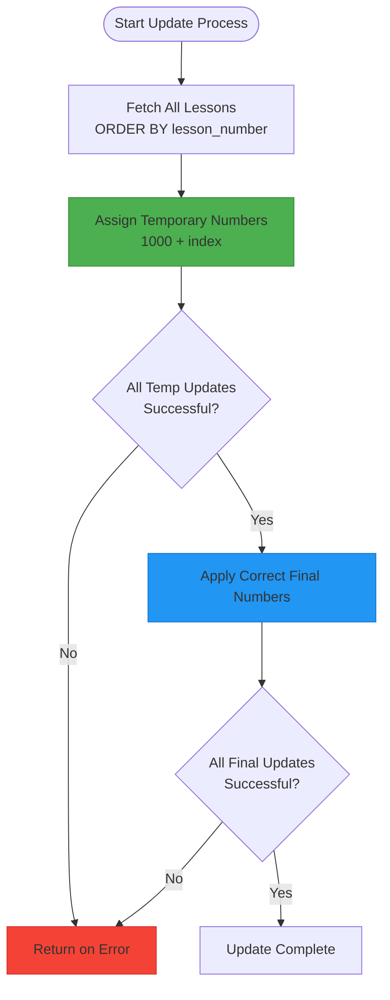
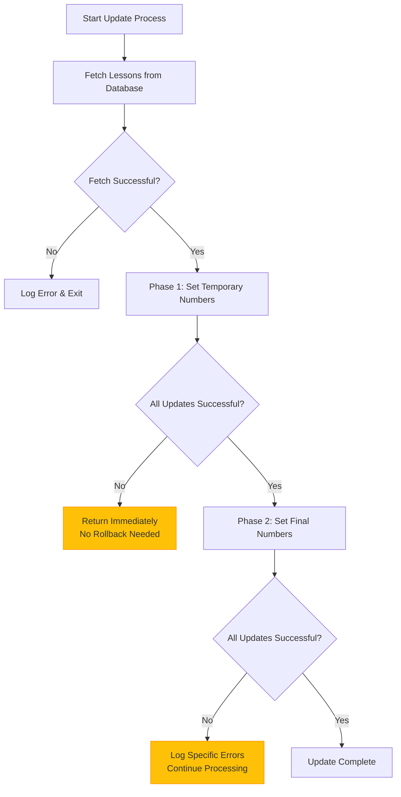
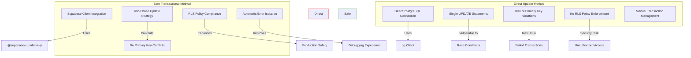

# Safe Transactional Update

<cite>
**Referenced Files in This Document**   
- [update-lesson-numbers-safe.ts](file://scripts/update-lesson-numbers-safe.ts)
- [update-lesson-numbers.ts](file://scripts/update-lesson-numbers.ts)
- [update-lesson-numbers-api.ts](file://scripts/update-lesson-numbers-api.ts)
- [client.ts](file://lib/supabase/client.ts)
- [LESSON_MANAGEMENT.md](file://LESSON_MANAGEMENT.md)
</cite>

## Table of Contents
1. [Introduction](#introduction)
2. [Core Components](#core-components)
3. [Two-Phase Update Strategy](#two-phase-update-strategy)
4. [Supabase Client Integration](#supabase-client-integration)
5. [Error Handling and Data Integrity](#error-handling-and-data-integrity)
6. [Comparison with Direct Update Methods](#comparison-with-direct-update-methods)
7. [Real-World Scenarios and Best Practices](#real-world-scenarios-and-best-practices)
8. [Conclusion](#conclusion)

## Introduction
This document details the safe transactional lesson number update mechanism implemented in `update-lesson-numbers-safe.ts`. The script ensures data integrity during reordering operations by employing a two-phase update strategy that prevents primary key violations and race conditions. It leverages the Supabase client for secure database interactions, enabling seamless integration with Supabase's authentication and row-level security features. This approach is specifically designed for production environments where maintaining data consistency is critical.

**Section sources**
- [update-lesson-numbers-safe.ts](file://scripts/update-lesson-numbers-safe.ts#L1-L118)

## Core Components

The safe lesson number update mechanism consists of several key components working in concert to ensure reliable and conflict-free updates. The primary script, `update-lesson-numbers-safe.ts`, orchestrates the entire process by first retrieving lesson data from the Supabase database, then applying a two-phase numbering strategy to prevent conflicts during reordering operations. The script reads lesson metadata from JSON files stored in the `/store/shvz/lessons/` directory, using the `number` field from each `lesson.json` file to determine the correct final ordering. This design ensures that the database reflects the intended lesson sequence as defined in the source files.

The mechanism relies on the Supabase client (`@supabase/supabase-js`) for all database operations, which provides a secure and authenticated connection to the database. This approach contrasts with direct PostgreSQL connections, as it enables integration with Supabase's built-in authentication and row-level security policies. The script handles configuration through environment variables, specifically `NEXT_PUBLIC_SUPABASE_URL` and `SUPABASE_SERVICE_ROLE_KEY`, with fallback to the anonymous key if the service role key is unavailable. This configuration strategy ensures the script can operate in different environments while maintaining appropriate security boundaries.

**Section sources**
- [update-lesson-numbers-safe.ts](file://scripts/update-lesson-numbers-safe.ts#L1-L118)
- [client.ts](file://lib/supabase/client.ts#L1-L11)
- [LESSON_MANAGEMENT.md](file://LESSON_MANAGEMENT.md#L1-L159)

## Two-Phase Update Strategy

**Diagram sources**
- [update-lesson-numbers-safe.ts](file://scripts/update-lesson-numbers-safe.ts#L39-L116)

**Section sources**
- [update-lesson-numbers-safe.ts](file://scripts/update-lesson-numbers-safe.ts#L39-L116)

The two-phase update strategy is the core innovation of the safe transactional mechanism, designed to eliminate the risk of primary key violations during lesson reordering. In the first phase, the script assigns temporary lesson numbers starting from 1000, incrementing by one for each lesson based on its current order. This temporary numbering scheme creates a "safe zone" that is guaranteed not to conflict with any existing lesson numbers in the production range (typically 1-999). By updating all lessons to these temporary values first, the system ensures that no two lessons ever have the same number simultaneously, which would violate the primary key constraint.

The second phase applies the correct final numbers by reading the intended sequence from the `lesson.json` files in the local filesystem. For each lesson, the script searches through the lesson directories to find the corresponding JSON file and extract the correct `number` value. It then updates the database record with this final number. This phased approach effectively decouples the reordering operation from the constraints of the primary key, allowing for arbitrary resequencing without the risk of conflicts. The temporary numbers act as placeholders that maintain data integrity throughout the transition, ensuring that the database remains in a consistent state at all times.

## Supabase Client Integration

The script's use of the Supabase client (`@supabase/supabase-js`) instead of direct PostgreSQL connections represents a significant architectural advantage for production environments. This integration enables the script to leverage Supabase's comprehensive authentication system and row-level security (RLS) policies, which provide fine-grained control over database access. Unlike direct database connections that bypass application-level security, the Supabase client respects all RLS policies configured in the database, ensuring that updates comply with the same security rules as the main application.

The client configuration prioritizes the service role key (`SUPABASE_SERVICE_ROLE_KEY`) for maximum privileges when available, but gracefully falls back to the anonymous key (`NEXT_PUBLIC_SUPABASE_ANON_KEY`) when operating in more restricted environments. This dual-key strategy provides flexibility while maintaining security boundaries. The integration also enables better monitoring and auditing, as all operations are logged through Supabase's analytics system. Additionally, using the client library ensures compatibility with Supabase-specific features like real-time subscriptions and storage integration, which could be leveraged for enhanced functionality in future iterations of the update mechanism.

**Section sources**
- [update-lesson-numbers-safe.ts](file://scripts/update-lesson-numbers-safe.ts#L5-L23)
- [client.ts](file://lib/supabase/client.ts#L1-L11)

## Error Handling and Data Integrity

**Diagram sources**
- [update-lesson-numbers-safe.ts](file://scripts/update-lesson-numbers-safe.ts#L24-L113)

**Section sources**
- [update-lesson-numbers-safe.ts](file://scripts/update-lesson-numbers-safe.ts#L24-L113)

The error handling strategy in the safe update mechanism prioritizes data integrity through immediate termination on critical failures while allowing for graceful degradation in non-critical scenarios. In the first phase, if any temporary number update fails, the entire process terminates immediately, preventing the system from entering an inconsistent state. This approach is safe because the temporary numbers are in a non-conflicting range, so partial updates do not create primary key violations. The system effectively uses the temporary numbering phase as a "canary" test—if this phase fails, the original data remains intact and no reordering has begun.

In the second phase, the error handling becomes more permissive, allowing the script to continue processing even if individual lesson updates fail. This design recognizes that some lessons might be missing corresponding JSON files or have other issues that shouldn't prevent the entire update process. Each failed update is logged individually, but the script continues to process the remaining lessons. This approach ensures maximum data consistency while providing detailed error reporting for troubleshooting. The lack of explicit transaction management is mitigated by the two-phase design itself, where the temporary numbering phase creates a buffer zone that prevents conflicts regardless of where the process might be interrupted.

## Comparison with Direct Update Methods

**Diagram sources**
- [update-lesson-numbers-safe.ts](file://scripts/update-lesson-numbers-safe.ts#L1-L118)
- [update-lesson-numbers.ts](file://scripts/update-lesson-numbers.ts#L1-L103)
- [update-lesson-numbers-api.ts](file://scripts/update-lesson-numbers-api.ts#L1-L100)

**Section sources**
- [update-lesson-numbers-safe.ts](file://scripts/update-lesson-numbers-safe.ts#L1-L118)
- [update-lesson-numbers.ts](file://scripts/update-lesson-numbers.ts#L1-L103)
- [update-lesson-numbers-api.ts](file://scripts/update-lesson-numbers-api.ts#L1-L100)

The safe transactional approach represents a significant improvement over direct update methods, particularly in production environments where data integrity is paramount. The direct method, exemplified by `update-lesson-numbers.ts`, uses a PostgreSQL client with direct database connections and attempts to update lesson numbers in a single phase. This approach is vulnerable to primary key violations when reordering lessons, as updating one lesson to another's number creates a temporary conflict that violates the unique constraint. Such operations require complex transaction management and careful sequencing to avoid failures.

In contrast, the safe method's two-phase strategy completely eliminates the possibility of primary key conflicts by using a temporary numbering scheme that operates outside the production range. This design allows for arbitrary reordering without concern for the sequence of updates. Additionally, the use of the Supabase client instead of direct database connections ensures compliance with row-level security policies and leverages Supabase's authentication system, providing a more secure and auditable update process. The direct method's reliance on database connection strings also represents a security risk, as it requires elevated database privileges that could be exploited if compromised.

## Real-World Scenarios and Best Practices

The safe transactional update mechanism addresses several critical real-world scenarios that commonly occur in production environments. One such scenario involves concurrent updates where multiple administrators might attempt to reorder lessons simultaneously. The two-phase approach prevents race conditions by ensuring that temporary numbers never conflict, allowing multiple update processes to run without interfering with each other. Another scenario involves partial failures during reordering operations—when a direct update fails midway, it can leave the database in an inconsistent state requiring manual intervention. The safe method's design ensures that even if the process is interrupted, the temporary numbers maintain data integrity and the operation can be safely retried.

Best practices for validating the outcome post-execution include verifying the final lesson order through the API endpoint, comparing the database results with the source JSON files, and checking the script's log output for any warnings about missing lesson files. Administrators should also confirm that all lessons have been updated to their intended numbers by running a SELECT query ordered by lesson_number. For critical updates, it's recommended to perform the operation during low-traffic periods and to have a backup of the lessons table before execution. The script's detailed logging provides a comprehensive audit trail, with successful updates marked with checkmarks and errors clearly indicated, facilitating quick verification of the update's success.

**Section sources**
- [update-lesson-numbers-safe.ts](file://scripts/update-lesson-numbers-safe.ts#L1-L118)
- [LESSON_MANAGEMENT.md](file://LESSON_MANAGEMENT.md#L1-L159)

## Conclusion
The safe transactional lesson number update mechanism in `update-lesson-numbers-safe.ts` represents a robust solution for maintaining data integrity during lesson reordering operations. By implementing a two-phase update strategy with temporary numbering, the script effectively eliminates the risk of primary key violations that plague direct update methods. The integration with the Supabase client enhances security and compliance by leveraging Supabase's authentication and row-level security features, making this approach particularly suitable for production environments. The comprehensive error handling ensures that the system remains in a consistent state even when individual operations fail, while the detailed logging provides valuable insights for troubleshooting and verification. This mechanism demonstrates how thoughtful design can overcome the limitations of traditional database operations, providing a reliable and safe method for managing critical data updates.