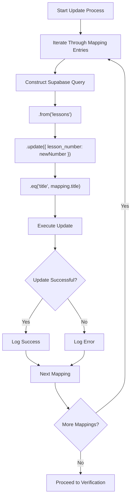
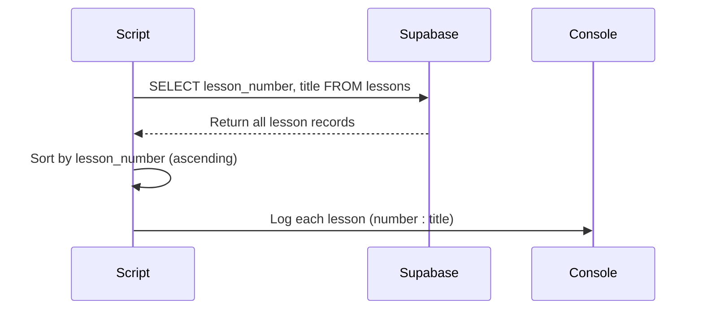

# Specific Lesson Fixes

<cite>
**Referenced Files in This Document**   
- [fix-remaining-lessons.ts](file://scripts/fix-remaining-lessons.ts)
- [LESSON_MANAGEMENT.md](file://LESSON_MANAGEMENT.md)
- [LESSON_NUMBERS_UPDATE_REPORT.md](file://LESSON_NUMBERS_UPDATE_REPORT.md)
- [client.ts](file://lib/supabase/client.ts)
- [server.ts](file://lib/supabase/server.ts)
</cite>

## Table of Contents
1. [Introduction](#introduction)
2. [Core Functionality](#core-functionality)
3. [Hardcoded Title Mapping](#hardcoded-title-mapping)
4. [Supabase Query Implementation](#supabase-query-implementation)
5. [Post-Update Verification](#post-update-verification)
6. [Remediation Use Cases](#remediation-use-cases)
7. [Best Practices](#best-practices)
8. [Conclusion](#conclusion)

## Introduction
The `fix-remaining-lessons.ts` script serves as a targeted remediation tool designed to correct specific lesson numbering inconsistencies that persist after bulk update operations. Unlike general-purpose update scripts, this utility focuses on edge cases where lesson titles deviate from standard naming patterns or contain manual entry errors that prevent automated matching. The script operates as a final corrective measure in the lesson management workflow, ensuring data integrity in the Supabase database after primary migration processes have completed.

**Section sources**
- [fix-remaining-lessons.ts](file://scripts/fix-remaining-lessons.ts#L1-L74)

## Core Functionality

The script addresses misnumbered lesson entries through a targeted correction approach rather than comprehensive data migration. It specifically handles cases where lesson titles do not conform to expected patterns or were incorrectly numbered due to human error during content creation. The implementation follows a three-phase process: configuration of correction mappings, execution of targeted updates, and post-operation verification.

This script complements other lesson update utilities in the system (`update-lesson-numbers.ts`, `update-lesson-numbers-api.ts`, and `update-lesson-numbers-safe.ts`) by focusing exclusively on residual inconsistencies that these broader tools cannot resolve. Its narrow scope ensures precision in corrections without risking unintended modifications to correctly numbered lessons.

**Section sources**
- [fix-remaining-lessons.ts](file://scripts/fix-remaining-lessons.ts#L1-L74)
- [LESSON_NUMBERS_UPDATE_REPORT.md](file://LESSON_NUMBERS_UPDATE_REPORT.md#L1-L62)

## Hardcoded Title Mapping

The script employs a hardcoded mapping system to address specific misnumbered entries that cannot be resolved through automated pattern matching. This approach targets known anomalies in lesson titles that deviate from standard naming conventions:

```typescript
const lessonMappings = [
  { title: "1 Урок Демонстрация", newNumber: 5 },
  { title: "1 Урок введение.", newNumber: 1 },
  { title: "1 урок повторяйте за мной", newNumber: 6 }
];
```

This mapping structure directly associates problematic lesson titles with their correct numerical assignments. The hardcoded nature of these mappings reflects the script's purpose as a remediation tool for specific, known issues rather than a general solution for lesson management. Each entry in the mapping array represents a documented discrepancy identified during previous migration attempts.

The use of exact title matching ensures precision in targeting affected records, preventing accidental modification of lessons with similar but correctly numbered titles. This approach is particularly effective for addressing manual entry errors where automated pattern recognition would be unreliable.

**Section sources**
- [fix-remaining-lessons.ts](file://scripts/fix-remaining-lessons.ts#L25-L31)

## Supabase Query Implementation

The script leverages Supabase's `.eq()` filter method to precisely target affected lesson records in the database. For each mapping entry, the script constructs a targeted update operation:



**Diagram sources**
- [fix-remaining-lessons.ts](file://scripts/fix-remaining-lessons.ts#L33-L44)

The `.eq()` filter ensures exact title matching, which is critical when correcting specific entries in a database with similarly named lessons. This precision prevents unintended modifications to lessons with similar titles but correct numbering. The update operation modifies only the `lesson_number` field while preserving all other lesson attributes, maintaining data integrity across the correction process.

The implementation uses the Supabase service role key when available, falling back to the anonymous key if necessary, ensuring the script can operate in various deployment environments.

**Section sources**
- [fix-remaining-lessons.ts](file://scripts/fix-remaining-lessons.ts#L33-L44)
- [server.ts](file://lib/supabase/server.ts#L19-L25)

## Post-Update Verification

Following the correction process, the script implements a verification step that retrieves and logs all lesson titles and numbers to confirm successful updates:



**Diagram sources**
- [fix-remaining-lessons.ts](file://scripts/fix-remaining-lessons.ts#L55-L72)

This verification process executes a database query to select the `lesson_number` and `title` fields from all records in the `lessons` table, ordering results by lesson number in ascending sequence. The script then iterates through the returned data, logging each lesson's number and title to the console. This output provides immediate visual confirmation of the final lesson ordering, allowing operators to quickly verify that all corrections were applied as intended.

The verification step serves as both a quality assurance measure and a debugging aid, making it immediately apparent if any lessons remain incorrectly numbered or if unexpected changes occurred during the update process.

**Section sources**
- [fix-remaining-lessons.ts](file://scripts/fix-remaining-lessons.ts#L55-L72)
- [LESSON_MANAGEMENT.md](file://LESSON_MANAGEMENT.md#L21-L27)

## Remediation Use Cases

The `fix-remaining-lessons.ts` script functions specifically as a remediation tool rather than a general-purpose updater, designed for targeted application in specific scenarios:

### Migration Anomalies
After bulk migration operations, certain lessons may retain incorrect numbers due to edge cases in the migration logic. The script addresses these residual inconsistencies, particularly when title variations prevent automated matching between source files and database records.

### Data Import Errors
When lessons are imported from external sources, manual entry errors or formatting inconsistencies can result in incorrect numbering. The hardcoded mapping approach allows for precise correction of these specific errors without requiring re-import of all lesson data.

### Manual Content Adjustments
Following manual updates to lesson content or structure, numbering discrepancies may arise. The script provides a controlled mechanism for correcting these issues without affecting lessons that were properly numbered.

The script's narrow focus on specific, known issues makes it an essential component of the lesson management ecosystem, working in conjunction with broader update utilities to ensure comprehensive data integrity.

**Section sources**
- [LESSON_NUMBERS_UPDATE_REPORT.md](file://LESSON_NUMBERS_UPDATE_REPORT.md#L59-L62)
- [fix-remaining-lessons.ts](file://scripts/fix-remaining-lessons.ts#L1-L74)

## Best Practices

### Extending the Mapping List
When new misnumbered entries are identified, they should be added to the `lessonMappings` array following the established pattern. Each new entry should include the exact title as it appears in the database and the correct lesson number. Before adding mappings, verify that the title discrepancy cannot be resolved through automated means, as excessive hardcoded mappings can become difficult to maintain.

### Ensuring Idempotency
The script is designed to be idempotent, meaning it can be safely executed multiple times without causing unintended side effects. The `.eq()` filter ensures that updates only affect lessons with exact title matches, and updating a lesson to its already-correct number has no adverse impact. This idempotency allows the script to be rerun after additional corrections are made to the mapping list.

### Environment Configuration
Ensure that the necessary environment variables (`NEXT_PUBLIC_SUPABASE_URL` and `SUPABASE_SERVICE_ROLE_KEY` or `NEXT_PUBLIC_SUPABASE_ANON_KEY`) are properly configured before execution. The script includes validation to exit gracefully if required configuration is missing, preventing partial or failed updates.

### Verification and Monitoring
Always review the verification output after script execution to confirm that all intended corrections were applied and no unexpected changes occurred. Maintain a record of mapping additions and the rationale for each correction to support future maintenance and auditing.

**Section sources**
- [fix-remaining-lessons.ts](file://scripts/fix-remaining-lessons.ts#L1-L74)
- [client.ts](file://lib/supabase/client.ts#L3-L8)

## Conclusion
The `fix-remaining-lessons.ts` script provides a targeted solution for correcting specific lesson numbering inconsistencies that persist after bulk update operations. By employing hardcoded title-to-number mappings and leveraging Supabase's precise filtering capabilities, the script effectively addresses edge cases that automated migration tools cannot resolve. Its post-update verification process ensures transparency and confidence in the correction results. As a specialized remediation tool, it plays a crucial role in maintaining data integrity within the lesson management system, particularly in scenarios involving migration anomalies, data import errors, or manual content adjustments. When used according to best practices for extending mappings and ensuring idempotency, the script provides a reliable mechanism for maintaining accurate lesson numbering in the database.