# Template Regeneration

<cite>
**Referenced Files in This Document**   
- [regenerate-lesson-templates.ts](file://scripts/regenerate-lesson-templates.ts)
- [openai.ts](file://lib/openai.ts)
- [lesson.json](file://store/shvz/lessons/01/lesson.json)
- [1-c8a90762-6fca-47a8-80c3-5f454ae05273-final.json](file://store/shvz/1-c8a90762-6fca-47a8-80c3-5f454ae05273-final.json)
</cite>

## Table of Contents
1. [Introduction](#introduction)
2. [Core Workflow](#core-workflow)
3. [AI Prompt Structure](#ai-prompt-structure)
4. [Data Processing Pipeline](#data-processing-pipeline)
5. [Output Format and Personalization Engine Requirements](#output-format-and-personalization-engine-requirements)
6. [Error Handling and Recovery](#error-handling-and-recovery)
7. [File Management and Backup Procedures](#file-management-and-backup-procedures)
8. [Configuration and Dependencies](#configuration-and-dependencies)

## Introduction

The `regenerate-lesson-templates.ts` script implements an AI-driven process for transforming raw lesson transcripts into structured, standardized lesson templates. This system leverages OpenAI's GPT-4o model to extract educational content from unstructured text, ensuring consistency across all course materials while maintaining factual accuracy to the original transcript. The generated templates serve as input for the personalization engine, enabling tailored learning experiences for students.

**Section sources**
- [regenerate-lesson-templates.ts](file://scripts/regenerate-lesson-templates.ts#L1-L311)

## Core Workflow

The template regeneration process follows a sequential workflow that systematically processes each lesson through four distinct phases: data acquisition, AI processing, response handling, and file management. The script operates on a predefined set of 12 lessons, processing them in numerical order with a one-second delay between requests to prevent rate limiting.


**Diagram sources**
- [regenerate-lesson-templates.ts](file://scripts/regenerate-lesson-templates.ts#L150-L311)

**Section sources**
- [regenerate-lesson-templates.ts](file://scripts/regenerate-lesson-templates.ts#L150-L311)

## AI Prompt Structure

The script constructs a comprehensive prompt that guides the GPT-4o model to produce structured educational content from raw transcripts. The prompt enforces strict adherence to factual content from the transcript while specifying a precise output format. It includes lesson metadata (number, title, description) and the full transcript text, followed by detailed formatting requirements for seven distinct content sections.

```mermaid
flowchart TD
PromptRoot["AI Prompt Structure"] --> MetadataSection["Metadata Context"]
MetadataSection --> LessonNumber["Lesson Number"]
MetadataSection --> LessonTitle["Lesson Title"]
MetadataSection --> LessonDescription["Lesson Description"]
PromptRoot --> TranscriptSection["Transcript Content"]
TranscriptSection --> RawTranscript["Full Transcript Text"]
PromptRoot --> RequirementsSection["Output Requirements"]
RequirementsSection --> Introduction["👋 Введение: 2-3 sentences"]
RequirementsSection --> KeyPoints["🔑 Ключевые моменты: 4-6 bullet points"]
RequirementsSection --> PracticalTips["💡 Практические советы: 3-5 action items"]
RequirementsSection --> Important["⚠️ Важно: Only if in transcript"]
RequirementsSection --> Equipment["🧰 Инвентарь и подготовка: Only if mentioned"]
RequirementsSection --> Homework["📚 Домашнее задание: 1-2 sentences"]
RequirementsSection --> Motivation["_(мотивационная строка)_: 1 italic sentence"]
PromptRoot --> StyleSection["Style Guidelines"]
StyleSection --> Clarity["Clear, friendly language (B1-B2 level)"]
StyleSection --> Terminology["Explain medical terms simply"]
StyleSection --> NoRepetition["Remove repetitions and filler words"]
StyleSection --> FactBased["Only include facts from transcript"]
PromptRoot --> FormatSection["Response Format"]
FormatSection --> JSON["Valid JSON only"]
FormatSection --> Fields["Specific field names required"]
FormatSection --> NoExtraText["No additional text outside JSON"]
```



**Diagram sources**
- [regenerate-lesson-templates.ts](file://scripts/regenerate-lesson-templates.ts#L80-L140)

**Section sources**
- [regenerate-lesson-templates.ts](file://scripts/regenerate-lesson-templates.ts#L80-L140)

## Data Processing Pipeline

The data processing pipeline orchestrates the flow of information from source files to AI-generated templates. It begins with retrieving structured lesson metadata from JSON files in the lessons directory, followed by locating and reading the corresponding transcript file from the store directory. These components are then combined into a single prompt that is submitted to the OpenAI API.


**Diagram sources**
- [regenerate-lesson-templates.ts](file://scripts/regenerate-lesson-templates.ts#L15-L78)
- [regenerate-lesson-templates.ts](file://scripts/regenerate-lesson-templates.ts#L150-L311)

**Section sources**
- [regenerate-lesson-templates.ts](file://scripts/regenerate-lesson-templates.ts#L15-L78)
- [regenerate-lesson-templates.ts](file://scripts/regenerate-lesson-templates.ts#L150-L311)

## Output Format and Personalization Engine Requirements

The AI-generated templates must conform to a specific JSON structure that is consumed by the personalization engine. The output format includes five required fields that transform the educational content into actionable learning components. This standardized format ensures compatibility with downstream systems that deliver personalized learning experiences to students.

```mermaid
erDiagram
TEMPLATE ||--o{ FIELD : contains
TEMPLATE {
string summary_short
string why_watch
string quick_action
string social_share
string homework_20m
}
FIELD {
string field_name
string content_type
string length_requirements
string purpose
}
FIELD ||--o{ summary_short : "summary_short"
FIELD ||--o{ why_watch : "why_watch"
FIELD ||--o{ quick_action : "quick_action"
FIELD ||--o{ social_share : "social_share"
FIELD ||--o{ homework_20m : "homework_20m"
summary_short {
string "summary_short"
string "Short summary"
string "2-3 sentences"
string "Concise lesson overview"
}
why_watch {
string "why_watch"
string "Paragraph"
string "3-4 sentences"
string "Benefits and importance"
}
quick_action {
string "quick_action"
string "Instruction"
string "1-2 sentences"
string "Immediate actionable step"
}
social_share {
string "social_share"
string "Sentence"
string "1 sentence"
string "Social media message"
}
homework_20m {
string "homework_20m"
string "List"
string "5-7 steps"
string "20-minute homework guide"
}
```

**Diagram sources**
- [regenerate-lesson-templates.ts](file://scripts/regenerate-lesson-templates.ts#L115-L135)

**Section sources**
- [regenerate-lesson-templates.ts](file://scripts/regenerate-lesson-templates.ts#L115-L135)

## Error Handling and Recovery

The script implements comprehensive error handling at multiple levels to ensure robust operation despite potential failures in file access, API connectivity, or response parsing. Each processing step includes try-catch blocks that log specific error details while allowing the overall process to continue with other lessons.

```mermaid
flowchart TD
StartProcess["regenerateLessonTemplates()"] --> APIKeyCheck["Check OPENAI_API_KEY"]
APIKeyCheck --> |Missing| ExitProcess["Exit with Error Code 1"]
StartLoop["For Each Lesson"] --> ReadMetadata["getLessonInfo()"]
ReadMetadata --> |File Not Found| LogError["Log 'Файл урока не найден'"]
ReadMetadata --> |Parse Error| LogError
ReadMetadata --> ReadTranscript["getTranscript()"]
ReadTranscript --> |File Not Found| LogError["Log 'Транскрипт не найден'"]
ReadTranscript --> |Read Error| LogError
ReadTranscript --> CallAI["generateLessonTemplate()"]
CallAI --> |API Error| LogError["Log 'Ошибка OpenAI'"]
CallAI --> |Empty Response| LogError["Log 'Пустой ответ от OpenAI'"]
CallAI --> ParseResponse["JSON.parse()"]
ParseResponse --> |Parse Error| LogError["Log 'Ошибка парсинга JSON'"]
ParseResponse --> |Success| SaveTemplate["saveLessonTemplate()"]
SaveTemplate --> |Write Error| LogError["Log 'Ошибка сохранения'"]
LogError --> Continue["Increment errorCount & Continue"]
SaveTemplate --> |Success| Success["Increment successCount"]
Success --> Continue
Continue --> NextLesson["Process Next Lesson"]
NextLesson --> |Complete| FinalReport["Generate Summary Report"]
```



**Diagram sources**
- [regenerate-lesson-templates.ts](file://scripts/regenerate-lesson-templates.ts#L15-L78)
- [regenerate-lesson-templates.ts](file://scripts/regenerate-lesson-templates.ts#L80-L140)
- [regenerate-lesson-templates.ts](file://scripts/regenerate-lesson-templates.ts#L150-L311)

**Section sources**
- [regenerate-lesson-templates.ts](file://scripts/regenerate-lesson-templates.ts#L15-L78)
- [regenerate-lesson-templates.ts](file://scripts/regenerate-lesson-templates.ts#L80-L140)
- [regenerate-lesson-templates.ts](file://scripts/regenerate-lesson-templates.ts#L150-L311)

## File Management and Backup Procedures

The script implements a systematic file naming and backup strategy to prevent data loss during template regeneration. Each generated template is saved using a consistent naming convention that combines the lesson number with a stable UUID, ensuring unique identifiers across the system. Before overwriting any existing file, the script creates a backup with a "-backup.json" suffix.

```mermaid
flowchart LR
InputData["Lesson Number"] --> IdMapping["getLessonId()"]
IdMapping --> FileName["Construct Filename\n{number}-{id}-final.json"]
FileName --> OutputPath["Build Full Path\nstore/shvz/{filename}"]
OutputPath --> CheckExists["File Exists?"]
CheckExists --> |Yes| CreateBackup["Copy to {filename}-backup.json"]
CheckExists --> |No| ProceedSave
CreateBackup --> ProceedSave["Proceed to Save"]
ProceedSave --> WriteFile["fs.writeFileSync()"]
WriteFile --> |Success| LogSuccess["Log 'Сохранен новый шаблон'"]
WriteFile --> |Error| LogError["Log 'Ошибка сохранения'"]
```



**Diagram sources**
- [regenerate-lesson-templates.ts](file://scripts/regenerate-lesson-templates.ts#L200-L230)

**Section sources**
- [regenerate-lesson-templates.ts](file://scripts/regenerate-lesson-templates.ts#L200-L230)

## Configuration and Dependencies

The template regeneration process depends on several external configurations and libraries. The primary dependency is the OpenAI API, accessed through the official OpenAI Node.js library with authentication managed via environment variables. The script also relies on Node.js built-in modules for file system operations and path manipulation.


**Diagram sources**
- [regenerate-lesson-templates.ts](file://scripts/regenerate-lesson-templates.ts#L1-L10)
- [openai.ts](file://lib/openai.ts#L1-L8)

**Section sources**
- [regenerate-lesson-templates.ts](file://scripts/regenerate-lesson-templates.ts#L1-L10)
- [openai.ts](file://lib/openai.ts#L1-L8)