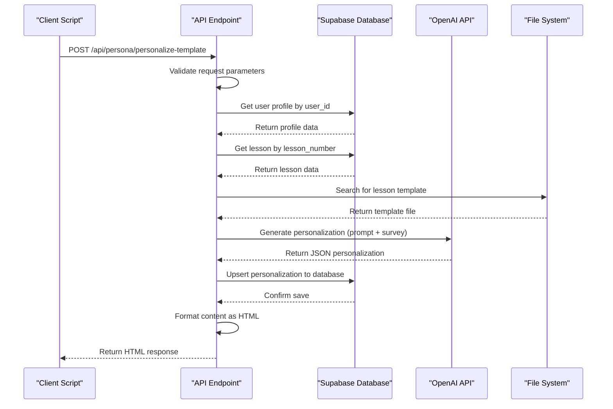

# User Personalization Scripts

<cite>
**Referenced Files in This Document**   
- [update-user-simple.ts](file://scripts/update-user-simple.ts)
- [update-user-via-api.ts](file://scripts/update-user-via-api.ts)
- [update-user-personalizations.ts](file://scripts/update-user-personalizations.ts)
- [route.ts](file://app/api/persona/personalize-template/route.ts)
- [server.ts](file://lib/supabase/server.ts)
</cite>

## Table of Contents
1. [Introduction](#introduction)
2. [Core Scripts Overview](#core-scripts-overview)
3. [Script: update-user-simple.ts](#script-update-user-simplets)
4. [Script: update-user-via-api.ts](#script-update-user-via-apits)
5. [Script: update-user-personalizations.ts](#script-update-user-personalizationsts)
6. [API Endpoint: /api/persona/personalize-template](#api-endpoint-apipersonapersonalize-template)
7. [Use Cases and Scenarios](#use-cases-and-scenarios)
8. [Command-Line Usage](#command-line-usage)
9. [Best Practices and Error Handling](#best-practices-and-error-handling)
10. [Debugging and Logging](#debugging-and-logging)

## Introduction
This document provides comprehensive documentation for the user personalization update scripts within the Persona system. These scripts are designed to manage personalized lesson content for users based on their survey responses and profile data. The system integrates with Supabase for database operations and leverages an OpenAI-powered API endpoint to generate tailored educational content. This guide details the functionality, usage, and integration points of each script, along with best practices for deployment and troubleshooting.

## Core Scripts Overview
The personalization system consists of three primary scripts located in the `scripts/` directory:
- `update-user-simple.ts`: Direct database updates using basic personalization logic
- `update-user-via-api.ts`: API-driven personalization via the `/api/persona/personalize-template` endpoint
- `update-user-personalizations.ts`: Batch processing with advanced template-based personalization

All scripts follow a consistent workflow: retrieve user profile, fetch lessons, clear existing personalizations, generate new content, and persist results to the database. They support command-line execution with optional `userId` parameter and default to a test user if not provided.

## Script: update-user-simple.ts
This script performs direct database personalization updates by generating basic personalized content from user survey data and storing it in Supabase.

The process begins by retrieving the user's profile using their `user_identifier` from the `profiles` table. It then fetches all lessons ordered by lesson number. Before generating new personalizations, it deletes any existing entries in the `personalized_lesson_descriptions` table for the user's profile.

Personalization is performed using a simple templating function (`createBasicPersonalization`) that constructs content based on survey fields such as motivation, target clients, skills wanted, fears, expected results, and practice model. The generated content includes sections like summary, why watch, quick action, social share, and homework.

Each personalized lesson description is inserted into the `personalized_lesson_descriptions` table with the profile ID, lesson ID, and content payload. The script provides detailed console output indicating progress and success/failure status for each operation.

**Section sources**
- [update-user-simple.ts](file://scripts/update-user-simple.ts#L1-L140)

## Script: update-user-via-api.ts
This script tests API-driven personalization updates by calling the `/api/persona/personalize-template` endpoint for each lesson rather than processing locally.

After retrieving the user profile and lessons (identical to other scripts), it sends POST requests to the external API endpoint (`https://pesonalisev2-zxby.vercel.app/api/persona/personalize-template`) with a JSON payload containing the `user_id`, `lesson_number`, and `flush` flag.

The API handles the entire personalization workflow: fetching the user's survey data, loading the appropriate lesson template, generating personalized content via OpenAI, and saving the result to the database. This approach centralizes the personalization logic and ensures consistency across different clients.

The script monitors response status and parses error messages from failed requests. It maintains a results array to track success/failure per lesson and provides a summary at completion. This script is particularly useful for testing the API endpoint's reliability and performance under load.

**Section sources**
- [update-user-via-api.ts](file://scripts/update-user-via-api.ts#L1-L113)

## Script: update-user-personalizations.ts
This script handles batch processing of multiple users' personalizations using template-based generation with AI enhancement.

The workflow starts with profile and lesson retrieval, followed by deletion of existing personalizations. The key differentiator is its use of pre-defined JSON templates stored in the `store/shvz/` directory. For each lesson, it attempts to load a template file named according to the pattern `{lesson_number}-{lesson_number}-{lessonId}-final.json`.

If a template is found, it's used as the base for personalization; otherwise, a default template structure is applied. The script then calls the `generateTemplatePersonalization` function, which constructs a detailed prompt for OpenAI's `gpt-4o-mini` model. The prompt includes both the template and user survey data, instructing the AI to personalize each element while addressing the user by name and incorporating their specific motivations, fears, and goals.

The AI-generated JSON response is parsed and saved to the `personalized_lesson_descriptions` table. Comprehensive error handling ensures that failures in template loading, AI generation, or database operations are logged appropriately. The script concludes with a detailed summary of processing results, including counts of successful and failed operations.

**Section sources**
- [update-user-personalizations.ts](file://scripts/update-user-personalizations.ts#L1-L235)

## API Endpoint: /api/persona/personalize-template
The `/api/persona/personalize-template` endpoint serves as the central service for generating personalized lesson content programmatically.

Accepting POST requests with CORS support, the endpoint expects a JSON body containing `user_id`, `lesson_number`, and optional `flush` parameter. It first validates these required fields, then retrieves the user's profile and the specified lesson from Supabase.

The endpoint searches for lesson templates using multiple filename patterns to ensure backward compatibility. It attempts to load templates from the `store/shvz/` directory, falling back to default content if no template is found.

The core personalization logic resides in the `personalizeTemplate` function, which creates a detailed prompt for OpenAI's API. This prompt instructs the model to act as an experienced massage instructor (Anastasia Fomina) who personalizes the lesson template based on the student's survey responses. The model is specifically directed to address the student by name, consider their motivations and fears, and adapt content accordingly.

After generating personalized content, the endpoint saves it to the database using `upsert` to handle both insert and update operations. It then formats the content into HTML using `formatPersonalizedContent`, creating a structured block with sections for summary, previous lessons, why watch, quick action, homework, and social sharing.

The response includes the generated HTML, a success flag, and caching information. Comprehensive error handling returns appropriate HTTP status codes and user-friendly messages for various failure scenarios, including missing profiles, lessons, or templates.



**Diagram sources**
- [route.ts](file://app/api/persona/personalize-template/route.ts#L1-L293)

**Section sources**
- [route.ts](file://app/api/persona/personalize-template/route.ts#L1-L293)

## Use Cases and Scenarios
These scripts support several critical use cases in the user personalization workflow:

**Backfilling Personalizations**: When onboarding existing users or after system migrations, `update-user-personalizations.ts` can be used to generate personalized content for all lessons in bulk. This ensures legacy users receive the same tailored experience as new users.

**Testing Personalization Logic**: The `update-user-via-api.ts` script serves as a validation tool for the API endpoint. By simulating real-world usage patterns, it helps verify that personalization logic works correctly across different user profiles and lesson combinations.

**Migrating Legacy User Data**: During data migrations, these scripts can transform generic lesson content into personalized experiences by applying survey data to historical user records. The template-based approach in `update-user-personalizations.ts` ensures consistency with current curriculum standards.

**Development and Debugging**: Developers use `update-user-simple.ts` for rapid iteration on personalization algorithms, as it operates directly against the database without API overhead. This allows for quick testing of new template structures or content variations.

**Scheduled Updates**: The scripts can be integrated into cron jobs or scheduled tasks to periodically refresh personalizations as user profiles evolve or new lesson templates become available.

## Command-Line Usage
All personalization scripts are executed via Node.js and accept optional command-line parameters:

```bash
# Run with default user (21179358)
npx tsx scripts/update-user-simple.ts

# Run with specific user ID
npx tsx scripts/update-user-simple.ts 12345678

# Chain multiple operations
npx tsx scripts/update-user-simple.ts 12345678 && \
npx tsx scripts/update-user-via-api.ts 12345678

# Process multiple users sequentially
for user in $(cat user_list.txt); do
  npx tsx scripts/update-user-personalizations.ts $user
done
```

Required environment variables must be configured:
- `NEXT_PUBLIC_SUPABASE_URL`: Supabase project URL
- `SUPABASE_SERVICE_ROLE_KEY`: Service role key for database access
- `OPENAI_API_KEY`: API key for GPT model access

The scripts output detailed status messages with emoji indicators:
- 🔄 Progress indicators
- ✅ Success confirmations
- ❌ Error notifications
- 🗑️ Deletion confirmations
- 🎉 Completion summary

## Best Practices and Error Handling
To ensure reliable operation of personalization scripts, follow these best practices:

**Avoiding Race Conditions**: When multiple scripts might access the same user data, implement locking mechanisms or ensure sequential execution. The current design mitigates this by deleting existing personalizations before insertion, creating an atomic update pattern.

**Handling API Rate Limits**: When using `update-user-via-api.ts`, implement exponential backoff for failed requests. Consider adding `setTimeout` between lesson requests to stay within API rate limits:
```typescript
await new Promise(resolve => setTimeout(resolve, 1000));
```

**Validating Personalization Results**: Always verify that generated content contains expected fields and meets quality standards. The scripts include basic success/failure tracking, but additional validation can be added to check for minimum content length or required keywords.

**Database Connection Management**: The scripts use Supabase service role keys for direct database access. Ensure these keys have appropriate permissions and are stored securely in environment variables, never in code.

**Error Recovery**: The scripts implement comprehensive error handling at multiple levels:
- Database query errors
- Template loading failures
- OpenAI API connectivity issues
- JSON parsing exceptions
- Network request failures

Each error type is logged with descriptive messages, allowing for targeted troubleshooting. Failed operations are recorded in the results array for post-execution analysis.

## Debugging and Logging
The personalization scripts include extensive logging mechanisms to facilitate troubleshooting:

**Console Output**: All scripts provide real-time feedback using emoji-enhanced messages that indicate the current operation and its outcome. This visual feedback makes it easy to identify where failures occur during execution.

**Structured Error Messages**: Errors include both descriptive text and underlying technical details (e.g., database error messages, API response bodies). This dual-layer approach supports both quick diagnosis and deep investigation.

**Progress Tracking**: The results array maintains a record of each lesson's processing status, enabling identification of specific lessons that fail consistently across users.

**Debugging Strategies**:
1. **Verify Environment Variables**: Ensure all required environment variables are set and accessible.
2. **Check Template Files**: Confirm that lesson template files exist in `store/shvz/` with correct naming patterns.
3. **Test Database Connectivity**: Validate that Supabase queries return expected data by running isolated tests.
4. **Inspect API Responses**: When using `update-user-via-api.ts`, examine the full response from the personalization endpoint.
5. **Review OpenAI Requests**: Check that prompts contain complete survey data and properly formatted templates.

For production debugging, consider redirecting output to log files:
```bash
npx tsx scripts/update-user-personalizations.ts 2>&1 | tee personalization.log
```

This captures both standard output and error streams for later analysis.