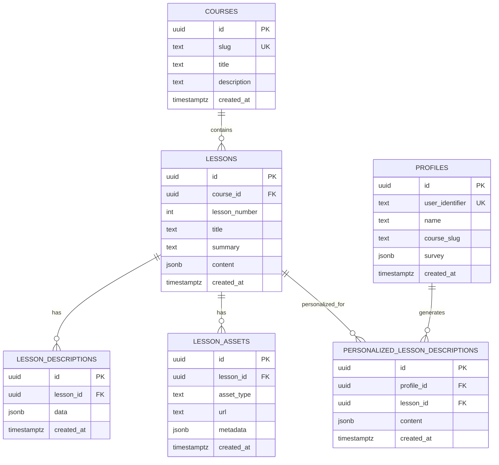

# Data Models & Database Schema

<cite>
**Referenced Files in This Document**   
- [001_init.sql](file://migrations/001_init.sql)
- [types.ts](file://lib/supabase/types.ts)
- [update-user-personalizations.ts](file://scripts/update-user-personalizations.ts)
- [personalized-lesson.tsx](file://components/personalizations/personalized-lesson.tsx)
- [5-f9b62dc5-9b76-491d-8b9b-2b72411df740-final.json](file://store/shvz/5-f9b62dc5-9b76-491d-8b9b-2b72411df740-final.json)
- [1-1-f9b62dc5-9b76-491d-8b9b-2b72411df740-final-backup.json](file://store/shvz/1-1-f9b62dc5-9b76-491d-8b9b-2b72411df740-final-backup.json)
</cite>

## Table of Contents
1. [Introduction](#introduction)
2. [Database Schema](#database-schema)
3. [Core Data Tables](#core-data-tables)
4. [JSON Structure in Personalization](#json-structure-in-personalization)
5. [TypeScript Interfaces](#typescript-interfaces)
6. [Data Access Patterns](#data-access-patterns)
7. [Data Lifecycle Management](#data-lifecycle-management)
8. [Sample Data Records](#sample-data-records)
9. [Conclusion](#conclusion)

## Introduction
This document provides comprehensive documentation for the data models and database schema used in the persona application. It details the core database tables, their relationships, constraints, and indexes. It also covers the TypeScript interfaces that represent these models, the JSON structure used for personalization content, and how data is accessed and managed throughout its lifecycle. The system is designed to support personalized learning experiences based on user profiles and survey data.

## Database Schema
The database schema is defined in a PostgreSQL migration file and implements a relational structure with JSONB support for flexible content storage. The schema includes tables for courses, lessons, profiles, lesson descriptions, personalized lesson descriptions, and lesson assets. All tables use UUIDs as primary keys and include timestamp triggers to ensure consistent creation times.



**Diagram sources**
- [001_init.sql](file://migrations/001_init.sql#L1-L88)

**Section sources**
- [001_init.sql](file://migrations/001_init.sql#L1-L88)

## Core Data Tables
The application's data model centers around three primary tables: `profiles`, `lessons`, and `personalized_lesson_descriptions`. These tables are interconnected through foreign key relationships and support the core functionality of user profiling, lesson management, and content personalization.

### profiles Table
The `profiles` table stores user profile information with a unique identifier, name, course association, and survey data in JSON format.

**Structure:**
- `id`: UUID primary key
- `user_identifier`: Unique text identifier (e.g., user ID from external system)
- `name`: User's name
- `course_slug`: Reference to course via slug
- `survey`: JSONB field storing user survey responses
- `created_at`: Timestamp with timezone

**Constraints:**
- Primary key on `id`
- Unique constraint on `user_identifier`
- Trigger to set timestamps

**Indexes:**
- Unique index on `user_identifier`

**Section sources**
- [001_init.sql](file://migrations/001_init.sql#L33-L39)
- [types.ts](file://lib/supabase/types.ts#L50-L65)

### lessons Table
The `lessons` table contains information about individual lessons within courses, including metadata and content.

**Structure:**
- `id`: UUID primary key
- `course_id`: Foreign key to courses table
- `lesson_number`: Integer indicating lesson order
- `title`: Lesson title
- `summary`: Text summary of the lesson
- `content`: JSONB field for lesson content
- `created_at`: Timestamp with timezone

**Constraints:**
- Primary key on `id`
- Foreign key constraint on `course_id` with cascade delete
- Unique constraint on combination of `course_id` and `lesson_number`
- Trigger to set timestamps

**Indexes:**
- Unique index on (`course_id`, `lesson_number`)

**Section sources**
- [001_init.sql](file://migrations/001_init.sql#L15-L24)
- [types.ts](file://lib/supabase/types.ts#L20-L35)

### personalized_lesson_descriptions Table
The `personalized_lesson_descriptions` table stores personalized content for each user-lesson combination.

**Structure:**
- `id`: UUID primary key
- `profile_id`: Foreign key to profiles table
- `lesson_id`: Foreign key to lessons table
- `content`: JSONB field containing personalized content
- `created_at`: Timestamp with timezone

**Constraints:**
- Primary key on `id`
- Foreign key constraints on `profile_id` and `lesson_id` with cascade delete
- Unique constraint on combination of `profile_id` and `lesson_id`
- Trigger to set timestamps

**Indexes:**
- Unique index on (`profile_id`, `lesson_id`)

**Section sources**
- [001_init.sql](file://migrations/001_init.sql#L58-L66)
- [types.ts](file://lib/supabase/types.ts#L78-L93)

## JSON Structure in Personalization
The personalization system uses a standardized JSON structure within the `content` field of the `personalized_lesson_descriptions` table. This structure enables consistent rendering of personalized content across the application.

### Key Fields
The following fields are used in the personalization JSON structure:

- `summary_short`: Brief personalized summary of the lesson
- `why_watch`: Explanation of why this lesson is relevant to the user
- `quick_action`: Immediate action the user can take
- `social_share`: Suggested social media message
- `homework_20m`: 20-minute homework assignment

### Field Descriptions
**summary_short**: A concise, personalized description of the lesson that incorporates the user's name and goals.

**why_watch**: Explains the relevance of the lesson based on the user's motivations, skills wanted, and expected results from their survey.

**quick_action**: Provides a simple, immediate action the user can take, often adapted to their available practice model.

**social_share**: A ready-to-use message the user can share on social media about their learning progress.

**homework_20m**: A detailed 20-minute homework assignment that incorporates the user's specific situation and practice model.

### Example Structure
```json
{
  "summary_short": "Personalized lesson summary",
  "why_watch": "Explanation tailored to user's motivation",
  "quick_action": "Immediate action based on user's context",
  "social_share": "Social media message",
  "homework_20m": "Detailed homework assignment"
}
```

**Section sources**
- [5-f9b62dc5-9b76-491d-8b9b-2b72411df740-final.json](file://store/shvz/5-f9b62dc5-9b76-491d-8b9b-2b72411df740-final.json#L1-L7)
- [update-user-personalizations.ts](file://scripts/update-user-personalizations.ts#L150-L180)

## TypeScript Interfaces
The application defines TypeScript interfaces in `types.ts` that correspond to the database schema, providing type safety for database operations.

### Database Interface
The root `Database` interface defines the public schema with all tables and their row, insert, and update types.

### Table-Specific Interfaces
Each table has three interface variants:
- `Row`: Represents the full data structure when reading from the database
- `Insert`: Represents the data structure for inserting new records
- `Update`: Represents the data structure for updating existing records

For example, the `profiles` table has:
- `Row`: Includes all fields including `id` and `created_at`
- `Insert`: Makes `id` and `created_at` optional
- `Update`: Makes all fields optional

The `survey` and `content` fields use the `Json` type which supports strings, numbers, booleans, null, objects, and arrays, allowing flexible data storage.

**Section sources**
- [types.ts](file://lib/supabase/types.ts#L1-L139)

## Data Access Patterns
The application follows specific patterns for accessing and manipulating data, particularly for personalized content.

### Reading Personalized Content
Personalized lesson content is retrieved by joining the `profiles`, `lessons`, and `personalized_lesson_descriptions` tables. The application first fetches the user profile, then all lessons for the course, and finally the personalized descriptions for each lesson.

### Creating/Updating Personalizations
The system uses a replace pattern rather than update: when generating new personalizations, it first deletes existing ones for a profile, then inserts new records. This ensures consistency and prevents stale data.

### API Endpoints
The application provides API endpoints for managing personalizations:
- `POST /api/personalizations`: Create or update a personalization
- `DELETE /api/personalizations`: Remove a personalization

These endpoints validate input and return appropriate success or error responses.

**Section sources**
- [update-user-personalizations.ts](file://scripts/update-user-personalizations.ts#L40-L130)
- [PERSONALIZATION_API.md](file://PERSONALIZATION_API.md#L1-L271)

## Data Lifecycle Management
The application implements specific processes for managing the lifecycle of personalization data.

### Personalization Update Process
The `update-user-personalizations.ts` script handles the complete lifecycle of personalization data:

1. Retrieve the user's profile and survey data
2. Fetch all lessons for the course
3. Delete existing personalizations for the profile
4. Generate new personalizations using AI based on survey data
5. Insert new personalization records

This process ensures that personalizations are always up-to-date with the latest user information.

### Retention Policies
The database does not have explicit retention policies defined in the schema. However, the cascade delete constraints ensure that when a profile or lesson is deleted, all associated personalizations are automatically removed.

### Update Scripts
Several scripts manage data lifecycle:
- `update-user-personalizations.ts`: Full personalization regeneration
- `update-user-simple.ts`: Simplified update process
- `update-user-via-api.ts`: Updates using API endpoints

These scripts can be run manually or scheduled to maintain data freshness.

**Section sources**
- [update-user-personalizations.ts](file://scripts/update-user-personalizations.ts#L1-L235)

## Sample Data Records
The following examples illustrate typical data records in the system.

### Profile Record
```json
{
  "id": "a954c858-888d-4e68-b1cd-5d0b2943d207",
  "user_identifier": "21179358",
  "name": "Alexey",
  "course_slug": "shvz",
  "survey": {
    "motivation": ["career_change", "help_others"],
    "target_clients": "office_workers",
    "skills_wanted": "pain_relief_techniques",
    "fears": ["hurting_clients"],
    "wow_result": "become_expert_massager",
    "practice_model": "friend"
  },
  "created_at": "2025-10-13T10:00:00Z"
}
```

### Personalized Lesson Description
```json
{
  "summary_short": "Урок 5: На этом уроке вы изучите основные приемы функционального массажа, адаптированные под вашу цель стать экспертом в массаже.",
  "why_watch": "Этот урок особенно важен для вас, Алексей, так как вы хотите помочь офисным работникам снимать напряжение. Вы научитесь работать с мышцами, которые чаще всего страдают от сидячей работы.",
  "quick_action": "Приготовьте массажное масло и попробуйте проработать малую грудную мышцу на друге, следуя инструкциям урока.",
  "social_share": "Изучаю техники функционального массажа для помощи офисным работникам! #массаж #функциональныймассаж",
  "homework_20m": "1. Подготовьте массажное масло. 2. Попросите друга помочь с практикой. 3. Потренируйтесь находить клювовидный отросток. 4. Проработайте грудинно-ключично-сосцевидную мышцу. 5. Практикуйтесь 10-15 минут, следя за реакцией."
}
```

**Section sources**
- [5-f9b62dc5-9b76-491d-8b9b-2b72411df740-final.json](file://store/shvz/5-f9b62dc5-9b76-491d-8b9b-2b72411df740-final.json#L1-L7)
- [1-1-f9b62dc5-9b76-491d-8b9b-2b72411df740-final-backup.json](file://store/shvz/1-1-f9b62dc5-9b76-491d-8b9b-2b72411df740-final-backup.json#L1-L24)

## Conclusion
The persona application's data model is designed to support personalized learning experiences through a flexible database schema that combines relational integrity with JSON flexibility. The core tables—profiles, lessons, and personalized_lesson_descriptions—work together to store user information, lesson content, and personalized descriptions. The use of JSONB fields allows for rich, structured personalization content that can be easily extended. TypeScript interfaces provide type safety, while scripts and API endpoints enable automated personalization updates. The system's design supports efficient data access patterns and proper lifecycle management, ensuring users receive relevant, up-to-date content tailored to their individual needs and goals.