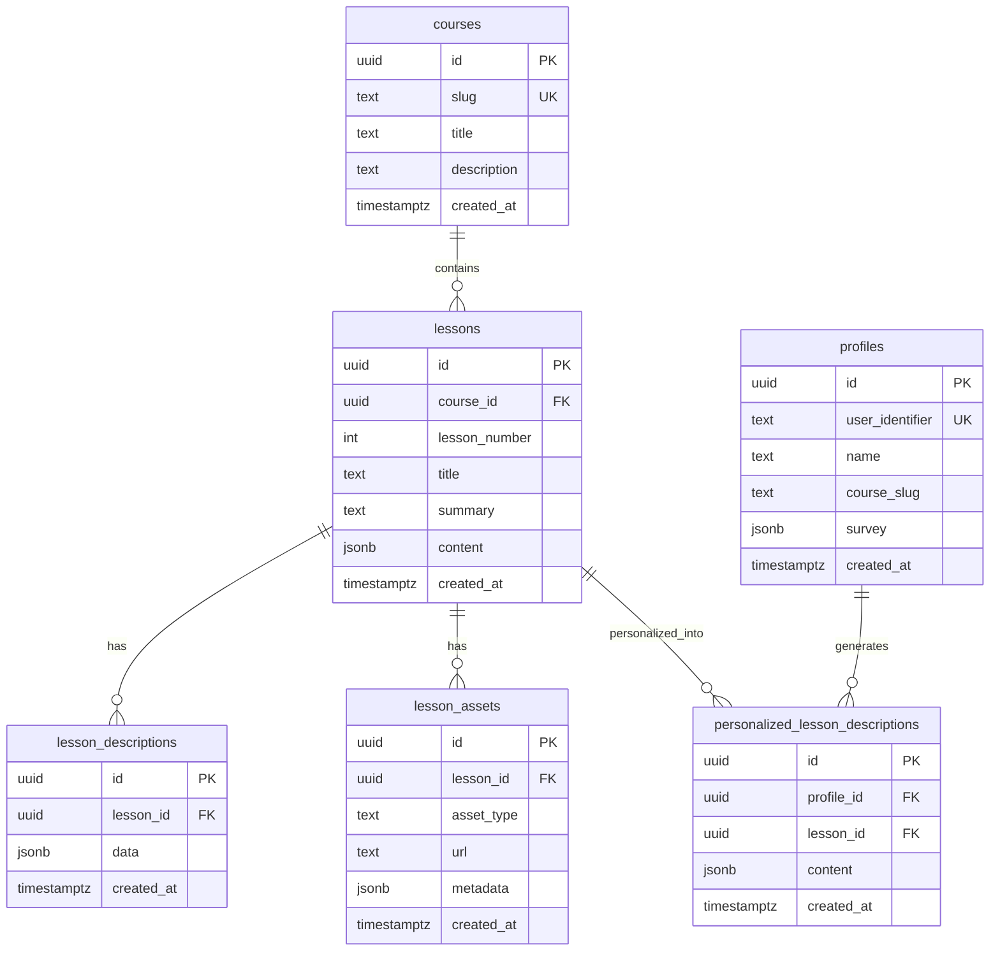

# Database Schema

<cite>
**Referenced Files in This Document**   
- [001_init.sql](file://migrations/001_init.sql)
- [types.ts](file://lib/supabase/types.ts)
</cite>

## Table of Contents
1. [Introduction](#introduction)
2. [Core Tables](#core-tables)
3. [Data Model Relationships](#data-model-relationships)
4. [TypeScript Interface Mapping](#typescript-interface-mapping)
5. [Query Patterns](#query-patterns)
6. [Performance Considerations](#performance-considerations)
7. [Appendices](#appendices)

## Introduction
This document provides comprehensive documentation for the PostgreSQL database schema used in the persona application. The schema is defined in `001_init.sql` and supports a personalized learning experience by storing course content, user profiles, and customized lesson descriptions. The database design enables efficient retrieval of educational content tailored to individual users based on their survey responses and preferences. The schema leverages PostgreSQL's JSONB capabilities for flexible storage of dynamic content while maintaining relational integrity through proper primary and foreign key constraints.

**Section sources**
- [001_init.sql](file://migrations/001_init.sql#L1-L88)
- [types.ts](file://lib/supabase/types.ts#L1-L139)

## Core Tables

### courses
The `courses` table stores metadata about available courses in the system. Each course is uniquely identified by a UUID and has a human-readable slug that serves as a URL-friendly identifier. The table includes basic information such as title and optional description, with a creation timestamp automatically managed by the `set_timestamps()` trigger.

**Section sources**
- [001_init.sql](file://migrations/001_init.sql#L4-L8)

### lessons
The `lessons` table contains individual lesson content within courses. Each lesson belongs to a specific course via the `course_id` foreign key and is ordered by `lesson_number` within that course. The `content` field uses JSONB to store structured lesson data flexibly, while the `unique(course_id, lesson_number)` constraint ensures no duplicate lesson numbers exist within the same course.

**Section sources**
- [001_init.sql](file://migrations/001_init.sql#L10-L18)

### lesson_descriptions
This table stores standardized descriptions for lessons in JSONB format. Each lesson can have one description record, enforced by the unique constraint on `lesson_id`. The `data` JSONB field allows for rich, structured content that can include various metadata about the lesson.

**Section sources**
- [001_init.sql](file://migrations/001_init.sql#L21-L26)

### profiles
The `profiles` table maintains user profile information with `user_identifier` serving as a unique external identifier (e.g., from an authentication system). Profiles may contain survey responses in the `survey` JSONB field, which drives personalization. The `course_slug` field indicates which course the user is currently engaged with.

**Section sources**
- [001_init.sql](file://migrations/001_init.sql#L29-L36)

### personalized_lesson_descriptions
This central table enables the personalization workflow by storing customized lesson descriptions for specific user profiles. Each record links a `profile_id` to a `lesson_id` with personalized `content` in JSONB format. The unique constraint on `(profile_id, lesson_id)` ensures each user receives only one personalized version per lesson.

**Section sources**
- [001_init.sql](file://migrations/001_init.sql#L38-L45)

### lesson_assets
The `lesson_assets` table manages supplementary materials for lessons, such as videos, documents, or images. Each asset is associated with a lesson and includes an `asset_type` discriminator, URL reference, and optional metadata in JSONB format for additional context.

**Section sources**
- [001_init.sql](file://migrations/001_init.sql#L47-L54)

## Data Model Relationships



**Diagram sources**
- [001_init.sql](file://migrations/001_init.sql#L4-L54)

**Section sources**
- [001_init.sql](file://migrations/001_init.sql#L4-L54)

## TypeScript Interface Mapping

The database schema is strongly typed in the application through TypeScript interfaces defined in `types.ts`. Each table has corresponding `Row`, `Insert`, and `Update` types that reflect the database structure and constraints.

### Type Mapping Strategy
- **Row types**: Represent complete database records as returned by queries
- **Insert types**: Define optional fields for new record creation (typically excluding system-managed fields)
- **Update types**: Specify optional fields for modifications, allowing partial updates

For example, the `courses` table maps to:
- `Row`: Requires all fields including `id` and `created_at`
- `Insert`: Makes `id` and `created_at` optional (auto-generated)
- `Update`: Makes all fields optional except `id`

This pattern enables type-safe database operations while accommodating the database's default value generation.

**Section sources**
- [types.ts](file://lib/supabase/types.ts#L1-L139)

## Query Patterns

### Personalization Workflow
The application follows a standard query pattern for delivering personalized content:

1. Retrieve user profile by `user_identifier`
2. Find the associated course using `course_slug`
3. Get all lessons for that course ordered by `lesson_number`
4. Attempt to retrieve personalized description using `profile_id` and `lesson_id`
5. Fall back to standard lesson description if personalization doesn't exist

### Common Queries
- **Get course by slug**: `SELECT * FROM courses WHERE slug = $1`
- **Get lessons by course**: `SELECT * FROM lessons WHERE course_id = $1 ORDER BY lesson_number`
- **Get personalization**: `SELECT * FROM personalized_lesson_descriptions WHERE profile_id = $1 AND lesson_id = $2`
- **Create/update profile**: `INSERT INTO profiles ... ON CONFLICT(user_identifier) DO UPDATE SET survey = EXCLUDED.survey`

These patterns are implemented in the API routes and optimized for the personalization use case.

**Section sources**
- [001_init.sql](file://migrations/001_init.sql#L1-L88)

## Performance Considerations

### Indexing Strategy
The schema relies on PostgreSQL's automatic index creation for:
- Primary keys (all `id` fields)
- Unique constraints (`slug` in courses, `user_identifier` in profiles, composite unique constraints)

No additional indexes are explicitly defined in the schema, suggesting that the current query patterns perform adequately with the existing constraints. For scale, consider adding:
- Index on `profiles(course_slug)` for faster course-based profile lookups
- Index on `lessons(course_id, lesson_number)` to optimize lesson ordering queries

### JSONB Performance
The extensive use of JSONB fields (`content`, `survey`, `data`) provides flexibility but requires careful consideration:
- Use GIN indexes on JSONB columns if querying within the JSON structure
- Keep JSONB documents reasonably sized to avoid bloating row size
- Consider extracting frequently queried JSON fields to dedicated columns if query performance degrades

### Trigger Overhead
The `set_timestamps()` trigger is applied to all tables, ensuring consistent timestamp management. This function is lightweight but adds minimal overhead to all INSERT and UPDATE operations. The trigger prevents client-side timestamp manipulation, enhancing data integrity.

**Section sources**
- [001_init.sql](file://migrations/001_init.sql#L57-L88)

## Appendices

### Sample Records

**courses**
```json
{
  "id": "a1b2c3d4-e5f6-7890-g1h2-i3j4k5l6m7n8",
  "slug": "shvz",
  "title": "Сила Хорошего Воспитания",
  "description": "Comprehensive parenting course",
  "created_at": "2025-01-15T10:30:00Z"
}
```

**profiles**
```json
{
  "id": "b2c3d4e5-f6g7-8901-h2i3-j4k5l6m7n8o9",
  "user_identifier": "auth0|1234567890",
  "name": "Anna Petrova",
  "course_slug": "shvz",
  "survey": {
    "child_age": "3-6",
    "parenting_style": "gentle",
    "challenges": ["bedtime", "mealtimes"]
  },
  "created_at": "2025-01-15T10:35:00Z"
}
```

**personalized_lesson_descriptions**
```json
{
  "id": "c3d4e5f6-g7h8-9012-i3j4-k5l6m7n8o9p0",
  "profile_id": "b2c3d4e5-f6g7-8901-h2i3-j4k5l6m7n8o9",
  "lesson_id": "d4e5f6g7-h8i9-0123-j4k5-l6m7n8o9p0q1",
  "content": {
    "title": "Gentle Bedtime Routine for 3-6 Year Olds",
    "approach": "Use storytelling and gradual transitions",
    "tips": ["Establish consistent schedule", "Create calming environment"]
  },
  "created_at": "2025-01-15T10:40:00Z"
}
```

### Trigger Function
The `set_timestamps()` function ensures consistent timestamp management:
- On INSERT: Sets `created_at` to current time if not provided
- On UPDATE: Preserves original `created_at` value
- Applied to all core tables via triggers

This prevents timestamp inconsistencies and ensures auditability of record creation times.

**Section sources**
- [001_init.sql](file://migrations/001_init.sql#L57-L88)