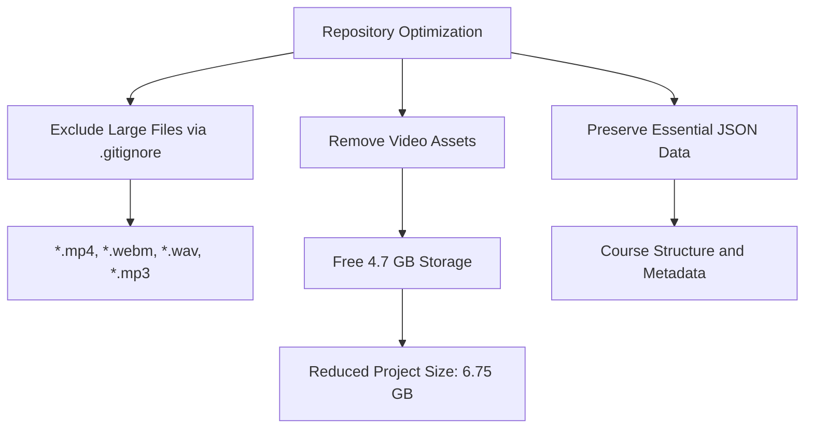
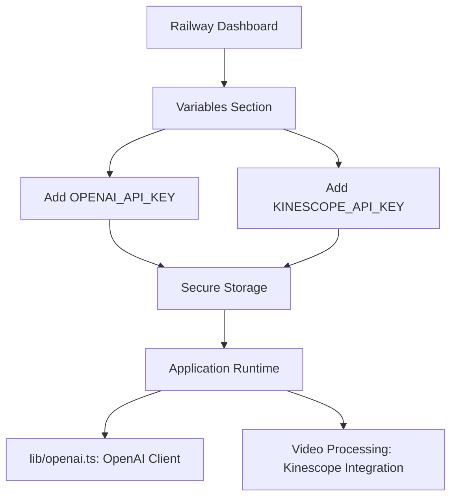
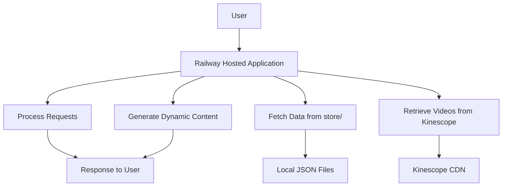
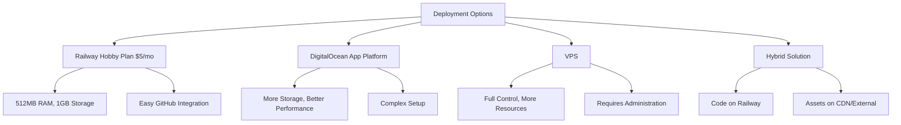

# Railway Deployment

<cite>
**Referenced Files in This Document**   
- [railway.json](file://railway.json)
- [start_server.sh](file://start_server.sh)
- [.gitignore](file://.gitignore)
- [lib/openai.ts](file://lib/openai.ts)
- [shvz_video_urls.txt](file://shvz_video_urls.txt)
- [RAILWAY_DEPLOYMENT.md](file://RAILWAY_DEPLOYMENT.md)
- [RAILWAY_DEPLOYMENT_FINAL.md](file://RAILWAY_DEPLOYMENT_FINAL.md)
</cite>

## Table of Contents
1. [Introduction](#introduction)
2. [Repository Optimization](#repository-optimization)
3. [Railway Configuration](#railway-configuration)
4. [Environment Variables Setup](#environment-variables-setup)
5. [Post-Deployment Data Loading](#post-deployment-data-loading)
6. [Hybrid Deployment Model](#hybrid-deployment-model)
7. [Pricing and Resource Comparison](#pricing-and-resource-comparison)
8. [Deployment Verification and Troubleshooting](#deployment-verification-and-troubleshooting)

## Introduction
This document provides comprehensive guidance for deploying the Persona application on Railway, a cloud platform for hosting web applications. The deployment process involves optimizing the repository size, configuring Railway settings, setting up environment variables, and managing static assets efficiently. The application leverages PHP as the runtime environment with Nixpacks for build automation, and utilizes external APIs for AI processing and video hosting.

**Section sources**
- [RAILWAY_DEPLOYMENT.md](file://RAILWAY_DEPLOYMENT.md#L0-L160)
- [RAILWAY_DEPLOYMENT_FINAL.md](file://RAILWAY_DEPLOYMENT_FINAL.md#L0-L152)

## Repository Optimization
To ensure successful deployment within Railway's resource constraints, the repository must be optimized by excluding large files through proper .gitignore configuration and removing video assets. The current .gitignore file is configured to exclude media files while preserving essential data structures.

The optimization strategy includes:
- Excluding all .mp4, .webm, .wav, and .mp3 files from version control
- Removing video assets that consume significant storage space (approximately 4.7 GB freed)
- Preserving essential JSON data files in the store/ directory
- Maintaining directory structure for course data while removing binary content

This optimization reduces the project size from 11.34 GB to 6.75 GB, making it suitable for Railway's Hobby Plan storage limitations.



**Diagram sources**
- [.gitignore](file://.gitignore#L0-L61)
- [RAILWAY_DEPLOYMENT_FINAL.md](file://RAILWAY_DEPLOYMENT_FINAL.md#L0-L152)

**Section sources**
- [.gitignore](file://.gitignore#L0-L61)
- [RAILWAY_DEPLOYMENT_FINAL.md](file://RAILWAY_DEPLOYMENT_FINAL.md#L0-L152)

## Railway Configuration
The railway.json configuration file defines the deployment settings for the application on the Railway platform. This configuration specifies the build process, start command, health check settings, and timeout values.

The configuration uses Nixpacks as the builder, which automatically detects the application type and sets up the appropriate environment. The start command "php -S 0.0.0.0:$PORT" launches a PHP development server that listens on the port assigned by Railway. The health check path is set to the root endpoint ("/") with a timeout of 100 seconds, allowing sufficient time for the application to respond during traffic spikes or processing heavy requests.

```json
{
  "build": {
    "builder": "NIXPACKS"
  },
  "deploy": {
    "startCommand": "php -S 0.0.0.0:$PORT",
    "healthcheckPath": "/",
    "healthcheckTimeout": 100
  }
}
```

**Diagram sources**
- [railway.json](file://railway.json#L0-L10)

**Section sources**
- [railway.json](file://railway.json#L0-L10)
- [start_server.sh](file://start_server.sh#L0-L60)

## Environment Variables Setup
Environment variables are configured through the Railway dashboard to securely store sensitive API keys without exposing them in the codebase. Two essential environment variables must be set:

- **OPENAI_API_KEY**: Used for accessing OpenAI services in the application, specifically referenced in lib/openai.ts where the OpenAI client is initialized with process.env.OPENAI_API_KEY
- **KINESCOPE_API_KEY**: Used for accessing Kinescope video hosting services, with video URLs listed in shvz_video_urls.txt pointing to the Kinescope platform

These variables are added in the Railway dashboard under the "Variables" section of the project settings. The application retrieves these values at runtime through Node.js environment variable access, ensuring secure handling of authentication credentials.



**Diagram sources**
- [lib/openai.ts](file://lib/openai.ts#L0-L2)
- [shvz_video_urls.txt](file://shvz_video_urls.txt#L0-L11)

**Section sources**
- [lib/openai.ts](file://lib/openai.ts#L0-L2)
- [shvz_video_urls.txt](file://shvz_video_urls.txt#L0-L11)
- [RAILWAY_DEPLOYMENT.md](file://RAILWAY_DEPLOYMENT.md#L0-L160)

## Post-Deployment Data Loading
After successful deployment, course content must be loaded into the store/ directory for the application to function properly. The store/ directory contains course-specific JSON files that define lesson structures, user profiles, and processing status.

The data loading process involves:
- Creating the store/ directory structure if it doesn't exist
- Populating the store/ directory with course JSON files such as course.json, course_quiz.json, and individual lesson.json files
- Maintaining user profile data in user_profiles.json
- Preserving processing state in processing_queue.json and processing_status.json

The application expects this data to be available at runtime, as demonstrated in the start_server.sh script which checks for the store/ directory and creates it if missing. This separation of code and data allows for easier updates and maintenance of course content without redeploying the entire application.

**Section sources**
- [store](file://store)
- [start_server.sh](file://start_server.sh#L0-L60)

## Hybrid Deployment Model
The application employs a hybrid deployment model where the application code runs on Railway while static assets may be served through external services. This architecture optimizes resource usage and performance by separating compute-intensive application logic from storage-intensive media files.

The model works as follows:
- Application code, configuration, and lightweight data (JSON files) are hosted on Railway
- Video assets are hosted externally on Kinescope, as evidenced by the URLs in shvz_video_urls.txt
- The application acts as a middleware layer that processes requests and retrieves content from various sources
- Static assets can be served via CDN or external storage solutions to reduce load on the Railway instance

This approach allows the application to operate within Railway's 1GB storage limit while still providing access to rich media content. It also improves performance by leveraging specialized content delivery networks for media streaming.



**Diagram sources**
- [shvz_video_urls.txt](file://shvz_video_urls.txt#L0-L11)
- [store](file://store)
- [start_server.sh](file://start_server.sh#L0-L60)

**Section sources**
- [shvz_video_urls.txt](file://shvz_video_urls.txt#L0-L11)
- [store](file://store)
- [start_server.sh](file://start_server.sh#L0-L60)

## Pricing and Resource Comparison
The application is designed to run on Railway's Hobby Plan, which costs $5 per month and provides 512MB of RAM and 1GB of storage. This plan is suitable for the optimized application size of 6.75 GB (after excluding video assets).

Key specifications of the Hobby Plan:
- 512MB RAM: Sufficient for PHP server and application logic
- 1GB Storage: Adequate for code and JSON data when videos are excluded
- Automatic scaling and deployment from GitHub

Alternative solutions include:
- **DigitalOcean App Platform**: Offers more storage and better performance but requires more complex configuration
- **VPS (Virtual Private Server)**: Provides complete control and more resources but requires system administration expertise
- **Hybrid solution**: Railway for code with CDN or external storage for static assets, combining cost efficiency with performance

The current optimization strategy makes Railway the most cost-effective option, saving approximately 40% of storage space by removing video files and retaining only essential data.



**Diagram sources**
- [RAILWAY_DEPLOYMENT_FINAL.md](file://RAILWAY_DEPLOYMENT_FINAL.md#L0-L152)

**Section sources**
- [RAILWAY_DEPLOYMENT_FINAL.md](file://RAILWAY_DEPLOYMENT_FINAL.md#L0-L152)

## Deployment Verification and Troubleshooting
After deployment, verify the application is functioning correctly by accessing the provided URLs. Common endpoints include the main application page and various PHP scripts for course viewing and survey processing.

Troubleshooting deployment failures should focus on:
- **Resource limits**: Check if the application exceeds 512MB RAM or 1GB storage
- **Configuration errors**: Verify railway.json settings and environment variables
- **Missing dependencies**: Ensure PHP and required extensions are available
- **File permissions**: Confirm the store/ directory is writable

Common issues and solutions:
- **Error 500**: Check environment variables and application logs in Railway dashboard
- **Slow loading**: Verify video files have been removed and only essential JSON data remains
- **API errors**: Validate OPENAI_API_KEY and KINESCOPE_API_KEY are correctly set
- **Health check failures**: Ensure the root path ("/") returns a successful response within 100 seconds

The start_server.sh script provides diagnostic information during local testing, including checks for PHP and FFmpeg installation, which can help identify potential deployment issues.

**Section sources**
- [start_server.sh](file://start_server.sh#L0-L60)
- [RAILWAY_DEPLOYMENT.md](file://RAILWAY_DEPLOYMENT.md#L0-L160)