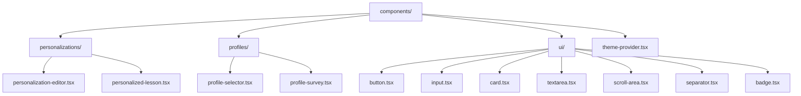
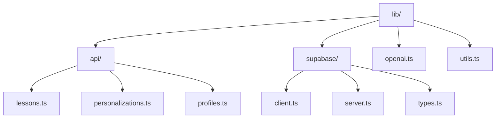
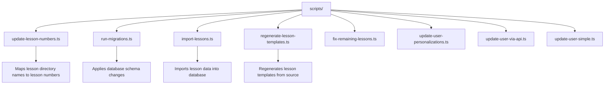
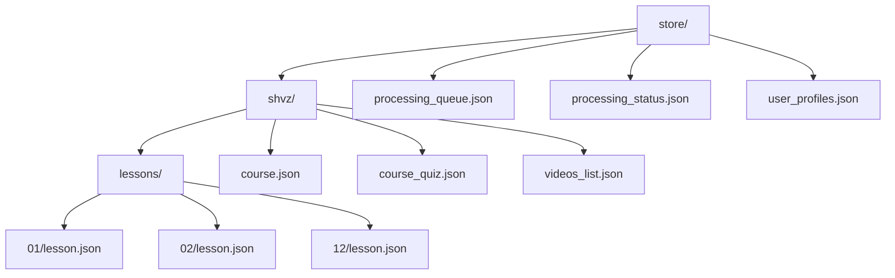
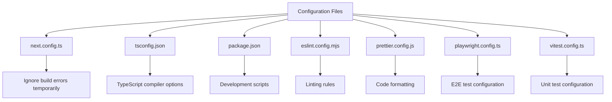

# Directory Structure

<cite>
**Referenced Files in This Document**   
- [app/page.tsx](file://app/page.tsx)
- [app/layout.tsx](file://app/layout.tsx)
- [app/globals.css](file://app/globals.css)
- [components/ui/button.tsx](file://components/ui/button.tsx)
- [lib/utils.ts](file://lib/utils.ts)
- [lib/api/personalizations.ts](file://lib/api/personalizations.ts)
- [next.config.ts](file://next.config.ts)
- [package.json](file://package.json)
- [tsconfig.json](file://tsconfig.json)
- [app/api/persona/personalize-template/route.ts](file://app/api/persona/personalize-template/route.ts)
- [scripts/update-lesson-numbers.ts](file://scripts/update-lesson-numbers.ts)
- [store/shvz/course.json](file://store/shvz/course.json)
</cite>

## Table of Contents
1. [Introduction](#introduction)
2. [Top-Level Directory Overview](#top-level-directory-overview)
3. [App Directory: Pages and Routing](#app-directory-pages-and-routing)
4. [Components Directory: Reusable UI Elements](#components-directory-reusable-ui-elements)
5. [Lib Directory: Shared Utilities and Services](#lib-directory-shared-utilities-and-services)
6. [Migrations Directory: Database Schema Management](#migrations-directory-database-schema-management)
7. [Public Directory: Static Assets](#public-directory-static-assets)
8. [Scripts Directory: Data Operations and Maintenance](#scripts-directory-data-operations-and-maintenance)
9. [Store Directory: Lesson Templates and Course Data](#store-directory-lesson-templates-and-course-data)
10. [Test Directory: Testing Infrastructure](#test-directory-testing-infrastructure)
11. [Configuration Files and Development Workflow](#configuration-files-and-development-workflow)
12. [File Organization and Naming Conventions](#file-organization-and-naming-conventions)
13. [Guidance for Extending the System](#guidance-for-extending-the-system)

## Introduction
This document provides a comprehensive overview of the project's directory layout and file organization. The structure follows modern Next.js conventions while incorporating domain-specific patterns for a personalized educational platform. The architecture emphasizes separation of concerns, scalability, and maintainability through well-defined directories for application logic, UI components, utilities, data management, and testing. Special attention is given to routing patterns, API organization, and the management of lesson templates and personalization data.

## Top-Level Directory Overview
The project follows a feature-oriented organization with clear separation between application code, shared resources, configuration, and operational scripts. Key directories include:
- **app/**: Contains all Next.js pages, layouts, and API routes using the App Router
- **components/**: Houses reusable UI components organized by domain
- **lib/**: Stores shared utilities, API clients, and service integrations
- **migrations/**: Manages database schema evolution
- **public/**: Serves static assets directly to clients
- **scripts/**: Contains maintenance and data processing operations
- **store/**: Holds lesson templates and course-related JSON data
- **test/**: Contains unit, integration, and end-to-end tests

**Section sources**
- [app/page.tsx](file://app/page.tsx#L1-L22)
- [package.json](file://package.json#L1-L70)

## App Directory: Pages and Routing
The `app/` directory implements Next.js App Router conventions with server components as the default. It contains the main application pages, layouts, and API routes. The directory uses special naming patterns for route organization:
- Parentheses `(dashboard)` denote route groups that don't appear in the URL path but help organize related routes
- Brackets `[profileId]` indicate dynamic route segments that capture parameters from the URL
- The `api/` subdirectory contains route handlers using the Route Handler pattern (`.route.ts` files)

The root layout (`layout.tsx`) provides theme context and metadata, while `page.tsx` serves as the homepage. The dashboard route group organizes user-specific functionality, and the survey routes support iframe embedding with dedicated layouts.

```mermaid
graph TD
A[app/] --> B[(dashboard)/]
A --> C[api/]
A --> D[survey/]
A --> E[page.tsx]
A --> F[layout.tsx]
A --> G[globals.css]
B --> H[dashboard/templates/]
B --> I[profile/[profileId]/]
C --> J[persona/personalize-template/route.ts]
C --> K[lessons/route.ts]
D --> L[iframe/layout.tsx]
D --> M[iframe/page.tsx]
```

**Diagram sources**
- [app/page.tsx](file://app/page.tsx#L1-L22)
- [app/layout.tsx](file://app/layout.tsx#L1-L25)
- [app/api/persona/personalize-template/route.ts](file://app/api/persona/personalize-template/route.ts#L1-L294)

**Section sources**
- [app/page.tsx](file://app/page.tsx#L1-L22)
- [app/layout.tsx](file://app/layout.tsx#L1-L25)
- [app/globals.css](file://app/globals.css#L1-L123)

## Components Directory: Reusable UI Elements
The `components/` directory organizes UI elements by domain and functionality. It follows a modular structure with:
- Domain-specific components (personalizations, profiles) in dedicated subdirectories
- Shared UI primitives in the `ui/` directory, implementing a design system
- Global components like `theme-provider.tsx` that provide application-wide functionality

Components are implemented as React Server Components by default, with "use client" directives when client-side interactivity is required. The UI components leverage Tailwind CSS for styling and use utility functions from the `lib/` directory for class composition.



**Diagram sources**
- [components/ui/button.tsx](file://components/ui/button.tsx#L1-L61)
- [components/personalizations/personalization-editor.tsx](file://components/personalizations/personalization-editor.tsx#L1-L158)

**Section sources**
- [components/ui/button.tsx](file://components/ui/button.tsx#L1-L61)
- [components/personalizations/personalization-editor.tsx](file://components/personalizations/personalization-editor.tsx#L1-L158)

## Lib Directory: Shared Utilities and Services
The `lib/` directory contains shared utilities and service integrations used throughout the application. It is organized into subdirectories by functionality:
- `api/`: Client-side API utilities for interacting with backend services
- `supabase/`: Supabase client configuration and type definitions
- Standalone utility files for common operations

The directory exports reusable functions and types that abstract away implementation details of third-party services and common operations. The `utils.ts` file provides a `cn()` function for conditional class composition using `clsx` and `tailwind-merge`.



**Diagram sources**
- [lib/utils.ts](file://lib/utils.ts#L1-L7)
- [lib/api/personalizations.ts](file://lib/api/personalizations.ts#L1-L29)

**Section sources**
- [lib/utils.ts](file://lib/utils.ts#L1-L7)
- [lib/api/personalizations.ts](file://lib/api/personalizations.ts#L1-L29)

## Migrations Directory: Database Schema Management
The `migrations/` directory contains SQL scripts for managing the database schema. Currently, it includes a single initialization script (`001_init.sql`) that defines the initial database structure. This directory follows a sequential numbering pattern to ensure migrations are applied in the correct order. The migration system is integrated with the application through scripts in the `scripts/` directory, allowing for automated schema updates during deployment and development.

**Section sources**
- [migrations/001_init.sql](file://migrations/001_init.sql)

## Public Directory: Static Assets
The `public/` directory serves static assets directly to clients without processing. It contains:
- HTML templates for integration with external systems (GetCourse)
- CSS stylesheets for embedded content
- Test HTML files for development and debugging
- Other static resources that need direct URL access

Assets in this directory are accessible via the root URL path (e.g., `/getcourse/anketa.html`). The directory structure mirrors the desired URL structure for these static resources.

**Section sources**
- [public/getcourse/anketa.html](file://public/getcourse/anketa.html)
- [public/persona/styles.css](file://public/persona/styles.css)

## Scripts Directory: Data Operations and Maintenance
The `scripts/` directory contains Node.js scripts for data operations, maintenance tasks, and system administration. These scripts are executed via npm/pnpm commands defined in `package.json`. Key scripts include:
- Database migration and seeding operations
- Lesson number updates and data synchronization
- User personalization updates
- Template regeneration

Scripts are written in TypeScript and use `tsx` for execution. They interact with the database directly using the `pg` client or through the application's API layer. The scripts directory supports both safe and direct data manipulation operations, with appropriate error handling and logging.



**Diagram sources**
- [scripts/update-lesson-numbers.ts](file://scripts/update-lesson-numbers.ts#L1-L103)

**Section sources**
- [scripts/update-lesson-numbers.ts](file://scripts/update-lesson-numbers.ts#L1-L103)
- [package.json](file://package.json#L1-L70)

## Store Directory: Lesson Templates and Course Data
The `store/` directory contains lesson templates and course-related JSON data. It is organized by course (currently `shvz` for "Шейно-воротниковая зона") with subdirectories for:
- Individual lesson templates in the `lessons/` subdirectory
- Course metadata and configuration files
- Backup and processing status files

Lesson templates are stored as JSON files with a naming convention that includes the lesson number and a unique identifier. The directory also contains user profile data and processing queue information. This structure allows for easy template management and supports the personalization workflow by providing a clear separation between template data and personalized content.



**Diagram sources**
- [store/shvz/course.json](file://store/shvz/course.json#L1-L10)

**Section sources**
- [store/shvz/course.json](file://store/shvz/course.json#L1-L10)

## Test Directory: Testing Infrastructure
The `test/` directory contains the testing infrastructure for the application. It includes:
- Unit and integration tests for application components
- Environment-specific test configurations
- Setup files for test runners

The directory structure mirrors the application structure with dedicated test files for components and utilities. The testing stack includes Vitest for unit testing, Playwright for end-to-end testing, and MSW (Mock Service Worker) for API mocking. Test files follow a consistent naming pattern with the `.test.ts` or `.test.tsx` extension.

**Section sources**
- [test/app/app.test.tsx](file://test/app/app.test.tsx)
- [test/env/env.test.ts](file://test/env/env.test.ts)

## Configuration Files and Development Workflow
The project includes several configuration files that define the development environment, build process, and deployment settings:
- `next.config.ts`: Next.js configuration with build optimizations
- `tsconfig.json`: TypeScript compiler configuration
- `package.json`: Project metadata and script definitions
- `eslint.config.mjs`: ESLint configuration
- `prettier.config.js`: Code formatting rules
- `playwright.config.ts`: End-to-end test configuration
- `vitest.config.ts`: Unit test configuration

These files work together to provide a consistent development experience with proper type checking, linting, formatting, and testing. The `package.json` scripts enable common operations like development server startup, building, testing, and database management.



**Diagram sources**
- [next.config.ts](file://next.config.ts#L1-L16)
- [tsconfig.json](file://tsconfig.json#L1-L28)
- [package.json](file://package.json#L1-L70)

**Section sources**
- [next.config.ts](file://next.config.ts#L1-L16)
- [tsconfig.json](file://tsconfig.json#L1-L28)
- [package.json](file://package.json#L1-L70)

## File Organization and Naming Conventions
The project follows consistent naming conventions and organizational patterns:
- **File extensions**: `.tsx` for React components, `.ts` for utilities and API routes, `.json` for data files
- **Component naming**: PascalCase for component files (e.g., `Button.tsx`)
- **Utility naming**: camelCase for utility files (e.g., `utils.ts`)
- **Route naming**: lowercase with hyphens for multi-word routes
- **Dynamic routes**: bracket notation for parameterized routes (e.g., `[profileId]`)
- **Route groups**: parentheses for organizational grouping without URL impact (e.g., `(dashboard)`)

The structure prioritizes discoverability and maintainability by grouping related files together and using descriptive names that reflect their purpose. API routes use the Route Handler pattern with `.route.ts` extension to distinguish them from page components.

**Section sources**
- [app/api/persona/personalize-template/route.ts](file://app/api/persona/personalize-template/route.ts#L1-L294)
- [components/ui/button.tsx](file://components/ui/button.tsx#L1-L61)

## Guidance for Extending the System
When adding new functionality to the system, follow these guidelines:
1. **New pages**: Add to the `app/` directory using the App Router conventions
2. **New components**: Place in `components/` with appropriate subdirectory organization
3. **New utilities**: Add to `lib/` with proper categorization
4. **New API routes**: Create in `app/api/` using the Route Handler pattern
5. **New tests**: Add to `test/` with structure mirroring the application
6. **New scripts**: Place in `scripts/` for data operations and maintenance tasks

For new courses or lesson templates, create a new directory under `store/` following the existing `shvz/` pattern. When modifying database schema, add a new numbered migration to the `migrations/` directory. Always update relevant configuration files and scripts to accommodate new features.

**Section sources**
- [app/page.tsx](file://app/page.tsx#L1-L22)
- [components/ui/button.tsx](file://components/ui/button.tsx#L1-L61)
- [lib/utils.ts](file://lib/utils.ts#L1-L7)
- [scripts/update-lesson-numbers.ts](file://scripts/update-lesson-numbers.ts#L1-L103)
- [store/shvz/course.json](file://store/shvz/course.json#L1-L10)