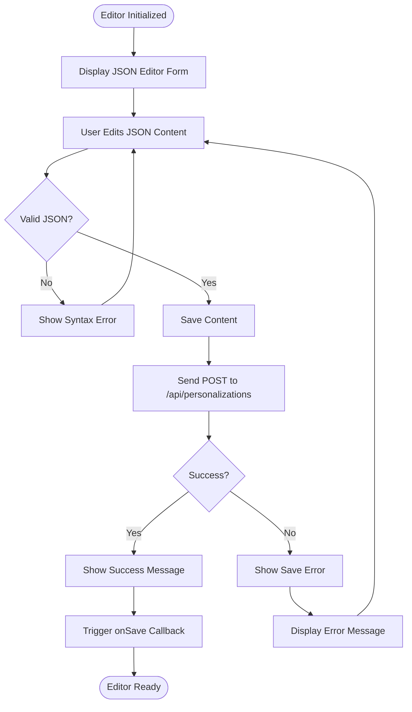
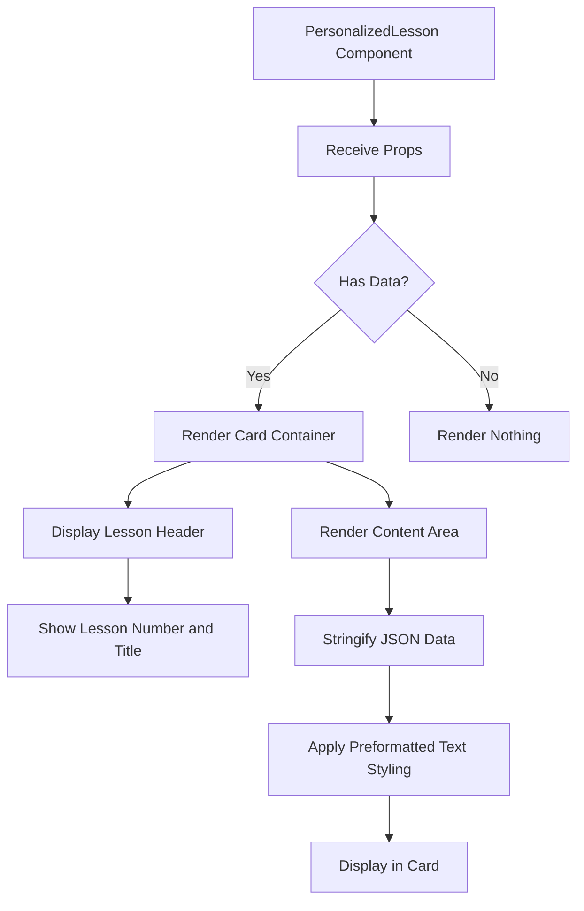
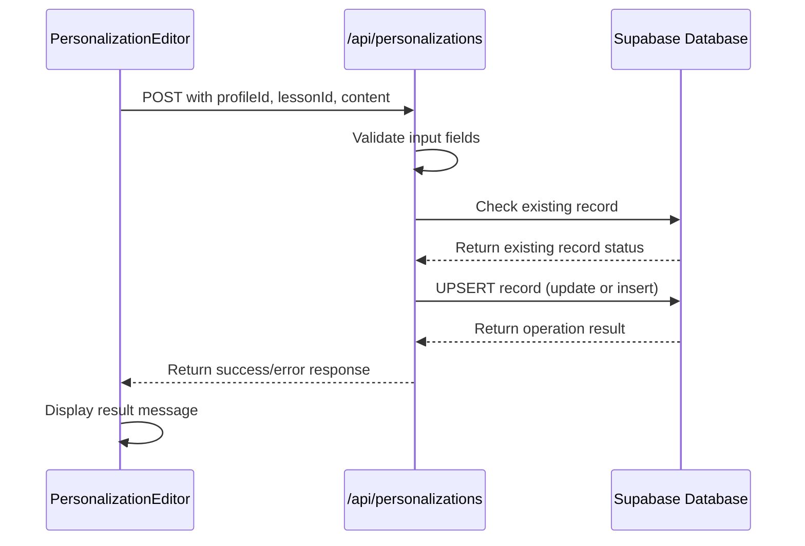
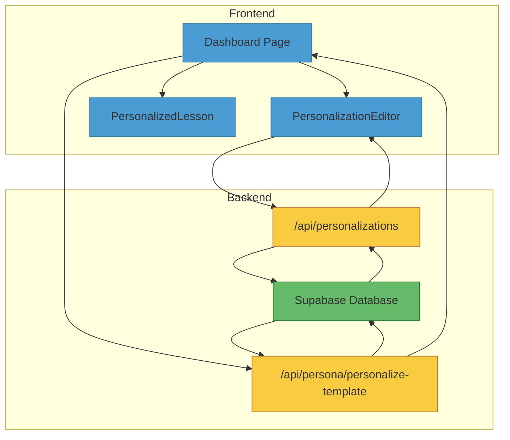

# Personalization Components

<cite>
**Referenced Files in This Document**   
- [personalization-editor.tsx](file://components/personalizations/personalization-editor.tsx)
- [personalized-lesson.tsx](file://components/personalizations/personalized-lesson.tsx)
- [route.ts](file://app/api/personalizations/route.ts)
- [personalizations.ts](file://lib/api/personalizations.ts)
- [personalization.ts](file://lib/services/personalization.ts)
- [page.tsx](file://app/(dashboard)/dashboard/page.tsx)
</cite>

## Table of Contents
1. [Introduction](#introduction)
2. [Core Components](#core-components)
3. [PersonalizationEditor Component](#personalizationeditor-component)
4. [PersonalizedLesson Component](#personalizedlesson-component)
5. [Data Flow and Integration](#data-flow-and-integration)
6. [Usage Examples](#usage-examples)
7. [Error Handling and Fallbacks](#error-handling-and-fallbacks)
8. [Performance Considerations](#performance-considerations)
9. [Integration Points](#integration-points)

## Introduction
This document provides comprehensive documentation for the personalization-specific components in the application: `PersonalizationEditor` and `PersonalizedLesson`. These components enable administrators to modify AI-generated lesson content through a JSON interface and render customized educational content based on user profiles. The system integrates with Supabase for persistent storage and provides real-time preview capabilities. The components are designed to work within a dashboard interface that allows profile selection and lesson personalization management.

## Core Components

The personalization system consists of two primary React components that work together to provide a complete personalization workflow. The `PersonalizationEditor` component enables content modification through a JSON interface, while the `PersonalizedLesson` component renders the customized content for end users. These components are integrated with backend APIs that handle data persistence in Supabase and provide the necessary data flow between the frontend and database.

**Section sources**
- [personalization-editor.tsx](file://components/personalizations/personalization-editor.tsx#L12-L154)
- [personalized-lesson.tsx](file://components/personalizations/personalized-lesson.tsx#L8-L24)

## PersonalizationEditor Component

The `PersonalizationEditor` component provides an administrative interface for modifying AI-generated lesson content through a JSON editor. It implements controlled inputs to manage the JSON content state and provides real-time validation and feedback.

### Props
The component accepts the following props:
- `profileId`: Unique identifier for the user profile being personalized
- `lessonId`: Unique identifier for the lesson being edited
- `lessonTitle`: Display title of the lesson for context
- `initialContent`: Optional existing personalization content to pre-populate the editor
- `onSave`: Optional callback function triggered after successful save operations

### Functionality
The editor features a textarea with monospace font for proper JSON formatting display. It initializes with either the provided `initialContent` (formatted with indentation) or an empty JSON object. The component includes validation logic that attempts to parse the JSON content before submission, providing immediate feedback on syntax errors.

The save functionality sends a POST request to the `/api/personalizations` endpoint with the profile ID, lesson ID, and parsed JSON content. Upon successful save, it displays a success message and triggers the `onSave` callback. The component also includes a delete functionality that removes existing personalizations through a DELETE request to the same API endpoint, with a confirmation dialog to prevent accidental deletions.



**Diagram sources**
- [personalization-editor.tsx](file://components/personalizations/personalization-editor.tsx#L45-L90)
- [route.ts](file://app/api/personalizations/route.ts#L15-L65)

**Section sources**
- [personalization-editor.tsx](file://components/personalizations/personalization-editor.tsx#L1-L157)

## PersonalizedLesson Component

The `PersonalizedLesson` component renders customized educational content based on user profiles and AI-generated output. It serves as the presentation layer for personalized lesson data.

### Props
The component accepts the following props:
- `lessonNumber`: Numeric identifier for the lesson sequence
- `title`: Optional lesson title for display
- `data`: JSON object containing the personalized content structure

### Rendering Logic
The component uses a Card UI pattern to display lesson information. It shows the lesson number and title in the header section. The main content area renders the JSON data using a `<pre>` element with specific styling for code-like presentation. The styling includes:
- Small text size (text-xs)
- Preserved whitespace formatting (whitespace-pre-wrap)
- Word breaking for long content (break-words)
- Monospace font family

The current implementation directly stringifies the JSON data for display, providing a raw but readable format of the personalized content structure.



**Diagram sources**
- [personalized-lesson.tsx](file://components/personalizations/personalized-lesson.tsx#L8-L24)
- [page.tsx](file://app/(dashboard)/dashboard/page.tsx#L54-L80)

**Section sources**
- [personalized-lesson.tsx](file://components/personalizations/personalized-lesson.tsx#L1-L27)

## Data Flow and Integration

The personalization components integrate with a backend API and Supabase storage to provide persistent data management. The data flow follows a client-server pattern with JSON serialization.

### API Integration
The `PersonalizationEditor` communicates with the `/api/personalizations` endpoint, which handles both creation and updating of personalization records. The API uses Supabase to upsert records into the `personalized_lesson_descriptions` table, ensuring that each profile-lesson combination has at most one personalization entry.

The data flow begins with the client sending a POST request containing the profile ID, lesson ID, and JSON content. The server validates the input, checks for existing records, and either updates the existing record or creates a new one. The response includes a success status and message for client-side feedback.

### Supabase Storage
Personalization data is stored in the `personalized_lesson_descriptions` table in Supabase with the following schema:
- `profile_id`: UUID referencing the user profile
- `lesson_id`: UUID referencing the lesson
- `content`: JSONB field storing the personalized content structure
- `created_at` and `updated_at`: Timestamps managed by the database

The integration uses the `createSupabaseServerClient` function from the Supabase server utilities, ensuring secure server-side database access without exposing sensitive credentials to the client.



**Diagram sources**
- [route.ts](file://app/api/personalizations/route.ts#L15-L65)
- [personalization.ts](file://lib/services/personalization.ts#L15-L40)
- [personalizations.ts](file://lib/api/personalizations.ts#L15-L25)

**Section sources**
- [route.ts](file://app/api/personalizations/route.ts#L1-L134)
- [personalization.ts](file://lib/services/personalization.ts#L1-L140)

## Usage Examples

### PersonalizationEditor Implementation
The `PersonalizationEditor` component is typically used in administrative dashboards where content managers need to modify lesson personalizations. A typical implementation includes:

```tsx
<PersonalizationEditor
  profileId="prof_123"
  lessonId="lesson_456"
  lessonTitle="Introduction to Massage Therapy"
  initialContent={existingPersonalization}
  onSave={() => refreshLessonList()}
/>
```

The component should be placed within a layout that provides context about the current profile and lesson being edited. The `initialContent` prop allows pre-populating the editor with existing personalization data, while the `onSave` callback enables parent components to respond to successful save operations.

### PersonalizedLesson Implementation
The `PersonalizedLesson` component is used to display personalized content to end users or administrators. A typical implementation in a lesson dashboard:

```tsx
{personalizedData ? (
  <PersonalizedLesson
    lessonNumber={lesson.lesson_number}
    title={lesson.title}
    data={personalizedData}
  />
) : (
  <p>No personalization available for this lesson.</p>
)}
```

The component is often conditionally rendered based on whether personalization data exists for the current profile-lesson combination.

**Section sources**
- [PERSONALIZATION_API.md](file://PERSONALIZATION_API.md#L191-L227)
- [page.tsx](file://app/(dashboard)/dashboard/page.tsx#L54-L80)

## Error Handling and Fallback Strategies

The personalization components implement several error handling and fallback strategies to ensure robust operation.

### Client-Side Validation
The `PersonalizationEditor` performs JSON syntax validation before submitting data to the server. If the JSON is invalid, it catches the parsing error and displays a user-friendly error message without making a server request. This provides immediate feedback and prevents unnecessary API calls.

### Server-Side Error Handling
The API endpoint includes comprehensive error handling for database operations. All server functions are wrapped in try-catch blocks that log errors to the console and return appropriate HTTP status codes (400 for validation errors, 500 for internal server errors). The response includes descriptive error messages that are displayed in the editor interface.

### Fallback Rendering
The `PersonalizedLesson` component has no explicit error handling in its current implementation, but it should be used conditionally based on data availability. When no personalization data exists, the parent component should render alternative content or a message indicating that personalization is not available.

### Network Resilience
Both components handle network failures gracefully. The editor displays error messages when API requests fail, and the lesson component simply won't render if no data is provided. This ensures that failures in the personalization system don't break the entire application.

**Section sources**
- [personalization-editor.tsx](file://components/personalizations/personalization-editor.tsx#L60-L90)
- [route.ts](file://app/api/personalizations/route.ts#L10-L134)
- [personalization.ts](file://lib/services/personalization.ts#L10-L140)

## Performance Considerations

When rendering large JSON-based lesson structures, several performance considerations should be addressed.

### Large JSON Rendering
The current implementation of `PersonalizedLesson` uses `JSON.stringify` with indentation (null, 2), which can create very large strings for complex data structures. For production use with large personalizations, consider:
- Implementing virtualized rendering for long content
- Adding collapsible sections for nested objects
- Limiting the depth of JSON serialization
- Providing a "compact view" toggle

### Memory Management
Large JSON objects can consume significant memory, especially when multiple lessons are loaded simultaneously. The dashboard implementation uses a Map to cache personalizations by lesson ID, which is efficient for lookups but could grow large with many lessons.

### Loading States
The components currently lack explicit loading states for data retrieval. When integrating with asynchronous data sources, implement proper loading indicators to improve user experience during data fetching operations.

### Optimization Recommendations
1. Implement JSON size limits for personalization content
2. Add content truncation with "show more" functionality for long texts
3. Consider using a dedicated JSON viewer component for complex structures
4. Implement client-side caching of personalization data to reduce API calls
5. Add debounced saving for frequent edits to reduce server load

**Section sources**
- [personalized-lesson.tsx](file://components/personalizations/personalized-lesson.tsx#L15-L24)
- [page.tsx](file://app/(dashboard)/dashboard/page.tsx#L25-L45)

## Integration Points

### Dashboard Routing
The personalization components are integrated into the application dashboard at `/dashboard`. The routing system supports profile selection through URL parameters (`?profileId=uuid`), which determines which personalizations are loaded and displayed.

The dashboard page fetches all lessons and profiles on initial load, then retrieves personalizations for the selected profile. This data is organized into a Map for efficient lookup by lesson ID, enabling quick rendering of personalized content alongside standard lesson information.

### Personalization Engine
The components integrate with the personalization engine through the `/api/persona/personalize-template` endpoint, which generates AI-powered personalizations based on user profiles. While the editor allows manual modifications, the system supports automated generation that can be refined through the editor interface.

### Supabase Integration
The entire personalization system relies on Supabase for data persistence. The integration is configured through environment variables for the Supabase URL and API keys, allowing deployment across different environments. The database schema is managed through migration scripts in the `migrations` directory.



**Diagram sources**
- [page.tsx](file://app/(dashboard)/dashboard/page.tsx#L1-L104)
- [route.ts](file://app/api/personalizations/route.ts#L1-L134)
- [personalize-template/route.ts](file://app/api/persona/personalize-template/route.ts#L1-L167)

**Section sources**
- [page.tsx](file://app/(dashboard)/dashboard/page.tsx#L1-L104)
- [route.ts](file://app/api/personalizations/route.ts#L1-L134)
- [personalize-template/route.ts](file://app/api/persona/personalize-template/route.ts#L1-L167)