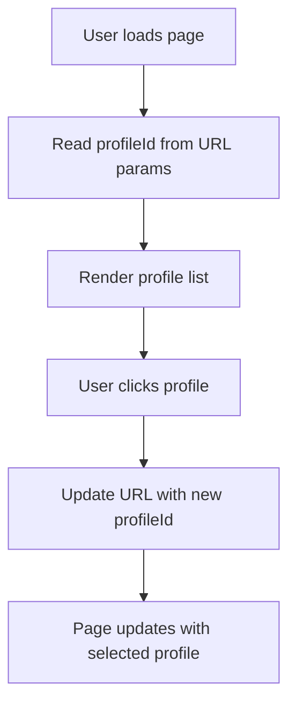
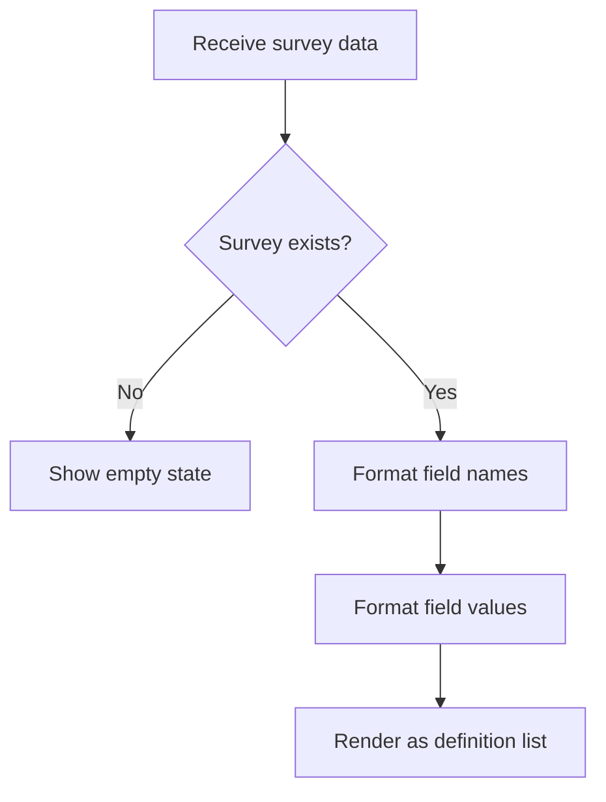
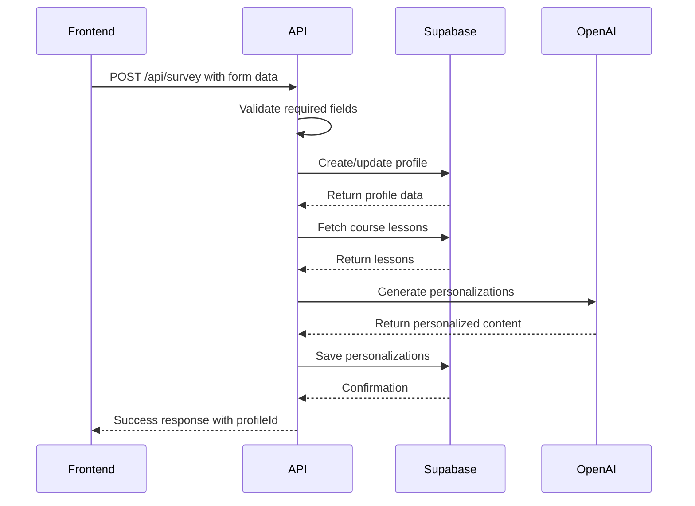
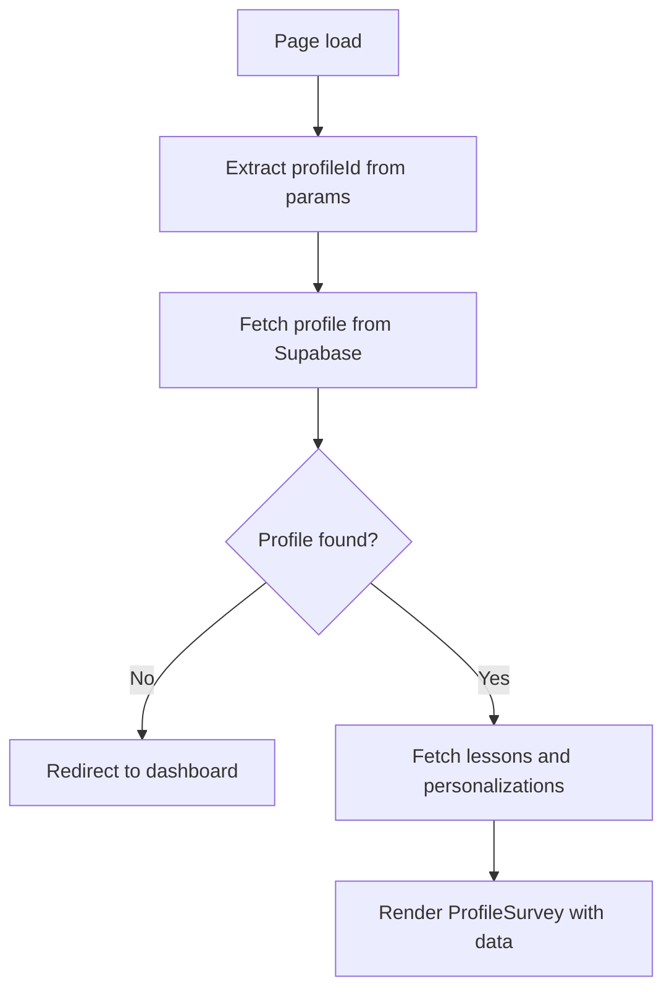

# Profile Components

<cite>
**Referenced Files in This Document**   
- [profile-selector.tsx](file://components/profiles/profile-selector.tsx)
- [profile-survey.tsx](file://components/profiles/profile-survey.tsx)
- [route.ts](file://app/api/survey/route.ts)
- [profiles.ts](file://lib/api/profiles.ts)
- [profile.ts](file://lib/services/profile.ts)
- [page.tsx](file://app/(dashboard)/profile/[profileId]/page.tsx)
- [page.tsx](file://app/survey/page.tsx)
</cite>

## Table of Contents
1. [Introduction](#introduction)
2. [Core Components Overview](#core-components-overview)
3. [ProfileSelector Component](#profileselector-component)
4. [ProfileSurvey Component](#profilesurvey-component)
5. [Form Handling and Validation](#form-handling-and-validation)
6. [Integration with Supabase and API Endpoint](#integration-with-supabase-and-api-endpoint)
7. [State Management and Router Integration](#state-management-and-router-integration)
8. [Accessibility and Responsive Design](#accessibility-and-responsive-design)
9. [Error Handling and User Feedback](#error-handling-and-user-feedback)
10. [Extensibility and Customization](#extensibility-and-customization)

## Introduction
This document provides comprehensive documentation for the profile-related UI components in the persona application. It details the implementation and usage of `ProfileSelector` for user profile selection and `ProfileSurvey` for displaying collected user data. The components are designed to work with Supabase-backed profile data and integrate with the `/api/survey` endpoint for form submissions. The documentation covers component props, state management, form validation, accessibility considerations, and extension points for additional functionality.

## Core Components Overview
The profile system consists of two primary UI components:
- `ProfileSelector`: Enables users to select from existing profiles with visual feedback for active selection
- `ProfileSurvey`: Displays formatted survey data from user profiles in a readable layout

These components are used throughout the dashboard and profile management interfaces to provide a consistent user experience for profile interaction and data visualization.

**Section sources**
- [profile-selector.tsx](file://components/profiles/profile-selector.tsx)
- [profile-survey.tsx](file://components/profiles/profile-survey.tsx)

## ProfileSelector Component

The `ProfileSelector` component renders a list of available user profiles with interactive selection capabilities. It uses Next.js App Router features for state management through URL search parameters.

### Props
- `profiles`: Array of Profile objects containing user profile data

### Functionality
- Displays profile name and course slug
- Highlights the currently active profile based on router state
- Handles profile selection by updating the `profileId` search parameter
- Provides navigation to profile management pages

### Router Integration
The component integrates with Next.js routing using:
- `useRouter` for programmatic navigation
- `useSearchParams` to read and modify URL parameters
- Client-side navigation to maintain application state



**Diagram sources**
- [profile-selector.tsx](file://components/profiles/profile-selector.tsx#L12-L65)

**Section sources**
- [profile-selector.tsx](file://components/profiles/profile-selector.tsx#L1-L70)

## ProfileSurvey Component

The `ProfileSurvey` component displays formatted survey data from user profiles in a structured layout.

### Props
- `survey`: Record containing survey data or null
- `profileName`: String representing the profile name or null

### Data Formatting
The component includes utility functions for formatting survey data:
- `formatFieldName`: Converts snake_case keys to human-readable format
- `formatFieldValue`: Handles different value types (null, boolean, object, string)

### Display Logic
- Shows empty state when no survey data exists
- Renders survey fields as definition lists with formatted labels
- Handles special value types with appropriate formatting



**Diagram sources**
- [profile-survey.tsx](file://components/profiles/profile-survey.tsx#L7-L63)

**Section sources**
- [profile-survey.tsx](file://components/profiles/profile-survey.tsx#L1-L66)

## Form Handling and Validation

The survey form implementation handles user input through controlled components with proper validation.

### Form Structure
The form collects the following data:
- Personal information (real_name)
- Course selection
- Multiple-choice selections (motivation, fears)
- Text inputs for goals and concerns

### State Management
Uses React useState hook to manage form state with proper typing:
```typescript
interface SurveyFormData {
  real_name: string;
  course: string;
  motivation: string[];
  target_clients: string;
  skills_wanted: string;
  fears: string[];
  wow_result: string;
  practice_model: string;
}
```

### Input Handling
- Text inputs use onChange with direct value assignment
- Checkboxes use toggle logic to add/remove values from arrays
- Form submission prevents default behavior and handles async processing

**Section sources**
- [page.tsx](file://app/survey/page.tsx#L1-L252)

## Integration with Supabase and API Endpoint

The profile components integrate with backend services through the `/api/survey` endpoint and Supabase for data persistence.

### API Endpoint (/api/survey)
Handles POST requests with survey data and performs:
1. Profile creation/updating in Supabase
2. Lesson personalization generation
3. Data validation and error handling

### Data Flow


**Diagram sources**
- [route.ts](file://app/api/survey/route.ts#L1-L132)

**Section sources**
- [route.ts](file://app/api/survey/route.ts#L1-L132)
- [profile.ts](file://lib/services/profile.ts#L1-L130)

## State Management and Router Integration

The components use Next.js App Router features for state persistence and navigation.

### URL State Management
- Profile selection state is stored in URL search parameters
- `profileId` parameter persists across page reloads
- Enables bookmarking and sharing of specific profile views

### Data Loading Pattern
The profile page uses async server components to:
1. Fetch profile data by ID
2. Load associated lessons
3. Retrieve personalization data
4. Pass data to client components



**Diagram sources**
- [page.tsx](file://app/(dashboard)/profile/[profileId]/page.tsx#L1-L89)

**Section sources**
- [page.tsx](file://app/(dashboard)/profile/[profileId]/page.tsx#L1-L89)

## Accessibility and Responsive Design

The components are designed with accessibility and responsive behavior in mind.

### Accessibility Features
- Semantic HTML structure with proper heading hierarchy
- ARIA attributes for interactive elements
- Keyboard navigation support
- Sufficient color contrast
- Focus management for interactive elements

### Responsive Behavior
- Flexible layout using Tailwind CSS
- Mobile-first design approach
- Proper spacing and typography scaling
- Touch-friendly interactive elements
- Responsive form layout with grid adjustments

The components use utility-first CSS classes to ensure consistent styling across different screen sizes while maintaining accessibility standards.

**Section sources**
- [profile-selector.tsx](file://components/profiles/profile-selector.tsx)
- [profile-survey.tsx](file://components/profiles/profile-survey.tsx)

## Error Handling and User Feedback

The system implements comprehensive error handling for form submission and data loading.

### Form Submission Errors
- Client-side validation for required fields
- Server-side validation with descriptive error messages
- Loading states during API requests
- Success and error feedback to users

### Error States
- Empty state for missing survey data
- Error boundaries for component rendering
- Graceful degradation when data is unavailable
- Informative error messages for users

The feedback system uses visual indicators and clear messaging to communicate the status of operations to users, ensuring a smooth user experience even when errors occur.

**Section sources**
- [page.tsx](file://app/survey/page.tsx#L1-L252)
- [route.ts](file://app/api/survey/route.ts#L1-L132)

## Extensibility and Customization

The components are designed to be extensible for additional profile fields and custom validation logic.

### Adding New Profile Fields
1. Update the SurveyData interface in the OpenAI service
2. Modify the form component to include new inputs
3. Update the API endpoint to handle new fields
4. Adjust the ProfileSurvey formatting functions as needed

### Custom Validation
The validation system can be extended by:
- Adding client-side validation rules to form handlers
- Implementing additional server-side validation in the API route
- Creating custom validation hooks for complex logic

### Styling Customization
The components use Tailwind CSS classes that can be easily modified:
- Update color schemes through class changes
- Adjust spacing and layout with utility classes
- Modify typography and font sizes
- Customize interactive element styles

The modular design allows for easy extension while maintaining consistency across the application.

**Section sources**
- [profile-survey.tsx](file://components/profiles/profile-survey.tsx)
- [page.tsx](file://app/survey/page.tsx)
- [route.ts](file://app/api/survey/route.ts)