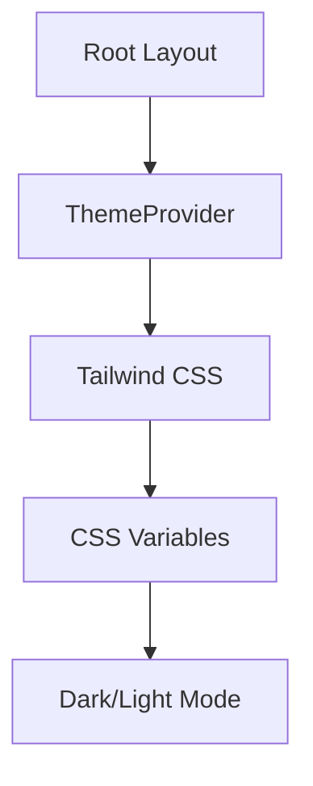
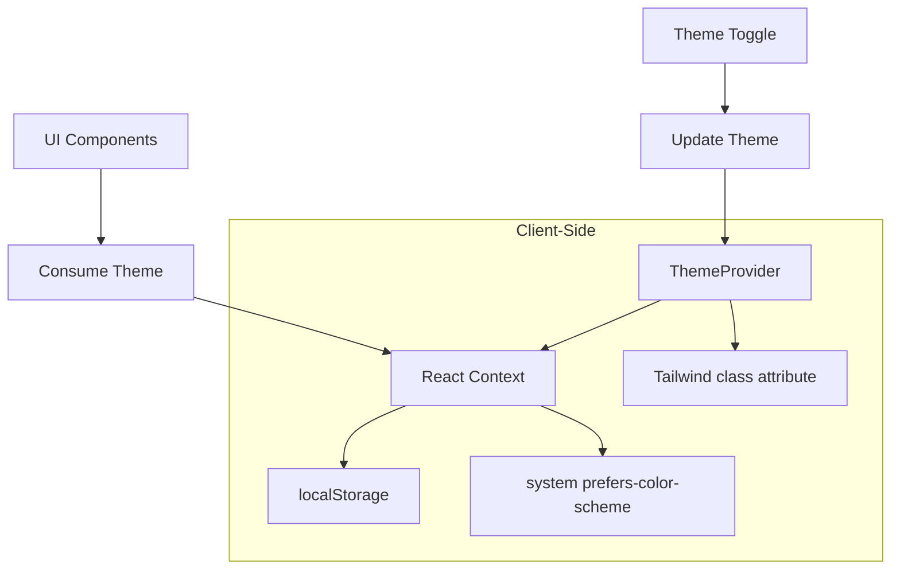
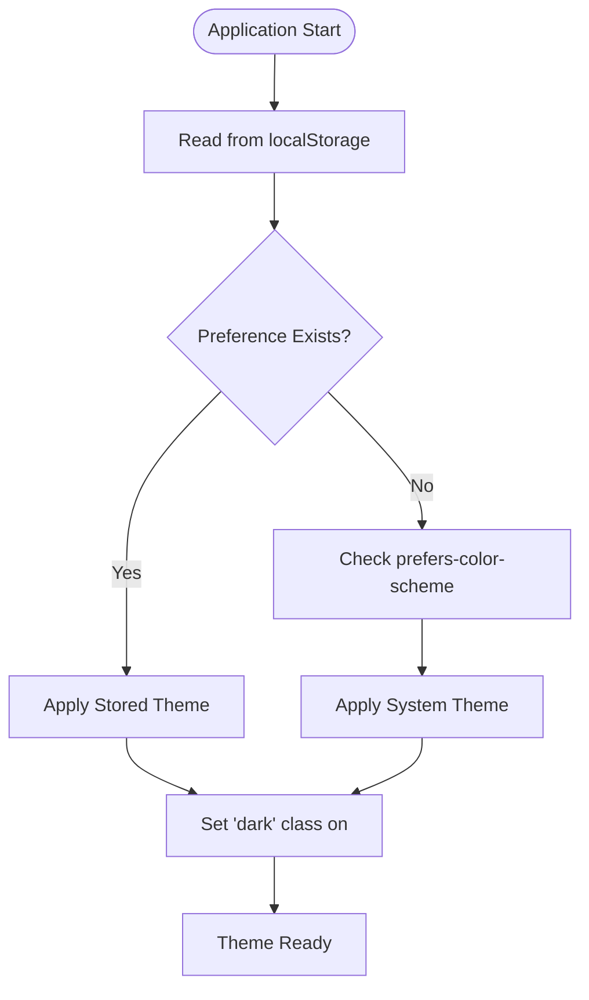
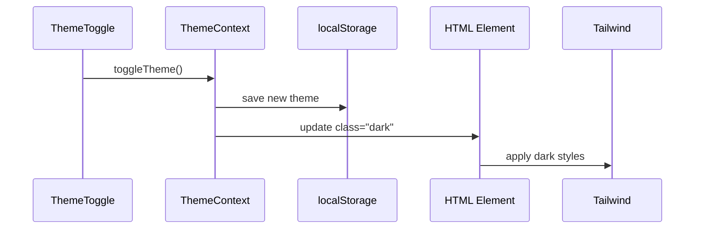
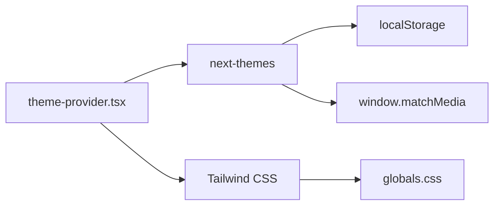

# Theme Management and Provider

<cite>
**Referenced Files in This Document**   
- [theme-provider.tsx](file://components/theme-provider.tsx)
- [layout.tsx](file://app/layout.tsx)
- [globals.css](file://app/globals.css)
</cite>

## Table of Contents
1. [Introduction](#introduction)
2. [Project Structure](#project-structure)
3. [Core Components](#core-components)
4. [Architecture Overview](#architecture-overview)
5. [Detailed Component Analysis](#detailed-component-analysis)
6. [Dependency Analysis](#dependency-analysis)
7. [Performance Considerations](#performance-considerations)
8. [Troubleshooting Guide](#troubleshooting-guide)
9. [Conclusion](#conclusion)

## Introduction
This document provides comprehensive documentation for the theme management system in the application, focusing on the `theme-provider.tsx` implementation. The system enables seamless toggling between dark and light modes, persists user preferences using `localStorage`, and integrates with Tailwind CSS via class-based theming. It also respects system-level preferences through the `prefers-color-scheme` media query and ensures smooth hydration in the Next.js App Router environment.

## Project Structure
The theme provider is located in the `components` directory and is used globally via the root layout. The styling system leverages CSS custom properties and Tailwind directives to support dynamic theming.



**Diagram sources**
- [layout.tsx](file://app/layout.tsx#L9-L23)
- [theme-provider.tsx](file://components/theme-provider.tsx#L5-L7)

**Section sources**
- [layout.tsx](file://app/layout.tsx#L1-L25)
- [theme-provider.tsx](file://components/theme-provider.tsx#L1-L8)

## Core Components
The core functionality revolves around the `ThemeProvider` component, which wraps the application and manages theme state. It uses `next-themes` under the hood to handle theme persistence and system preference detection.

**Section sources**
- [theme-provider.tsx](file://components/theme-provider.tsx#L5-L7)
- [layout.tsx](file://app/layout.tsx#L9-L23)

## Architecture Overview
The theme system follows a React Context pattern, abstracted through `next-themes`. The provider is mounted at the root level, allowing any component to access the current theme or trigger a theme change.



**Diagram sources**
- [theme-provider.tsx](file://components/theme-provider.tsx#L5-L7)
- [layout.tsx](file://app/layout.tsx#L9-L23)

## Detailed Component Analysis

### ThemeProvider Analysis
The `ThemeProvider` is a lightweight wrapper around `next-themes`'s `ThemeProvider`, re-exported for use throughout the application. It accepts configuration props that define theme behavior.

#### Configuration Flow


**Diagram sources**
- [theme-provider.tsx](file://components/theme-provider.tsx#L5-L7)
- [layout.tsx](file://app/layout.tsx#L9-L23)

#### Integration with Tailwind CSS
The theme system uses the `class` attribute strategy, where the `dark` class is added to the `<html>` element to activate dark mode styles. Tailwind automatically generates variants for `.dark &`.

```mermaid
classDiagram
class ThemeProvider {
+attribute : "class"
+defaultTheme : "system"
+enableSystem : true
+storageKey : "theme"
}
class TailwindCSS {
+dark : &.dark {}
+@apply : bg-background text-foreground
}
ThemeProvider --> TailwindCSS : "controls"
```

**Diagram sources**
- [theme-provider.tsx](file://components/theme-provider.tsx#L5-L7)
- [globals.css](file://app/globals.css#L0-L122)

**Section sources**
- [theme-provider.tsx](file://components/theme-provider.tsx#L5-L7)
- [globals.css](file://app/globals.css#L0-L122)

### Consuming the Theme Context
Components can access the current theme and toggle functionality via the `useTheme` hook from `next-themes`. This allows UI controls like theme toggles to function consistently.



**Diagram sources**
- [theme-provider.tsx](file://components/theme-provider.tsx#L5-L7)

## Dependency Analysis
The theme system depends on `next-themes` for state management and persistence, and on Tailwind CSS for style generation. The integration is minimal and focused.



**Diagram sources**
- [theme-provider.tsx](file://components/theme-provider.tsx#L3-L7)
- [globals.css](file://app/globals.css#L0-L122)

**Section sources**
- [theme-provider.tsx](file://components/theme-provider.tsx#L1-L8)
- [globals.css](file://app/globals.css#L0-L122)

## Performance Considerations
The theme provider is lightweight and only runs on the client side (`"use client"`). Theme switching is instantaneous with no re-renders beyond the context update. The use of `suppressHydrationWarning` in the root layout prevents hydration mismatches when the theme is applied after initial render.

**Section sources**
- [layout.tsx](file://app/layout.tsx#L9-L23)

## Troubleshooting Guide
Common issues include hydration mismatches when the server-rendered theme doesn't match the client preference. This is mitigated by using `suppressHydrationWarning` on the `<html>` tag and ensuring the theme is only applied client-side.

**Section sources**
- [layout.tsx](file://app/layout.tsx#L9-L23)

## Conclusion
The theme management system provides a robust, user-friendly way to toggle between light and dark modes while respecting system preferences and persisting user choices. Its integration with Tailwind CSS via class-based theming ensures consistency and performance across the application.