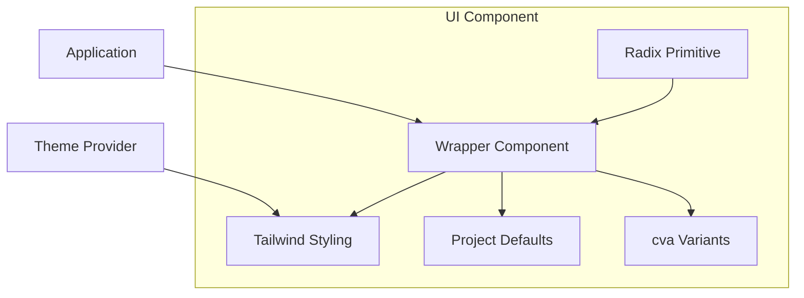
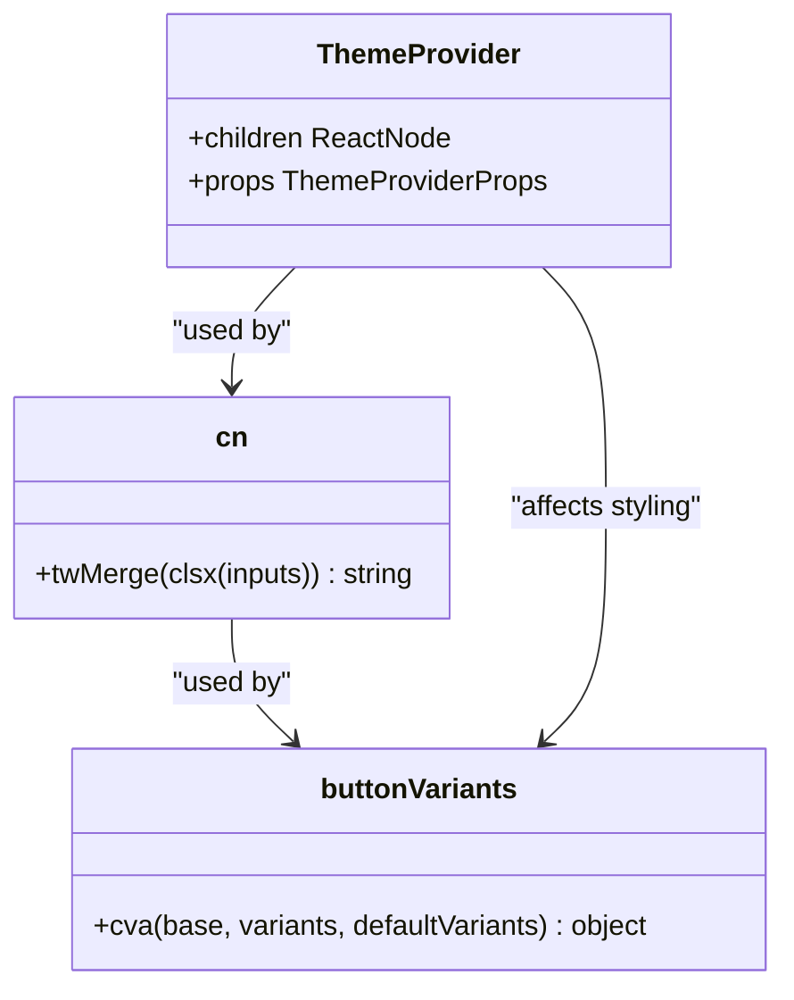

# UI Primitives and Component Library

<cite>
**Referenced Files in This Document**   
- [button.tsx](file://components/ui/button.tsx)
- [input.tsx](file://components/ui/input.tsx)
- [textarea.tsx](file://components/ui/textarea.tsx)
- [card.tsx](file://components/ui/card.tsx)
- [badge.tsx](file://components/ui/badge.tsx)
- [scroll-area.tsx](file://components/ui/scroll-area.tsx)
- [separator.tsx](file://components/ui/separator.tsx)
- [utils.ts](file://lib/utils.ts)
- [theme-provider.tsx](file://components/theme-provider.tsx)
</cite>

## Table of Contents
1. [Introduction](#introduction)
2. [Component Architecture Overview](#component-architecture-overview)
3. [Core UI Primitives](#core-ui-primitives)
   - [Button](#button)
   - [Input](#input)
   - [Textarea](#textarea)
   - [Card](#card)
   - [Badge](#badge)
   - [ScrollArea](#scrollarea)
   - [Separator](#separator)
4. [Styling and Theming System](#styling-and-theming-system)
5. [Accessibility and Keyboard Navigation](#accessibility-and-keyboard-navigation)
6. [Usage Guidelines and Composition Patterns](#usage-guidelines-and-composition-patterns)
7. [Extending the Component Library](#extending-the-component-library)
8. [Best Practices](#best-practices)

## Introduction

This document provides comprehensive documentation for the foundational UI component library built on Radix UI primitives and styled with Tailwind CSS. The library offers a set of reusable, accessible, and responsive components that serve as the building blocks for the application's user interface. Each component is designed to maintain design system integrity while providing flexibility for various use cases.

The component library follows a wrapper pattern that enhances Radix UI primitives with project-specific defaults, Tailwind utility classes, and consistent styling conventions. This approach ensures accessibility by leveraging Radix's robust implementation while enabling visual consistency through Tailwind CSS.

**Section sources**
- [button.tsx](file://components/ui/button.tsx#L1-L60)
- [card.tsx](file://components/ui/card.tsx#L1-L92)

## Component Architecture Overview

The UI component library follows a consistent architectural pattern across all primitives. Each component is implemented as a wrapper around Radix UI primitives, enhancing them with project-specific styling, accessibility features, and responsive behaviors. The architecture leverages several key technologies:

- **Radix UI**: Provides accessible, unstyled primitives with robust keyboard navigation and ARIA compliance
- **Tailwind CSS**: Enables utility-first styling with consistent design tokens
- **class-variance-authority (cva)**: Manages variant-based styling for components with multiple states
- **Tailwind Merge**: Safely composes Tailwind classes with custom overrides

The wrapper pattern allows components to expose Radix functionality while applying consistent project-specific defaults. This approach maintains accessibility standards while ensuring visual consistency across the application.



**Diagram sources**
- [button.tsx](file://components/ui/button.tsx#L6-L36)
- [utils.ts](file://lib/utils.ts#L3-L5)
- [theme-provider.tsx](file://components/theme-provider.tsx#L1-L11)

**Section sources**
- [button.tsx](file://components/ui/button.tsx#L1-L60)
- [utils.ts](file://lib/utils.ts#L1-L6)

## Core UI Primitives

### Button

The Button component is a wrapper around a standard HTML button element enhanced with Radix UI patterns and Tailwind styling. It supports multiple variants and sizes through the cva system.

**Props:**
- `variant`: Controls visual style (default, destructive, outline, secondary, ghost, link)
- `size`: Controls dimensions (default, sm, lg, icon, icon-sm, icon-lg)
- `asChild`: When true, renders as a Slot component to preserve child styling
- `className`: Additional Tailwind classes for customization

The component includes focus states with visible rings, hover effects, and disabled state styling. It also handles SVG icons within buttons, automatically adjusting padding.

**Section sources**
- [button.tsx](file://components/ui/button.tsx#L38-L57)
- [button.tsx](file://components/ui/button.tsx#L6-L36)

### Input

The Input component wraps a standard HTML input element with consistent styling and accessibility features. It provides a clean, accessible text input with proper focus states and validation styling.

**Props:**
- `type`: Standard HTML input type (text, email, password, etc.)
- `className`: Additional Tailwind classes for customization

The component includes styling for placeholder text, selection states, and file inputs. It features consistent focus rings and error states with destructive color variants for invalid inputs.

**Section sources**
- [input.tsx](file://components/ui/input.tsx#L4-L18)

### Textarea

The Textarea component provides a styled textarea element with consistent sizing and behavior. It automatically sets a minimum height while allowing vertical expansion based on content.

**Props:**
- `className`: Additional Tailwind classes for customization

The component includes the same focus and validation states as the Input component, ensuring consistent behavior across form elements. It uses field-sizing-content to properly handle content-based sizing.

**Section sources**
- [textarea.tsx](file://components/ui/textarea.tsx#L4-L15)

### Card

The Card component is a container element designed to group related content. It implements a multi-part structure with header, title, description, action, content, and footer sections.

**Subcomponents:**
- `Card`: Main container with border and shadow
- `CardHeader`: Top section with grid layout
- `CardTitle`: Heading text
- `CardDescription`: Supporting text
- `CardAction`: Right-aligned action element
- `CardContent`: Main content area
- `CardFooter`: Bottom section for actions

The component uses CSS container queries for responsive behavior and supports border utilities for dividers between sections.

**Section sources**
- [card.tsx](file://components/ui/card.tsx#L4-L15)
- [card.tsx](file://components/ui/card.tsx#L17-L89)

### Badge

The Badge component displays small status indicators or labels with various styling options. It supports different variants to convey meaning through color and style.

**Props:**
- `variant`: Visual style (default, secondary, destructive, outline)
- `asChild`: When true, renders as a Slot component
- `className`: Additional Tailwind classes

Badges are designed to be inline elements with appropriate spacing and can contain SVG icons. They include hover states for interactive badges and support anchor tag styling.

**Section sources**
- [badge.tsx](file://components/ui/badge.tsx#L27-L43)
- [badge.tsx](file://components/ui/badge.tsx#L6-L25)

### ScrollArea

The ScrollArea component provides a styled container with custom scrollbars that appear only when needed. It wraps Radix UI's scroll area primitive with project-specific styling.

**Props:**
- `className`: Additional Tailwind classes
- `children`: Content to be scrollable

The component includes a ScrollBar subcomponent that renders custom-styled scrollbars with proper touch and pointer event handling. The scroll thumb has a subtle border and rounded styling.

**Section sources**
- [scroll-area.tsx](file://components/ui/scroll-area.tsx#L7-L28)
- [scroll-area.tsx](file://components/ui/scroll-area.tsx#L30-L58)

### Separator

The Separator component creates a horizontal or vertical divider line between content sections. It wraps Radix UI's separator primitive with consistent styling.

**Props:**
- `orientation`: Direction of the separator (horizontal, vertical)
- `decorative`: Whether the separator is purely visual (default: true)
- `className`: Additional Tailwind classes

The component uses data attributes to conditionally apply height and width based on orientation, ensuring proper layout in both directions.

**Section sources**
- [separator.tsx](file://components/ui/separator.tsx#L7-L25)

## Styling and Theming System

The component library uses a sophisticated styling system that combines Tailwind CSS with variant management through class-variance-authority (cva). This approach enables consistent styling across components while allowing for flexible customization.

The `cn` utility function, imported from `@/lib/utils`, combines `clsx` and `tailwind-merge` to safely compose class names. This prevents class conflicts and ensures that Tailwind classes are properly merged, with later classes taking precedence over earlier ones.

Theme support is provided through the ThemeProvider component, which wraps Next Themes. This enables dark mode support across all components, with specific dark variants defined in the Tailwind configuration.



**Diagram sources**
- [utils.ts](file://lib/utils.ts#L3-L5)
- [button.tsx](file://components/ui/button.tsx#L6-L36)
- [theme-provider.tsx](file://components/theme-provider.tsx#L7-L11)

**Section sources**
- [utils.ts](file://lib/utils.ts#L1-L6)
- [button.tsx](file://components/ui/button.tsx#L6-L36)

## Accessibility and Keyboard Navigation

All components in the library inherit accessibility features from Radix UI primitives, ensuring robust keyboard navigation and screen reader support. The wrapper components preserve these accessibility features while adding visual enhancements.

Key accessibility features include:
- Proper focus management with visible focus rings
- ARIA attributes for interactive elements
- Keyboard navigation support for all interactive components
- Semantic HTML structure
- Proper contrast ratios for text and interactive elements

Form components include validation styling through the `aria-invalid` attribute, which triggers appropriate visual feedback for error states. Focus states are enhanced with ring effects that meet WCAG contrast requirements.

**Section sources**
- [button.tsx](file://components/ui/button.tsx#L38-L57)
- [input.tsx](file://components/ui/input.tsx#L4-L18)
- [textarea.tsx](file://components/ui/textarea.tsx#L4-L15)

## Usage Guidelines and Composition Patterns

Components should be used according to their intended purpose and semantic meaning. The library encourages composition of primitives to create higher-level interfaces.

**Basic Usage:**
```tsx
<Button variant="primary">Click me</Button>
<Input placeholder="Enter text" />
<Card>
  <CardHeader>
    <CardTitle>Card Title</CardTitle>
    <CardDescription>Card description</CardDescription>
  </CardHeader>
  <CardContent>Card content</CardContent>
</Card>
```

**Composition Patterns:**
- Use Card with Header, Title, Description, and Content for information grouping
- Combine Button with Badge for action labels
- Wrap form elements in Card for form sections
- Use Separator to divide content sections
- Apply ScrollArea to content that may overflow

When extending components, use the `asChild` prop to preserve styling of child elements while applying component behavior.

**Section sources**
- [card.tsx](file://components/ui/card.tsx#L4-L89)
- [button.tsx](file://components/ui/button.tsx#L38-L57)

## Extending the Component Library

New components should follow the established patterns for consistency. When creating new primitives:

1. Start with a Radix UI primitive when available
2. Use the same wrapper pattern with consistent props interface
3. Implement variants using cva when multiple styles are needed
4. Use the `cn` utility for class composition
5. Ensure accessibility features are preserved
6. Follow the same file naming convention (kebab-case)

For compound components, create subcomponents within the same file and export them together. Use descriptive data-slot attributes to identify component parts for styling.

**Section sources**
- [button.tsx](file://components/ui/button.tsx#L1-L60)
- [card.tsx](file://components/ui/card.tsx#L1-L92)

## Best Practices

- Always use the appropriate component variant to convey meaning
- Maintain consistent spacing using the defined size scale
- Use the `asChild` prop when wrapping interactive elements
- Avoid overriding critical accessibility styles
- Test components in both light and dark modes
- Ensure keyboard navigation works for all interactive elements
- Use semantic component names that reflect their purpose
- Keep custom className overrides minimal and focused

By following these best practices, developers can ensure consistency across the application while leveraging the full capabilities of the component library.

**Section sources**
- [button.tsx](file://components/ui/button.tsx#L1-L60)
- [input.tsx](file://components/ui/input.tsx#L1-L20)
- [card.tsx](file://components/ui/card.tsx#L1-L92)