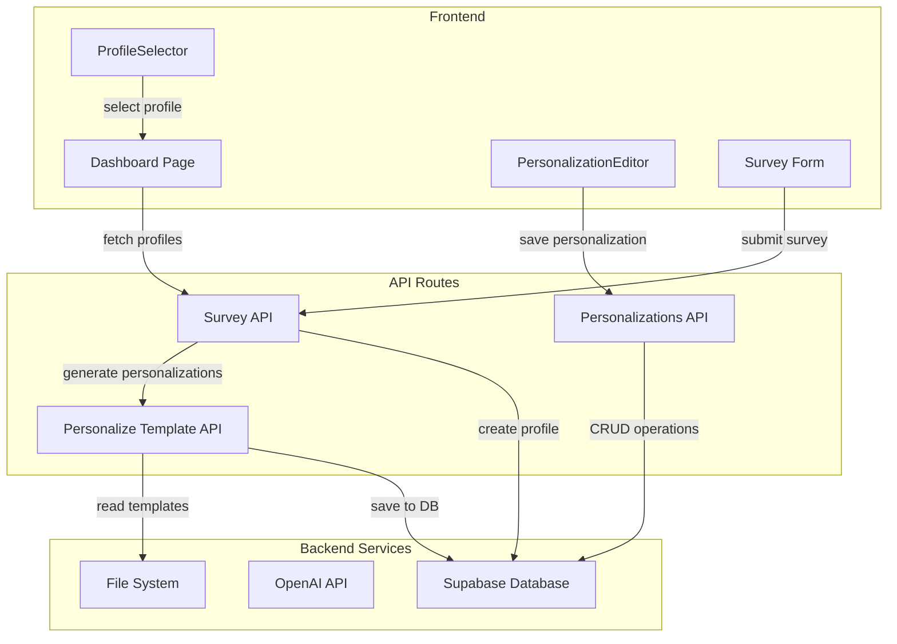
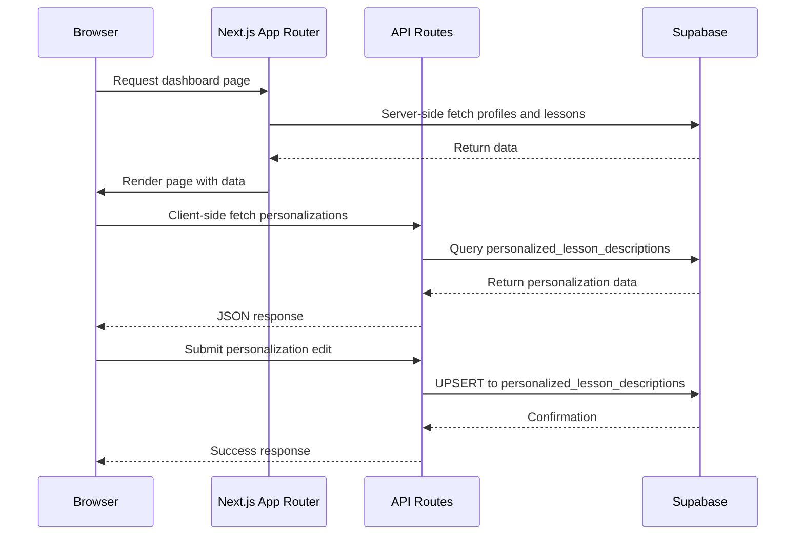
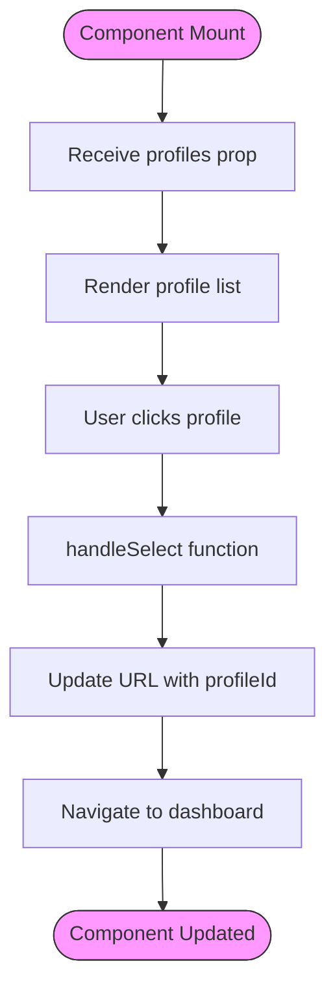
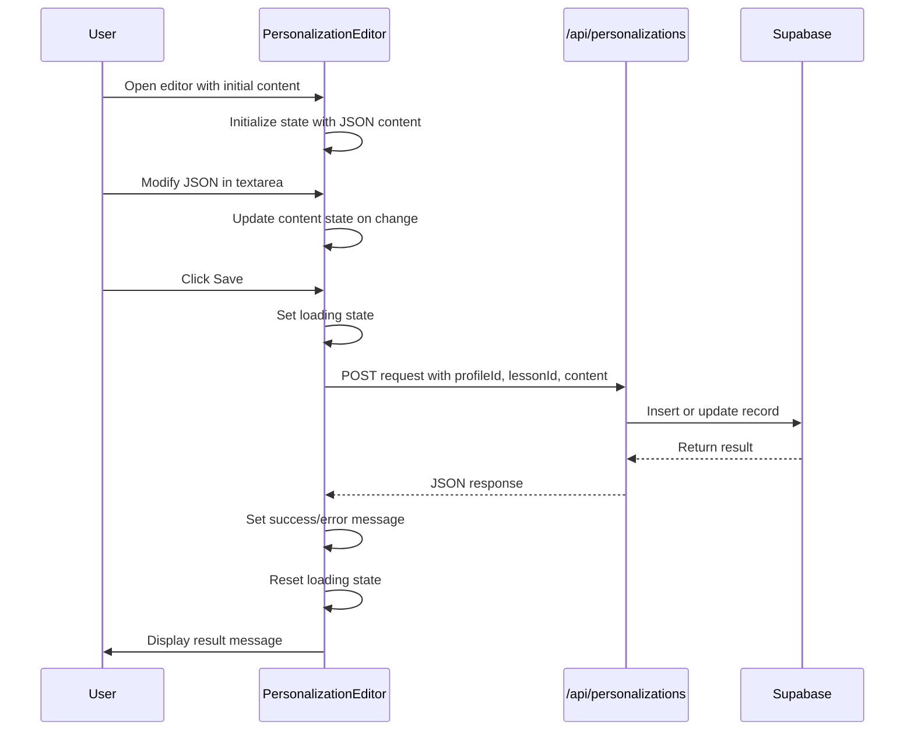
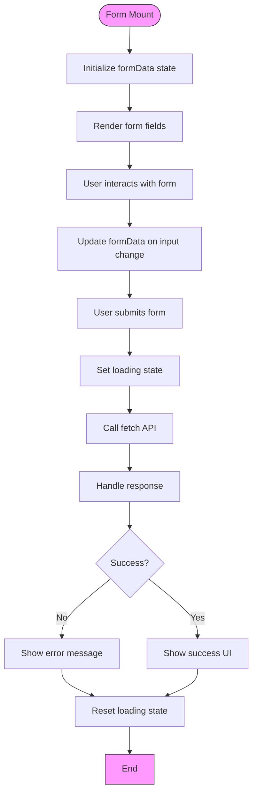
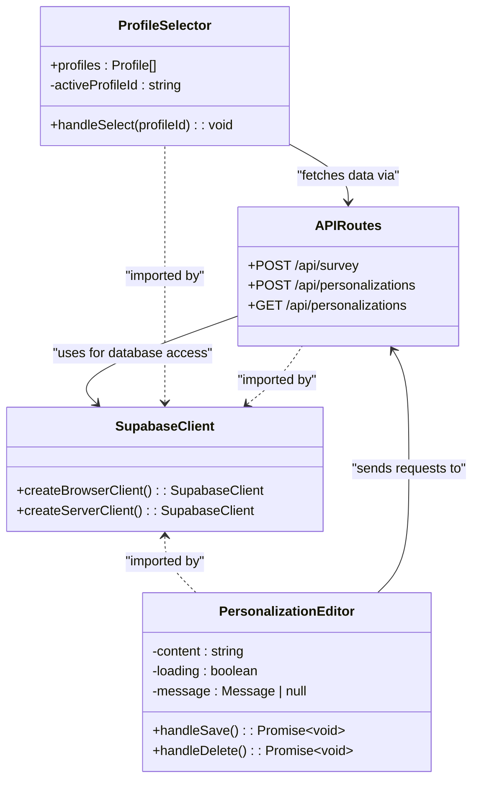

# Data Fetching and State Management

<cite>
**Referenced Files in This Document**   
- [profile-selector.tsx](file://components/profiles/profile-selector.tsx)
- [personalization-editor.tsx](file://components/personalizations/personalization-editor.tsx)
- [profiles.ts](file://lib/api/profiles.ts)
- [personalizations.ts](file://lib/api/personalizations.ts)
- [supabase/client.ts](file://lib/supabase/client.ts)
- [supabase/server.ts](file://lib/supabase/server.ts)
- [survey/route.ts](file://app/api/survey/route.ts)
- [personalize-template/route.ts](file://app/api/persona/personalize-template/route.ts)
- [personalizations/route.ts](file://app/api/personalizations/route.ts)
- [dashboard/page.tsx](file://app/(dashboard)/dashboard/page.tsx)
- [survey/iframe/page.tsx](file://app/survey/iframe/page.tsx)
</cite>

## Table of Contents
1. [Introduction](#introduction)
2. [Project Structure](#project-structure)
3. [Core Components](#core-components)
4. [Architecture Overview](#architecture-overview)
5. [Detailed Component Analysis](#detailed-component-analysis)
6. [Dependency Analysis](#dependency-analysis)
7. [Performance Considerations](#performance-considerations)
8. [Troubleshooting Guide](#troubleshooting-guide)
9. [Conclusion](#conclusion)

## Introduction
This document provides comprehensive documentation on data fetching and state management strategies in the frontend application. It explains how client components use React useState and useEffect hooks to manage local UI state, while fetching data from API routes via fetch calls in components like ProfileSelector and PersonalizationEditor. The integration between frontend components and backend APIs is detailed, including request construction, error handling, and response processing. The document contrasts server-side data fetching in page components with client-side interactions and documents the use of Supabase for real-time data where applicable. Examples of form handling, optimistic updates, and error recovery in personalization workflows are included.

## Project Structure
The project follows a Next.js App Router architecture with a clear separation between frontend components, API routes, and utility libraries. The structure is organized into several key directories:
- `app/` - Contains all page components and API routes using the App Router pattern
- `components/` - Reusable UI components organized by feature
- `lib/` - Shared utilities, API clients, and Supabase integration
- `store/` - Static data storage for lesson templates and user profiles

The application implements a hybrid data fetching strategy with server-side rendering for initial page loads and client-side fetching for interactive components.

**Diagram sources**
- [dashboard/page.tsx](file://app/(dashboard)/dashboard/page.tsx)
- [survey/route.ts](file://app/api/survey/route.ts)
- [personalize-template/route.ts](file://app/api/persona/personalize-template/route.ts)

**Section sources**
- [app](file://app)
- [components](file://components)
- [lib](file://lib)

## Core Components
The application's core components implement data fetching and state management patterns for user profiles and lesson personalizations. The ProfileSelector component manages UI state for profile selection using React useState, while the PersonalizationEditor handles form state and API interactions for editing lesson personalizations. These components demonstrate the use of client-side data fetching with the fetch API to interact with backend endpoints.

**Section sources**
- [profile-selector.tsx](file://components/profiles/profile-selector.tsx)
- [personalization-editor.tsx](file://components/personalizations/personalization-editor.tsx)

## Architecture Overview
The application implements a hybrid data fetching architecture that combines server-side rendering with client-side API calls. Page components like the dashboard use server-side data fetching to load initial data during rendering, while interactive components use client-side fetch calls to update state and perform CRUD operations. Supabase serves as the primary data persistence layer, with real-time capabilities available through its client SDK.

The state management strategy follows React best practices, using useState for local component state and useEffect for side effects. Form state is managed locally within components, with changes persisted to the backend via API routes. Error handling is implemented with try-catch blocks and user feedback through message states.

**Diagram sources**
- [dashboard/page.tsx](file://app/(dashboard)/dashboard/page.tsx)
- [personalizations/route.ts](file://app/api/personalizations/route.ts)
- [supabase/server.ts](file://lib/supabase/server.ts)

## Detailed Component Analysis
This section provides a thorough analysis of key components involved in data fetching and state management, including their implementation patterns, data flow, and integration with backend services.

### Profile Selector Analysis
The ProfileSelector component demonstrates client-side state management for user interface interactions. It uses React's useState and useEffect hooks to manage selection state and respond to user actions. The component receives profile data as a prop from parent components that perform server-side data fetching.

**Diagram sources**
- [profile-selector.tsx](file://components/profiles/profile-selector.tsx)
- [dashboard/page.tsx](file://app/(dashboard)/dashboard/page.tsx)

**Section sources**
- [profile-selector.tsx](file://components/profiles/profile-selector.tsx)
- [profiles.ts](file://lib/api/profiles.ts)

### Personalization Editor Analysis
The PersonalizationEditor component implements a comprehensive client-side data management workflow for creating and updating lesson personalizations. It uses useState to manage multiple state variables including form content, loading status, and user feedback messages.

**Diagram sources**
- [personalization-editor.tsx](file://components/personalizations/personalization-editor.tsx)
- [personalizations/route.ts](file://app/api/personalizations/route.ts)

**Section sources**
- [personalization-editor.tsx](file://components/personalizations/personalization-editor.tsx)
- [personalizations/route.ts](file://app/api/personalizations/route.ts)

### Survey Form Analysis
The survey form component implements a complete client-side form handling workflow with state management for multi-field inputs, validation, and API communication. It uses useState to manage the form data object and submission states.

**Diagram sources**
- [survey/iframe/page.tsx](file://app/survey/iframe/page.tsx)
- [survey/route.ts](file://app/api/survey/route.ts)

**Section sources**
- [survey/iframe/page.tsx](file://app/survey/iframe/page.tsx)
- [survey/route.ts](file://app/api/survey/route.ts)

## Dependency Analysis
The application's data fetching and state management system relies on several key dependencies and their interactions. The architecture shows a clear separation between client-side components and server-side data access.

**Diagram sources**
- [supabase/client.ts](file://lib/supabase/client.ts)
- [supabase/server.ts](file://lib/supabase/server.ts)
- [personalization-editor.tsx](file://components/personalizations/personalization-editor.tsx)
- [profile-selector.tsx](file://components/profiles/profile-selector.tsx)

**Section sources**
- [package.json](file://package.json)
- [lib/supabase](file://lib/supabase)

## Performance Considerations
The application implements several performance optimizations in its data fetching strategy. Server-side rendering of the dashboard page reduces initial load time by delivering pre-rendered content. The use of Suspense and loading states provides feedback during data fetching operations.

For API routes, the application leverages Supabase's efficient querying capabilities and implements proper error handling to prevent cascading failures. The personalization workflow uses batch operations where appropriate, such as generating multiple lesson personalizations in parallel after survey submission.

The client-side components minimize re-renders through proper state management and use of React's optimization techniques. Form inputs are efficiently handled with controlled components that update state only when necessary.

## Troubleshooting Guide
Common issues in the data fetching and state management system typically involve API connectivity, authentication, or data validation. Error handling is implemented at multiple levels:

1. **Network errors**: The fetch calls include try-catch blocks to handle network failures
2. **Validation errors**: API routes validate input data and return appropriate error messages
3. **State synchronization**: Loading states prevent multiple concurrent requests
4. **User feedback**: Error messages are displayed to users in a clear manner

When debugging issues, check the browser's developer console for fetch errors and examine the network tab to verify API requests and responses. Server-side logs can be found in the API route implementations, particularly in error handling blocks.

**Section sources**
- [personalization-editor.tsx](file://components/personalizations/personalization-editor.tsx)
- [survey/iframe/page.tsx](file://app/survey/iframe/page.tsx)
- [survey/route.ts](file://app/api/survey/route.ts)

## Conclusion
The application implements a robust data fetching and state management system using React's built-in hooks and Next.js server-side rendering capabilities. The architecture effectively combines server-side data loading for initial page content with client-side API calls for interactive features. Supabase provides reliable data persistence with potential for real-time updates, while the component design follows React best practices for state management and error handling.

The system demonstrates proper separation of concerns between UI components and data access logic, with clear pathways for data flow from the backend to the frontend. Form handling, optimistic updates, and error recovery are implemented consistently across components, providing a reliable user experience.