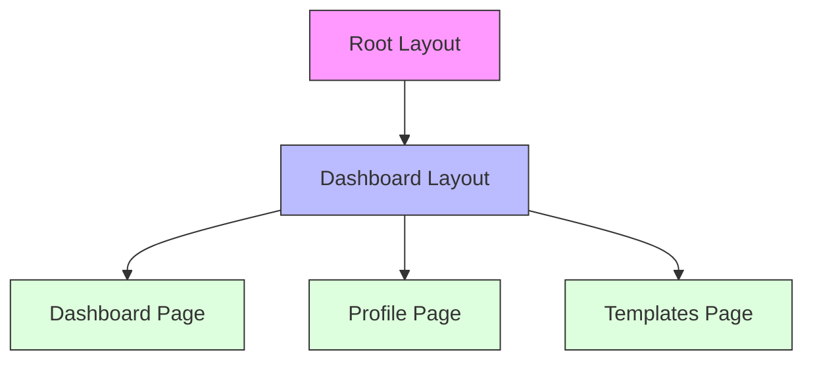
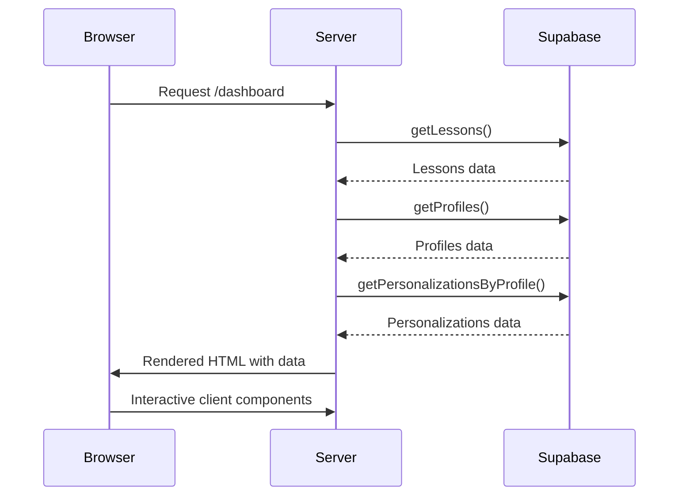

# Frontend Architecture Overview

<cite>
**Referenced Files in This Document**   
- [app/page.tsx](file://app/page.tsx)
- [app/layout.tsx](file://app/layout.tsx)
- [app/(dashboard)/layout.tsx](file://app/(dashboard)/layout.tsx)
- [app/(dashboard)/dashboard/page.tsx](file://app/(dashboard)/dashboard/page.tsx)
- [app/survey/page.tsx](file://app/survey/page.tsx)
- [app/(dashboard)/profile/[profileId]/page.tsx](file://app/(dashboard)/profile/[profileId]/page.tsx)
- [components/profiles/profile-selector.tsx](file://components/profiles/profile-selector.tsx)
- [components/personalizations/personalized-lesson.tsx](file://components/personalizations/personalized-lesson.tsx)
- [lib/api/lessons.ts](file://lib/api/lessons.ts)
- [lib/api/profiles.ts](file://lib/api/profiles.ts)
- [lib/api/personalizations.ts](file://lib/api/personalizations.ts)
- [app/survey/iframe/layout.tsx](file://app/survey/iframe/layout.tsx)
</cite>

## Table of Contents
1. [Introduction](#introduction)
2. [Project Structure](#project-structure)
3. [Root Layout and Theme Management](#root-layout-and-theme-management)
4. [Dashboard Route Group and Layout Inheritance](#dashboard-route-group-and-layout-inheritance)
5. [Initial Page Routing and Navigation](#initial-page-routing-and-navigation)
6. [Server-Side Rendering and Data Flow](#server-side-rendering-and-data-flow)
7. [Client-Side Interactivity and Component Integration](#client-side-interactivity-and-component-integration)
8. [Performance Considerations](#performance-considerations)
9. [Conclusion](#conclusion)

## Introduction
This document provides a comprehensive overview of the frontend architecture of the Persona application, focusing on the Next.js App Router structure. It details the organization of route groups, layout inheritance, server-side rendering patterns, and data flow between server and client components. The architecture is designed to deliver a seamless user experience with consistent UI scaffolding, efficient data loading, and optimized initial rendering performance.

## Project Structure

The application follows a standard Next.js App Router structure with clear separation of concerns. Key directories include:
- `app/`: Contains all route definitions and layout components
- `components/`: Reusable UI components organized by feature
- `lib/`: Utility functions, API clients, and Supabase integration
- `public/`: Static assets and HTML templates

The routing structure leverages Next.js route groups with the `(dashboard)` group encapsulating dashboard-related routes while keeping them organized separately from other routes like `/survey`.

```mermaid
graph TB
subgraph "App Routes"
A[app/page.tsx] --> B[app/(dashboard)/layout.tsx]
B --> C[app/(dashboard)/dashboard/page.tsx]
B --> D[app/(dashboard)/profile/[profileId]/page.tsx]
A --> E[app/survey/page.tsx]
E --> F[app/survey/iframe/layout.tsx]
end
subgraph "Components"
G[components/profiles/profile-selector.tsx]
H[components/personalizations/personalized-lesson.tsx]
end
subgraph "Libraries"
I[lib/api/lessons.ts]
J[lib/api/profiles.ts]
K[lib/api/personalizations.ts]
end
B --> G
C --> G
C --> H
I --> C
J --> C
J --> D
K --> C
K --> D
```

**Diagram sources**
- [app/page.tsx](file://app/page.tsx#L1-L21)
- [app/(dashboard)/layout.tsx](file://app/(dashboard)/layout.tsx#L1-L22)
- [components/profiles/profile-selector.tsx](file://components/profiles/profile-selector.tsx#L1-L70)

**Section sources**
- [app/page.tsx](file://app/page.tsx#L1-L21)
- [app/(dashboard)/layout.tsx](file://app/(dashboard)/layout.tsx#L1-L22)

## Root Layout and Theme Management

The root layout in `app/layout.tsx` provides the foundational structure for the entire application. It sets the HTML document structure, includes global styles, and wraps all content with the ThemeProvider component for consistent theme management across the application. The layout defines metadata for SEO purposes and ensures that the application renders correctly in both light and dark modes by leveraging the system preference.

The root layout is a server component that wraps all pages in the application, providing a consistent HTML structure and theme context. It uses the `suppressHydrationWarning` attribute to prevent hydration mismatches when switching between server and client rendering.

**Section sources**
- [app/layout.tsx](file://app/layout.tsx#L1-L24)

## Dashboard Route Group and Layout Inheritance

The `(dashboard)` route group organizes all dashboard-related routes under a shared layout. This layout, defined in `app/(dashboard)/layout.tsx`, provides consistent UI scaffolding including a header with navigation links to different sections of the dashboard. The layout is automatically applied to all routes within the `(dashboard)` group, enabling layout inheritance and reducing code duplication.

The dashboard layout includes a header with navigation to the main dashboard and templates section, along with a main content area that renders the specific page content. This shared layout ensures visual consistency across all dashboard pages while allowing individual pages to define their unique content.



**Diagram sources**
- [app/layout.tsx](file://app/layout.tsx#L1-L24)
- [app/(dashboard)/layout.tsx](file://app/(dashboard)/layout.tsx#L1-L22)

**Section sources**
- [app/(dashboard)/layout.tsx](file://app/(dashboard)/layout.tsx#L1-L22)

## Initial Page Routing and Navigation

The initial page at `app/page.tsx` serves as the landing page for the application. It displays a simple welcome message with a link to navigate to the dashboard. This page does not use the dashboard layout, providing a distinct entry point experience before users access the main application functionality.

Navigation between pages is handled through standard anchor tags and client-side routing. The dashboard page supports URL parameters for profile selection, allowing users to maintain state when navigating between different views. The profile selector component updates the URL with the selected profile ID, enabling bookmarkable URLs and direct linking to specific user states.

**Section sources**
- [app/page.tsx](file://app/page.tsx#L1-L21)
- [components/profiles/profile-selector.tsx](file://components/profiles/profile-selector.tsx#L1-L70)

## Server-Side Rendering and Data Flow

The application leverages server-side rendering (SSR) extensively to improve performance and SEO. Key pages like the dashboard and profile pages are server components that fetch data directly from the database using Supabase. The data fetching occurs on the server, preventing sensitive database credentials from being exposed to the client.

Data flows from server components to client components through props. For example, the dashboard page fetches lessons, profiles, and personalizations on the server and passes them to client components like `ProfileSelector` and `PersonalizedLesson`. This pattern ensures that critical data is loaded before the page is rendered, reducing loading states and improving perceived performance.

The API library functions in `lib/api/` encapsulate data access logic, providing a clean interface for fetching data from Supabase. These functions are called directly from server components, eliminating the need for separate API routes in many cases.



**Diagram sources**
- [app/(dashboard)/dashboard/page.tsx](file://app/(dashboard)/dashboard/page.tsx#L1-L104)
- [lib/api/lessons.ts](file://lib/api/lessons.ts#L1-L24)
- [lib/api/profiles.ts](file://lib/api/profiles.ts#L1-L38)
- [lib/api/personalizations.ts](file://lib/api/personalizations.ts#L1-L28)

**Section sources**
- [app/(dashboard)/dashboard/page.tsx](file://app/(dashboard)/dashboard/page.tsx#L1-L104)
- [lib/api/lessons.ts](file://lib/api/lessons.ts#L1-L24)
- [lib/api/profiles.ts](file://lib/api/profiles.ts#L1-L38)
- [lib/api/personalizations.ts](file://lib/api/personalizations.ts#L1-L28)

## Client-Side Interactivity and Component Integration

Client components handle user interactivity and dynamic updates. The `ProfileSelector` component is a client component that uses Next.js navigation hooks to update the URL when a profile is selected, triggering a re-render of the dashboard with the new profile's data. This component demonstrates the integration between client-side interactivity and server-side data fetching.

The `PersonalizedLesson` component receives pre-fetched data from the server and renders it in a formatted card layout. This separation of concerns allows the server to handle data fetching while the client component focuses on presentation and user experience.

Form interactions, such as the survey page, use client-side state management to handle user input and form submission. The survey page collects user responses and submits them to an API route, then redirects to the dashboard with the newly created profile ID.

**Section sources**
- [components/profiles/profile-selector.tsx](file://components/profiles/profile-selector.tsx#L1-L70)
- [components/personalizations/personalized-lesson.tsx](file://components/personalizations/personalized-lesson.tsx#L1-L26)
- [app/survey/page.tsx](file://app/survey/page.tsx#L1-L252)

## Performance Considerations

The application architecture prioritizes performance through several key strategies:

1. **Server-Side Rendering**: Critical data is fetched on the server, reducing client-side processing and improving initial load performance.
2. **Suspense Boundaries**: The application uses Suspense to provide loading states while data is being fetched, improving perceived performance.
3. **Code Organization**: Route groups and layout inheritance reduce code duplication and improve bundle efficiency.
4. **Efficient Data Fetching**: Multiple data requests are executed in parallel using `Promise.all`, minimizing network latency.
5. **Client-Server Separation**: By clearly separating server and client components, the application minimizes the amount of JavaScript sent to the client.

The dashboard layout is shared across multiple pages, allowing the browser to cache and reuse the common UI elements. The use of server components for data fetching eliminates the need for additional API calls and reduces the client-side bundle size.

**Section sources**
- [app/(dashboard)/dashboard/page.tsx](file://app/(dashboard)/dashboard/page.tsx#L1-L104)
- [app/survey/iframe/layout.tsx](file://app/survey/iframe/layout.tsx#L1-L11)

## Conclusion

The Persona application frontend architecture effectively leverages Next.js App Router features to create a maintainable, performant, and user-friendly interface. The use of route groups, layout inheritance, and server-side rendering provides a solid foundation for the application's functionality. The clear separation between server and client components enables efficient data loading while maintaining interactive user experiences. This architecture supports the application's core functionality of delivering personalized learning experiences through a well-structured and scalable frontend implementation.