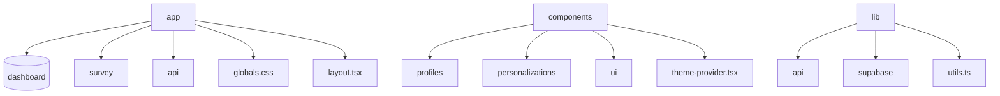
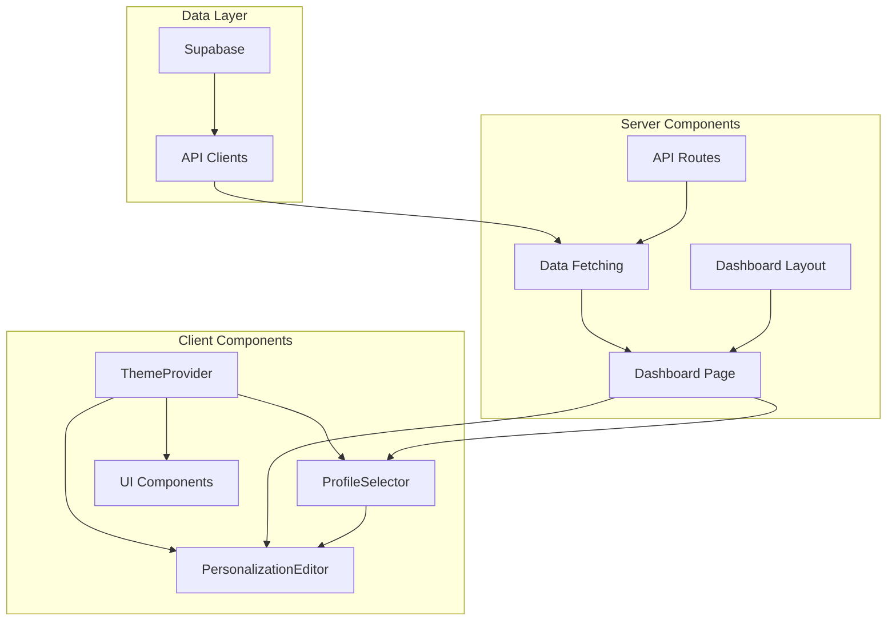
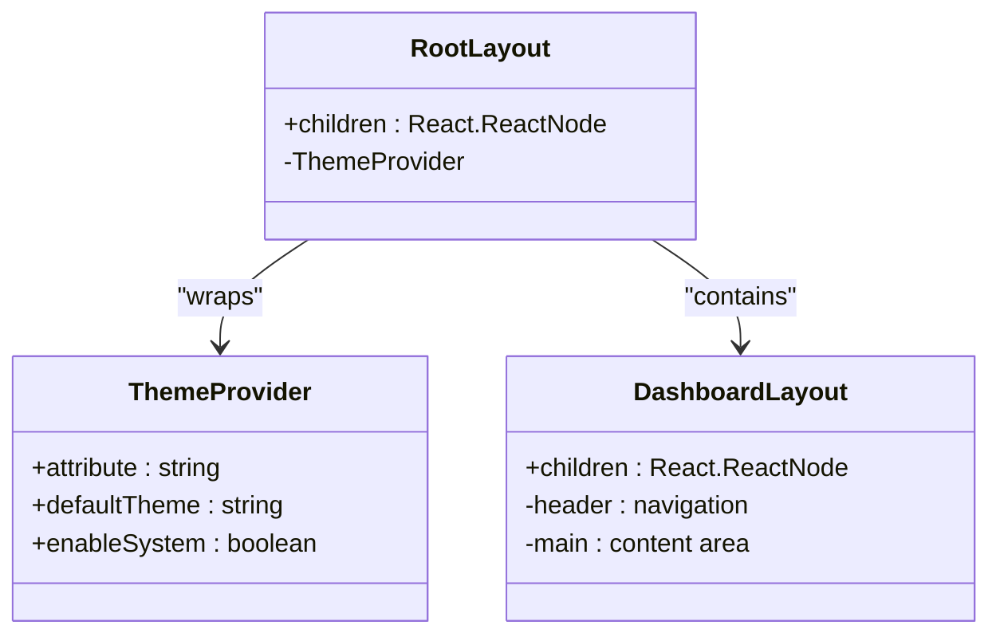
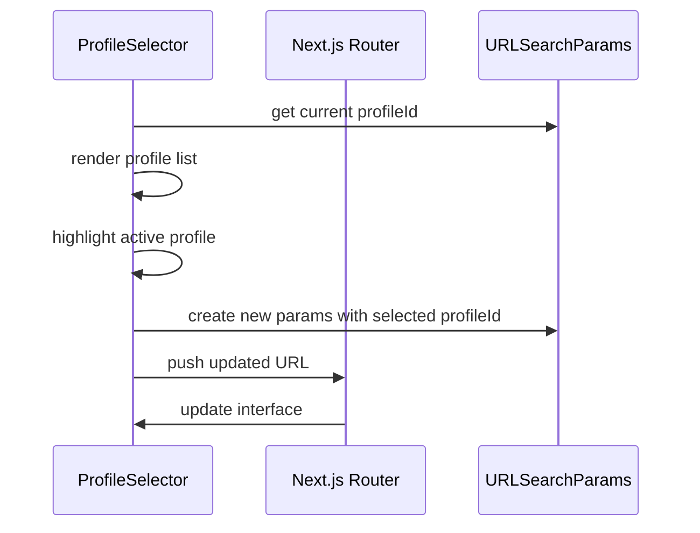
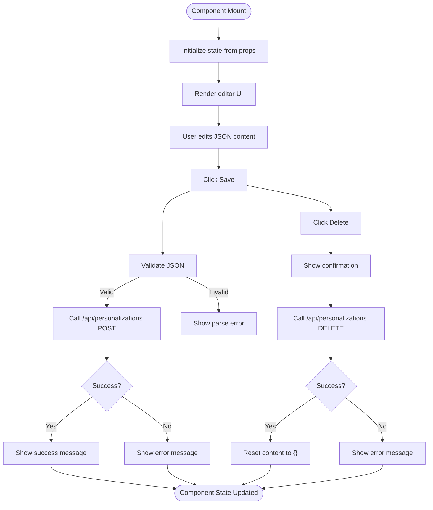
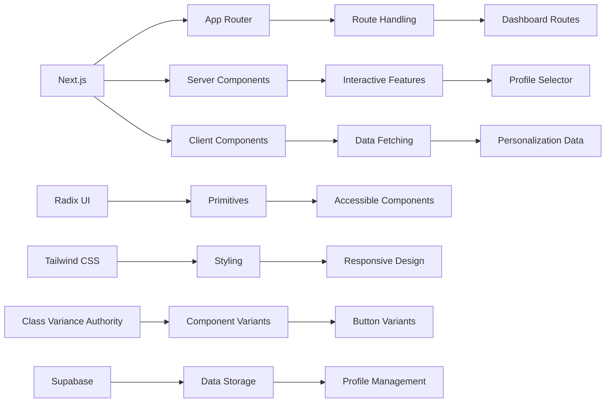

# Frontend Architecture

<cite>
**Referenced Files in This Document**   
- [app/layout.tsx](file://app/layout.tsx)
- [app/(dashboard)/layout.tsx](file://app/(dashboard)/layout.tsx)
- [app/(dashboard)/dashboard/page.tsx](file://app/(dashboard)/dashboard/page.tsx)
- [components/theme-provider.tsx](file://components/theme-provider.tsx)
- [components/profiles/profile-selector.tsx](file://components/profiles/profile-selector.tsx)
- [components/personalizations/personalization-editor.tsx](file://components/personalizations/personalization-editor.tsx)
- [components/ui/button.tsx](file://components/ui/button.tsx)
- [lib/utils.ts](file://lib/utils.ts)
- [lib/api/profiles.ts](file://lib/api/profiles.ts)
- [lib/api/personalizations.ts](file://lib/api/personalizations.ts)
- [lib/supabase/client.ts](file://lib/supabase/client.ts)
- [next.config.ts](file://next.config.ts)
</cite>

## Table of Contents
1. [Introduction](#introduction)
2. [Project Structure](#project-structure)
3. [Core Components](#core-components)
4. [Architecture Overview](#architecture-overview)
5. [Detailed Component Analysis](#detailed-component-analysis)
6. [Dependency Analysis](#dependency-analysis)
7. [Performance Considerations](#performance-considerations)
8. [Troubleshooting Guide](#troubleshooting-guide)
9. [Conclusion](#conclusion)

## Introduction
This document provides a comprehensive architectural overview of the frontend component of the Persona application. It details the Next.js App Router structure, server and client component patterns, data fetching strategies, component hierarchy, state management, UI library implementation, responsive design, accessibility, theming, API interactions, and performance optimization techniques.

## Project Structure

The application follows a standard Next.js App Router structure with clear separation of concerns. Key directories include:
- `app/` - Contains route definitions and layout components
- `components/` - Reusable UI components organized by feature and utility
- `lib/` - Shared logic including API clients and Supabase integration
- `public/` - Static assets

**Diagram sources**
- [app/layout.tsx](file://app/layout.tsx#L1-L24)
- [components/theme-provider.tsx](file://components/theme-provider.tsx#L1-L11)

**Section sources**
- [app/layout.tsx](file://app/layout.tsx#L1-L24)
- [next.config.ts](file://next.config.ts#L1-L15)

## Core Components

The frontend architecture is built around several core components that enable personalized lesson delivery. The system uses a combination of server components for data fetching and client components for interactive features. The component hierarchy starts from root layouts and flows down to atomic UI elements.

**Section sources**
- [app/layout.tsx](file://app/layout.tsx#L1-L24)
- [app/(dashboard)/layout.tsx](file://app/(dashboard)/layout.tsx#L1-L22)

## Architecture Overview

The frontend architecture follows Next.js App Router conventions with a clear separation between server and client components. Data flows from Supabase through API routes to server components, which then pass props to client components for interactivity.

**Diagram sources**
- [app/(dashboard)/dashboard/page.tsx](file://app/(dashboard)/dashboard/page.tsx#L1-L104)
- [lib/api/profiles.ts](file://lib/api/profiles.ts#L1-L38)
- [lib/api/personalizations.ts](file://lib/api/personalizations.ts#L1-L28)

## Detailed Component Analysis

### Layout and Theming System

The application uses a nested layout system with theme support via Next Themes. The root layout provides the HTML structure and theme context, while dashboard-specific layouts add navigation and styling.

**Diagram sources**
- [app/layout.tsx](file://app/layout.tsx#L9-L23)
- [app/(dashboard)/layout.tsx](file://app/(dashboard)/layout.tsx#L1-L22)
- [components/theme-provider.tsx](file://components/theme-provider.tsx#L1-L11)

**Section sources**
- [app/layout.tsx](file://app/layout.tsx#L1-L24)
- [components/theme-provider.tsx](file://components/theme-provider.tsx#L1-L11)

### Profile Selector Component

The ProfileSelector component enables users to switch between different user profiles. It uses client-side navigation with URL search parameters to maintain state without full page reloads.

**Diagram sources**
- [components/profiles/profile-selector.tsx](file://components/profiles/profile-selector.tsx#L12-L65)
- [app/(dashboard)/dashboard/page.tsx](file://app/(dashboard)/dashboard/page.tsx#L1-L104)

**Section sources**
- [components/profiles/profile-selector.tsx](file://components/profiles/profile-selector.tsx#L1-L70)
- [lib/api/profiles.ts](file://lib/api/profiles.ts#L1-L38)

### Personalization Editor Component

The PersonalizationEditor component provides a JSON-based interface for editing lesson personalizations. It handles form state, validation, and API communication for saving and deleting personalization data.

**Diagram sources**
- [components/personalizations/personalization-editor.tsx](file://components/personalizations/personalization-editor.tsx#L12-L154)
- [app/(dashboard)/dashboard/page.tsx](file://app/(dashboard)/dashboard/page.tsx#L1-L104)

**Section sources**
- [components/personalizations/personalization-editor.tsx](file://components/personalizations/personalization-editor.tsx#L1-L157)
- [lib/api/personalizations.ts](file://lib/api/personalizations.ts#L1-L28)

## Dependency Analysis

The frontend architecture relies on several key dependencies that enable its functionality. These include UI primitives, styling utilities, and database integration.

**Diagram sources**
- [next.config.ts](file://next.config.ts#L1-L15)
- [components/ui/button.tsx](file://components/ui/button.tsx#L1-L60)
- [lib/supabase/client.ts](file://lib/supabase/client.ts#L1-L10)
- [lib/utils.ts](file://lib/utils.ts#L1-L6)

**Section sources**
- [next.config.ts](file://next.config.ts#L1-L15)
- [lib/utils.ts](file://lib/utils.ts#L1-L6)

## Performance Considerations

The application implements several performance optimization techniques:

1. **Server Components**: Data fetching occurs on the server to reduce client-side processing
2. **Suspense**: Used for loading states to improve perceived performance
3. **Code Organization**: Components are organized to minimize bundle size
4. **Efficient Rendering**: Conditional rendering prevents unnecessary component mounts

The dashboard page uses `Suspense` to handle loading states during data fetching, providing a smooth user experience while maintaining React's concurrent rendering capabilities.

**Section sources**
- [app/(dashboard)/dashboard/page.tsx](file://app/(dashboard)/dashboard/page.tsx#L1-L104)

## Troubleshooting Guide

Common issues and their solutions:

1. **Theme not applying**: Ensure ThemeProvider wraps all components in the layout
2. **Profile selection not persisting**: Verify URLSearchParams are correctly handled in client components
3. **Personalization save failures**: Check API route implementation and Supabase connection
4. **JSON validation errors**: Validate JSON syntax in the editor before saving

The application includes error handling in the PersonalizationEditor component that provides user feedback for both validation and API errors.

**Section sources**
- [components/personalizations/personalization-editor.tsx](file://components/personalizations/personalization-editor.tsx#L1-L157)
- [app/(dashboard)/dashboard/page.tsx](file://app/(dashboard)/dashboard/page.tsx#L1-L104)

## Conclusion

The frontend architecture of the Persona application effectively combines Next.js App Router features with client-side interactivity to create a seamless experience for managing personalized lessons. The clear separation between server and client components, combined with a well-organized component hierarchy and robust data fetching patterns, creates a maintainable and scalable foundation. The integration of Radix UI primitives with Tailwind CSS provides accessible, styled components while the Supabase integration enables real-time data synchronization. Future improvements could include enhanced error boundaries and more granular code splitting.