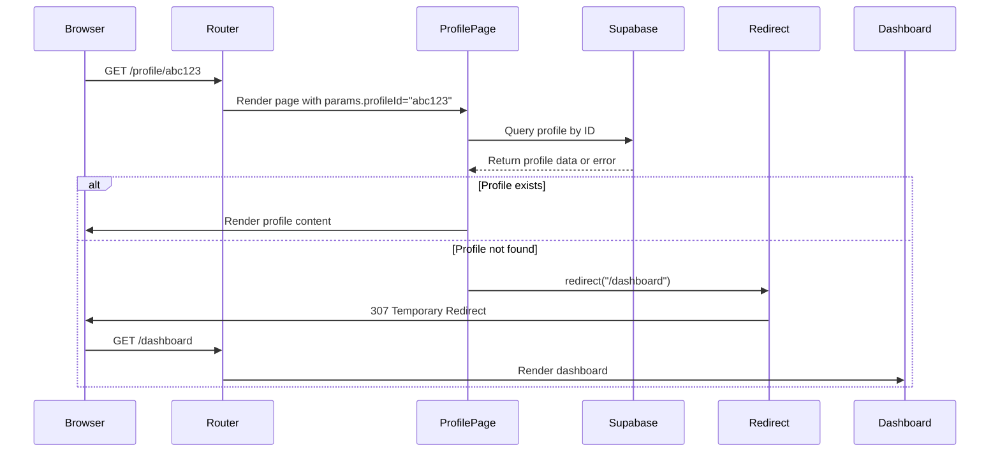
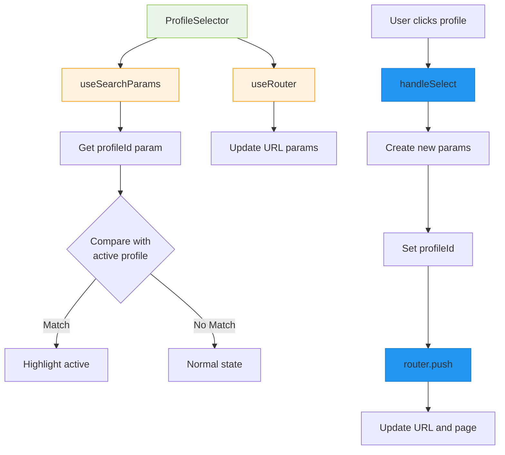
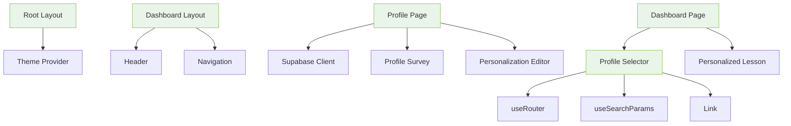

# Navigation and Routing System

<cite>
**Referenced Files in This Document**   
- [app/page.tsx](file://app/page.tsx)
- [app/layout.tsx](file://app/layout.tsx)
- [app/(dashboard)/layout.tsx](file://app/(dashboard)/layout.tsx)
- [app/(dashboard)/dashboard/page.tsx](file://app/(dashboard)/dashboard/page.tsx)
- [app/(dashboard)/dashboard/templates/page.tsx](file://app/(dashboard)/dashboard/templates/page.tsx)
- [app/(dashboard)/profile/[profileId]/page.tsx](file://app/(dashboard)/profile/[profileId]/page.tsx)
- [components/profiles/profile-selector.tsx](file://components/profiles/profile-selector.tsx)
</cite>

## Table of Contents
1. [Introduction](#introduction)
2. [Project Structure](#project-structure)
3. [Core Components](#core-components)
4. [Architecture Overview](#architecture-overview)
5. [Detailed Component Analysis](#detailed-component-analysis)
6. [Dependency Analysis](#dependency-analysis)
7. [Performance Considerations](#performance-considerations)
8. [Troubleshooting Guide](#troubleshooting-guide)
9. [Conclusion](#conclusion)

## Introduction
This document provides a comprehensive analysis of the navigation and routing architecture in the Next.js App Router for the Persona course platform. The system implements a structured routing approach with public routes, protected dashboard routes, and dynamic profile routes. It leverages Next.js features including route groups, layout components, client-side navigation, and URL search parameters for state persistence. The routing system is designed to support a personalized learning experience with profile-based content customization.

## Project Structure

The application follows a Next.js App Router structure with organized route segments and component organization. The routing architecture is divided into public and dashboard sections, with specific patterns for layout sharing and component reuse.

```mermaid
graph TB
subgraph "App Router Structure"
A[app/] --> B[page.tsx]
A --> C[layout.tsx]
A --> D[(dashboard)]
A --> E[api/]
A --> F[survey/]
end
subgraph "Dashboard Route Group"
D --> G[dashboard/page.tsx]
D --> H[dashboard/templates/page.tsx]
D --> I[profile/[profileId]/page.tsx]
D --> J[layout.tsx]
end
subgraph "Components"
K[components/profiles/]
L[components/personalizations/]
M[components/ui/]
end
B --> |Redirects to| G
G --> |Uses| K
I --> |Displays| L
J --> |Shared UI for| D
```

**Diagram sources**
- [app/page.tsx](file://app/page.tsx)
- [app/(dashboard)/dashboard/page.tsx](file://app/(dashboard)/dashboard/page.tsx)
- [app/(dashboard)/profile/[profileId]/page.tsx](file://app/(dashboard)/profile/[profileId]/page.tsx)

**Section sources**
- [app/page.tsx](file://app/page.tsx)
- [app/(dashboard)/layout.tsx](file://app/(dashboard)/layout.tsx)

## Core Components

The navigation system consists of several core components that work together to provide a seamless user experience. The root page serves as the entry point, redirecting users to the dashboard. The dashboard layout provides shared UI elements across all dashboard routes. The ProfileSelector component enables client-side navigation with URL state persistence. Dynamic profile routes allow for personalized content editing based on the profile ID parameter.

**Section sources**
- [app/page.tsx](file://app/page.tsx#L1-L21)
- [app/(dashboard)/layout.tsx](file://app/(dashboard)/layout.tsx#L1-L22)
- [components/profiles/profile-selector.tsx](file://components/profiles/profile-selector.tsx#L1-L70)

## Architecture Overview

The routing architecture implements a hierarchical structure with shared layouts and targeted navigation patterns. The system uses route groups to organize dashboard-related functionality while maintaining clean URL paths. Layout components provide consistent UI elements across route segments, reducing duplication and ensuring visual consistency.

```mermaid
graph TB
A[Root] --> B[Public Routes]
A --> C[Dashboard Route Group]
B --> D[/]
D --> |Redirect| E[/dashboard]
C --> F[/dashboard]
C --> G[/dashboard/templates]
C --> H[/profile/{id}]
F --> |Uses| I[Dashboard Layout]
G --> |Uses| I
H --> |Uses| I
I --> J[Shared Header]
I --> K[Shared Navigation]
I --> L[Container Styling]
M[Client Components] --> N[ProfileSelector]
N --> |useRouter| O[Navigation]
N --> |useSearchParams| P[State Persistence]
Q[Server Components] --> R[Profile Page]
R --> |params| S[Dynamic Routing]
R --> |redirect| F
style C fill:#f0f0f0,stroke:#ccc
style I fill:#e8f5e8,stroke:#8bc34a
```

**Diagram sources**
- [app/page.tsx](file://app/page.tsx#L1-L21)
- [app/(dashboard)/layout.tsx](file://app/(dashboard)/layout.tsx#L1-L22)
- [app/(dashboard)/dashboard/page.tsx](file://app/(dashboard)/dashboard/page.tsx#L1-L104)
- [components/profiles/profile-selector.tsx](file://components/profiles/profile-selector.tsx#L1-L70)

## Detailed Component Analysis

### Root Page and Redirect Logic
The root page implements a simple redirect to the dashboard, serving as the entry point for the application. This pattern ensures users are directed to the main application interface immediately upon visiting the site.

```mermaid
flowchart TD
Start([User visits /]) --> CheckAuth{Authentication<br>Check}
CheckAuth --> |Authenticated| Redirect[Redirect to /dashboard]
CheckAuth --> |Not Authenticated| Login[Show Login]
Redirect --> Dashboard[/dashboard]
Dashboard --> |Preserve| SearchParams[URL Search Parameters]
style Start fill:#4CAF50,stroke:#388E3C
style Redirect fill:#2196F3,stroke:#1976D2
style Dashboard fill:#FFC107,stroke:#FFA000
```

**Diagram sources**
- [app/page.tsx](file://app/page.tsx#L1-L21)

**Section sources**
- [app/page.tsx](file://app/page.tsx#L1-L21)

### Dashboard Layout Structure
The dashboard route group uses a layout component to provide shared UI elements across all dashboard-related routes. This layout includes a consistent header with navigation links and proper container styling.

```mermaid
classDiagram
class DashboardLayout {
+children : ReactNode
+return : JSX.Element
}
class Header {
+title : "Persona"
+navigation : Link[]
}
class MainContainer {
+className : "flex-1 container py-8"
}
DashboardLayout --> Header : "contains"
DashboardLayout --> MainContainer : "contains"
DashboardLayout --> children : "renders"
note right of DashboardLayout
Shared layout for all routes
within (dashboard) group
Provides consistent UI
end note
```

**Diagram sources**
- [app/(dashboard)/layout.tsx](file://app/(dashboard)/layout.tsx#L1-L22)

**Section sources**
- [app/(dashboard)/layout.tsx](file://app/(dashboard)/layout.tsx#L1-L22)

### Dynamic Profile Routing
The dynamic profile route enables personalized content editing based on the profile ID parameter. The route includes server-side validation and redirect logic to handle invalid profile IDs.



**Diagram sources**
- [app/(dashboard)/profile/[profileId]/page.tsx](file://app/(dashboard)/profile/[profileId]/page.tsx#L1-L89)

**Section sources**
- [app/(dashboard)/profile/[profileId]/page.tsx](file://app/(dashboard)/profile/[profileId]/page.tsx#L1-L89)

### Client-Side Navigation with Profile Selection
The ProfileSelector component implements client-side navigation using Next.js router hooks, allowing for dynamic profile selection with URL search parameter persistence.



**Diagram sources**
- [components/profiles/profile-selector.tsx](file://components/profiles/profile-selector.tsx#L1-L70)

**Section sources**
- [components/profiles/profile-selector.tsx](file://components/profiles/profile-selector.tsx#L1-L70)

## Dependency Analysis

The navigation system has well-defined dependencies between components and routing elements. The architecture follows Next.js best practices for separation of concerns between server and client components.



**Diagram sources**
- [app/layout.tsx](file://app/layout.tsx#L1-L24)
- [app/(dashboard)/layout.tsx](file://app/(dashboard)/layout.tsx#L1-L22)
- [app/(dashboard)/dashboard/page.tsx](file://app/(dashboard)/dashboard/page.tsx#L1-L104)
- [app/(dashboard)/profile/[profileId]/page.tsx](file://app/(dashboard)/profile/[profileId]/page.tsx#L1-L89)
- [components/profiles/profile-selector.tsx](file://components/profiles/profile-selector.tsx#L1-L70)

**Section sources**
- [app/layout.tsx](file://app/layout.tsx#L1-L24)
- [app/(dashboard)/layout.tsx](file://app/(dashboard)/layout.tsx#L1-L22)

## Performance Considerations

The routing architecture is optimized for performance through several mechanisms:
- Layout components are reused across route segments, reducing re-renders
- Server components handle data fetching and rendering where possible
- Client components are isolated to interactive elements only
- Suspense is used for loading states during data fetching
- Code splitting occurs automatically at route boundaries

The use of route groups ensures that dashboard-related code is bundled together, improving load performance for users navigating within the dashboard section. Dynamic route parameters are handled efficiently through Next.js's built-in routing system, avoiding client-side routing overhead.

## Troubleshooting Guide

Common issues and solutions for the navigation system:

1. **Profile not found redirect loop**: Ensure the Supabase query in the profile page correctly handles error cases and invalid profile IDs.

2. **Search parameter persistence issues**: Verify that the ProfileSelector component properly merges existing search parameters when updating the profileId.

3. **Layout flickering**: Confirm that the dashboard layout is correctly defined and shared across all routes in the (dashboard) group.

4. **Client-server component conflicts**: Ensure that client components using useRouter or useSearchParams are properly marked with 'use client' directive.

5. **Dynamic route parameter access**: When accessing dynamic parameters in server components, ensure they are awaited properly using async/await syntax.

**Section sources**
- [app/(dashboard)/profile/[profileId]/page.tsx](file://app/(dashboard)/profile/[profileId]/page.tsx#L1-L89)
- [components/profiles/profile-selector.tsx](file://components/profiles/profile-selector.tsx#L1-L70)

## Conclusion

The navigation and routing system in the Next.js App Router for the Persona platform demonstrates effective use of modern Next.js features. The architecture leverages route groups for logical organization, layout components for UI consistency, and client-side navigation for interactive elements. The system effectively combines server components for data fetching with client components for interactivity, following Next.js best practices. URL search parameters are used appropriately for state persistence, and redirect logic ensures proper navigation flow. This routing architecture provides a solid foundation for a scalable application with personalized user experiences.