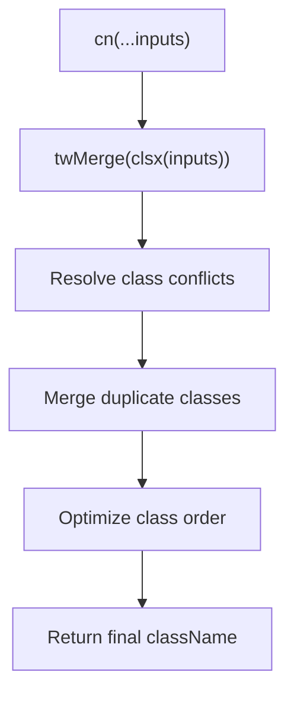
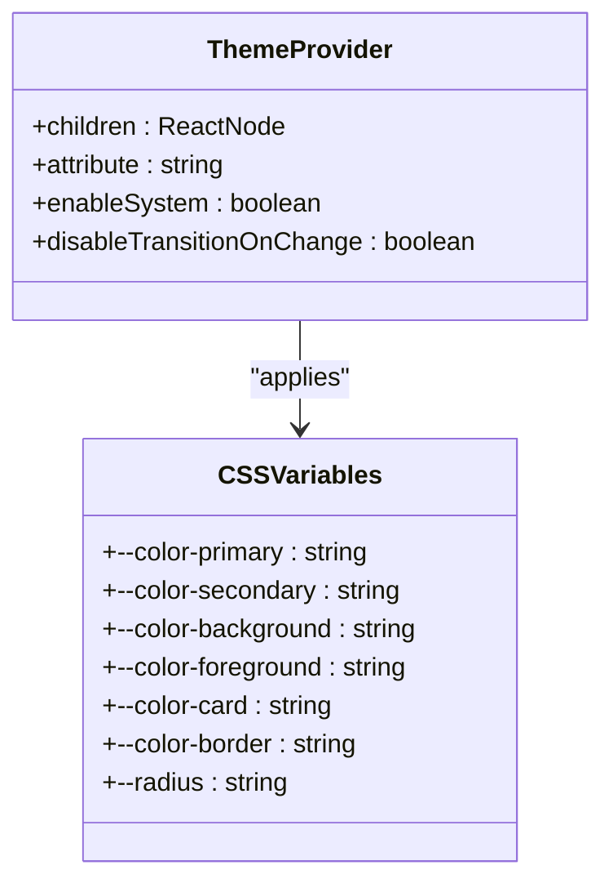
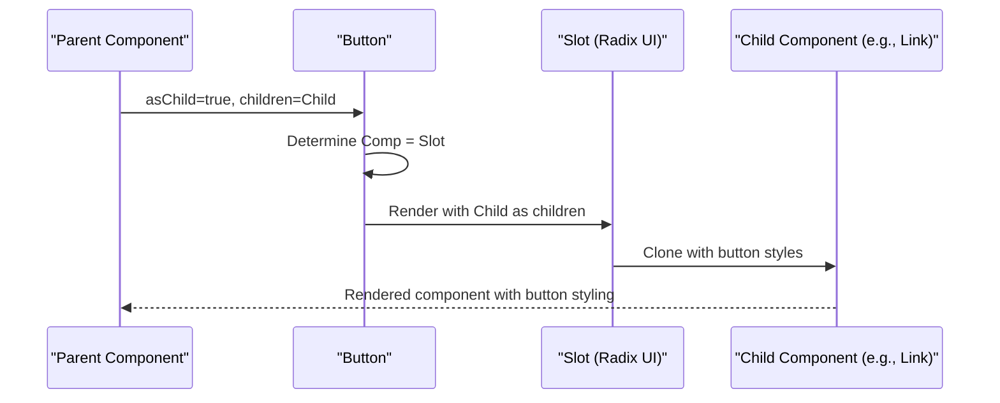

# UI Library Implementation

<cite>
**Referenced Files in This Document**   
- [components/ui/button.tsx](file://components/ui/button.tsx)
- [components/ui/card.tsx](file://components/ui/card.tsx)
- [components/ui/input.tsx](file://components/ui/input.tsx)
- [components/ui/textarea.tsx](file://components/ui/textarea.tsx)
- [components/ui/badge.tsx](file://components/ui/badge.tsx)
- [components/ui/scroll-area.tsx](file://components/ui/scroll-area.tsx)
- [components/ui/separator.tsx](file://components/ui/separator.tsx)
- [components/theme-provider.tsx](file://components/theme-provider.tsx)
- [app/globals.css](file://app/globals.css)
- [lib/utils.ts](file://lib/utils.ts)
</cite>

## Table of Contents
1. [Introduction](#introduction)
2. [Core Components](#core-components)
3. [Styling Mechanism](#styling-mechanism)
4. [Accessibility Features](#accessibility-features)
5. [Theming Support](#theming-support)
6. [Component Composition](#component-composition)
7. [Performance Considerations](#performance-considerations)
8. [Conclusion](#conclusion)

## Introduction
This document details the implementation of a custom UI library built on Radix UI primitives and Tailwind CSS. The library provides a set of reusable components including Button, Card, Input, Textarea, Badge, ScrollArea, and Separator. These components are designed with consistency, accessibility, and theming in mind, leveraging modern React patterns and utility libraries to ensure high-quality user interfaces across the application.

**Section sources**
- [components/ui/button.tsx](file://components/ui/button.tsx#L1-L60)
- [components/ui/card.tsx](file://components/ui/card.tsx#L1-L92)

## Core Components

### Button Component
The Button component is a versatile interactive element that supports multiple variants (default, destructive, outline, secondary, ghost, link) and sizes (default, sm, lg, icon variants). It uses the `asChild` prop pattern to allow composition with other components like links or custom interactive elements while maintaining consistent styling and behavior.

**Section sources**
- [components/ui/button.tsx](file://components/ui/button.tsx#L6-L57)

### Card Component
The Card component serves as a container for related content and supports structured composition through subcomponents: CardHeader, CardTitle, CardDescription, CardAction, CardContent, and CardFooter. This modular design enables consistent card layouts throughout the application while allowing flexibility in content arrangement.

**Section sources**
- [components/ui/card.tsx](file://components/ui/card.tsx#L4-L81)

### Input and Textarea Components
The Input and Textarea components provide form controls with built-in styling for various states including focus, validation errors, and disabled conditions. Both components handle accessibility attributes and support the full range of native HTML input/textarea props, ensuring compatibility with form libraries and controlled component patterns.

**Section sources**
- [components/ui/input.tsx](file://components/ui/input.tsx#L4-L21)
- [components/ui/textarea.tsx](file://components/ui/textarea.tsx#L4-L18)

### Badge Component
The Badge component displays small pieces of information or status indicators with support for different variants (default, secondary, destructive, outline). It can be composed with icons and supports the `asChild` pattern for creating interactive badges that maintain consistent visual styling.

**Section sources**
- [components/ui/badge.tsx](file://components/ui/badge.tsx#L27-L46)

### ScrollArea Component
The ScrollArea component wraps Radix UI's scroll area primitive to provide a styled, accessible scrolling container. It includes a customizable scrollbar and handles focus states appropriately, making it suitable for content that may overflow its container.

**Section sources**
- [components/ui/scroll-area.tsx](file://components/ui/scroll-area.tsx#L7-L58)

### Separator Component
The Separator component creates visual dividers between content sections with support for both horizontal and vertical orientations. It uses semantic markup and appropriate ARIA attributes to maintain accessibility while providing a clean visual separation.

**Section sources**
- [components/ui/separator.tsx](file://components/ui/separator.tsx#L7-L28)

## Styling Mechanism

### Class Variance Authority Integration
The UI components leverage class-variance-authority (CVA) to define variant-based styling in a type-safe manner. The `buttonVariants` and `badgeVariants` functions create reusable variant configurations that can be consumed by their respective components.

```mermaid
classDiagram
class buttonVariants {
+variants : { variant : { default, destructive, outline, secondary, ghost, link }, size : { default, sm, lg, icon, icon-sm, icon-lg } }
+defaultVariants : { variant : "default", size : "default" }
}
class badgeVariants {
+variants : { variant : { default, secondary, destructive, outline } }
+defaultVariants : { variant : "default" }
}
class Button {
+className : string
+variant : "default"|"destructive"|"outline"|"secondary"|"ghost"|"link"
+size : "default"|"sm"|"lg"|"icon"|"icon-sm"|"icon-lg"
+asChild : boolean
}
class Badge {
+className : string
+variant : "default"|"secondary"|"destructive"|"outline"
+asChild : boolean
}
Button --> buttonVariants : "uses"
Badge --> badgeVariants : "uses"
```

**Diagram sources**
- [components/ui/button.tsx](file://components/ui/button.tsx#L6-L36)
- [components/ui/badge.tsx](file://components/ui/badge.tsx#L6-L25)

### clsx and cn Utility Functions
The styling system uses clsx for conditional class composition and tailwind-merge for resolving conflicting Tailwind classes. The `cn` utility function combines these capabilities, ensuring that classes are properly merged without duplication or conflict.



**Diagram sources**
- [lib/utils.ts](file://lib/utils.ts#L3-L5)

**Section sources**
- [lib/utils.ts](file://lib/utils.ts#L1-L6)

## Accessibility Features

### Semantic Markup and ARIA Attributes
All components use appropriate semantic HTML elements and include necessary ARIA attributes for accessibility. The Button component uses the native `<button>` element by default, while other components use appropriate container elements with proper roles when needed.

### Focus Management
Components implement consistent focus styles using Tailwind's focus-visible utilities, ensuring that keyboard navigation is clearly indicated without affecting mouse users. The focus ring is styled with appropriate colors and transparency levels based on the current theme.

### Color Contrast and Visual States
The styling system ensures sufficient color contrast between text and background colors in both light and dark modes. Interactive elements have distinct visual states for hover, focus, and disabled conditions, making their functionality clear to all users.

**Section sources**
- [components/ui/button.tsx](file://components/ui/button.tsx#L6-L57)
- [components/ui/input.tsx](file://components/ui/input.tsx#L4-L21)
- [app/globals.css](file://app/globals.css#L1-L122)

## Theming Support

### CSS Variables and Theme Provider
The application implements theming through CSS variables defined in globals.css, with values for both light and dark modes. The ThemeProvider component from next-themes enables dynamic theme switching while maintaining SSR compatibility.



**Diagram sources**
- [components/theme-provider.tsx](file://components/theme-provider.tsx#L1-L11)
- [app/globals.css](file://app/globals.css#L1-L122)

### Dark Mode Implementation
The dark theme is implemented using a comprehensive set of CSS variables that adjust colors, backgrounds, borders, and shadows. The transition between light and dark modes is smooth and maintains visual consistency across all components.

**Section sources**
- [app/globals.css](file://app/globals.css#L1-L122)
- [components/theme-provider.tsx](file://components/theme-provider.tsx#L1-L11)

## Component Composition

### AsChild Pattern
Several components support the `asChild` prop pattern, which allows them to render as a different component while maintaining their styling. This enables composition with routing components (like Next.js Link) or other interactive elements without losing the visual consistency of the UI library.



**Diagram sources**
- [components/ui/button.tsx](file://components/ui/button.tsx#L38-L57)
- [components/ui/badge.tsx](file://components/ui/badge.tsx#L27-L46)

### Card Subcomponents
The Card component demonstrates effective composition through its subcomponents, which work together to create a cohesive layout. The data-slot attributes enable targeted styling based on the presence of specific subcomponents.

**Section sources**
- [components/ui/card.tsx](file://components/ui/card.tsx#L17-L81)

## Performance Considerations

### Minimal Re-renders
The components are implemented as simple functional components without unnecessary state or effects, minimizing re-renders. The styling is applied at render time through the cn utility, avoiding runtime style calculations.

### Efficient Styling
The use of Tailwind CSS with class-variance-authority ensures that styles are pre-defined and composed efficiently. The cn utility with tailwind-merge prevents class duplication and resolves conflicts, resulting in optimal CSS output.

### Bundle Size Optimization
By building on Radix UI primitives and using utility-first CSS, the library maintains a small bundle size while providing rich functionality. The components are tree-shakable, so only used components are included in the final bundle.

**Section sources**
- [components/ui/button.tsx](file://components/ui/button.tsx#L1-L60)
- [lib/utils.ts](file://lib/utils.ts#L1-L6)
- [app/globals.css](file://app/globals.css#L1-L122)

## Conclusion
The custom UI library provides a robust foundation for building consistent, accessible, and performant user interfaces. By combining Radix UI's accessible primitives with Tailwind CSS's utility classes and enhanced through class-variance-authority for variant management, the library strikes a balance between flexibility and consistency. The theming system enables seamless dark mode support, while the composition patterns allow for flexible usage scenarios without sacrificing design integrity.