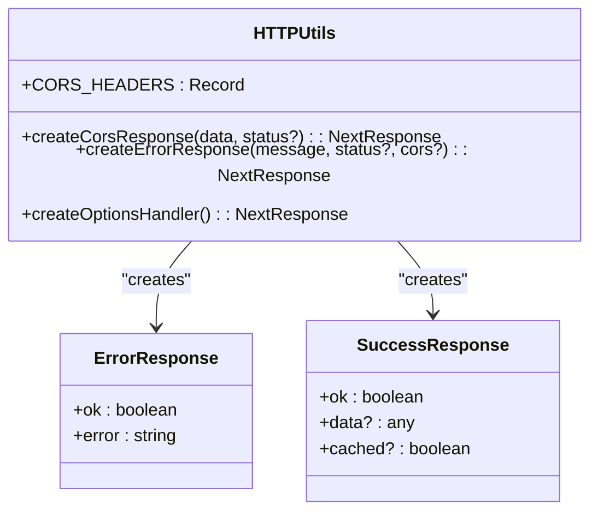
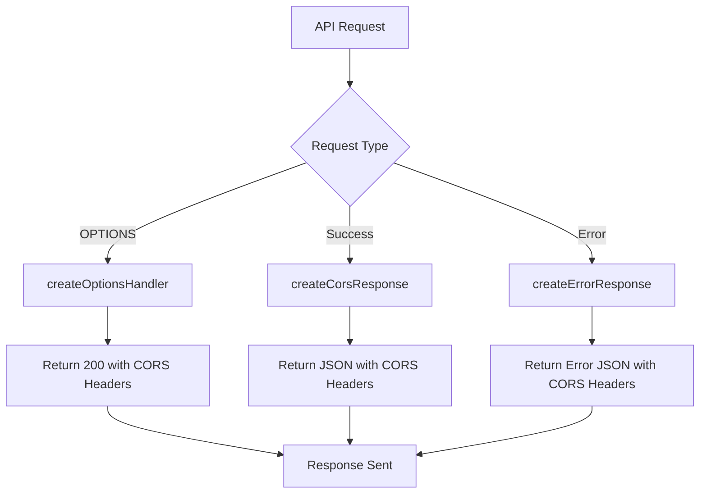
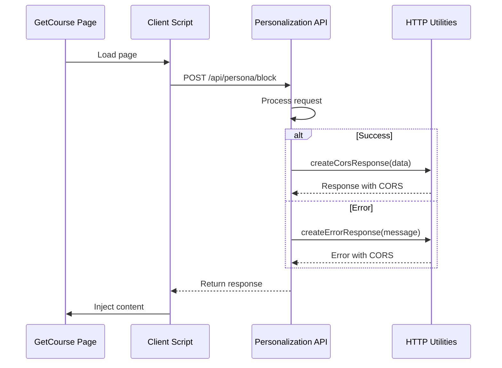

# HTTP Utilities

<cite>
**Referenced Files in This Document**   
- [http.ts](file://lib/utils/http.ts)
- [block/route.ts](file://app/api/persona/block/route.ts)
- [personalize-template/route.ts](file://app/api/persona/personalize-template/route.ts)
- [GETCOURSE_INTEGRATION.md](file://GETCOURSE_INTEGRATION.md)
</cite>

## Table of Contents
1. [Introduction](#introduction)
2. [Core Components](#core-components)
3. [API Interfaces](#api-interfaces)
4. [Integration Patterns](#integration-patterns)
5. [Practical Examples](#practical-examples)
6. [Troubleshooting Guidance](#troubleshooting-guidance)

## Introduction
The HTTP Utilities module provides standardized response handling and CORS configuration for the Persona application's API endpoints. This utility layer ensures consistent HTTP response patterns across all API routes, particularly for cross-origin requests from external platforms like GetCourse. The implementation supports the application's personalized learning experience by enabling secure, reliable communication between the frontend interface and backend services.

**Section sources**
- [http.ts](file://lib/utils/http.ts#L1-L73)

## Core Components
The HTTP Utilities module consists of standardized response generators and CORS configuration that are used across multiple API endpoints. The core components include a shared CORS configuration object and three utility functions for creating consistent HTTP responses. These utilities are imported and used in various API routes to maintain uniform response formats and proper cross-origin headers.

The module exports a constant `CORS_HEADERS` containing standard CORS directives that allow cross-origin POST and OPTIONS requests with Content-Type headers. It also provides three functions: `createCorsResponse` for successful responses with CORS headers, `createErrorResponse` for standardized error responses, and `createOptionsHandler` for handling CORS preflight requests. These components work together to ensure API endpoints can be securely accessed from external domains while maintaining consistent response structures.

**Diagram sources**
- [http.ts](file://lib/utils/http.ts#L1-L73)

**Section sources**
- [http.ts](file://lib/utils/http.ts#L1-L73)

## API Interfaces
The HTTP Utilities module provides three main API interfaces for handling HTTP responses in the application. The `CORS_HEADERS` constant contains the standard CORS configuration used across API routes, allowing cross-origin requests from external platforms. This configuration includes headers for allowed origin (*), methods (POST, OPTIONS), and request headers (Content-Type).

The `createCorsResponse` function creates successful JSON responses with CORS headers. It accepts any data object and an optional status code (defaulting to 200) and returns a NextResponse with the data serialized as JSON and CORS headers applied. This function is used to return successful API responses that need to be accessible from external domains.

The `createErrorResponse` function generates standardized error responses with consistent formatting. It takes an error message string, an optional status code (defaulting to 500), and a boolean flag to include CORS headers (defaulting to true). It returns a NextResponse with an error object containing ok: false and the error message, ensuring clients receive predictable error formats.

The `createOptionsHandler` function provides a generic handler for CORS preflight (OPTIONS) requests. It returns a 200 status response with the standard CORS headers, satisfying browser preflight requirements for cross-origin requests. This function is typically exported directly as the OPTIONS method handler in API routes.

**Diagram sources**
- [http.ts](file://lib/utils/http.ts#L1-L73)

**Section sources**
- [http.ts](file://lib/utils/http.ts#L1-L73)

## Integration Patterns
The HTTP Utilities are integrated into API routes that serve content to external platforms, particularly the GetCourse LMS integration. The primary integration pattern involves importing the utilities in API route files and using them to generate consistent responses with proper CORS headers. This pattern is implemented in endpoints like `/api/persona/block` and `/api/persona/personalize-template`, which deliver personalized lesson content to GetCourse pages via iframe embedding.

The integration follows a standard pattern where API routes import the HTTP utilities and use them in their request handlers. For POST requests, the route processes the business logic and uses `createCorsResponse` to return successful responses with CORS headers. When errors occur, the route uses `createErrorResponse` to return properly formatted error responses. The `createOptionsHandler` is typically exported directly as the OPTIONS method to handle CORS preflight requests automatically.

This integration enables secure cross-origin communication between the Persona application and GetCourse, allowing personalized lesson blocks to be dynamically injected into course pages. The consistent use of these utilities across multiple endpoints ensures that all external integrations receive responses with the same structure and CORS configuration, reducing integration complexity and improving reliability.

**Diagram sources**
- [block/route.ts](file://app/api/persona/block/route.ts#L14-L183)
- [http.ts](file://lib/utils/http.ts#L1-L73)

**Section sources**
- [block/route.ts](file://app/api/persona/block/route.ts#L14-L183)
- [personalize-template/route.ts](file://app/api/persona/personalize-template/route.ts#L20-L146)
- [GETCOURSE_INTEGRATION.md](file://GETCOURSE_INTEGRATION.md#L1-L280)

## Practical Examples
The HTTP Utilities are used in API routes that serve personalized content to external platforms. A practical example is the `/api/persona/block` endpoint, which returns HTML blocks for personalized lesson content. When a request is received, the endpoint validates the user ID and lesson information, then retrieves the corresponding personalized content from the database. If successful, it uses `createCorsResponse` to return the HTML content with proper CORS headers, allowing the response to be used in cross-origin contexts.

Another example is error handling in API routes. When a required parameter is missing or a database query fails, the route uses `createErrorResponse` to return a standardized error response. For instance, if a user profile cannot be found, the endpoint returns an error response with status 404 and a descriptive message. This consistent error format helps client applications handle errors predictably.

For CORS preflight requests, the `createOptionsHandler` function is used as the OPTIONS method handler. When a browser sends a preflight OPTIONS request before a cross-origin POST request, the API route directly exports `createOptionsHandler` as the handler function. This automatically returns a 200 status response with the required CORS headers, allowing the subsequent POST request to proceed.

These examples demonstrate how the HTTP Utilities simplify response handling in API routes while ensuring proper CORS configuration for external integrations. By using these standardized utilities, developers can focus on business logic without worrying about response formatting or CORS configuration.

**Section sources**
- [http.ts](file://lib/utils/http.ts#L1-L73)
- [block/route.ts](file://app/api/persona/block/route.ts#L14-L183)
- [personalize-template/route.ts](file://app/api/persona/personalize-template/route.ts#L20-L146)

## Troubleshooting Guidance
When troubleshooting issues with the HTTP Utilities, start by checking the browser's developer console for CORS-related errors. Common issues include missing or incorrect CORS headers, which can prevent cross-origin requests from succeeding. Verify that API responses include the expected CORS headers (Access-Control-Allow-Origin, Access-Control-Allow-Methods, and Access-Control-Allow-Headers) by inspecting the network requests in the browser's developer tools.

If API endpoints return unexpected error responses, check that `createErrorResponse` is being called with appropriate status codes and error messages. Ensure that error handling code properly catches exceptions and converts them to HTTP responses using the utility functions. Missing try-catch blocks or direct NextResponse.json calls without CORS headers can cause integration issues.

For OPTIONS preflight requests failing, verify that the API route properly exports `createOptionsHandler` as the OPTIONS method handler. Preflight requests must receive a 200 status response with CORS headers before the browser will send the actual request. If the OPTIONS handler is missing or returns an error, the preflight will fail.

When debugging response formatting issues, confirm that `createCorsResponse` is used for successful responses instead of direct NextResponse.json calls. This ensures consistent response structures across all endpoints. Also verify that the response data matches the expected format, particularly the "ok" field in success responses.

Finally, ensure that the HTTP Utilities module is properly imported in API route files. Missing imports or incorrect import paths can prevent the utility functions from being available, leading to inconsistent response handling and CORS issues.

**Section sources**
- [http.ts](file://lib/utils/http.ts#L1-L73)
- [block/route.ts](file://app/api/persona/block/route.ts#L14-L183)
- [GETCOURSE_INTEGRATION.md](file://GETCOURSE_INTEGRATION.md#L1-L280)