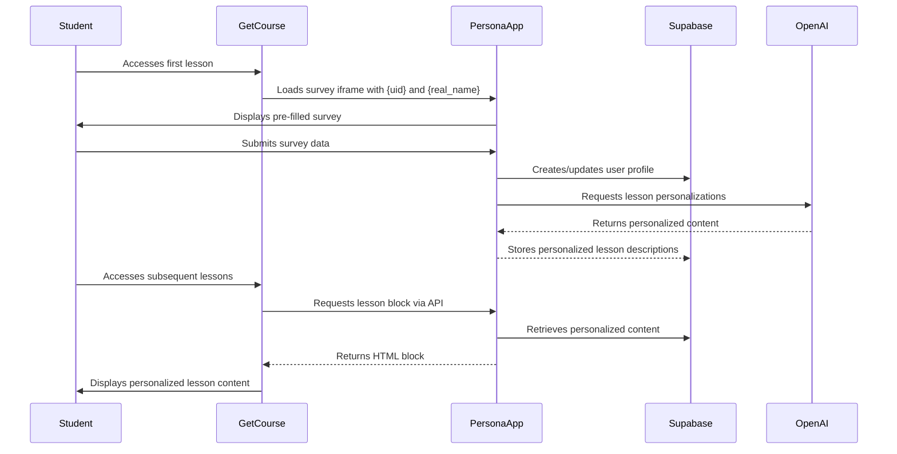
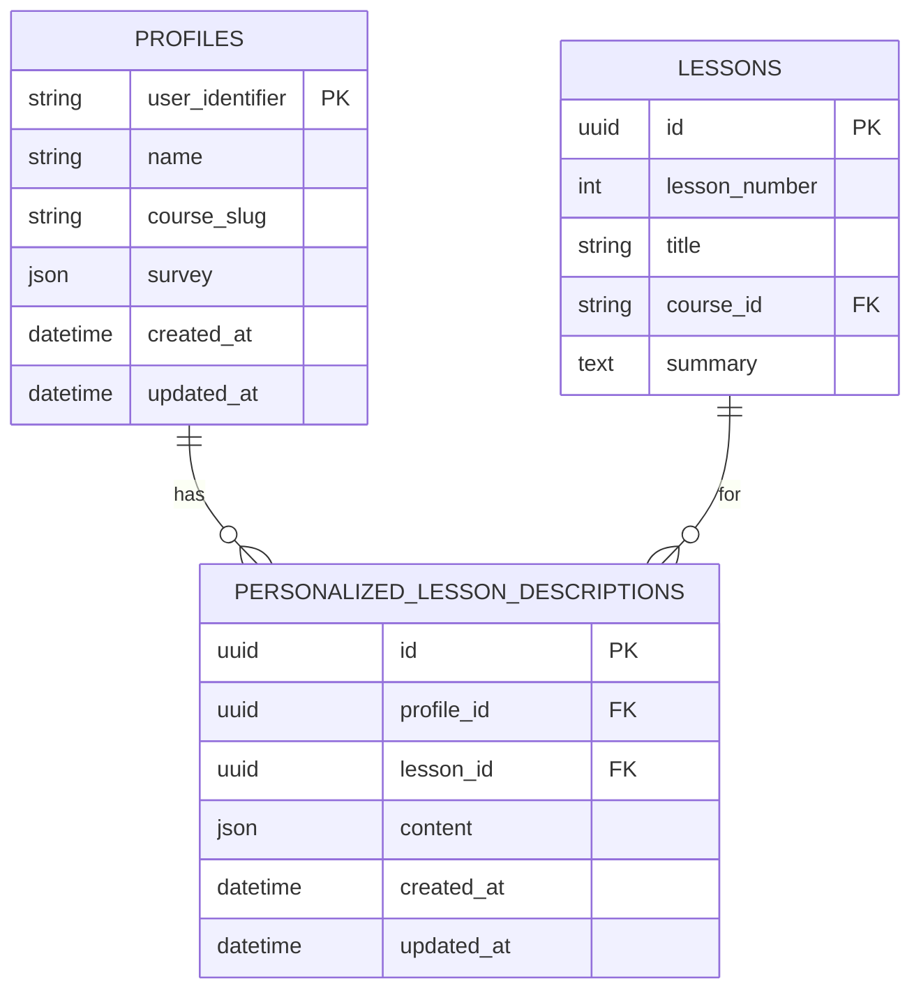

# GetCourse Integration

<cite>
**Referenced Files in This Document**   
- [GETCOURSE_HTML_CODES.md](file://GETCOURSE_HTML_CODES.md)
- [app/api/persona/block/route.ts](file://app/api/persona/block/route.ts)
- [app/api/survey/route.ts](file://app/api/survey/route.ts)
- [app/survey/iframe/page.tsx](file://app/survey/iframe/page.tsx)
- [public/getcourse/anketa.html](file://public/getcourse/anketa.html)
- [public/getcourse/lesson-block-template.html](file://public/getcourse/lesson-block-template.html)
- [public/persona/styles.css](file://public/persona/styles.css)
</cite>

## Table of Contents
1. [Introduction](#introduction)
2. [Integration Process Overview](#integration-process-overview)
3. [Survey Integration](#survey-integration)
4. [Lesson Block Integration](#lesson-block-integration)
5. [Data Flow and Processing](#data-flow-and-processing)
6. [Placeholder Usage](#placeholder-usage)
7. [HTML and JavaScript Code Snippets](#html-and-javascript-code-snippets)
8. [Lesson Title and Keyword Mapping](#lesson-title-and-keyword-mapping)
9. [Troubleshooting Guide](#troubleshooting-guide)
10. [Styling and Visual Consistency](#styling-and-visual-consistency)

## Introduction

This document provides comprehensive instructions for integrating the persona application with GetCourse LMS. The integration enables personalized learning experiences by collecting user profiles through a survey and injecting customized lesson content into course materials. The system leverages GetCourse's user data placeholders to pre-fill survey fields and link user profiles across the platform.

**Section sources**
- [GETCOURSE_HTML_CODES.md](file://GETCOURSE_HTML_CODES.md)
- [GETCOURSE_SETUP.md](file://GETCOURSE_SETUP.md)

## Integration Process Overview

The integration consists of two main components: survey embedding for user profile collection and personalized lesson block injection. The process begins with students completing a survey on the first course lesson, which captures their goals, motivations, and preferences. This information is stored in Supabase and used to generate AI-powered personalized content for subsequent lessons. The personalized blocks are then dynamically injected into each lesson page through JavaScript.



**Diagram sources**
- [app/api/survey/route.ts](file://app/api/survey/route.ts)
- [app/api/persona/block/route.ts](file://app/api/persona/block/route.ts)

**Section sources**
- [GETCOURSE_SETUP.md](file://GETCOURSE_SETUP.md)
- [GETCOURSE_INTEGRATION.md](file://GETCOURSE_INTEGRATION.md)

## Survey Integration

The survey integration involves embedding an iframe on the first lesson of the course to collect user profile information. The survey form is pre-filled with the student's name using GetCourse's `{real_name}` placeholder, while the `{uid}` parameter links the survey response to the user's identifier in the system. The survey collects essential information including motivation, target clients, desired skills, fears, expected results, and practice models.

The survey is implemented as a Next.js page component that processes URL parameters and displays a form. Upon submission, the data is sent to the `/api/survey` endpoint, which creates or updates the user's profile in Supabase and triggers AI-generated personalizations for all course lessons.

```mermaid
flowchart TD
A[Student accesses first lesson] --> B{Survey iframe loaded}
B --> C[Extract {uid} and {real_name} from URL]
C --> D[Pre-fill survey form with name]
D --> E[Student completes survey]
E --> F[Submit to /api/survey endpoint]
F --> G[Create/update profile in Supabase]
G --> H[Generate AI personalizations]
H --> I[Store in personalized_lesson_descriptions]
I --> J[Display success message]
```

**Diagram sources**
- [app/survey/iframe/page.tsx](file://app/survey/iframe/page.tsx)
- [app/api/survey/route.ts](file://app/api/survey/route.ts)

**Section sources**
- [public/getcourse/anketa.html](file://public/getcourse/anketa.html)
- [app/survey/iframe/page.tsx](file://app/survey/iframe/page.tsx)

## Lesson Block Integration

Lesson block integration involves injecting personalized content into each course lesson after the initial survey is completed. This is achieved by adding a container div and JavaScript code to each lesson in GetCourse. The container has a unique ID following the pattern `persona-lesson-N` where N is the lesson number. The JavaScript code fetches the personalized content from the `/api/persona/block` endpoint and injects it into the container.

The integration uses the `data-lesson` attribute to specify a keyword or phrase from the lesson title for matching against the lesson database, and the `data-title` attribute to provide the full lesson title for display purposes. The script also dynamically loads the required CSS styles if they haven't been loaded already, ensuring consistent visual presentation across lessons.

```mermaid
flowchart TD
A[Lesson page loads] --> B[Execute lesson block script]
B --> C[Extract user ID from {uid}]
C --> D[Get lesson keyword from data-lesson]
D --> E[Get lesson title from data-title]
E --> F[Call /api/persona/block API]
F --> G{Profile exists?}
G --> |Yes| H[Retrieve personalized content]
G --> |No| I[Show survey prompt]
H --> J[Inject HTML into container]
I --> J
J --> K[Load styles if needed]
K --> L[Display personalized block]
```

**Diagram sources**
- [app/api/persona/block/route.ts](file://app/api/persona/block/route.ts)
- [public/getcourse/lesson-block-template.html](file://public/getcourse/lesson-block-template.html)

**Section sources**
- [app/api/persona/block/route.ts](file://app/api/persona/block/route.ts)
- [public/getcourse/lesson-block-template.html](file://public/getcourse/lesson-block-template.html)

## Data Flow and Processing

The data flow begins with user input in the survey and progresses through storage, processing, and presentation layers. When a student submits the survey, their responses are sent to the `/api/survey` endpoint, which stores the data in the Supabase `profiles` table using the `{uid}` as the `user_identifier`. This profile data is then used to generate personalized lesson descriptions for all course lessons using OpenAI's GPT-4o-mini model.

The personalization process combines the user's survey responses with predefined lesson templates stored in the `store/shvz/` directory. These templates contain the base content for each lesson, which is then customized based on the user's specific motivations, goals, fears, and practice models. The resulting personalized content is stored in the `personalized_lesson_descriptions` table, linked to both the user's profile and the specific lesson.

When a student accesses a lesson, the client-side script calls the `/api/persona/block` endpoint with the user ID, lesson keyword, and lesson title. The API retrieves the corresponding personalized content from Supabase and returns it as HTML, which is then injected into the lesson page. The system includes fallback mechanisms to handle cases where personalizations are not yet available or the user hasn't completed the survey.



**Diagram sources**
- [app/api/survey/route.ts](file://app/api/survey/route.ts)
- [app/api/persona/block/route.ts](file://app/api/persona/block/route.ts)

**Section sources**
- [app/api/survey/route.ts](file://app/api/survey/route.ts)
- [app/api/persona/block/route.ts](file://app/api/persona/block/route.ts)

## Placeholder Usage

The integration utilizes two key placeholders from GetCourse: `{uid}` and `{real_name}`. These placeholders are automatically replaced by GetCourse with the actual user data when the lesson page is rendered. The `{uid}` placeholder represents the unique user identifier in GetCourse and is used as the `user_identifier` in the Supabase `profiles` table to link all user data across sessions. This ensures that a user's personalization persists even if they access the course from different devices or sessions.

The `{real_name}` placeholder contains the student's first name as provided in their GetCourse profile. This value is passed as a URL parameter to the survey iframe and used to pre-fill the name field in the survey form. This improves user experience by reducing the amount of information students need to enter manually and increases completion rates for the personalization survey.

Both placeholders are case-sensitive and must be included exactly as shown in the integration code. They should not be enclosed in quotes or modified in any way within the HTML code snippets. The system includes validation to handle cases where these placeholders might not be properly replaced by GetCourse, defaulting to "guest" for the user ID in such cases.

**Section sources**
- [app/survey/iframe/page.tsx](file://app/survey/iframe/page.tsx)
- [GETCOURSE_HTML_CODES.md](file://GETCOURSE_HTML_CODES.md)

## HTML and JavaScript Code Snippets

The integration requires specific HTML and JavaScript code snippets to be added to GetCourse lesson pages. For the survey integration, the following code should be added to the first lesson:

```html
<div style="max-width:900px;margin:40px auto;padding:20px;">
  <h2 style="text-align:center;color:#667eea;margin-bottom:20px;">
    🎯 Personalization of your course
  </h2>
  <p style="text-align:center;color:#666;margin-bottom:30px;">
    Complete a short questionnaire to receive personalized recommendations in each lesson
  </p>
  
  <iframe 
    src="https://pesonalisev2-zxby.vercel.app/survey/iframe?uid={uid}&name={real_name}" 
    style="width:100%;height:1200px;border:0;border-radius:16px;box-shadow:0 10px 40px rgba(102,126,234,0.2);"
    allowtransparency="true">
  </iframe>
  
  <p style="text-align:center;color:#999;margin-top:20px;font-size:14px;">
    💡 Your responses are used only for lesson personalization
  </p>
</div>
```

For lesson block integration, the following template should be used on each lesson page, with appropriate modifications for the lesson number, keyword, and title:

```html
<div id="persona-lesson-X" 
     data-lesson="KEYWORD_FROM_TITLE" 
     data-title="FULL_LESSON_TITLE" 
     style="display:none;margin:30px 0;">
</div>

<script>
(async function(){
  const API = "https://pesonalisev2-zxby.vercel.app/api/persona";
  const UID = "{uid}";
  const userId = (/^\d{3,}$/.test(String(UID))) ? String(UID) : "guest";
  const mount = document.getElementById('persona-lesson-X');
  const lesson = mount.getAttribute('data-lesson');
  const title = mount.getAttribute('data-title');

  try {
    const r = await fetch(`${API}/block`, {
      method: 'POST',
      headers: {'Content-Type': 'application/json'},
      body: JSON.stringify({ 
        user_id: userId, 
        lesson: lesson, 
        title: title, 
        flush: false 
      })
    });
    
    const data = await r.json();
    
    if (data && data.ok && data.html) {
      if (!document.querySelector('link[data-persona-styles]')) {
        const link = document.createElement('link');
        link.rel = 'stylesheet';
        link.href = 'https://pesonalisev2-zxby.vercel.app/persona/styles.css';
        link.setAttribute('data-persona-styles', '1');
        document.head.appendChild(link);
      }
      mount.innerHTML = data.html;
      mount.style.display = 'block';
    }
  } catch(e) {
    console.error('Persona block error:', e);
  }
})();
</script>
```

**Section sources**
- [GETCOURSE_HTML_CODES.md](file://GETCOURSE_HTML_CODES.md)
- [public/getcourse/anketa.html](file://public/getcourse/anketa.html)
- [public/getcourse/lesson-block-template.html](file://public/getcourse/lesson-block-template.html)

## Lesson Title and Keyword Mapping

Proper mapping of lesson titles and keywords is critical for the personalization system to correctly identify and display content. The `data-lesson` attribute should contain a distinctive keyword or phrase from the lesson title that can uniquely identify the lesson within the course. This keyword is used to search the database for the corresponding lesson record.

For example, for a lesson titled "What is Post-Isometric Relaxation?", the `data-lesson` attribute could be set to "post-isometric" or "relaxation". The system performs a case-insensitive search for this keyword within the lesson titles in the database. If an exact match is not found, the system will attempt to match by lesson number extracted from the keyword if it appears to be numeric.

The `data-title` attribute should contain the complete, exact title of the lesson as it appears in the course. This title is used for display purposes within the personalized block and for analytics. It's important that this title matches exactly with the title stored in the database to ensure proper tracking and reporting.

When multiple lessons contain similar keywords, it's recommended to use more specific phrases in the `data-lesson` attribute to avoid ambiguity. For example, instead of using "demonstration" for multiple lessons, use "1-lesson-demonstration", "2-lesson-demonstration", etc., to ensure accurate matching.

**Section sources**
- [app/api/persona/block/route.ts](file://app/api/persona/block/route.ts)
- [GETCOURSE_HTML_CODES.md](file://GETCOURSE_HTML_CODES.md)

## Troubleshooting Guide

Common issues and their solutions:

**Failed Block Loading**
- Check browser console for JavaScript errors
- Verify that `{uid}` is being properly replaced by GetCourse (should be a 3+ digit number)
- Ensure the `persona-lesson-N` ID matches exactly in both the div and JavaScript
- Confirm internet connectivity and API endpoint accessibility

**Missing Styles**
- Check if the CSS file is accessible at https://pesonalisev2-zxby.vercel.app/persona/styles.css
- Verify that the script is creating the link element in the document head
- Ensure no browser extensions are blocking external stylesheet loading
- Check for CSS conflicts with existing GetCourse styles

**Incorrect User Identifier Propagation**
- Verify that `{uid}` placeholder is correctly implemented in GetCourse
- Check that the iframe URL contains the `{uid}` parameter
- Confirm that the user identifier in Supabase matches the one from GetCourse
- Test with multiple user accounts to verify identifier uniqueness

**Personalization Not Applied**
- Ensure the survey was completed successfully
- Verify that the profile exists in Supabase with the correct `user_identifier`
- Check that personalizations were generated in the `personalized_lesson_descriptions` table
- Confirm that the lesson keyword in `data-lesson` matches the database record

**Slow Loading Times**
- Check OpenAI API key and rate limits
- Verify Supabase connection performance
- Consider implementing client-side caching
- Monitor server response times in Vercel dashboard

**Section sources**
- [app/api/persona/block/route.ts](file://app/api/persona/block/route.ts)
- [app/api/survey/route.ts](file://app/api/survey/route.ts)
- [GETCOURSE_SETUP.md](file://GETCOURSE_SETUP.md)

## Styling and Visual Consistency

Visual consistency is maintained through the external CSS file hosted at https://pesonalisev2-zxby.vercel.app/persona/styles.css. This stylesheet defines the appearance of all personalized lesson blocks, ensuring a uniform look and feel across all lessons and users. The styles include a clean, modern design with appropriate spacing, typography, and color scheme that complements typical course content.

The CSS file defines several key components:
- `.persona-block`: Main container with padding, border, and shadow
- `.persona-section`: Content sections with background and border
- `.persona-section-title`: Section headings with appropriate sizing and color
- `.persona-text`: Body text with optimal line height and color
- `.persona-list`: Styled lists with custom bullet points
- `.persona-homework`: Special styling for homework sections
- `.persona-alert`: Alert messages with appropriate visual hierarchy
- `.persona-btn`: Call-to-action buttons with gradient and hover effects

The stylesheet is designed to be responsive, adapting to different screen sizes and device types. On mobile devices, padding and font sizes are reduced to accommodate smaller screens while maintaining readability. The styles are loaded dynamically by the lesson block script, ensuring they are only loaded when needed and not duplicated across multiple lesson pages.

**Section sources**
- [public/persona/styles.css](file://public/persona/styles.css)
- [app/api/persona/block/route.ts](file://app/api/persona/block/route.ts)