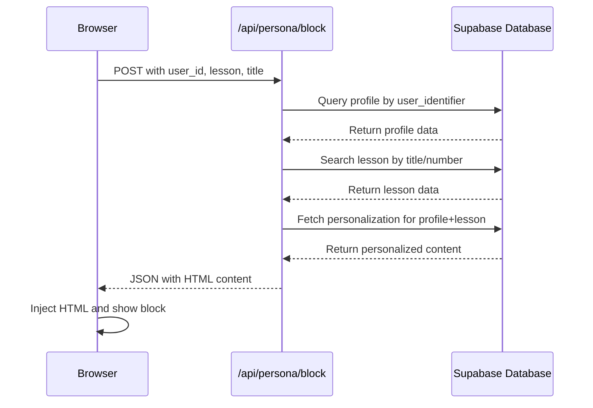
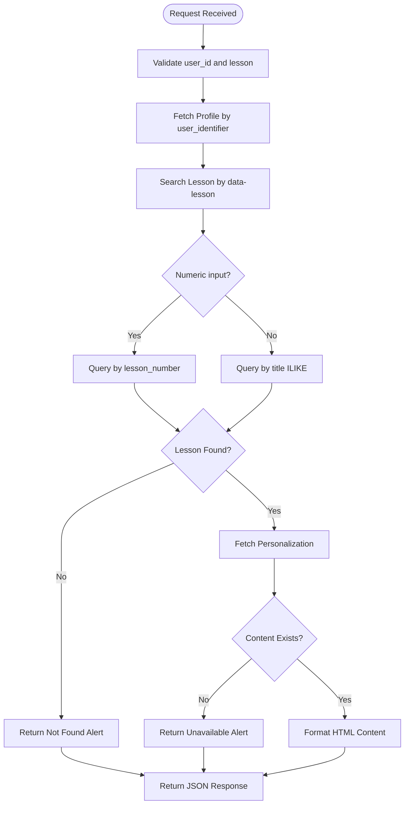

# Lesson Block Integration

<cite>
**Referenced Files in This Document**   
- [GETCOURSE_HTML_CODES.md](file://GETCOURSE_HTML_CODES.md)
- [app/api/persona/block/route.ts](file://app/api/persona/block/route.ts)
- [lib/services/personalization.ts](file://lib/services/personalization.ts)
- [lib/services/html-formatter.ts](file://lib/services/html-formatter.ts)
- [public/getcourse/lesson-block-template.html](file://public/getcourse/lesson-block-template.html)
- [public/persona/styles.css](file://public/persona/styles.css)
</cite>

## Table of Contents
1. [Introduction](#introduction)
2. [Purpose of data-lesson and data-title Attributes](#purpose-of-data-lesson-and-data-title-attributes)
3. [Step-by-Step Integration Instructions](#step-by-step-integration-instructions)
4. [Client-Side Script Behavior](#client-side-script-behavior)
5. [Backend Processing and Keyword Matching](#backend-processing-and-keyword-matching)
6. [Common Issues and Debugging Strategies](#common-issues-and-debugging-strategies)
7. [Conclusion](#conclusion)

## Introduction
This document provides comprehensive guidance for integrating personalized lesson blocks into GetCourse course pages. It explains the technical implementation, including the role of data attributes, JavaScript integration, API communication, and styling. The system enables dynamic content personalization based on user profiles and lesson context, enhancing the learning experience through tailored recommendations.

**Section sources**
- [GETCOURSE_HTML_CODES.md](file://GETCOURSE_HTML_CODES.md)

## Purpose of data-lesson and data-title Attributes
The `data-lesson` and `data-title` attributes are essential for mapping course content to AI-generated personalizations. The `data-lesson` attribute contains a keyword or lesson number used to identify the lesson in the database, while `data-title` stores the full lesson title displayed to users.

During the backend processing, `data-lesson` is used as a search parameter to locate the corresponding lesson record. This allows flexible matching using partial titles or numeric identifiers. The `data-title` attribute ensures accurate display of lesson information within personalized content blocks.

These attributes work together to connect user-specific data with relevant lesson content, enabling the system to deliver contextually appropriate personalizations.

**Section sources**
- [app/api/persona/block/route.ts](file://app/api/persona/block/route.ts#L20-L45)
- [GETCOURSE_HTML_CODES.md](file://GETCOURSE_HTML_CODES.md)

## Step-by-Step Integration Instructions
To integrate personalized lesson blocks, follow these steps:

1. Insert the universal JavaScript template into each lesson page in GetCourse
2. Customize the `id` attribute to match the lesson number (e.g., `persona-lesson-1`)
3. Set `data-lesson` to a keyword from the lesson title or the lesson number
4. Set `data-title` to the complete lesson title
5. Ensure the script is placed where the personalized block should appear

For lessons 1-12, use the specific code snippets provided in GETCOURSE_HTML_CODES.md, replacing placeholder values with actual lesson information. Each lesson block must have a unique ID to prevent conflicts.

The integration requires no server-side changes, as all personalization is handled through client-server communication with the persona API endpoint.

**Section sources**
- [GETCOURSE_HTML_CODES.md](file://GETCOURSE_HTML_CODES.md)
- [public/getcourse/lesson-block-template.html](file://public/getcourse/lesson-block-template.html)

## Client-Side Script Behavior
The client-side script dynamically fetches and injects personalized content into lesson pages. It operates as follows:

1. Extracts user ID from the `{uid}` placeholder provided by GetCourse
2. Identifies the target container using the `id` attribute
3. Retrieves `data-lesson` and `data-title` values for API request
4. Sends a POST request to `/api/persona/block` with user and lesson data
5. Processes the JSON response containing personalized HTML
6. Conditionally loads external CSS from `/persona/styles.css` if not already present
7. Injects the personalized HTML into the page and makes it visible

The script uses conditional loading to prevent duplicate CSS imports by checking for the presence of a link element with the `data-persona-styles` attribute before adding a new one.

**Diagram sources**
- [app/api/persona/block/route.ts](file://app/api/persona/block/route.ts#L15-L108)
- [public/getcourse/lesson-block-template.html](file://public/getcourse/lesson-block-template.html)

**Section sources**
- [app/api/persona/block/route.ts](file://app/api/persona/block/route.ts#L15-L108)
- [public/getcourse/lesson-block-template.html](file://public/getcourse/lesson-block-template.html)

## Backend Processing and Keyword Matching
The backend processes personalization requests through the `/api/persona/block` endpoint. When a request is received, the system performs the following steps:

1. Validates required parameters (`user_id`, `lesson`)
2. Retrieves user profile from Supabase using `user_identifier`
3. Searches for the lesson using keyword matching on the `data-lesson` value
4. Attempts exact match first, then falls back to partial title matching
5. For numeric inputs, queries by `lesson_number`
6. Fetches personalized content from the database using profile and lesson IDs
7. Formats the response using predefined HTML templates

The keyword matching system supports both text-based searches (using `ilike` for case-insensitive pattern matching) and numeric lesson identification, providing flexibility in how lessons are referenced.

**Diagram sources**
- [app/api/persona/block/route.ts](file://app/api/persona/block/route.ts#L40-L85)
- [lib/services/personalization.ts](file://lib/services/personalization.ts#L53-L81)

**Section sources**
- [app/api/persona/block/route.ts](file://app/api/persona/block/route.ts#L40-L85)
- [lib/services/personalization.ts](file://lib/services/personalization.ts#L53-L81)

## Common Issues and Debugging Strategies
Several common issues may occur during integration:

**Blocks Not Appearing**
- Verify the container ID matches the script's `getElementById` call
- Check that `{uid}` is properly populated by GetCourse
- Ensure the API endpoint is accessible and responding

**Incorrect Personalization**
- Confirm `data-lesson` contains accurate keywords from lesson titles
- Verify lesson numbers match between the database and implementation
- Check that user profiles exist in the database

**Missing Styles**
- Ensure the conditional CSS loading logic is intact
- Verify network access to `styles.css`
- Check for CSS conflicts with existing page styles

**JavaScript Errors**
- Inspect browser console for error messages
- Validate JSON response structure from the API
- Confirm proper HTML escaping in template strings

Debugging strategies include:
- Using browser developer tools to inspect network requests
- Checking console logs for error messages
- Verifying API responses in the Network tab
- Testing with different user accounts to isolate profile-related issues
- Validating database content for missing personalizations

**Section sources**
- [app/api/persona/block/route.ts](file://app/api/persona/block/route.ts)
- [public/getcourse/lesson-block-template.html](file://public/getcourse/lesson-block-template.html)
- [lib/services/html-formatter.ts](file://lib/services/html-formatter.ts)

## Conclusion
The personalized lesson block integration provides a powerful way to enhance course content with AI-generated recommendations. By properly implementing the JavaScript template and understanding the role of data attributes, course creators can deliver tailored learning experiences. The system's robust error handling and conditional resource loading ensure reliable performance across different scenarios. Regular testing and monitoring using the provided debugging strategies will help maintain optimal functionality.