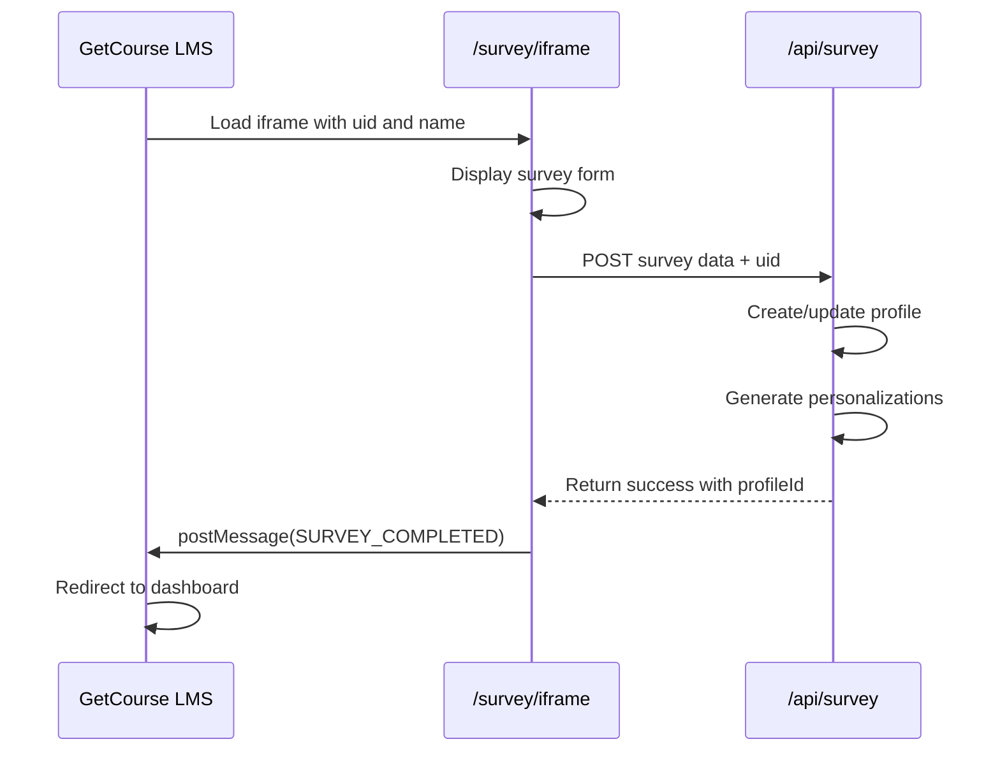
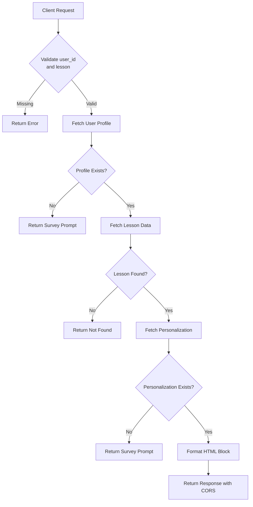
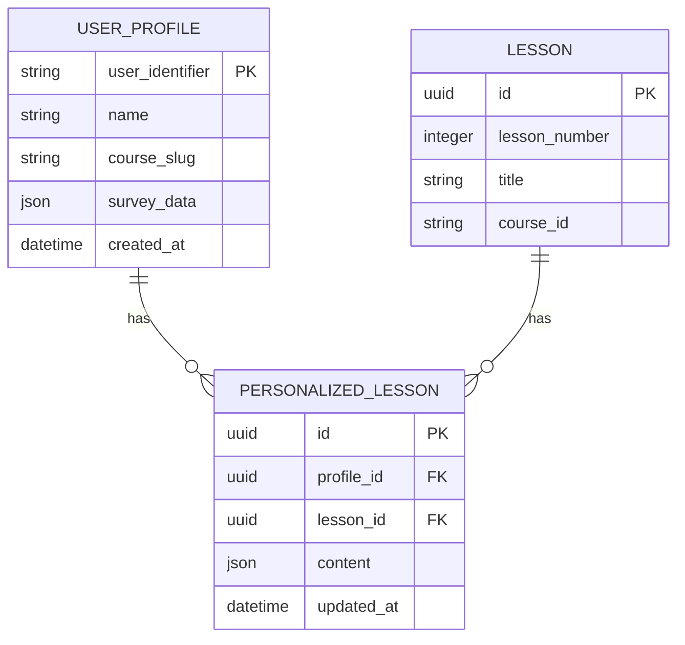

# Integration Guide

<cite>
**Referenced Files in This Document**   
- [block/route.ts](file://app/api/persona/block/route.ts)
- [personalize-template/route.ts](file://app/api/persona/personalize-template/route.ts)
- [page.tsx](file://app/survey/iframe/page.tsx)
- [all-lessons.html](file://public/getcourse/all-lessons.html)
- [anketa.html](file://public/getcourse/anketa.html)
- [lesson-block-template.html](file://public/getcourse/lesson-block-template.html)
- [GETCOURSE_INTEGRATION.md](file://GETCOURSE_INTEGRATION.md)
</cite>

## Table of Contents
1. [Integration Overview](#integration-overview)
2. [Iframe Integration at /survey/iframe](#iframe-integration-at-surveyiframe)
3. [Lesson Personalization Blocks](#lesson-personalization-blocks)
4. [Static HTML Templates in public/getcourse/](#static-html-templates-in-publicgetcourse)
5. [Data Exchange Patterns](#data-exchange-patterns)
6. [CORS Configuration](#cors-configuration)
7. [Step-by-Step Setup Instructions](#step-by-step-setup-instructions)
8. [Troubleshooting Common Issues](#troubleshooting-common-issues)

## Integration Overview

The persona application integrates with the GetCourse LMS platform through iframe embedding and dynamic content personalization. The integration enables personalized learning experiences by collecting user data through surveys and dynamically generating lesson content based on individual responses. This document details the technical implementation, configuration requirements, and operational procedures for establishing and maintaining this integration.

**Section sources**
- [GETCOURSE_INTEGRATION.md](file://GETCOURSE_INTEGRATION.md#L1-L280)

## Iframe Integration at /survey/iframe

The `/survey/iframe` endpoint serves as the primary integration point between the persona application and GetCourse. This route renders a client-side React component that displays a survey form within an iframe context. The page accepts two query parameters: `uid` (user identifier from GetCourse) and `name` (user's real name). When the form is submitted, it sends a POST request to the `/api/survey` endpoint with the survey data and user identifier. Upon successful processing, the application sends a `SURVEY_COMPLETED` message to the parent window using `window.parent.postMessage()`, enabling GetCourse to capture the completion event and redirect users to their personalized dashboard.



**Diagram sources**
- [page.tsx](file://app/survey/iframe/page.tsx#L1-L285)
- [route.ts](file://app/api/survey/route.ts#L29-L175)

**Section sources**
- [page.tsx](file://app/survey/iframe/page.tsx#L1-L285)
- [GETCOURSE_INTEGRATION.md](file://GETCOURSE_INTEGRATION.md#L1-L280)

## Lesson Personalization Blocks

Lesson personalization blocks are dynamically generated HTML components that provide customized content for each lesson based on user profiles. These blocks are served through the `/api/persona/block` API endpoint, which accepts a POST request containing the user ID, lesson identifier, and lesson title. The endpoint retrieves the user's profile and corresponding personalization data from the database, then formats it into an HTML block with sections including "About the Lesson," "Why Watch," "Quick Action," "Homework (20 min)," and "Share on Social Media." The response includes CORS headers to enable cross-domain usage within GetCourse pages.



**Diagram sources**
- [block/route.ts](file://app/api/persona/block/route.ts#L14-L183)

**Section sources**
- [block/route.ts](file://app/api/persona/block/route.ts#L1-L198)

## Static HTML Templates in public/getcourse/

The `public/getcourse/` directory contains static HTML templates used to maintain branding consistency across platforms when integrating with GetCourse. These templates include `all-lessons.html`, `anketa.html`, and `lesson-block-template.html`. The `all-lessons.html` file contains pre-configured iframe blocks for all 12 lessons, each with a unique lesson identifier and corresponding script to fetch personalized content. The `anketa.html` template provides a styled container for the survey iframe with responsive design elements. The `lesson-block-template.html` serves as a blueprint for adding new lesson integrations, containing placeholders for lesson number, keyword, and title that must be replaced during implementation.

**Section sources**
- [all-lessons.html](file://public/getcourse/all-lessons.html#L1-L98)
- [anketa.html](file://public/getcourse/anketa.html#L1-L21)
- [lesson-block-template.html](file://public/getcourse/lesson-block-template.html#L1-L60)

## Data Exchange Patterns

The integration follows a structured data exchange pattern between the persona application and GetCourse. User identifiers (UID) are propagated from GetCourse to the persona application through URL parameters in iframe src attributes. The UID is used to create or reference user profiles in the Supabase database, establishing a link between the LMS user and their personalized learning data. Single sign-on is achieved through the UID parameter, eliminating the need for separate authentication. When a user completes the survey, the application generates personalized content for all lessons using OpenAI's GPT-4o-mini model, storing the results in the database for subsequent retrieval during lesson viewing.



**Diagram sources**
- [block/route.ts](file://app/api/persona/block/route.ts#L14-L183)
- [personalize-template/route.ts](file://app/api/persona/personalize-template/route.ts#L20-L146)

**Section sources**
- [block/route.ts](file://app/api/persona/block/route.ts#L1-L198)
- [personalize-template/route.ts](file://app/api/persona/personalize-template/route.ts#L1-L294)

## CORS Configuration

Cross-origin resource sharing (CORS) is configured to enable secure API access from GetCourse domains. The `/api/persona/block` and `/api/persona/personalize-template` endpoints include CORS headers in their responses, allowing requests from any origin (`Access-Control-Allow-Origin: *`). The configuration permits POST and OPTIONS methods with Content-Type headers, facilitating the transmission of JSON payloads. The OPTIONS method is implemented as a preflight handler to satisfy browser security requirements for cross-domain requests. This configuration enables the JavaScript code in GetCourse HTML templates to successfully fetch personalized content from the persona application's API endpoints.

**Section sources**
- [block/route.ts](file://app/api/persona/block/route.ts#L14-L183)
- [personalize-template/route.ts](file://app/api/persona/personalize-template/route.ts#L20-L146)

## Step-by-Step Setup Instructions

To set up the integration with GetCourse, follow these steps:

1. **Create a new page in GetCourse** titled "Course Personalization" or similar
2. **Add an HTML block** to the page and insert the iframe code from `anketa.html`
3. **Configure the iframe source** to `https://pesonalisev2-zxby.vercel.app/survey/iframe?uid={uid}&name={real_name}`
4. **Set iframe dimensions** to width="100%" and height="1200px" (increase to 1400px for mobile optimization)
5. **Add tracking code** to listen for the `SURVEY_COMPLETED` message and redirect users:
```javascript
window.addEventListener('message', function(event) {
  if (event.origin !== 'https://pesonalisev2-zxby.vercel.app') return;
  if (event.data.type === 'SURVEY_COMPLETED') {
    window.location.href = event.data.dashboardUrl;
  }
});
```
6. **For each lesson**, insert the corresponding block from `all-lessons.html` or use `lesson-block-template.html` as a starting point
7. **Replace placeholder values** in the template with actual lesson numbers, keywords, and titles
8. **Publish the page** and test the integration with a sample user

**Section sources**
- [anketa.html](file://public/getcourse/anketa.html#L1-L21)
- [all-lessons.html](file://public/getcourse/all-lessons.html#L1-L98)
- [lesson-block-template.html](file://public/getcourse/lesson-block-template.html#L1-L60)
- [GETCOURSE_INTEGRATION.md](file://GETCOURSE_INTEGRATION.md#L1-L280)

## Troubleshooting Common Issues

Common integration issues and their solutions include:

- **Broken iframes**: Ensure the iframe URL includes the `{uid}` parameter from GetCourse. Verify that the height is sufficient (minimum 1200px) to display the entire form without scrollbars.
- **Missing personalization data**: Confirm that users have completed the survey before viewing lessons. Check that the user identifier (UID) is being passed correctly and matches the format expected by the API (3+ digit string).
- **CORS errors**: Verify that the API endpoints are returning the correct CORS headers. Check browser developer tools for preflight request failures and ensure OPTIONS requests are handled properly.
- **Styling inconsistencies**: Ensure the CSS from `https://pesonalisev2-zxby.vercel.app/persona/styles.css` is loaded by verifying the link element is added to the document head.
- **Message event not captured**: Confirm that the event listener for `SURVEY_COMPLETED` is properly implemented and that the origin check uses the correct domain (`https://pesonalisev2-zxby.vercel.app`).

**Section sources**
- [block/route.ts](file://app/api/persona/block/route.ts#L14-L183)
- [page.tsx](file://app/survey/iframe/page.tsx#L1-L285)
- [GETCOURSE_INTEGRATION.md](file://GETCOURSE_INTEGRATION.md#L1-L280)