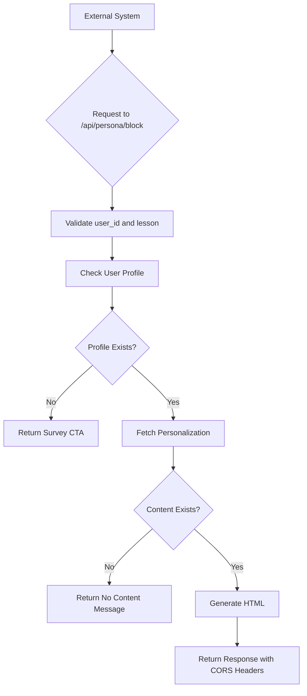

# Other Integrations

<cite>
**Referenced Files in This Document**   
- [route.ts](file://app/api/persona/block/route.ts)
- [route.ts](file://app/api/personalizations/route.ts)
- [personalization-editor.tsx](file://components/personalizations/personalization-editor.tsx)
- [server.ts](file://lib/supabase/server.ts)
- [types.ts](file://lib/supabase/types.ts)
- [PERSONALIZATION_API.md](file://PERSONALIZATION_API.md)
- [GETCOURSE_INTEGRATION.md](file://GETCOURSE_INTEGRATION.md)
- [anketa.html](file://public/getcourse/anketa.html)
</cite>

## Table of Contents
1. [Introduction](#introduction)
2. [Core API Endpoint: /api/persona/block](#core-api-endpoint-apipersonablock)
3. [CORS Configuration](#cors-configuration)
4. [Integration with External LMS Platforms](#integration-with-external-lms-platforms)
5. [Authentication and Security Considerations](#authentication-and-security-considerations)
6. [Direct API Consumption Examples](#direct-api-consumption-examples)
7. [Security Implications and Best Practices](#security-implications-and-best-practices)
8. [Conclusion](#conclusion)

## Introduction
This document details integration options beyond GetCourse for systems interacting with the personalization engine. It focuses on the `/api/persona/block` endpoint, which enables external platforms to retrieve personalized lesson content based on user profiles. The system supports iframe-based integrations, CORS-enabled API access, and direct programmatic consumption, allowing seamless embedding of personalized educational content into third-party learning management systems (LMS) or custom web applications.

## Core API Endpoint: /api/persona/block

The `/api/persona/block` endpoint is the primary interface for retrieving personalized HTML content for a specific lesson tailored to a user. It accepts a POST request with user and lesson identifiers and returns a structured HTML block containing AI-generated, profile-specific recommendations.

### Request Parameters
The endpoint expects a JSON payload with the following fields:
- `user_id`: Unique identifier for the user (maps to `user_identifier` in the database)
- `lesson`: Lesson identifier, which can be a lesson slug (partial or full title match) or lesson number
- `title`: Display title of the lesson (used for fallback messaging)
- `flush`: Optional boolean to bypass caching

### Response Structure
The API returns a JSON object with:
- `ok`: Boolean indicating success
- `html`: Rendered HTML block with personalized content sections
- `cached`: Boolean indicating whether the response was served from cache

The HTML includes dynamic sections such as:
- Summary of the lesson
- Reasons to watch (personalized motivation)
- Quick action items
- 20-minute homework assignment
- Social sharing prompts

When a user has not completed their profile survey, the response includes a call-to-action to complete the survey via an iframe link.

**Section sources**
- [route.ts](file://app/api/persona/block/route.ts#L14-L183)

## CORS Configuration

The API is configured to allow cross-origin requests from any domain, enabling integration with external LMS platforms without same-origin restrictions.

### CORS Headers
The following headers are included in all responses:
- `Access-Control-Allow-Origin: *`
- `Access-Control-Allow-Methods: POST, OPTIONS`
- `Access-Control-Allow-Headers: Content-Type`

An `OPTIONS` preflight handler is implemented to support CORS preflight requests, ensuring compatibility with browsers' security policies when making cross-origin POST requests.

This permissive CORS policy allows any external domain to embed the personalization engine's functionality, such as loading personalized content blocks within iframes or via JavaScript fetch calls.

**Section sources**
- [route.ts](file://app/api/persona/block/route.ts#L186-L195)

## Integration with External LMS Platforms

External LMS platforms can integrate with the personalization engine using the same iframe and JavaScript injection pattern demonstrated in the GetCourse integration.

### iframe Embedding Pattern
The recommended integration method uses an iframe to load the survey or personalized content:

```html
<iframe 
  src="https://your-deployment-url/survey/iframe?uid={user_id}&name={user_name}" 
  width="100%"
  height="1200px"
  frameborder="0"
  style="border: none; border-radius: 12px;">
</iframe>
```

The iframe can pass user context via URL parameters:
- `uid`: User identifier
- `name`: User's name (optional)

### Event Communication
After survey completion, the iframe sends a `message` event to the parent window with the following data:
- `type: "SURVEY_COMPLETED"`
- `profileId`: UUID of the created profile
- `userIdentifier`: User ID
- `dashboardUrl`: Direct link to the personalized dashboard

Parent applications should listen for these events to redirect users or store profile references.

### LMS Integration Steps
1. Create a content page or module in the LMS
2. Embed the survey iframe with dynamic user ID substitution
3. Implement message event listener for post-survey redirection
4. Optionally, use the `/api/persona/block` endpoint to inject personalized content into lesson pages

**Section sources**
- [GETCOURSE_INTEGRATION.md](file://GETCOURSE_INTEGRATION.md#L0-L279)
- [anketa.html](file://public/getcourse/anketa.html#L0-L20)

## Authentication and Security Considerations

While the current implementation does not require authentication for API access, several security aspects must be considered when exposing endpoints to third-party systems.

### Current Authentication Model
- **No API Keys**: The `/api/persona/block` endpoint does not require authentication
- **User Identifier Mapping**: Security relies on the secrecy of the `user_id` (user_identifier)
- **Profile-Based Access**: Content is tied to profiles linked to user_identifier

### Security Implications
- **Open CORS**: The `Access-Control-Allow-Origin: *` header allows any domain to access the API
- **No Rate Limiting**: The current implementation lacks built-in rate limiting
- **Identifier Exposure**: If user identifiers are predictable or exposed, unauthorized access to personalized content is possible

### Recommended Security Enhancements
For production deployments with third-party integrations:
- Implement API key authentication for `/api/persona/block`
- Restrict CORS to trusted domains instead of wildcard (`*`)
- Add rate limiting based on IP or API key
- Use UUIDs or cryptographically random strings for user_identifier
- Consider short-lived tokens instead of persistent identifiers

**Section sources**
- [route.ts](file://app/api/persona/block/route.ts#L14-L195)
- [server.ts](file://lib/supabase/server.ts#L0-L27)

## Direct API Consumption Examples

Third-party systems can programmatically consume the personalization API to retrieve and display content.

### JavaScript/TypeScript Example
```typescript
async function getPersonalizedBlock(userId: string, lesson: string) {
  const response = await fetch('/api/persona/block', {
    method: 'POST',
    headers: { 'Content-Type': 'application/json' },
    body: JSON.stringify({
      user_id: userId,
      lesson: lesson,
      title: "Lesson Title"
    })
  });

  return await response.json();
}

// Usage
const result = await getPersonalizedBlock('user123', 'lesson-1-introduction');
if (result.ok) {
  document.getElementById('persona-container').innerHTML = result.html;
}
```

### cURL Example
```bash
curl -X POST https://your-deployment/api/persona/block \
  -H "Content-Type: application/json" \
  -d '{
    "user_id": "user123",
    "lesson": "1",
    "title": "Introduction to Massage"
  }'
```

### Response Handling
Applications should handle both success and error cases:
- Check `ok` field before rendering `html`
- Provide fallback content if personalization is unavailable
- Handle cases where the user hasn't completed their profile

**Section sources**
- [route.ts](file://app/api/persona/block/route.ts#L14-L183)
- [PERSONALIZATION_API.md](file://PERSONALIZATION_API.md#L0-L271)

## Security Implications and Best Practices

Exposing personalization APIs to third-party systems introduces several security considerations that must be addressed.

### Rate Limiting
Implement rate limiting to prevent abuse:
- Limit requests per IP address
- Enforce limits per API key (when implemented)
- Use services like Vercel Speed Insights or Cloudflare to monitor traffic patterns

### API Key Management
When implementing authentication:
- Generate cryptographically secure API keys
- Store keys securely (never in client-side code)
- Provide key rotation mechanisms
- Implement key revocation

### Data Privacy
- Ensure compliance with data protection regulations (GDPR, CCPA)
- Anonymize or pseudonymize user identifiers where possible
- Clearly communicate data usage in privacy policies

### Deployment Best Practices
- Use environment variables for configuration
- Restrict database access with row-level security
- Monitor logs for suspicious activity
- Regularly audit third-party integrations



**Diagram sources**
- [route.ts](file://app/api/persona/block/route.ts#L14-L183)

**Section sources**
- [route.ts](file://app/api/persona/block/route.ts#L14-L183)
- [types.ts](file://lib/supabase/types.ts#L0-L139)

## Conclusion
The personalization engine provides a flexible integration model for external systems through the `/api/persona/block` endpoint. With built-in CORS support and a simple JSON API, third-party LMS platforms can embed personalized content using iframe or direct API consumption patterns. While the current implementation prioritizes ease of integration, production deployments should consider implementing API key authentication, rate limiting, and domain-restricted CORS policies to enhance security. The system's architecture supports both immediate iframe-based integration and more sophisticated programmatic usage, making it adaptable to various educational technology ecosystems.